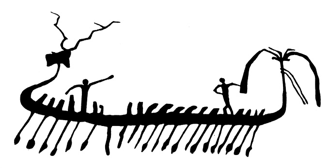
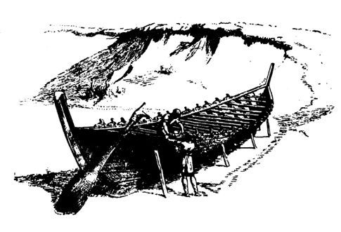

<section>

> _Vyplujte!  
> Plujte k severu pod Pásem Oriónu!_

TAHITSKÁ SÁGA

Lodě jsou vhodným demonstračním materiálem k argumentaci o možné existenci dávných civilizací především proto, že je můžeme souvisle sledovat od prehistorie a protohistorie, kdy vodní toky byly jedinými komunikacemi uprostřed neprostupných a nebezpečných pralesů. Pluly po nich nejdříve prosté kmeny, na nichž seděl obkročmo pionýrský odvážlivec, později se kmeny spojovaly ve vory. Pokrokem byl vydlabaný kmen, tzv. monoxyl, který sám nebo s vahadlem a poháněný vesly nebo plachtou byl schopen i příbřežní mořské plavby. Tam, kde nebylo vhodných stromů, nacházel člověk důvtipné náhrady v nafouklých zvířecích kožích (tzv. kelecích), kruhových plavidlech z proutí, utěsněného smolou (gufách), člunech z rákosových svazků, oválných košících potažených kůží (koraklech) nebo kanoích a kajacích potažených březovou či jinou kůrou nebo koží.

Složité lodě, sestavované z jednotlivých částí, je možné datovat asi do roku 5000 před n. l., kdy se taková plavidla počala objevovat na Eufratu a Tigridu. Námořní kýlové lodě vznikaly o 2000 let později ve Středomoří současně s objevem a rozvojem plachet. Jejich obrazem je ještě dnes čínská džunka s plochým dnem.

Nejstarší námořní lodě jsou připisovány Egypťanům, dovážejícím ideálně vhodné cedrové dřevo z dnešního Libanonu asi kolem roku 2800 před n. l., avšak délky kolem 30 metrů dosáhly teprve asi roku 1700 před n. l., kdy se objevují paluba, přístřešky, možnost spouštění plachty atd.

Asi tolik je v kostce známo o červáncích mořeplavby.

Lodě antického světa jsou již dokumentované zcela spolehlivě – od 5. století před n. l. to byly bachraté obchodní lodě o nosnosti 150–250 tun (nosnost známe přesně díky zachovaným celním zápisům z Peiraiea), dlouhé asi 25 metrů. Největší lodě této doby dosahovaly nosnosti nejvýše 700–800 tun, avšak současně s počátkem prací na přístavu v ústí Tibery (na příkaz císaře Klaudia roku 42 n. l.) počala výstavba proslulých námořních obrů tzv. obilní flotily, dovážející každoročně asi 500 000 tun pšenice ze Sicílie, severní Afriky, Hispánie a Egypta do římského přístavu Puteol, nahrazeného později Ostií.

O těchto korábech nám zanechali zprávy očití svědkové – Lúkiános, účastník přistání alexandrijské lodi Isis v Peiraieu, židovský dějepisec Josephus Flavius i sám proslaveně přesný, úzkostlivý a výborně pozorující Plinius. Všichni se shodují, že rozměry korábů obilní flotily byly impozantní: délka asi 60 metrů, šířka 15 metrů a téměř stejný ponor. Z údajů o nákladech a počtu cestujících, který šel do set, byl vypočítán výtlak alespoň 2000 tun a nosnost 1200 až 1300 tun. Je to tím pozoruhodnější, že od 4. století n. l., kdy obilní flotila skončila činnost, až do roku 1845 nebyla postavena ani jedna jediná loď této velikosti…

Není zde místo popisovat dokonalost římských lodí s nádhernými kabinami, zastřešenými pálenými taškami na mramorových sloupech. Za poznámku však stojí, že se antické flotily pohybovaly – nepočítáme-li ovšem piráty, jimiž se moře již tenkrát přímo hemžila – poměrně velmi bezpečně, se ztrátami, nepřesahujícími např. pro­centuální ztráty hanzy při pobřežních plavbách, ačkoli příbřežní plavba, na niž byli odkázáni starověcí kapitáni, postrádající kompas, sextant i další plavební pomůcky, je právě ve Středozemním moři značně nebezpečná díky náhle propukajícím vichřicím. Zásluhu na tom měly nejen tradice předávané z generace na generaci v mořeplaveckých dynastiích („Jestliže vynese olovnice bahno z hloubi jedenácti sáhů, je ústí Nilu vzdáleno den plavby“, „Spatříš-li nejprve velké černé a pak malé zelené mořské hady, blížíš se Varygaze“ atd.), ale i řádné plavební příručky pro kapitány plachetnic, z nichž první sestavil zeměpisec Skylax mladší v polovině 4. století před n. l., jinou, pod názvem Přehled vzdáleností ve Středozemním moři, Stadiasmos. Tyto příručky, brzy vypracované i pro Černé moře, Perský záliv aj., byly do značné míry podobné dnešním každoročně vycházejícím námořním rukovětím a jako ony přesně popisovaly námořní trasy, přístavy, orientační body, mělčiny atd.

Není pochyby, že takové znalosti jak v nautice, tak ve stavbě lodí jsou dědictvím ne staletí, ale tisíciletí. Od obilní flotily, představující na půldruhého tisíciletí vrchol alespoň co do nosnosti a výtlaku, můžeme sestupovat po žebříku dějin stále hlouběji a hlouběji, objevujíce vždy znova překvapivě vyspělou plavbu a úctyhodný soubor zkušeností.

Je přesvědčivě dokázáno, že se již nejpozději v 18. století před n. l. zro­dila na Krétě první námořní politicko-hospodářská moc, thalasokracie, panující nad mořem, dokumentovaná proslulými paláci v Knóssu i jinde, přetékajícími bohatstvím, a přece nechráněnými ani náznakem obranných zařízení, hradeb, valů, příkopů apod., a to ani tam, kde byly položeny z taktického obranného hlediska zcela nevýhodně.

Záhada má dvojí možný klíč: buď byla tehdy námořní doprava na tak nízké úrovni, že se krétští vládcové nemuseli obávat pobřežního výsadku tak rozsáhlého, aby ohrozil jejich sídla, nebo byla Kréta opravdu vládkyní moří, schopnou zadržet protivníka ještě daleko od břehů.

První možnost můžeme vyloučit vzhledem k trvalým a živým stykům Kréty s Peloponésem, Kykladami, maloasijským pobřežím s přilehlými ostrovy (Rhódos), Sýrií a Egyptem. Tam všude směřoval objemný zahraniční krétský obchod, spojující export s importem, tam směřovala i diplomatická poselstva a výpravy kolonistů.

V dobách rozkvětu krétské kultury jsou tyto styky Egypta s Kré­tou dokumentovány i výměnou dekoru – na Krétě se stále častěji objevují typicky egyptské prvky palmového listu, posvátného chro­báka, papyru a lotosu – naopak z Kréty do Egypta a Sýrie přechází dekor tvaru spirály. Podobné shody nalezli uměnovědci i v architektuře např. krétských paláců na jedné straně, paláců v Mari na Eufratu nebo v Alalakhu v severní Sýrii na straně druhé. Díky pravidelné lodní dopravě Středozemním mořem shledáváme jistou jednotu kultury na jeho březích, určovanou zprvu fénickými a krétskými vlivy, později Řeky a naposledy, po potlačení pirátství rozhodnými akcemi, Římany. Není bez zajímavosti, že právě tato relativní kulturní jednota přímořských oblastí nadmíru usnadnila křesťanství těžký úkol převzít dědictví kdysi světovládného města.

Můžeme tedy téměř s jistotou předpokládat, že 8300 km2 ostrova bylo dostatečně střeženo válečnou flotilou, zajišťující i bezpečnost mořských komunikací pro krétský obchod. Jako operativní doplněk – z vojenského hlediska mimořádně vhodný a důvtipný – této předsunuté obrany byla vybudována bojová vozba, oddíly válečných dvojkolých vozů, tažených dvěma koňmi a s posádkou dvou bojovníků opatřených pancířem. Knósský vládce měl ve svém inventáři z posledního roku před zničením paláce (předpokládá se, že zastaralé záznamy byly každoročně z prostorových důvodů ničeny) zaregistrováno 400 válečných vozů v různém stupni bojové pohotovosti, tedy rozhodně ne nevýznamnou sílu. Co nejrychleji se přesunovaly a s nimi několik set plně vyzbrojených bojovníků se zásobou šípů (v jediné inventární tabulce je údaj o 8640 šípech) na místo výsadku. Neočekávaně napadaly protivníka, odřezávaly ho od jeho lodí a tím i od zásob, vyčerpávaly a zadržovaly tak dlouho, dokud nebyla k dispozici dostatečná bojová pohotovost domobrany.

Nepřímou podporou těchto domněnek je i skutečnost, že ostatní střediska egejské kultury na řecké pevnině (jejichž čilý, i když ne vždy rovnoprávný a symetrický styk s Krétou je prokázán) byla bez výjimky založena z obranných důvodů dál ve vnitrozemí a byla obehnána hradbami. Nejmohutnější hradby Tírynthu si dokonce vysloužily jméno „kyklopské“, obyvatelé Egeidy si nedovedli představit, že by 17 metrů silný val z balvanů těžkých až dvanáct tun stavěli jejich předkové. Daleko pravděpodobnější se zdála spoluúčast bájných Kyklopů, povolaných prý zakladatelem města králem Proitem. Ani Mykény se svými osmimetrovými hradbami ovšem nebyly vydány pozemnímu nepříteli napospas…

Postačilo však několik set let mezi zkázou krétské minojské civilizace kolem roku 1400 před n. l. a mezi Homérovým 8. stoletím, aby se představy o egejské minulosti deformovaly téměř k nepoznání. Homér (ať jím byl kdokoli) nebyl již schopen v podmínkách nové, dosti primitivní civilizace, teprve nesměle vyrůstající na troskách dávné kultury, představit si skutečnou velkolepost civilizace, pohřbené zemí a staletími.

Je celkem nedůležité, že si nevěděl rady ani s válečnými vozy, od vpádu východních národů v 17. století př. n. l. do říše Chetitů až k bojům v nilské deltě známými v celé egejské oblasti; považoval je za pouhý pomocný dopravní prostředek pěších bojovníků, tak jak je znal ze své současnosti, neschopné ve větším měřítku vyrobit, udržovat a zasadit tak složitou bojovou techniku.

A neměl ani ponětí o mocné krétské flotile, jejíž koráby byly zcela určitě pevnější a solidnější než např. Odysseova loď, již můžeme podle Homéra považovat nejvýše za veslový člun s jediným stožárem.

Ostatně i sama volba Homérova tématu je překvapující; zatímco se ani slovem nezmiňuje o dodnes zcela nevysvětlitelném pádu Knóssu a s ním krétské kultury, ovlivňující celou egejskou oblast, věnuje veškerou pozornost trojské válce.

</section>

<section>

Jednu ze starověkých lodí máme popsánu až nápadně přesně – loď všech lodí jak rozměry, tak významem – Noemovu archu.

Nebylo třeba, aby se před několika lety objevila dosti pošetile argumentující kniha Wernera Kellera A bible má přece pravdu, s podtitulem Vědci dokazují historickou pravdu, aby se stala bestsellerem a aby dosáhla celkového počtu 6 miliónů výtisků v sedmnácti zemích. Již mnoho let žádný rozumný člověk nepochyboval, že celá řada starozákonních historických a místopisných líčení má zcela reálný podklad. Úspěchy izraelské geologie, založené na předběžném studiu a důvtipném výkladu bible, překvapily proto daleko méně než např. Schliemannovy objevy, vycházející z nápadu použít Homérových eposů jako bedekra.

Část historických biblických textů byla uspokojivě prověřena archeology, geology a historiky. Možná, že se v budoucnu podaří verifikovat další části – co to však má společného se zjeveným náboženstvím? Případný objev zbytků Sodomy a Gomory není důkazem, že byly navštíveny anděly vyslanými bohem. – Případné potvrzení historické skutečnosti exodu a historické existence Mojžíše zdržujícího izraelity čtyřicet let na poušti, kterou mohli přejít za několik týdnů, jen proto, aby vymřeli jedinci, „nakažení“ egyptskými rozvratnými myšlenkami mnohobožství, a aby bylo dosaženo jednoty názorů, nijak nedokazuje vesmírnou rozprostřenost kmenového boha izraelitů, který se ve starozákonních textech projevuje jako vrtkavý, nedůtklivý a krutý náčelník kočovného kmene, chránící svou oázu nejen proti všem protivníkům, ale i proti každému, kdo by se mohl protivníkem stát. Reálnost zámku pánů z Růže ještě nedokazuje, že tam obchází paní Perchta.

Tento vztah ke starým náboženským textům může přinést ovoce vědě a poznání. Ze starověku se nezachovalo tolik knih, abychom je mohli s lehkým srdcem opomíjet. Naopak, každá řádka stojí za prostudování, zda nám přes propast tisíciletí nepodává třeba ve zkreslené nebo kryptografické formě závažné poselství.

O arše, na níž byla zachráněna další existence lidstva i veškeré fauny, máme dokonce dva souběžné prameny. Kromě bible je to epos se 300 čtyřveršími, objevený v knihovně krále Assurbanipala. Opěvuje zážitky polomytického panovníka Gilgameše (vládl asi kolem roku 2700 před n. l.) a je dnes počítán k základním literárním památkám lidské historie.

Srovnejme oba texty – nejprve biblický:

</section>

<section>

Učiň sobě koráb z dříví gofer;  
příhrady sděláš v tom korábu  
a oklejuješ jej vnitř i zevnitř klím.  
A tento způsob uděláš jej:  
Tří set loktů bude dlouhost toho korábu,  
padesát loktů širokost jeho a třicet loktů vysokost jeho.  
Okno uděláš v korábu a svrchkem na loket širokým zavřeš jej;  
dveře také korábu v boku jeho postavíš  
a pokoje spodní, druhé i třetí sděláš v něm.

Mojžíš I., kap. 6

A nyní část z eposu o Gilgamešovi, jež nás zajímá. Gilgameš se snaží dosáhnout nesmrtelnosti, již bohové propůjčili Utnapištimovi, a vydá se za ním na jakousi konzultaci. Po strádáních, obvyklých ve všech bájích a pohádkách, konečně nesmrtelného předka nalezne. Část, věnovaná Utnapištimovu vyprávění, má dvě zvláštnosti – je psaná „ich“ formou, zatímco celý ostatní epos je vyprávěn v osobě třetí. Za druhé se zdá být vložena do díla poněkud neorganicky, jako by autor nebo zapisovatel eposu na hliněné tabulky chtěl za každou cenu uplatnit zajímavou epizodu, s níž byl seznámen.

Autoři, naklonění překotným závěrům, z obou těchto fakt vyvo­zují, že by mohlo jít o autentické líčení přímého svědka potopy – což je svrchovaně nepravděpodobné. Přijatelnější se zdá možnost, že část eposu, pojednávající o Utnapištimovi a potopě, je starší, a existovala snad před písemným záznamem Gilgamešových dobrodružství.

Utnapištim žil v Šurupaku jako věrný a oddaný ctitel boha vod Ea. Když se rada bohů rozhodla lidstvo zlikvidovat potopou (jak je vidět, neznala láska bohů-stvořitelů ke svým dítkám hranic ani tehdy…), Ea Utnapištima varoval:

</section>

<section>

… Strhni svůj dům, postav si loď, opovrhni bohatstvím,  
hledej raději život!  
Opovrhni majetkem a statky,  
zachraň raději život!  
Na svou loď z každého semene  
přiveď život!  
A nechť je dobře vyměřena loď,  
kterou máš postavit!  
… Udělej spodní, druhou a třetí palubu,  
udělej koráb s přehradami,  
natři jej z nitra i zvenčí smolou!

</section>

<section>

Utnapištim poslechl nejen pokynu, ale i technických připomínek, což mu dalo asi dost přemýšlení, takže se k projekci korábu dostal až pátého dne:

</section>

<section>

Plocha půdorysu byla 13 iků,  
stěny vysoké na deset garů.  
Dal jsem jí šest palub,  
šířku jsem rozdělil devětkrát.  
V peci jsem roztavil šest sarů smůly.  
Tři sta loktů bude délka mé lodi,  
padesát loktů šířka a třicet loktů výška.

</section>

<section>

Zbytek příběhu se jak vejce vejci podobá dobrodružstvím ctnostného Noema a jeho rodiny. Utnapištim se nalodil i s příbuzenstvem a „vším semenem“, zachránil se, zatímco vody šest dní stoupaly a bouřily, sedmého dne bouře od jihu polevila, zátopa však stoupala, trvala čtyřicet dní a počala opadat teprve po 150 dnech. Utnapištim právě tak jako Noe vypustil havrana, holubici atd., se stejným výsledkem. Vyprávění končí takto:

</section>

<section>

Otevřel jsem průduch a světlo padlo na mou tvář.  
Loď se zachytila na vrchu Nizir.  
Vrch Nizir objal loď a nenechal ji kymácet se.

</section>

<section>

Vzhledem k tomu, že epos o Gilgamešovi je mnohem starší, v bibli může jít o text přejatý z ústního podání, nebo o text, s nímž se Mojžíš za svého pobytu v egyptských chrámech seznámil. Třetí možností je paralelní zpracování pověsti, živé a aktuální jak v Mezopotámii, tak v oblasti Egypta. Ať už je jakákoli verze o přenosu Utnapištimova dobrodružství do Starého zákona správnou, zůstává pozoruhodnou skutečností, že se ve dvou náboženských knihách dozvídáme o 4000 let starých božích pokynech ke stavbě lodi „se spodní, druhou a třetí palubou, korábu s příhradami“, nebo s „pokoji spodními, druhými i třetími“ – což je jinými slovy totéž.

V souvislostech této knihy bych chtěl upozornit na něco zcela jiného, co se týká především bohů a poddůstojníků: ti i oni závisejí především na vlastní autoritě. Poddůstojníci velice dobře vědí – a bohové by vědět měli – že nejsnáze a nejrychleji lze autoritu ztratit vydáváním nesplnitelných rozkazů a nerealizovatelných pokynů.

Utnapištim i Noe byli možná furianti a dokázali postavit – jako v případě Utnapištimových zprvu projektovaných a později realizovaných palub – plavidlo ještě větší. Zdá se tedy, že takové lodi zřejmě tehdy byly, i když, připusťme, výjimečně, v dosahu možností lodních stavitelů. Na svou dobu obrovské – a ve srovnání s našimi nedávnými představami o tehdejších plavidlech přímo gigantické koráby, schopné transoceánské plavby alespoň výtlakem, umožňujícím nalodit dostatečné množství potravin a vody na dlouhou cestu.

Toto je – nebo by mělo být – racionální jádro obou textů. Koráby rozhodně nebyly postaveny „na boží objednávku“ v krátké době. Stavba takového plavidla by vyžadovala řadu měsíců, ne-li let, mělo-li by být i patřičně vystrojeno. Rozhodně nemohlo být postaveno rodinnou svépomocí sebespravedlivějšího věřícího, nemohlo být rodinnou svépomocí řízeno a obsluhováno (140 metrů dlouhá plachetní loď by potřebovala několik set, veslová loď typu galéry několik tisíc námořníků). Také se „všemi živočichy po dvém všelikého těla“ by měli pánové Utnapištim a Noe jisté starosti. Daleko pravděpodobnějším se zdá, že tento koráb, existoval-li, díky své mohutnosti a díky bohatým zásobám, uchránil posádku a cestující od přírodní katastrofy, jež postihla nikoli snad svět, ale jistě značné oblasti některé kulturní krajiny.

Pověst o potopě znají téměř všechny národy světa. Biblická potopa se již před řadou desítek let dostala z polohy mýtu do racionálnějších sfér: Při mezopotamských vykopávkách u Tell al Muquayyaru byla nalezena mezi kulturními vrstvami, bohatými střepy, odpadem, zkrátka stopami lidské činnosti, třímetrová vrstva jílů, přerušující kontinuitu kulturních vrstev. Nad ní leží střepy nádob, vyrobených na hrnčířském kruhu, pod ní střepy nádob, tvarovaných rukou, a kamenné nástroje. Neolitickou Mezopotámii, již tehdy hustě zalidněnou, zalila kolem roku 4000 před n. l. mocná zátopa, jež, jak ukázaly sondy, postihla oblast o rozměrech asi 630 km krát 160 km severozápadně od Perského zálivu. Vody Perského zálivu, zdvižené mocnou bouří, vylíčenou v eposu o Gilgamešovi, se vrhly na pevninu podobně jako roku 1876, kdy cyklónová bouře zatopila vodami Bengálského zálivu nížinu při ústí Gangu, patnácti­metrovou vlnou zalila 114 čtverečních mil vnitrozemí a zahubila 215 000 lidí. Kulturní vývoj postižené oblasti Mezopotámie byl dočasně přerušen – neolitické obyvatele vystřídal lid znalý hrnčířského kruhu i zpracování kovů.

Obě verze potopy se vzájemně podstatně liší jedním údajem: Utnapištimova archa přistála na vrchu Nizir v dnešním Kurdistánském pohoří, což odpovídá pravděpodobnému směru náporu cyklónu. Noemova archa prý skončila plavbu na Araratu, pokrytém věčným sněhem a vysokém 5156 metrů.

Vzhledem k poměrně nedávnému nalezení eposu o Gilgamešovi (a rozšifrování dnešní polohy kopce, nazývaného kdysi Nizir), jakož i vzhledem k nepochybné skutečnosti, že dnešní ctitelé bible jsou početnější a disponují značnějšími prostředky než ctitelé starobabylónského boha vod, soustředila se pozornost na Ararat, kde se již takřka sto let pátrá po zbytcích posvátného plavidla.

Podnět k tomu dala – snad – z generace na generaci předávaná pověst, zjištěná ve vesničce Bayzit na samém úpatí Araratu: jakýsi pastýř prý se zatoulal při hledání ztracené ovce vysoko na horu, až pod samý vrcholek, a objevil tam dlouhou dřevěnou loď. Turecká expedice, vyslaná roku 1883, ve své písemné zprávě tuto možnost nevyvrátila, naopak se zmínila o dřevěném ráhnu, vyčnívajícím prý z jižního ledovce. Jeho existenci potvrdil sám jeruzalémský a babylónský arcidiákon Nouri. Další zprávy pocházejí z I. světové války – jakýsi ruský důstojník expedičního sboru vstoupil na turecké území a hlásil „pozůstatky významného lodního vraku“, v čemž ho podpořili i kolegové ze II. světové války, čtyři sovětští a američtí piloti, hlásící „dlouhý stín, podobný lodi“, který lze za příznivých okolností spatřit v ledovci. Pátrání pokračovalo po válce. Několik výprav nenalezlo zhola nic. Teprve Fernando Navarra byl roku 1955 úspěšnější. Časně ráno 6. července nalezl v ledovci na samém vrcholu hory tři kusy břevna, jehož stáří určila radioizotopová analýza asi na 5000 let.

Tím ovšem zdaleka není řečeno, že archa byla nalezena – v každém případě je však výskyt opracovaného, 5000 let starého dřeva na vrcholu těžce dostupné hory poněkud znepokojujícím otazníkem.

Sám o nálezu archy, obzvláště v tak nevysvětlitelné nadmořské výšce, kterou nelze v tomto případě vysvětlit např. geologickými posuny, pochybuji. Sotva budeme moci připevnit na archu tabulku, kterou nese poslední a nejkrásnější Clipper čajové flotily Cutty Sark, ponechaný jako památka zašlých dob:

TOTO JE MEZNÍK NA CESTĚ LIDSKÉ KULTURY.

TAKOVOU LOĎ UŽ SVĚT NEUVIDÍ.

Jeden háček ovšem celá biblicko-utnapištimovská záležitost má: loď 140 metrů dlouhou – a ani polovičních rozměrů – nebyl zcela jistě schopen postavit člověk civilizační úrovně, neznalé hrnčířského kruhu a kovů. Člověk neolitické kultury, jak se nám zachoval např. v Polynésii až do zcela nedávné minulosti, mohl být (a v Polynésii mimo veškerou pochybnost také byl) zdatným mořeplavcem. Jeho lodě však konstrukčně nepřekročily rámec vorů a velkých kanoí, případně spojených do katamaránu nebo s vahadlem. Této konstrukci archy ovšem odporuje jak její velikost, tak i výslovné údaje obou náboženských textů.

</section>

<section>

> Skalní kresba z Wadi Atwani (východně od Nilu) z roku asi 3000 před n. l. znázorňuje rozměrný mořský koráb „útočníků ze západu“

A ještě něco: je poměrně málo známo, že rozměry lodí byly až do novověku omezeny účinností kormidelního mechanismu, který se vyvinul ze záďového vesla a až do podstatného zdokonalení převodem síly z kormidelního kola nebyl schopen zajistit manévrovatelnost větších lodí. Zde je i důvod existence a mimořádně dlouhého přetrvání veslových galér. Jejich výhoda nebyla jen v možnosti plavby za bezvětří, ale především ve schopnosti provádět rychlé bojové obraty pomocí vesel daleko bystřeji než pouhým kormidlem. Legendární archy zcela určitě nebyly galérami – jejich realizace v popsaných rozměrech byla tedy nemyslitelná bez znalostí vyhovujícího kormidelního zařízení.

Jestliže tedy plavidlo, blížící se konstrukcí a velikostí lodím, doporučeným božskou radou Utnapištimovi a Noemu, existovalo (autor je nakloněn tomu věřit), posunuje se tím nejen hranice mořeplavby velkými koráby o několik tisíc let do minulosti, ale objevují se zde i další zřejmé signály mimořádně vysoké civilizační úrovně, jakou nelze očekávat u tehdejších, ostatně vnitrozemských národů, obývajících oblast, postiženou potopou.

</section>

<section>

> Normanská loď maximální velikosti, limitované primitivním kormidelním mechanismem, vlastně pouhým veslem

Pro konkrétní případ archy, jež dokázala čelit potopě, si dovolím navrhnout mírně vzrušující řešení: jedna z mohutných dopravních lodí ztracené civilizace, po níž pátráme, se plavila prastarou námořní cestou lidstva, Perským zálivem. Vzhledem k délce cesty nebo ke kolonizačním úmyslům posádky vezla ve zcela dostatečných prostorách podpalubí vedle zásob i spárovaná hospodářská zvířata, jež se měla stát jádrem živočišné výroby v cílové oblasti, případně měla sloužit jako nekazící se proviant. Loď se nešťastnou shodou okolností ocitla v pásmu orkánu, jenž způsobil biblickou i Utnapištimovu potopu, a byla vzdutým mořem vržena daleko do vnitrozemí. Podívaná na nevídanou a pro primitivní neolitické pastevce, kteří o moři nejvýše slýchali, obludně obrovitou loď, jež se objevila nad zničeným a vyhubeným územím, na podivně oděnou posádku vyvádějící z nitra lodi „ze všech živočichů všelikého těla po dvém“, musela na místní kmeny působit mocným a nezapomenutelným dojmem a takřka nevyhnutelně stvořit mýtus. K jeho vzniku mohly ostatně přispět i zchytralé konfabulace trosečníků, nucených volky nevolky žít v barbarském prostředí, svrchovaně nepříznivém všem vetřelcům. Pohádka o božském zásahu v jejich prospěch a tedy i o nepochybné božské přízni, byla rozhodně lepším vstupem než suché prohlášení, že jde o smůlou postiženou loď rejdařské firmy XY, nacházející se právě na pravidelné lince z A do B…

Nezbývá než připustit, že starověk patrně znal lodi imponujících rozměrů, schopné vzdorovat bouřím a křižovat oceány, tedy nejen provozovat příbřežní plavbu. Tyto koráby byly produktem dlouhého vývoje, který se zřejmě neomezil na několik málo nautických středisek, ale může být sledován v celé řadě koutů světa.

Zajímavá zjištění přineslo v tomto ohledu usilovné řešení odedávna oblíbené šarády: kdo první objevil Ameriku?

Antropologové, paleontologové a snílkové, zabývající se touto problematikou, se ovšem nepídí po asijských kmenech, které již před dvaceti tisíci lety počaly přecházet Beringovu úžinu. Jde jim především o mořské návštěvy dávných národů. Zde jsou některá tvrzení, lépe nebo hůře podložená nálezy:

– Washingtonští archeologové se domnívají, že na západním pobřeží Jižní Ameriky nalezli stopy návštěv japonských mořeplavců, pravděpodobně rybářů, asi ze 3. tisíciletí před n. l., a možná i japonskou keramiku, jež se sem dovážela.

– Poblíže brazilského městečka Galvea byl nalezen ve skále vytesaný nápis, který byl označen za fénický.

– Existuje tvrzení na základě jistých společných znaků v obou jazycích, že někdy mezi 12. a 10. stoletím před naším letopočtem pravidelně navštěvovaly Střední Ameriku čínské koráby.

– V mexickém hrobě, neporušeném a starém 900 let, byla nalezena hliněná římská plastika, pocházející z 2. století před n. l.

– Dávnou znalost Evropanů dokazují legendy, kolující mezi in­diánským obyvatelstvem až do zahájení konkvisty. Je obecně známo, že právě tyto legendy o „bílých bozích“, kteří přijdou z východu na vlnách oceánu, ne-li přímo umožnily, tedy přinejmenším podstatně usnadnily evropské pronikání a rozvrácení mocných jihoamerických a středoamerických říší.

– Existují nepopiratelné a nápadné obdoby mezi některými znaky mayské a starokrétské kultury, především ceremoniální oděv vládců purpurové barvy, koruna z per, baldachýn a žezlo, nehledě na oděv šlechty, podobající se oděvům mykénské kulturní oblasti. Nápadné shody byly nalezeny i mezi mayskými hieroglyfy a hieroglyfickým písmem (archaickým) fénickým a krétským.

</section>

<section>

Některá z uvedených tvrzení nelze ovšem pokládat za prokázaná a stavět na nich barvité teorie – jsou to však vesměs názory badatelů nebo vědeckých kolektivů, nikoli snad maniakální výplody „atlantomanů“.

Nepochybným výtěžkem těchto zlomkovitých nálezů a úvah se však zdá být přinejmenším nezbytnost připustit dalekosáhlou oceánskou migraci starověkých národů, výměnu kulturních statků a civilizačních vymožeností, zakládání kolonií na březích vzdálených kontinentů a další důsledky rozvinuté námořní dopravy, jež se ještě před několika desítkami let zdály být odsouzeny k nucenému pobytu v říši bájí. A ještě něco nutí nepřeceňovat význam lokalit jednotlivých podivných nálezů. Není možné – nebo lépe řečeno není účelné – zanést do mapy světa místo objevů jednotlivých objektů, jež používáme jako doličného materiálu naší pře, a podle hustoty praporků na mapě usuzovat na tu či onu oblast, kde by se mohla hledaná kultura skrývat. Reliéf mykénské dýky na jednom z megalitů Stonehenge u Salisbury, Feidiova gemma na nákončí meče velkomoravského ozbrojence, římské hlavičky ve Střední Americe, spinely z Cejlonu – nepochybně! – na svatováclavské koruně českých králů, vyrobené kolem roku 1100 a restaurované s použitím původních drahokamů roku 1345, středomořské mušle v paleo­litických hrobech u Erfurtu… Což to nestačí dokázat pošetilost jakýchkoli snah o určení místa mimořádných znalostí podle lokalit nálezů? Vždyť právě to nejcennější, nejzajímavější bylo odváženo nejdále, putovalo, měnilo majitele.

Dokladů o upadání středomořské mořeplavby již v dobách, které pro nás zahaluje šero, přinejmenším v období minojské kultury, je dnes již celá řada a podmořská archeologie objevuje další a další.

Jedním z nejvýznamnějších je objev vraku od mysu Gelidonya při tureckém pobřeží. Z lodi, potopené, jak bylo spolehlivě určeno, roku 1200 před n. l., byl vyzdvižen bronzový poklad o váze převyšující jednu tunu. Jeho prozkoumání odhalilo, že koráb byl syrskou obchodní lodí, patrně v majetku kováře nebo majitele kovářské manufaktury, prodávajícího po celém východním Středomoří bronzové nástroje, zbraně a domácí potřeby, bronzové odlitky k dalšímu zpracování, bronzové dráty, cín a patrně i drobné zboží egyptského původu. Z vraku byly vyzdviženy tři úplné sady závaží ve tvaru koulí s oploštěným vrchlíkem, aby se nekutálela. Závaží byla překvapivě přesná. Jedna sada byla srovnána s egyptskou váhovou jednotkou gedet, představující 9,3 g, a bylo zjištěno, že odchylka jednotlivých závaží od etalonu nepřesahuje 1/100 (!). S těmito závažími mohl být prováděn obchod v tehdejším Egyptě, Sýrii a na Kypru. Další dvě sady zřejmě sloužily k vážení podle zvyklostí krétských, maloasijských a řeckých.

Je zřejmé, že v době zničení homérské Tróje, datovaném dnes mezi léta 1200–1100 před n. l. (mimochodem řečeno – vrak od Gelidonye pomohl rozšifrovat i několik nautických nejasností Homérových eposů), existovala ve Středomoří pravidelná a rozsáhlá obchodní mořeplavba, jejíž provozovatelé si stěží činili nárok na titul héroů. Bájná hrdinství se neslučují s prodejem motyk a dlát. Pro Homéra, žijícího pravděpodobně koncem 8. stol. před n. l., však již je plavba po zrádném moři nesmírně obtížnou, nebezpečnou a plnou strázní, o čemž by mohli nejlépe vyprávět nejen Odysseus, ale i další postavy eposu. Vždyť dokonce někteří hrdinové dali po vyvrácení Tróje přednost návratu po souši, což jistě nebylo ani příjemné, ani bez nebezpečí. Jistým náznakem úpadku mořeplaveckého umění je i technika návratu Odyssea z ostrova kouzelnice Kirké: z úradku bohů si robí nikoli loď, ale pouhý vor, tedy plavidlo značně primitivní.

Tento obdiv nad dávno zapomenutými mořeplaveckými znalostmi zaznívá i z tzv. cyklických básní, opěvujících události kolem trojské války mimo oba proslulé Homérovy eposy. Podařilo se je zčásti rekonstruovat ze zlomků a zmínek pozdějších autorů, zejména Prokla, Fótia a Apollodóra.

Nejzajímavější pro nás je v této souvislosti Kypria, cyklus připisovaný buď Stasinovi nebo Hegesinovi z Kypru, žijícímu patrně v 8. stol. před n. l.

Kypria uvádí dvě podrobnosti, o nichž Homér taktně mlčí, ačkoli byl zcela jistě s „trojskou látkou“ cyklů výtečně obeznámen.

První z nich je poněkud trapný omyl Achajců, kteří se po dlouhé plavbě bujaře vrhnou na první pobřežní město, pokládajíce ho za Tróju. Teprve když je obyvatelstvo pomordováno a domy spáleny, zjistí malý omyl: šlo o Teuthranii v Myzii.

Pravda, za války se stává ledacos, ale tato epizoda přece jen dokazuje, že v době vzniku básně (nikoli v době trojské války) bylo cestování Egejským mořem z řeckého na maloasijský břeh vzácné a znalosti protilehlých osad minimální, ačkoli šlo o pouhý mořeplavecký skok.

Avšak ani to nestačí. Achajci si na moři vedou tak neobratně, že jsou pojednou v Aulidě, tedy tam, odkud vypluli, a Agamemnón se rozhodne obětovat – o čemž Homér rovněž pomlčel – svou jedinou dceru Ifigenii, aby se konečně i se znechucenými bojovníky dostal pod hradby Tróje.

O sto let později vedla dokonce chabá znalost mořeplavby a lodní architektury v Athénách k opatření, ostře se rozcházejícímu s dosavadním striktně kmenovým zřízením – totiž k ustavení tzv. nauk­rarií (12 naukrarií = 1 tryttye, 3 tryttye = 1 fýlum, 4 fýla = veškeré obyvatelstvo Athén) jako konečných a operativních územních jednotek, jejichž obyvatelé byli povinni poskytnout pro válku dva jezdce a jednu loď. Ačkoli se Athénané nemohli jako mořeplavci měřit s některými jinými středomořskými státy, přece toto zřízení přispělo k vítěznému boji o ostrov Salamínu na sklonku 7. století.

Opět jednou se zkrátka setkáváme s tušením stínu, s indiciemi, naznačujícími možnost, že vývoj neprobíhal rovnoměrně od embryo­nálního stavu na samém počátku nám dohledné minulosti až k stavu dnešnímu, ale že to, co zachycujeme jako prvopočátek, bylo vlastně úpadkem, pracně shromažďujícím trosky dávných znalostí a schopností k nové technické expanzi v příznivějších podmínkách.

Posunutí zrození mořeplavby o celá tisíciletí do minulosti samo o sobě nepřekvapuje – rok od roku jsou vědci nuceni posouvat hraniční kameny antropologie i historie do stále vzdálenějších dob. Sovětský vědec Jurij Rešetov, zabývající se problematikou raného stěhování lidstva, se odvážil (a před několika lety to byla odvaha, jíž riskoval svou vědeckou pověst) posunout datum cílové a hromadné mořeplavby v Indickém oceánu a Pacifiku do doby před 18 000 až 20 000 lety, kdy byly po moři – nikoli tedy díky téměř souvislému řetězu ostrovů – osídleny Austrálie a některá tichomořská souostroví. Ve Středomoří připouští Rešetov mořeplavectví asi před 6000 lety, kdy také počala mořeplavba na severu Tichého oceánu z Japonska do Číny. Podle Rešetova pluly první migrační vlny na bambusových vorech, později na kanoích typu katamaránu (s dvojitým trupem) a před 5000 lety počali Indové stavět koráby až pro sto lidí, s nimiž se plavili do jižní Arábie, na Madagaskar, do východní Afriky, a jak Rešetov připouští, snad až do Ameriky.

Zdá se, že existují dobré důvody považovat tuto odvážnou hypotézu za první krok, za jakési prolomení bariéry utkvělých představ na cestě k dalšímu stupni poznání, jež přinese poznatky ještě podivuhodnější.

Především jde o postup migračních a výzkumných cest.

Je známo, že ne všechny přímořské národy se staly mořeplavci, tzn. pouštěly se na širé moře mimo dohled břehů za přesně určeným cílem, kterého díky svým zkušenostem a nautickým znalostem s větší nebo menší pravděpodobností dosahovaly. Římané např. považovali až do punských válek moře za „pastvinu bláznů“ a vyhýbali se mu, Židé navzdory bezprostřední blízkosti mořeplavecké Fénicie se nikdy nevydali na oceán; praotec Noe byl naprostou výjimkou z donucení. Mayové provozovali příbřežní plavbu na 4000 km dlouhé trase od Tampika až po Panamu, ale o existenci Kuby vzdálené pouze 160 km neměli jaktěživi ani tušení.

Mluvit v této souvislosti o „povaze“ nebo dokonce „rasových vlastnostech“ je zpozdilé. Obyvatelé Velikonočního ostrova jsou z mořeplaveckého rodu Polynésanů, vikingů Tichého oceánu, a přece u nich kromě rákosových člunků nejsou lodě dokumentovány ani z doby, kdy ještě na ostrově rostly stromy, připouštějící výrobu kanoí, a tím delší cesty. Záhadní světlovlasí a modroocí Guančové, původní obyvatelé Kanárských ostrovů, podle jazykové příbuznosti s Tuaregy nejspíše přistěhovalci mořskou cestou ze Středomoří, nepřepluli ani úžiny mezi sedmi Šťastnými ostrovy (jak jim říkali Plutarchos a Hérodotos), ačkoli jsou vzájemně na dohled.

K mořeplavectví může podnítit přímořské národy jen úspěch plaveb, spojený s návratem odvážlivců. Teprve pak lze uvažovat o hromadné migraci, při níž je riskován i život žen a dětí. Takové úspěšné návraty, spojené s poznáním mořských cest, byly předpokladem vystěhování čtyřsetčlenného houfu Ingolfa Arnarsona (874) na Island i vypravení flotily pětadvaceti drakarů pod velením Eiríka Rudého (986 nebo 987) do Grónska, nikoli „nordická duše“, kterou se tak opájeli němečtí autoři. Úspěšné návraty byly předpokladem kolonizace tichomořských ostrovů, ztracených v širém oceánu. Připusťme, že bambusový, případně balzový vor, stejně obtížně řiditelný jako balón a stejně jako balón odkázaný na proud, který jej pohání, od něhož se může (jak zjistil na vlastní kůži Thor Heyerdahl) odklonit jen o několik úhlových stupňů, a to po složitých manipulacích, občas dospěl ke vzdálenému cíli. Nikdy se však již nevrátil. Mořské proudy jsou „jednokolejné“ a teorie Erika de Bisschopa o čilém frekventování Tichého oceánu od západu na východ i opačně díky rozličným proudům mohla vzniknout (a být plavbami vorů „dokázána“) teprve po důkladném poznání těchto proudů posádkami plavidel, jež na nich nebyla závislá.

Ani kanoe Polynésanů, navzdory jejich impozantním rozměrům a vynikajícím posádkám, nebyly schopné podnikat cílové plavby s případnými návraty dříve, než byl Tichý oceán zmapován, poznány proudy a sezónní pasáty a především zeměpisná šířka ostrovů, určovaná vrcholením hvězd. Pravděpodobnost úspěšné plavby bez těchto znalostí do vzdálenosti tisíců kilometrů by byla mizivá, takřka nulová, a strašlivé ztráty, jež by takové počínání přinášelo, by nejen vylučovaly hromadnou migraci, ale odradily by od mořeplavby vůbec. I Tichý oceán by se pak stal „pastvinou bláznů“.

Není tedy pouhou nepodloženou domněnkou uvažovat o daleko dokonalejší mořeplavbě, předcházející vynikající a úctyhodné plavby legendárních polynéských kanoí, podnikané plavidly, schopnými naložit dostatečné množství potravin a pitné vody pro průzkumnou cestu do neznáma a vybavenými navigačními pomůckami k návratu do mateřského přístavu i bez mezipřistání.

Smíme takovou dokonalou mořeplavbu předpokládat? A máme podklady k jejímu alespoň přibližnému datování?

Plavební návody a zkušenosti patřily odedávna k nejpřísněji tajeným vědomostem lidstva, takže hledání jejich zdroje je tím obtížnější. Fénické lodě měly rozkaz potopit se nebo najet na mělčinu či útesy, byly-li sledovány cizími koráby, aby nebyly prozrazeny obchodní cesty Féničanů. Polynésané měli své navigátory a učitele astronomické navigace a mapování, zvané pallauu, kteří své vědomosti, sdělované pod přísahou mlčenlivosti, brali jako hluboké tajemství do hrobu. Nejinak tomu bylo ve třech stoletích rozkvětu vikinské mořeplavby: zatímco šťastná cesta na Island, nebo dokonce do Grónska byla pro obchodníka či kolonistu životním výkonem, jenž ho opravňoval k několikaletému oddechu, spojenému s vydatnou konzumací piva na statku některého náčelníka, jemuž musel znovu a znovu opakovat všechny zážitky své senzační plavby, pluly lodě s církevními a královskými hodnostáři sem a tam bezpečně a beze ztrát. Není to podivné?

Pokud jde o datování dávné mořeplavby, předcházející nám známé výpravy mořeplaveckých národů za novými světy, nacházíme významný údaj v astronomických znalostech Polynésanů, udivujících svou obsáhlostí. I havajské děti dovedly pojmenovat plných jedenaosmdesát hvězd, „zavěšených ve čtrnácté éře“, což je několikanásobně více, než dokáže průměrný evropský vzdělanec, jehož omluvou budiž, že zářivky a neony každou noc hvězdy spolykají. Polynéské měsíce mají názvy podle souhvězdí, vycházejících v tu dobu před východem slunce nebo po západu klesajících za obzor. Jsou to prastaré vědomosti – společenská paměť Polynésanů, dokumentovaná rodokmeny, sahajícími např. na Markézách od dnešních obyvatel až k Otci-obloze přes propast 160 generací, tedy asi do roku 2000 před n. l., je výjimečná – starší, než vůbec tušíme.

Polynésané s rozpaky připouštějí, že jedno z jejich souhvězdí, sloužících kdysi navigaci, jediné, jež nemohlo být astronomy iden­tifikováno, Pešeylam, z oblohy zmizelo. Podobalo se otevřené ruce, jejímiž prsty byly hvězdy, a podle tradice leželo mezi Orionem a Havranem.

Údaj je patrně správný a jeho dešifrování není obtížné. Jedinou skupinou hvězd, připadající v této oblasti v úvahu (polynéská souhvězdí se nekryjí se souhvězdími našimi, např. Pás Orióna je souhvězdím samostatným), je dosti výrazná „hlava“ nejdelšího souhvězdí oblohy, totiž Hydry (Vodního hada), zdvihající se nad rovník, zatímco zbytek souhvězdí se noří pod rovník na jižní oblohu. „Hlavu“ Hydry, umístěnou dnes mezi rovníkem a +10°, tvoří šest hvězd, z nichž dvě jsou si tak blízké, že téměř splývají v optickou dvojhvězdu. Jejich zdánlivá hvězdná velikost je 3 až 4, avšak v oblasti oblohy, poměrně chudé na hvězdy, je toto seskupení přece jen dosti nápadné, asi jako Severní koruna našich nocí s hvězdami přibližně stejných magnitud. Postačil by nepatrný posun, aby byla podobnost s otevřenou rukou nápadná – hvězdy „hlavy“ Hydry jsou však poměrně daleko (125, 130, 136, 270, 300 a 410 světelných let), dále než např. hvězdy „čtyř kol“ Velké medvědice (Velkého vozu – 76, 76, 80, 142 světelných let), jejichž deformace v časových odstupech desetitisíciletí jsou znázorněny v takřka každé astronomické příručce. Přípustná doba pro zdánlivý i skutečný posun hvězd „hlavy“ Hydry od sugestivního tvaru ruky s roztaženými prsty do dnešního stavu je asi 25–30 000 let. Před 25–30 000 lety tedy byla podrobně pozorována obloha z ryze utilitárních důvodů: pro astronomickou navigaci. Zdá se, že do této doby musíme klást i rozvinutou mořeplavbu, předcházející a podmiňující vynikající nautické výkony národů Indického a Tichého oceánu v historických dobách.

Závěrem kapitoly se alespoň zmiňme o jedné z archeologických senzací století, plně potvrzující naše domněnky. Jde o průzkum jihořecké jeskyně Franchthi jihovýchodně od Nauplionu v Argolském zálivu, dlouhé 160 a široké 50 metrů. Byla obydlena již v letech 20 000 před n. l. (až dosud se pokládalo dnešní Řecko asi do 7. tisíciletí před n. l. za liduprázdné) a dokazuje, že asi v letech 7500–7000 existovala rozvinutá mořeplavba, ustávající asi po tisíci letech rozkvětu, když byli plavci z Franchthi vytlačeni novým lidem zemědělsko-pasteveckým.

Důkazem mořeplavby a mořského rybolovu jsou hromady kostí tuňáka, který byl tehdy v Egejském moři loven, a obsidiánové nástroje, jejichž materiál pochází nepochybně ze 120 km vzdáleného a tehdy neobydleného ostrova Melu. Po vytlačení nebo vyhubení mořeplavců obsidián mizí, je nahrazen pazourkem a jinými minerály a na místo ryb se do jídelníčku troglodytů z Franchthi dostávají domácí zvířata a obilniny.

</section>
