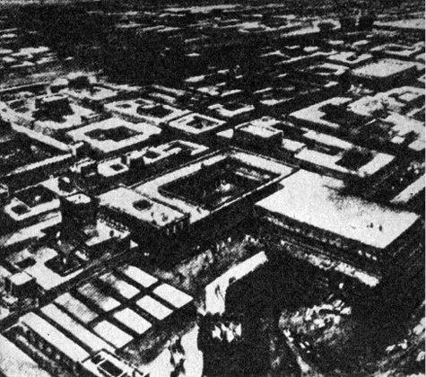
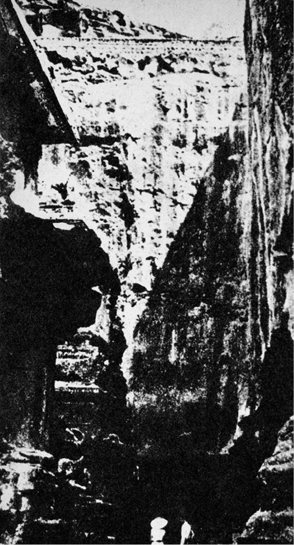
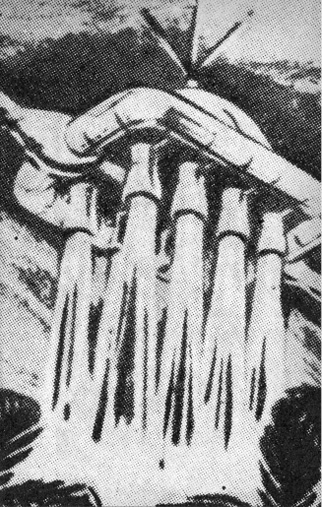
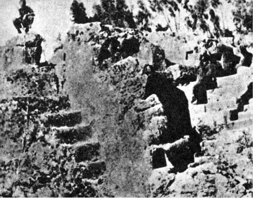

<section>

> _Všichni souhlasíme, že vaše teorie je šílená.  
> Rozcházíme se jen v tom, zda je dostatečně šílená, aby bylo  
> pravděpodobné, že je pravdivá.  
> Mám pocit, že tato teorie není dostatečně šílená._

NIELS BOHR V DISKUSI K REFERÁTU W. PAULIHO

Sovětský sborník Problémy kosmické biologie konstatuje, že v Indii byla objevena 4000 let stará lidská kostra, jejíž radioaktivita padesátkrát převyšuje přirozené radioaktivní „pozadí“, zjištěné v okolí. Jediné přijatelné vysvětlení podivného nálezu je, že tento člověk za svého života, přesněji řečeno těsně před smrtí, jež se nevyhnutelně záhy dostavila, byl mohutně ozářen nebo požil potravu, kontaminovanou radioaktivními látkami v množství stonásobně nebo více převyšujícím přípustnou dávku. Nejspíše to mohly být ryby, živící se planktonem, jenž v sobě, jak známo, koncentruje radioaktivní látky, takže např. po amerických pokusných výbuších v Tichém oceánu byli Japonci nuceni značnou část úlovku tuňáků a dalších druhů ryb po prozkoumání stupně radioaktivity zakopat na odlehlých místech.

VII. kniha Mahábháraty, posvátného indického eposu, vznikajícího v různých dobách a předávaného velice přesně nejprve ústní tradicí asi od 14. století před n. l. (a možná ještě dříve), obsahuje mj. tuto pozoruhodnou zprávu:

„Zbožný Gurkha vymrštil z paluby mocného vimanu (létajícího stroje) jednu jedinou střelu proti kvetoucímu trojměstí. I zdvihl se v nekonečné záři jasný oblak, jasnější než tisíc sluncí, a proměnil města v popel. Když se Gurkha opět snesl k zemi, podobal se jeho vůz svítícímu kusu antimonu…“

Čtenář zajisté pozná, že zlomku citátu použil Robert Jungk pro název své knihy o jaderné bombě – Jasnější než tisíc sluncí.

Jiný text líčí události ještě sugestivněji:

„Byla to lesklá střela, jež se třpytila, aniž vydávala kouř. Byla vržena na nepřítele a tu všechno zahalila hustá mlha. Zavířily jedovaté víry. S děsivým hlukem se zvedla mračna a zaútočila na nebesa. Zdálo se, že se samo slunce chvěje. Celý svět byl spálen žárem výbuchu jako nějakou děsivou horečkou. Tisíce vozů, desetitisíce mužů a slonů byly obráceny v prach a popel.“ Po skončené bitvě nařídil vůdce zničit zbylou, dosud nepoužitou zbraň, jež se „zevnějškem podobala kovovému šípu, připomínajícímu obřího posla smrti. Hrdina nařídil svým lidem, aby ji proměnili v jemný prach“.

Jinde v Mahábháratě se o této zbrani mluví jako o schopné „potrestat Zemi dvanácti lety neplodnosti a zabíjet plod v matčině těle“.

I když připustíme, že anonymní kolektiv autorů Mahábháraty (jejímž základem, kolem něhož se rozvíjejí nespočetné epizody, je boj mezi Kuruovci a Pánduovci) byl obdařen mimořádnou fantazií, jež shodou okolností předjala hrůznou skutečnost, i když připustíme, že se dodatečně do eposu dostalo množství legend, jež měly pouze dokazovat nadřazenost bráhmanů nejen nad lidmi, ale i nad bohy, přece jen je shoda popisu atomových výbuchů (nebo něčeho atomovým výbuchům velmi podobného) a jejich biologického působení nápadná. Epos podává i jakýsi návod protiatomové obrany: tato zbraň je schopna zabít všechny válečníky, kteří mají na těle kov. Dozvědí-li se však vojáci včas, že má být zbraně použito, strhají všechno kovové z těla, po výbuchu se ihned vrhnou do řeky a důkladně omyjí sebe i vše, čeho se dotkli. Není to zbytečné, neboť je známo, že při zanedbání těchto opatření vypadají účinkem zbraně vlasy i nehty a všechno živé bledne a slábne…

Příručky civilní obrany se sice vyjadřují méně květnatě, v podstatě však popisují a doporučují po útoku jadernými zbraněmi učinit totéž.

Podotýkám, že překlady, jichž bylo použito, nejsou upraveny a že jejich autoři nejsou romantičtí přívrženci pana Dänikena – tak rozsáhlé eposy nejsou překládány každoročně; za základní dílo je dodnes považován Royův převod z roku 1889, takže překladatele rozhodně nelze podezírat z vědomého přikrašlování nebo podvědomé aktualizace. Za zmínku stojí i skutečnost, že moderní indologové nepopírají historické jádro mnohých příběhů, popisovaných eposy Mahábháratou i Rámájanou a s nimi úzce souvisejícím literárním okruhem tzv. starých vyprávění čili purán, jimž indická tradice připisuje, patrně jen zčásti právem, značné stáří a za jejichž autora považuje samotného Brahmu.

Shody jsou opravdu prokleté.

Všechna tato podivná sdělení výslovně zdůrazňují charakter účinku zbraně _jako_ při požáru, nejde však o skutečný požár nebo o použití hořlavých bojových látek, např. tzv. řeckého ohně. Ve staroindické literatuře totiž je pro naše jediné slovo „oheň“ plných čtyřicet výrazů, z nichž některé se týkají např. tajných věd nebo magnetismu, význam jiných dosud nedovedeme přesně určit. Je dosti těžké nevzpomenout v této souvislosti výroku W. Heisenberga: „Moderní fyzika se v jistém smyslu neobyčejně přiblížila k Hérakleitovu učení. Nahradíme-li slovo ‚oheň‘ slovem ‚energie‘, můžeme Hérakleitovy výroky považovat slovo od slova za výraz našeho moderního pojetí.“

Pozoruhodný je i termín, používaný na mnoha místech eposu o spoušti, kterou zbraň zanechala: mluví se doslova o stínech kdysi kvetoucích měst. Pro pamětníky atomových úderů proti Hirošimě a Nagasaki s jejich stíny bytostí, stromů i budov, proměněných výbuchem v prach a popel, je to výraz svrchovaně významuplný.

Co znamenají tyto vzkazy z dávné minulosti Indie, v nichž bychom mohli ostatně pokračovat dál a dál až k úvahám, zda kvetoucí Harappa a divukrásné, asi čtyřicetitisícové Mohendžodáro, první město světa s velkorysým urbanistickým řešením a s civilizačními vymoženostmi (ústřední teplárna, rozvod horké a studené vody, kanalizační síť atd.), byly skutečně vyvráceny kočovnými kmeny Árjů (čemuž nasvědčuje nález třiceti koster lidí, zjevně násilně zabitých), vedených „bořitelem měst“ Indrou, a zda na počátku zkázy nebyla, jak se domnívá např. geolog Rex, záhadná přírodní katastrofa způsobená otřesem s epicentrem 140 km na jih od Mohendžodára, jež obrátila tok Indu, zatopila osady, smetla vesnice a zardousila města bahnem, takže jejich obyvatelstvo záhy emigrovalo do Gudžarátu? A jaká katastrofa to byla?

A jaký to byl „hrom a blesk, schopný zničit nepřítele v krajině i za hradbami“, který uvádí řecký sofista Flavius Filostratos jako důvod náhlého a strategicky dosti podivného návratu Alexandra Velikého z Indie, jež byla přece vlastním cílem celého tažení? Nebo se opravdu vrátil jen pro nepokoje v týlu bojujících vojsk, jak je dnes všeobecně tvrzeno?

</section>

<section>

> Mohendžodáro v době vrcholného rozkvětu, jak je rekonstruoval Alan Sorrell

Snad je vhodné připomenout v této souvislosti podivnou pověru, rozšířenou v Indii i v arabských zemích, že štír – na Zemi jich žije přes 100 druhů – neshoří v ohni. Jednoduchý pokus přesvědčí, že je to nesmysl, a tento „pokus“ vhozením štíra do ohně byl jistě nespočetněkrát učiněn. Je však podivnou a dosud nevysvětlenou biologickou zvláštností některých druhů štírů, mezi něž patří např. i indický Ptalamnaeus fulvipes, dlouhý až 13 cm, že snášejí obrovské dávky pronikavého záření a přežívají i ozáření dávkou 10 000 r (podle jiných autorů dokonce 75 000 r). Člověk onemocní při jednorázové expozici 50–100 r, 500 r je kritickou mezí a po ozáření 1000 r je obvykle každá pomoc marná. Štír však v atomovém ohni – a proč by to nemohl být jeden z dosud hledaných významů? – přežije. Není to zvláštní?

Nežli budeme pokračovat dál v hledání civilizací, jež – připusťme to zatím jako pracovní hypotézu – mohly znát atomové zbraně, zůstaňme krátce u létajících indických strojů, vimanů. Zprávy o nich se velmi výrazně liší od pohádek a bájí nejrozličnějších národů, líčících uskutečnění dávného snu lidstva buď ikarskými křídly, orly, nesoucími vzdušné plavidlo, nebo – např. v eposu o Gilgamešovi – samotného vzduchoplavce, případně některým z důvtipných nápadů Cyrana z Bergeraku, o dracích a ptáku Nohovi nemluvě.

Staroindické eposy i purány, především 6. až 10. kniha Mahábháraty i další spisy tohoto kulturního okruhu přinášejí řadu naprosto věcných a střízlivých popisů létajících strojů, jejich taktického zasazení do bitev a dokonce i návodů na jejich zhotovování. Kdybychom přirovnali tyto báje a bohy v nich vystupující např. k biblickým pověstem o Henochovi, Eliášovi a dalších, kteří rovněž zakusili slasti létání, jevili by se nám indičtí bohové, především Brahma, jako výjimečně nadaný a technicky značně pokročilý projekční tým. Neznám totiž příklad, kdy by Hospodin promluvil alespoň trochu zasvěceně – s výjimkou konstrukčního návodu na Noemovu archu a archu úmluvy – a přikázal například: „Blok motoru, synu, odlij z hliníku a hořčíku a písty z legované oceli. A aj, pravím tobě, nezapomeň na kuličková ložiska pro klikovou hřídel…“

Nuže, indičtí bohové takto nemluví jenom proto, že se do létání nepletou a přenechávají je lidem, což je koneckonců správné. V rozsáhlé knihovně rukopisů Mezinárodní akademie pro sanskrtská bádání v Maisúru (Mysore) byl objeven asi 3000 let starý rukopis, přičítaný mudrci a jogínu Bhárádvajovi, jenž žil asi kolem roku 1000 před n. l. Studie pod názvem Vimanika Šastra čili Věda o letectví má osm kapitol s diagramy a vypočítává jedenatřicet podstatných částí letadel a šestnáct druhů kovů nebo slitin (všechny názvy se dosud nepodařilo přeložit s uspokojivou přesností), vhodných pro stavbu létajících strojů. O andělských perutích ani slovo.

Sám výčet šestnácti kovů je pozoruhodný. V době vzniku rukopisu počínal teprve pro Egypt železný věk, zprostředkovaný Chetity, a kromě velevzácného železa znali Egypťané z kovů zlato, stříbro, měď, zinek, cín, ovšem rtuť (od 16. století před n. l.) – a dost.

Jakousi ilustraci k Vimanika Šastra jsou reliéfy skalního chrámu v Eloře nedaleko Hajdarábádu, představujícího přechod od jeskynních chrámů k volným stavbám. Centrem je Kailásanáthův chrám monumentálních rozměrů (45 m dlouhý, 30 m vysoký), symbolizující sídlo boha Šivy, posvátnou himálajskou horu Kailásu, obklopený asi třiceti dalšími svatyněmi. Celý komplex vznikl asi v 8. století n. l. (podle některých autorů byla stavba započata již ve 4. století). Stěny zdobí kromě obvyklých obrazů božstev i bitevní scény, v nichž hrají úlohu válečných strojů letadla. Jakoukoli pochybnost o záměru sochařů vyvrací shoda těchto zobrazení s líčením sanskrtských spisů.

„… Na Rámův rozkaz vystoupil nádherný viman s mocným burácením nad mraky…“

„… Bhoma letěl se svým vimanem na mocném paprsku, který zářil jako slunce a jehož hluk se podobal rachotu moře…“

</section>

<section>

> Část proslulého skalního chrámu Kalasaya v Eloře

„… Jsou to stroje, létající vysoko díky rtuti a mocnému vichru, který je pohání. Jsou schopny překonávat nekonečné vzdálenosti a pohybovat se seshora dolů, zdola nahoru, dopředu i dozadu…

Na jiném místě čteme:

„Uvnitř stroje je zařízení, ve kterém se v železném kotlíku zahřívá zvláštním řízeným ohněm rtuť. Čtyři nádržky se rtutí umožňují tomuto zařízení vyvolat celý vír sil. Vůz pak vystoupí na oblohu s burácením a ti, kdo sledují jeho dráhu, mají dojem, že pozorují nějakou obrovskou perlu.“

Tyto výňatky a další z některých súter (stručných systematických učebnic), především Samarangana Sútradhara, svědčí, že by mohlo jít nejspíše o tryskový pohon. V této myšlence nás utvrzuje i již zmíněná Vimanika Šastra:

„… uprostřed korábu je těžká kovová schránka, zdroj síly. Z této schránky jde síla do dvou silných hlavních trubic, připevněných na zádi a na přídi korábu. Mimoto se tato síla rozvádí do osmi ramen, směřujících otvory dolů. Při vzletu se odkryjí clony osmi rour, směřujících dolů, a horní otvory jsou uzavřeny. Proud síly udeří do země, zdvíhaje tím koráb vzhůru. Když je dost vysoko, jsou otvory zpola zakryty, aby právě visel ve vzduchu. Pak je větší část síly převedena do zadní roury, aby mohl koráb vyrazit vpřed…“

Pomocí těchto strojů, prohlašují indické prameny, mohli pozemšťané vystoupit do vzduchu, zatímco obyvatelé nebeských těles jich používali, aby sestoupili na Zemi. Cituji přesně Gorbovského: obyvatelé nebeských těles, nikoli bohové…

Na dobu, kdy ještě nebyl založen Řím a kdy se „řecký zázrak“ skrýval v daleké budoucnosti, je to jistě slušný technický popis reaktivního nebo raketového vzdušného plavidla, jemuž velkoryse promineme mylnou představu, že se výtokový proud z trysek opírá o zem a tím plavidlo nadnáší. Nemusím snad dodávat, že ani tyto překlady citátů nejsou svévolně upravovány a „modernizovány“, i když by ovšem textová kritika, základ historického zkoumání, byla namístě.

</section>

<section>

> Rekonstrukce staroindického létajícího stroje podle knihy Vimanika Šastra

Ve staroindickém eposu Rámájana nalezneme řadu pasáží, které lze vysvětlovat jako reflexe setkání s létajícími nebo dokonce kosmickými přístroji. Netřeba ovšem dodávat, že v těchto případech je namístě nejvyšší rezervovanost.

Ráma a jeho bratr Lakšman se utkali s démonem:

</section>

<section>

… les porážel – to démon po nich ruce vztáh.  
Bez hlavy, bez nohou byl, ústa v břiše měl,  
tam svítilo též jedno oko veliké,  
jak černé mračno vypadal a hromem řval…  
………  
V tu chvíli duch se vznesl v záři planoucí…

</section>

<section>

Ráma si zajistil spojenectví dobrého krále opic Hanumana. Král medvědů Hanumana oslovuje:

</section>

<section>

Vstaň, reku, přeskoč moře, zachraň všecky nás!  
Tvým otcem je bůh větru, on ti sílu dal.  
Už jako dítě, když jsi slunce uviděl,  
tys myslel, že plod rudý vidíš před sebou,  
a do nebe jsi skočil celých tři sta mil…

</section>

<section>

Jinde nacházíme verše:

</section>

<section>

Zamával Hanuman svým velkým ocasem,  
jenž zablýskal se křivolace ve vzduchu.  
Odrazem hora mohutná se zachvěla  
a stromy za ním za chvíli do výše spěchaly,  
v jeskyních řvali strachem skrytí tvorové,  
v úzkosti hadi oheň z tlamy chrlili  
a skálu kousali, až jasně vzplanula…

</section>

<section>

V eposu Hanuman spolu s opičím vojskem potřel strašné démony rákšásy i s jejich králem Rávanou a osvobodil krásnou Sítu. V „kosmické“ interpretaci by patrně bylo možné nalézt v eposu vzpomínku na humanoidní návštěvníky z vesmíru a jejich „krále“ – raketoplán.

Zmiňme se ještě o podobných zprávách z Tibetu, jehož lámaistická literatura, především posvátné knihy Kanžur a Tanžur o mnoha a mnoha stech svazcích nebyly dosud ani z nepatrné části přeloženy do evropských jazyků, o keltských pověstech, popisujících „létající zvířata, pokrytá železným krunýřem, jež neměla kosti a nemusela žrát“ – což je definice, odpovídající mentalitě prostého člověka, jenž stanul tváří v tvář letadlu.

Tím končíme malou odbočku k létajícím strojům starověku. Umožní nám pochopit některé souvislosti kapitoly Otřesené civilizace a doplnila vyprávění o podivných a děsivých zbraních, jichž používali Indové v minulosti tak dávné, že je pro nás nedohlednou. Vraťme se však k atomovým výbuchům.

Kromě podivného požáru, jenž zničil a v pravém slova smyslu spekl ve škváru Chattuš, hlavní město chetitské říše, a kromě některých podobných nálezů, mj. i v Irsku, se od několika let obrátila pozornost romantičtějších badatelů především k dobře známé biblické epizodě zničení Sodomy a Gomory.

Profesor Matvěj Agrest například říká: katastrofa, jež zničila Sodomu a Gomoru, mohla být způsobena atomovým výbuchem, když nepozemšťané likvidovali nadbytečné zásoby jaderných paliv, které nehodlali zanechat v dosahu všetečných a protiradiační ochrany neznalých pozemšťanů.

Poněkud odvážná teorie se opírá o několik bodů biblického textu:

1\. Spravedlivého Lota zachránili dva andělé, kteří jej varovali před neštěstím a doporučili mu důrazně prchnout „do lůna hor“ a za žádnou cenu se neohlížet, což je při atomovém výbuchu vzhledem k oslepujícímu světelnému záření zcela rozumná rada.

(Agrest neuvádí zajímavou podrobnost, že totiž podobných bájí je známa celá řada a takřka ve všech vystupují dva černě odění poslové, varující obyvatele dotyčné oblasti před následky hrozící katastrofy. Shoda je dosti nápadná.)

2\. Lot odpovídá nezvyklým způsobem: „… bojím se, že ono zlo do mne pronikne a usmrtí mne…“

Hospodin slíbil (v Mojžíšově podání) zahladit Sodomu a Gomoru sírou a ohněm, hrozilo tedy popálení, uhoření, případně udušení kouřem či zalknutí žárem. Ani v jednom z těchto případů není příliš logické mluvit o „zlu, které proniká“. Kdyby ovšem šlo o pronikavé záření, pak by se Lot vyjadřoval zcela přiměřeně, především proto, že vyjadřuje obavu, aby nebyl „zlem“ zastižen dříve, než bude moci uprchnout pod ochranu hor, tedy na nechráněné rovině.

3\. Popis samotného Hospodinova dopuštění je dosti sugestivní: „… Hle, vystoupil sloup kouře ze země jako sloup kouře z výhně… A dštila na Sodomu a Gomoru síra a oheň… A zničila města tato a celou rovinu a všechny obyvatele měst a kotliny země…“ „Sloup kouře ze země“ má morfologicky dosti blízko ke známému atomovému hřibu.

</section>

<section>

Moderní kritici bible mají celou řadu námitek jak proti biblické příhodě samotné, tak – tím spíše – proti její „kosmické“ interpretaci. Hlavními argumenty je naprosté zmizení obou měst a jejich existence právě jen v 1. Mojžíšově knize. Vyprávění o zničení hříšného města považují za jeden z didaktických mýtů, varujících před božím hněvem a jeho následky jako je potopa a další maléry, jež celkem nerudný a v hněvu ukvapený Hospodin sesílal na lidstvo. Takže se celá diskuse stává bezpředmětnou. Odmítají proto – domnívám se, že právem – psychologickou argumentaci, totiž rozbor jednání osob, jímž nelze dospět k jádru faktů, pouze k jádru psychologie legendy jako útvaru lidové slovesnosti.

Jediným ústupkem, který jsou po stránce nábožensko-fenomenologické ochotni znalci bible v tomto případě, ač neradi, poskytnout, je zařazení legendy o zničení Sodomy a Gomory do období patriarchů. Staletí trvající proces vytváření izraelského kmenového svazu byl v ústní tradici sice zhuštěn do období tří generací (Abraháma, Izáka a Jákoba), přesto však odráží vzdálené vzpomínky na kmenové dějiny.

Je to, upřímně řečeno, malá útěcha.

Poněkud tolerantněji se stavějí k problematice odborníci, připouštějící existenci jakýchsi sídlišť v oblasti Mrtvého moře i katastrofu, jež byla patrně způsobena vznícením podzemních zřídel nafty a zemního plynu, doprovázených efekty, jež musely obyvatele přesvědčit o zásahu Hospodina, rozhořčeného hříchy, které se při dobré vůli vždycky najdou, tím spíše, jde-li o hromadné rozšíření poněkud exkluzivního hříchu sodomie.

Je to důvtipná teorie, ale její slabinou je skutečnost, že podobná katastrofa, tj. katastrofa alespoň přibližných rozměrů, nebyla dosud pozorována, a naftaři ji považují za velmi nepravděpodobnou. Kdyby se v takovém případě přeneslo alespoň zrnko historického faktu do báje (a, jak uvidíme, takových zrnek je obvykle dost), musel by Mojžíš popisovat ohnivý, nikoli kouřový sloup, děsné hučení atd. atd.

Geologické prozkoumání okolí Mrtvého moře záhadu poněkud objasnilo. Objevilo patrně i údolí Siddim, kde měly Sodoma i Gomora a další zničená města stát.

Mrtvé moře je děleno poloostrovem el-Lisan (arabsky „jazyk“) téměř na dvě části, podstatně se lišící konfigurací dna: na východ od „jazyku“ nacházíme hloubku až 400 metrů, na západ sotva 15–20 metrů. Pod hladinou jezera jsou tu kmeny stromů solí konzervované, sice prastaré, ale přece jen nepocházející ze vzdálených geologických dob. A mělká část jezera je součástí zlomu se stopami vulkanické činnosti, táhnoucího se z Malé Asie k Akabskému zálivu. Je to hledané údolí Siddim.

Podle úsudku geologů zde byla naposledy aktivní sopečná činnost kolem roku 1900 před n. l., kdy došlo k poklesu, hladina Mrtvého moře se podstatně rozšířila a osady zmizely pod hladinou. Fénický kněz Sanschuniathon píše ve svých Pradějinách: Údolí Sid­dim kleslo a stalo se mořem věčně se pařícím a bez ryb, obrazem pomsty a smrti za rouhačství.

I pro Lotovu ženu, proměněnou v sloup, mají geologové vysvětlení: na západ od jižního pobřeží jezera se táhne 15 km dlouhý řetěz nízkých pahorků, složený zčásti ze soli. Arabové jej nazývají Džebel Úsdúm, co zvukem slova připomíná Sodomu. Některé útvary jsou účinkem dešťů a větrů bizarně zformovány a mohou být připodobněny lidským postavám.

Takže diskuse by se stala rovněž bezpředmětnou.

Historikové nemají na rozdíl od přírodovědců možnost ověřovat pokusem své domněnky. Tento nedostatek do jisté míry nahrazuje pečlivá konfrontace pramenů a jejich kritika spolu s diskusí, přinášející argumenty pro tu či onu hypotézu. Pokusme se o to a nespokojme se s jednoznačným vysvětlením, i když je přírodovědecky přijatelné. Je tu totiž několik háčků.

V okolí Mrtvého moře byla nalezena zvýšená radioaktivita díky zvýšenému podílu radioizotopů s dlouhými poločasy rozpadu, k jejichž hledání dal podnět oděský fyzik M. Agrest. Nejde o přirozenou radioaktivitu vyvřelých hornin, vystupujících na povrch. Hodnoty radiace i zjištěné izotopy tomu neodpovídají.

V blízkosti – relativně vzato – se nachází naleziště libyjského skla, o němž a o jeho příbuznosti se sklem, vzniklým po jaderných výbuších, jsme se již zmínili.

Další biblické knihy přinášejí řadu podobných příběhů – především Ezechielovo proroctví, ale i další, přímo vybízející ke „kosmické“ interpretaci.

Především však nikde ve Starém zákoně, pokud odráží skutečné události, nenacházíme zmínky o sopečné činnosti, s výjimkou Exodu, kdy prý Židům v noci ukazoval cestu ohnivý sloup. Proroci, využívající každého přírodního jevu k posílení svého vlivu, by zcela jistě neopomenuli řádně projednat tak markantní a efektní příhodu, jako setkání s vulkanismem jakéhokoli druhu. Kromě toho se zdá, že datum příchodu Židů do Palestiny musíme klást do pozdějších století (první mimobiblický záznam, vztahující se k izraelskému kmenovému seskupení, je teprve egyptská stéla faraóna Merneptaha z druhé poloviny 13. století před n. l.) a že k vulkanickému poklesu došlo – došlo-li k němu vůbec – dříve než se v těchto končinách usadili a než měli čas změnit způsob života a zaměnit kočovnické stany za pevná sídliště, dokonce v jakési aglomeraci.

Starozákonní líčení neodpovídá poklesu půdy. Jistě i taková katastrofa by se mohla stát podkladem sugestivního a varovného líčení, avšak pak by popis vypadal zcela jinak. Dokonce i stručná zmínka Sanschuniathonova naznačuje, ačkoli mohl čerpat pouze z mnohokráte zprostředkovaných zpráv, že šlo o děj sice mimořádný, avšak zcela místní; kdyby se byl rázem vytvořil zlom o délce několika set kilometrů, procházející daleko kulturnějšími a osídlenějšími krajinami, nebyl by se zmiňoval toliko o údolí Siddim, bezvýznamném kousku pouště na březích slaného jezera s několika sídlišti kočovných kmenů, vstupujících teprve nesměle do dějin Blízkého východu. Sodoma a Gomora ostatně nejsou jedinými městy, naznačujícími možnost zničení výbuchem, jehož přirozenou, např. vulkanickou genezi si stěží dovedeme představit. Otázky klade i incká, lépe řečeno předincká pevnost Sacsayhuaman poblíže prastarého sídliště Cuzka. Jde patrně o nejmonumentálnější megalitickou a monolitickou stavbu až dosud na naší planetě odkrytou. Některé skalní bloky nepochopitelně, avšak určitě opracované do přesných ploch, křížících se v dokonalých úhlech, vylučujících použití kamenných nástrojů, nebo bobtnajících dřevěných klínů, tu mají velikost několikapatrových domů. Jde o žulu, tedy hlubinnou horninu mimořádně tvrdou, pevnou a odolnou, do níž byly vytesány geometricky přesně omezené chodby v hloubi několika desítek metrů. Jsou dnes na mnoha místech posunuty, přerušeny, zavaleny nebo deformovány. Obrovské mnohatunové kvádry, jejichž transport, ba již pouhé posunutí by znamenalo pro moderní techniku výzvu a problém (tím spíše ovšem pro Pizarrovy negramotné loupežníky), leží zpřeházeny a vyrvány ze spojovacích čepů.

Odborníci tu vylučují vulkanickou činnost v posledních deseti tisících letech, zemětřesení takové síly je rovněž nepravděpodobné. Ale zato na některých žulových blocích jsou zesklovatělé plochy, jako by tu působil strašlivý žár…

</section>

<section>

> Obrovské kamenné bloky velikosti domů s vytesanými obřími schody a terasami

Tolik alespoň k atomovým výbuchům nebo k dějům, jejichž stopy a popis se atomovému výbuchu podobají, v dávné minulosti. Mohli bychom citovat řadu dalších bájí a popisovat řadu dalších nálezů, vesměs navzájem dosti podobných. Vzrostl by objem, nikoli kvalita našich informací.

První, co je třeba učinit, je vyloučit samovolný atomový výbuch, k němuž by došlo nahromaděním nadkritického množství štěpných materiálů. Jak víme, i o této možnosti se uvažovalo v souvislosti s tzv. tunguzským meteoritem.

Současná fyzika a geologie takovou možnost popírá. Zdá se však, že mohou existovat přirozené jaderné reaktory. O jednom z nich referoval nedávno francouzský vysoký komisař pro atomovou energii François Perrin ve Francouzské akademii věd: v dole Oklo v africkém státě Gabunu odhalilo složení izotopů „stovky let starou řetězovou reakci, která se sama udržovala“. Obohacení uranové rudy v Oklo štěpitelným uranem 235 činilo před 1,7 miliardy let asi 3 procenta, tedy přesně tolik, kolik je dnes používáno v palivech pro lehkovodní jaderné reaktory. Řetězová reakce samovolně ustala, když podíl uranu 235 klesl. Zatímco v přirozeném uranu je ho obsaženo vždy 0,72 %, v Oklo kolísá jeho obsah mezi 0,62 % a 0,73 %.

Takovou možnost nelze popírat tím spíše, že do tepelného režimu naší Země významně (i když patrně ne tolik, jak se ještě nedávno soudilo) zasáhl i přirozený rozpad radioaktivních prvků a možná i obdoby „reaktoru“ v Oklo, pracující v dávných geologických dobách. Samovolný atomový výbuch si však představit nedovedeme a nemáme pro něj logické vysvětlení.

Přijmeme-li hypotézu atomových výbuchů nebo dokonce jaderných zbraní v dávné minulosti lidstva, musíme předpokládat zásah inteligentních bytostí s poměrně rozvinutou technologií, schopnou izolovat z uranových rud např. U 235 v dostatečném množství, aby spojením podkritických mas došlo k lavinové štěpné reakci. Pro „klasickou“ atomovou bombu tritolového ekvivalentu 20 kt (tedy ničivosti, odpovídající výbuchu 20 000 tun tritolu), svrženou např. na Hirošimu, je třeba asi 1000 g U 235. Je však dobře si uvědomit, že sám princip jaderné bomby (nebo jaderné miny, nálože) je prostinký, neskonale jednodušší než např. složité zařízení torpéda, ba jednodušší než např. složení časovaného šrapnelu. Jde jen o to uvést ve vhodném okamžiku v kontakt dvě podkritická množství štěpných materiálů, aby vznikla nadkritická masa. Ostatní už obstarají samy elementární částice. První atomové bomby byly sice pořádně rozměrné, vážily několik tun a obsahovaly složitou elektronickou aparaturu (pečující ovšem především několikanásobným jištěním o samozničení, kdyby k výbuchu nedošlo), dnes je však atomová munice ve výzbroji dělostřelectva, ba dokonce i minometných jednotek.

Laureát Nobelovy ceny Fréderic Soddy (1877–1956, Nobelova cena roku 1921 za chemii radioaktivních látek a za výzkum vzniku a povahy radioizotopů) napsal ve své knize Výklad rádia: „Domnívám se, že v minulosti existovaly civilizace, které znaly atomovou energii a které špatné používání této energie úplně zničilo.“

</section>

<section>

> Podzemní prostory bývají obvykle označovány jako „chrámy“ – tyto v turec­kém Derinkuyu, schopné pojmout až 60 000 lidí, nejsou výjimkou. Jinak se ovšem chrámům nepodobají – spíše krytům

Vede ještě nějaká cesta k těmto civilizacím?

Pokusíme se o to dvěma směry: první z nich snad naznačuje důsledky, které mohl otřes, způsobený zasazením atomových zbraní, mít, promítaje se do mýtů, materiální kultury i mentality národů a kulturních okruhů. Pojednáme o něm v kapitolách o otřesených civilizacích.

Druhou cestou je pokus o naznačení možností (nikoli o odkrytí nebo snad dokonce „řešení“), skrytých jako koruptela v obrovské a pro jednotlivce naprosto nepřehledné alchymické literatuře.

</section>

<section>

Do samého středu problému vstoupil alchymista, jenž roku 1937 vkročil do pracovny Jacquesa Bergiera, jaderného chemika a asis­tenta profesora Andrého Helbronnera, který po dobrodružné činnosti ve francouzském hnutí odporu, pobytu ve vyhlazovacím koncentračním táboře a obecném uznání po II. světové válce napsal s Pauwelsem knihu Jitro kouzelníků, kam odkazuji čtenáře k podrobnostem. Alchymista Bergierovi sdělil, že laskavostí Helbronnerovou zná obsah jejich společných pokusů s umělou radioaktivitou polonia a pokračoval: „… Smím vás varovat? Práce, kterou podnikáte, je nesmírně nebezpečná. Neohrožuje jenom vás, ale celé lidstvo. Uvolnění jaderné energie je snazší, než se asi domníváte. Umělá radioaktivita může v několika letech zamořit celou atmosféru naší planety. Kromě toho je možné pouhým přidáním několika gramů jistých kovů vyrobit atomové bomby, schopné zničit celá města. Říkám vám to zcela jasně; alchymisté to věděli už dávno.“ Bergier, pyšný na svou moderní laboratoř, se jen pousmál, ale muž pokračoval: „Vím, co chcete říci… Alchymisté neměli ani ponětí o struktuře atomového jádra, neznali elektřinu, neměli žádné detektory, a proto nebyli schopni provádět žádné transmutace či uvolňovat jadernou energii. Nebudu se ani pokoušet přesvědčovat vás, sdělte však, prosím, monsieuru Helbronnerovi alespoň to, že postačí jen jisté geometrické uspořádání mimořádně čistých látek, aby byly uvolněny jaderné síly. Není k tomu třeba ani elektřiny, ani vakuové techniky…“

Bergier tuší, že neznámým návštěvníkem byl Fulcanelli, autor vzácných alchymických spisů, není si však jist. Jisté zato je, že atomový reaktor Enrika Fermiho, v němž poprvé probíhala řízená štěpná reakce, byl určitým geometrickým uspořádáním kostek U 235 a grafitu bez elektřiny (kromě ovšem v měřicích přístrojích) a bez vakuové techniky.

Jisté je, že staroegyptský Harrisův (Leydenský) papyrus, jenž unikl spálení všech knih podobného druhu z Diokleciánova příkazu roku 296 n. l., nabádá alchymisty: „Uzamkněte svá ústa! Uzamkněte je pevně!“ a o něco později text čínský: „Bylo by strašným proviněním, kdybys sdělil vojákům tajemství našeho umění. Dej pozor! V prostoru, kde pracuješ, nesmí být ani hmyz!“

Středověký alchymista musel k práci přistupovat denně v čistě vypraných šatech, v čistém prádle a vykoupaný. Během laborace nesměl jíst ani pít.

Nevěděl proč. Bylo to „arkanum“, příkaz, jaký dodnes ve všech bodech dodržují laboratoře, pracující s radioaktivními látkami.

Nekonečné, zdánlivě nesmyslné destilace a redestilace jsou používány i dnes např. k získávání velice čistých látek nebo tzv. těžké vody, jež byla a dosud je moderátorem některých atomových reaktorů. Je to náhoda nebo útržková a nepochopená vzpomínka?

Neustále opakované operace za stejných podmínek a podle týchž receptů by ovšem uvedly moderního chemika k šílenství, ale při tehdejším nevyhnutelném kolísání kvality ingrediencí by byl postup při víře ve správnost receptu zcela pochopitelný. Je i to náhoda?

A jak dlouho existovala nepřerušená tradice vědomostí, o nichž se dnes jen dohadujeme?

Anglický atomový fyzik Da Costa Andrade neváhal při svém slavnostním projevu v Cambridgi roku 1946 k třístému výročí Newtonova narození prohlásit, že Newton patřil k řetězu zasvěcenců, předávajících si staletími tajemství hmoty i síly, jež se v ní skrývá, že však odhalil světu jen malou část svých vědomostí. Newton sám napsal: „Alchymická praxe představuje pravděpodobně bránu, vedoucí k daleko ušlechtilejšímu vědění. Tyto poznatky však nesmějí být, jsou-li spisy Herma Trismegista pravdivé, rozšířeny, nemá-li svět upadnout v obrovské nebezpečí…“

„Kromě nauky o proměnách kovů jsou i jiná tajná umění, pokud nejsou slova starých mistrů pustým vychloubáním. Jenom oni znali tato tajemství…“

„Vystoupil jsem tak vysoko jenom proto, že jsem stál na teme­nech obrů…“

Je toto vše opravdu řetěz náhod a nedorozumění?

</section>
