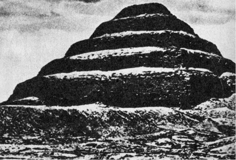
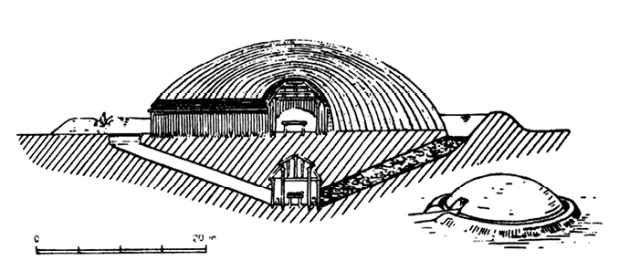
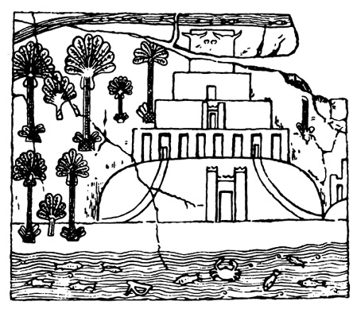
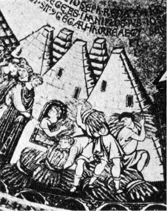
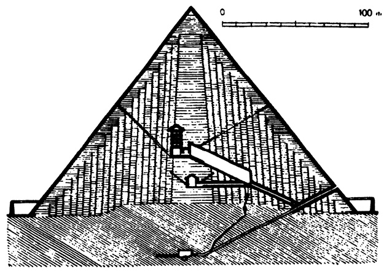

<section>

> _Čtvrtého měsíce rozpuku dne 23. se pracovalo.  
> Čtvrtého měsíce rozpuku dne 24. se pracovalo.  
> Čtvrtého měsíce rozpuku dne 25. se pracovalo.  
> Čtvrtého měsíce rozpuku dne 26. se pracovalo.  
> Čtvrtého měsíce rozpuku dne 27. se pracovalo.  
> Čtvrtého měsíce rozpuku dne 28. se pracovalo.  
> Pátého měsíce rozpuku dne 29. byl Rahotep  
> nemocen a Telmonte nebyl v práci,  
> poprav se se svou ženou._

ZÁPIS ZE STAVBY PYRAMIDY, PODLE V. J. ŽIŽKY

Spěchám, abych čtenáře uklidnil. Nehodlám psát o mystice čísel, „zašifrované“ ve Velké pyramidě, ani o mnoho diskutovaném způsobu staveb, které někteří ohromení návštěvníci připisovali, vzhledem k nelidským rozměrům velkých pyramid, zásahům bohů, modernější romantikové, nedůvěřující lidským silám, vytrvalosti a důvtipu, nepozemšťanům. Nehodlám se zabývat ani zvláštními vlastnostmi tvaru pyramidy a jejího působení, jež podle soudu pana Bovise mumifikuje vložená těla a podle patentu K. Drbala v lepenkové miniatuře brousí žiletky (což je jistě záslužné).

Bylo by jistě o čem psát – osobně považuji za jednu z největších zajímavostí Velké pyramidy, její přesné situování podle světových stran, od něhož se severojižní hrany odchylují pouze o 2′28″, západovýchodní o 5′30″ a 2′30″. Kompasem (jehož znalost u Egypťanů ostatně nepředpokládáme) nelze takové přesnosti měření dosáhnout. Jedinou možností je opětované sledování kulminace jasných hvězd a určení směru, avšak vůdčí duch antické astronomie Klau­dios Ptolemaios, žijící v Alexandrii v letech 90–160 n. l., a tedy skoro 3000 let po předpokládané stavbě pyramid, jemuž byly v tomto synkretickém prostředí k dispozici všechny vymoženosti antické techniky, měřil polohy hvězd s přesností na pouhých 10′ – teprve Tycho Brahe, skvělý pozorovatel, vybavený vynikajícími přístroji (jedním z nich byl např. obrovský Quadrantus muralis Tychonicus) vystupňoval přesnost desetinásobně, takže jeho měření nebyla překonána ani plných 80 let po vynalezení dalekohledu…

Avšak o tyto otazníky teď nejde.

Chufévova (Cheopsova) pyramida byla poprvé veřejně (a patrně vůbec poprvé) otevřena roku 820 n. l. synem legendárního Hárúna ar Rašída, arabským chalífou al-Mamúnem, jenž přivedl k úpatí velké Chufévovy pyramidy, tehdy ještě pokryté zářivými vyleštěnými deskami, celou armádu kameníků, architektů a pomocných sil. Leštěný povrch pyramidy byl proveden tak dokonale, že mezi jednotlivé desky nebylo možné zasunout ani hrot damascénské čepele – čímž se ještě dnes právem chlubí arabští průvodci turistů nejen v Gíze, ale i v komplexu baalbeckých chrámů a jinde. Úkol, který si al-Mamún vytkl, vypadal stěží splnitelně: objevit vnitřní prostory pyramidy a nalézt v nich nejen poklad faraónů (na chudobu si chalífa rozhodně nemohl stěžovat), ale zejména nerezavějící zbraně, nerozbitné sklo a další zázraky, slibované chalífovými rádci.

</section>

<section>

> Proslulé pyramidy v Gíze při pohledu od jihu

Jedna deska byla jako druhá – chalífa tedy poručil hloubit tunel do pyramidy „ostřím se dotýkající nebes“ tak hluboko a tak dlouho, dokud kameníci nenarazí na systém vnitřních prostor. Byla to cesta obtížná a zdlouhavá, rozhodně obtížnější než Strabónova rada, podle níž postačí „vyzvednout kámen na boku pyramidy v nevelké výši, pod nímž je vchod, vedoucí ke hrobu“. Sám chalífa ani netušil, do čeho se pouští. Vápencové desky i kvádry vzdorovaly železným dlátům a musely být trhány ohněm a vodou (v této souvislosti se opět vtírá pochybnost o předpokládaném tempu výstavby pyramid kamennými, dřevěnými a jen výjimečně měděnými nástroji…), takže vyrubání třicetimetrové chodby si vyžádalo řadu měsíců. Dílo by bylo patrně opuštěno, kdyby dělníci jednoho dne, když už všem docházela trpělivost, nezaslechli z nitra pyramidy hluk, jako by se valil do hlubiny balvan. Trvalo několik dalších týdnů, než se vlomili do úzké chodby, součásti pravého labyrintu, jenž je po rozličných obtížích a příhodách dovedl až k… prázdnému žulovému sarkofágu v pohřební komoře. Zklamání bylo tak velké, že prý dobrotivý chalífa (který vyhubil polovinu Koptů, potomků starých Egypťanů) vlastnoručně zakopal v jedné z chodeb poklad, který po „objevení“ rozdal neúnavným dělníkům.

Byl Mamún opravdu prvním návštěvníkem hrobky? Nelze dát jednoznačnou odpověď, nelze vyloučit, že hrobka byla vyloupena ještě v průběhu stavebních prací před dokončením obložení pyramidy. Je to však velmi nepravděpodobné. Tak velkorysá gangsterská akce by vyžadovala spiknutí nejvyšších funkcionářů faraónova dvora a sotva by zůstala utajenou. Téměř bezpečným důkazem o neporušenosti hrobky, v níž nikdy nebyl nikdo pochován a v níž snad ani nikdo pochován být neměl, je skutečnost, že sarkofágu již v době Mamúnovy akce chybělo víko, chránící mumii, a vzhledem k rozměrum žulového sarkofágu jistě mnoho set kilogramů těžké. Nikde nejsou stopy poškození, k němuž by při rozbíjení víka nepochybně došlo. Těžko si představit, že by zloději, riskujíce životy a vystavujíce se nejrafinovanějším a nejkrutějším způsobům popravy, odnesli strmými, těžko schůdnými a úzkými chodbami – kus kamene…

Chufévova pyramida nezůstala u Gízy osamocena. Další faraóni IV. dynastie (asi 2600–2480 před n. l.) Ráchef (řecký Chefrén) a Menkauré (Mykerínos) postavili své pyramidy v bezprostřední blízkosti a obklopili je po Chufévově vzoru menšími pyramidami pro manželky a hrobkami dvorních hodnostářů. Jednou z pozoruhodných charakteristik všech tří nejznámějších pyramid je nejen podobnost, ale takřka shodnost vnitřní architektury, alespoň pokud jde o sestupnou chodbu a podzemní komoru; v Chufévově má neznámou funkci, v Ráchefově pyramidě slouží tato komora jako pohřební, stejně jako v médúmské pyramidě Snofrevově, budované kolem r. 2600 před n. l., vzniklé dodatečným zakrytím dvoufázově budované a podle některých autorů nikdy zcela dokončené stupňové pyramidy. Složitější vnitřní architekturu rozličných prostor má pyramida Chufévova. Přesně podle Mamúnova násilně vylámaného vchodu do Velké pyramidy vnikl jeden z nejpozoruhodnějších zjevů egyptologie, padovský rodák, řeholník, cirkusový silák, akvizitér Britského muzea a krasavec Giovanni Battista Belzoni 2. března roku 1818 poměrně malým otvorem do sestupné chodby Ráchefovy pyramidy, o níž všichni předtím tvrdili, že je kompaktní stavbou bez chodeb a komor.

Nehoršeme se na mnoho pomlouvaného cirkusáka Belzoniho pro jeho poněkud razantní metody průzkumu – nebyly tehdy ničím neobvyklým. Právě naopak. Renomovaný a slavný britský badatel plukovník Richard Howard-Vyse ještě o dvacet let později marně prorážel cestu do pyramid střelným prachem a provrtával sfingu jak ementálský sýr, doufaje narazit na vnitřní prostory…

Schematický a v několika nejvýznačnějších pyramidách se opakující vnitřní plán uvádí ve značnou pochybnost dosud obecně platný názor, že totiž jsou hrobkami, navršenými nad malou pohřební komorou, jež měly chránit faraónovy tělesné pozůstatky, aby zosobnění životní síly, duch (astrální tělo) ka nedoznal úhony a neopustil tělo. Vzhledem k nesmírné náročnosti a obtížnosti staveb projevili vysoce kvalifikovaní staroegyptští architekti pramalou nápaditost v ukrývání hrobních komor, spokojujíce se kopírováním vzoru nejstarší médúmské pyramidy, a co hlavního: neudělali nejbezpečnější a zaručené opatření, čelící tajným vylupovačům hrobů, totiž úplné zazdění chodby po uložení faraónova těla do sarkofágu. Takové opatření by zajistilo kýžený posmrtný klid pro pozůstatky i nepostradatelné ka před každým, kdo by nedisponoval početnou skupinou kameníků a pomocných nosičů, schopných věnovat dlouhou řadu měsíců takřka nadlidské práci. A přece zazdění chodby, jež ostatně neměla zůstat průchodnou, o čemž svědčí řada přehrazujících kamenných desek, by představovalo pouhý nepatrný zlomek úsilí i materiálu, vynaložených na stavbu celé pyramidy.

Situování vchodů do pyramid ostatně nebylo diktováno ohledy na co možná nejúčinnější ochranu hrobu, ale důvody rituálními. Bylo tomu tak již od první skutečné pyramidy, postavené kolem roku 2700 před n. l. všeumělem Imhotepem pro zakladatele třetí dynastie Džósera na podkladě stupňovité mastaby. Stavba již nebyla z hliněných cihel, ale z kamenných kvádrů a měla, jako i všechny ostatní hrobky faraónů třetí dynastie, výstupní chodby a vchody orientovány k Polárce. Podle tehdejších představ sem měl vládce vstoupit a ztotožnit se s jednou z cirkumpolárních hvězd. Vzhledem k obvyklému umístění hrobní komory pod středem základny pyramidy nebylo tedy obtížné na spojnici s Polárkou nalézt na severní stěně pyramidy zazděný vchod.

Tento rituální zvyk, mimochodem řečeno, vyvrací nesmyslné domněnky o pyramidách, budovaných prý kromě jiných nespočetných funkcí i jako „dokonalé hvězdárny se stálou teplotou v observatoři, tvořené hrobní komorou“. Z takové „observatoře“ by byla vidět cirkumpolární oblast oblohy velikosti asi měsíčního úplňku, pro astronomy pramálo zajímavá, pro astrology (což mohlo být závažnější) naprosto bezvýznamná. Nic víc.

Budování pyramid jako svrchovaně okázalých hrobek nelze ovšem odmítnout; možno říci, že celý život starých Egypťanů byl poznamenán vědomím smrti daleko více než řeholníků trapistů, zdravících se navzájem „Memento mori!“. Posmrtný život se nejevil Egypťanům v nijak zvlášť růžových barvách, jejich náboženství v tomto ohledu nehýřilo optimismem.

Záhrobí však bylo možné obelstít a obstarat si na cestu přes práh onoho světa jednak co možno největší pohodlí, poskytované služebnictvem (třeba jen v podobě hrobních sošek, jež, nadány životem, nebožtíkovi poslouží), předměty denní i luxusní potřeby a vybranými pokrmy, které vzhledem k minimální a spíše symbolické potřebě skromného ka postačí na neomezenou dobu. Tato představa ovlivnila i prosté Egypťany chudších vrstev tak dalece, že značnou část celoživotního výdělku a veškeré úspory investovali do své hrobky a do procesu balzamování, zajišťujícího co nejdelší soudržnost fyzického těla a astrálního ka. Hrobky faraónů byly pochopitelně nedostižným vzorem, nesmírně okázalým, ale co do nákladnosti přístupným vládcům Dolního i Horního Egypta, i když na nich pracovaly skupiny svobodných dělníků (nikoli otroků, jimž by sotva bylo dovoleno tvořit skupiny např. pod jménem „Menkauré je opilý“). Podle Hérodota pracovalo na Chufévově pyramidě 100 000 otroků po dobu dvaceti let, podle moderních výpočtů však současně nejvýše 36 000 lidí za předpokladu, že by byla obsazena všechna pracoviště současně, což je nepravděpodobné vzhledem k nemožnosti udržení patřičného pracovního rytmu. Stavební ekonomové vypočítali, že by stavba Velké pyramidy starým způsobem stála při dnešních mzdách více než 34 000 000 liber šterlinků, s pomocí veškeré dnešní mechanizace 3 500 000 liber… Je to hodně – ale za naprosto bezvýznamným, asi devatenáctiletým faraónkem Tutanchamónem bylo do hrobky v Údolí králů v pravém slova smyslu bez ladu a skladu naházeno obrovské množství skvostů; jen cena zlata, použitého na vnitřní rakev, se odhaduje na 64 000 liber šterlinků. Jakými klenotnicemi musely být hroby významných a bohatých faraónů, kteří zemřeli v klidnější době než chudáček Tutanchamón, svědek zbídačení Egypta občanskými nepokoji, vpády Chetitů, vzpourami Núbijců a dalšími pohromami…? Ke všemu se zdá, že Tutanchamón byl Amónovými knězi nebo nedočkavými zájemci o trůn zavražděn – američtí vědci objevili roku 1971 nad jeho levým spánkem proražení lebky ostrým předmětem.

Egyptští kameníci sotva očekávali od mzdy více než reprodukci vlastní pracovní síly a nejvýš ještě obživu rodiny – což v zázračně úrodném údolí Nilu bylo snadné a levné, – netoužíce po televizorech, nových typech automobilů a dovolené např. v minojských letoviscích na Krétě, takže jejich mzdy asi činily pouhý zlomek dnes kalkulované sumy.

Závažným argumentem proti funkci pyramid jako hrobek (ačkoli tato funkce je všemi egyptology uznávána) je kromě schematického vedení chodby k hrobní komoře skutečnost, že v žádném případě nebyly v pyramidách nalezeny pozůstatky mrtvého faraóna, a to ani tehdy ne, bylo-li možné takový nález bezpečně očekávat. Zklamán byl chalífa Mamún, ačkoli otevíral pyramidu s neporušeným krytem vápencových desek a ačkoli jeho lidé prolamovali kamenné desky, přehrazující chodby. Chalífa se nepochybně informoval, zda v době arabské okupace nebyl učiněn úředně schválený pokus o nalezení hrobky. Dříve, dokud ještě žili egyptští bohové, trvající i za dynastie Ptolemaiovců a římské nadvlády, by bylo možné provést loupež jen naprosto tajně a úkradkem (ani to není vyloučeno – pyramida byla králi 26. dynastie opravována) – a přece zmizel několikatunový kryt sarkofágu, sám o sobě bezcenný kámen, ačkoli sarkofág sám je z červené žuly tak leštěné, že jej Helffrich, jenž navštívil Gízu roku 1565, pokládal za kovový. Zmizel, nebo spíše nebyl nikdy položen na místo? Druhá domněnka se zdá být pravděpodobnější, protože s podobnou zkušeností se setkal i krásný Belzoni, jenž zaznamenal historický okamžik svého vstupu do Ráchefovy pyramidy neumělou kresbou. Hrobka byla zpola zakrytá těžkou kamennou deskou, uvnitř se nacházelo několik kostí a arabský nápis, neklamně hlásající, že Belzoni nebyl prvním. Zakoušel asi podobné pocity jako nebohý Scott, když na jižním pólu objevil po nesmírných štrapácích Amundsenův tábor s norskou vlajkou. S rozčarováním však bylo spojeno i překvapení: hrobní komora byla zcela prázdná, chyběl tu nejen sarkofág, jenž by tak jako tak polozavřeným vchodem stěží prošel, ale i obvyklé stopy řádění arabských lupičů, zajímajících se výhradně o šperky, zlato a snad alabastrové nádoby. Hrobní komora, jež prý měla do věčnosti chránit pozůstatky faraóna Ráchefa i jeho věrné ka, byla prázdná, jako vymetená. Totéž potkalo řadu dalších egyptologů, jejichž nadšení a povznesenou náladu, plnou naděje, záhy vystřídalo trpké zklamání. Naposledy se to stalo příslušníku nejmladší egyptologické generace SAR Zakariovi Gonémovi, řediteli vykopávek v Sakkáře, jenž v listopadu 1953 objevil hranu nové, tehdy neznámé pyramidy dosud rovněž neznámého vládce nedaleko pyramidy faraóna Džósera. Zcela podle schématu nejstarší Snofreovy pyramidy objevil i vstup do chodby, vedoucí k hrobní komoře. Goném byl ovšem moderní archeolog, nepoužívající ani dynamitu, ani vrtaček. Postupoval krok za krokem a získával jistotu, že se jemu, právě jemu splnil dávný, vytoužený, ale dosud nedosažený sen egyptologů: objevit nevyloupenou pyramidu…

Všechno nasvědčovalo, že tentokráte bude konečně nesmírné úsilí korunováno úspěchem. Chodba k hrobní komoře byla zřejmě už v dávných dobách zavalena, nacházely se v ní stovky neporušených pohřebních mís, pokud je nerozdrtil zával, které rovněž představovaly pro zloděje jistou hodnotu, ba dokonce malý zlatý poklad (21 náramků, hůlka a zlatá krabička na líčidlo překrásné práce), nehledě na množství zlatých, karneolových a fajánsových perel. Goném byl den ze dne jistější, že do pyramidy vstoupil jako první poté, co byla opuštěna obřadníky, řídícími pohřeb faraóna Sechemcheta (jehož jméno bylo nalezeno na pečetích). Podle kartuší kolem hieroglyfických znaků šlo zřejmě opravdu o faraóna, ačkoli o něm dějiny nevědí zhola nic.

Hlavní chodba klesala ve skále pod pyramidou v délce 72 metrů a končila neporušenou zdí, za níž se po proražení objevila pohřební komora s „nádherným bílým sarkofágem z průzračného alabastru, který se třpytil jako zlato“. Sarkofág nejen nebyl porušený, ale dokonce se zprvu jevil jako z jednoho kusu. Teprve později Goném objevil jeho uspořádání: neměl víko, ale na kratší stěně alabastrovou zasouvací desku v drážkách, dosud zčásti vyplněných sádrovým tmelem. Na sarkofágu byly ještě zbytky „pohřebního věnce“.

Těžko si představit bezpečnější záruky, že hrobní prostory byly nalezeny neporušeny, v původním stavu. Goném se na to právem spolehl a v očekávání reprízy senzace s Tutanchamónovým hrobem pozval 27. června 1954 několik vynikajících pracovníků památkové služby do komory. Deska, zakrývající pohled do nitra sarkofágu, byla po jistých obtížích jeřábem vysunuta.

</section>

<section>

> Džóserova stupňovitá pyramida v Sakkáře, výchozí vzor pro všechny další egyptské pyramidy

Sarkofág byl prázdný.

Představa o symbolickém pohřbívání pouhého faraónova ka do sarkofágu naráží na četné potíže, především z hlediska výkladu staroegyptské víry. Ka je zásadně spojeno s tělem člověka, je jakýmsi jeho astrálním „odlitkem“ a vystupuje za jistých mimořádných okolností jen proto, aby se opět vrátilo. Tělo obývá tak dlouho, dokud nepodlehne rozkladu, přičemž byl obvykle míněn rozpad morfologický, hrubá ztráta individuální podoby a posléze i podoby člověka – nikoli snad rozpad fyziologických funkcí. Kde není přítomno fyzické tělo (třeba i zcela evidentně života neschopné, s odstraněným mozkem a s vnitřnostmi uloženými mimo mrtvolu v tzv. kanopách, ba dokonce namnoze se svaly, oddělenými od kostí), tam nemůže být ka, astrální tělo.

Nemohu si při této příležitosti odpustit kacířskou poznámku: ačkoli všichni egyptologové i popularizátoři shodně motivují egyptské balzamování mrtvol snahou o zajištění existence ka, nenalezl jsem v původní staroegyptské literatuře pro toto tvrzení žádné potvrzení, ba dokonce se zdá, že opak je pravdou. Lexa uvádí ve své knize Náboženská literatura staroegyptská, že původně byly mrtvoly dokonce záměrně zbavovány svalstva, aby nebyl duch příliš dlouho vězněn. Později patrně vznikla víra, že duch trpí týmiž nedostatky jako mrtvola – jakmile je však odloučen, stává se mrtvola pro další existenci ducha bezcennou. K tomuto odloučení dochází poměrně záhy. Lexa píše doslova: „Nesprávné je Hérodotovo tvrzení, že duch žije podle víry starých Egypťanů tak dlouho, dokud mrtvola zůstane neporušena; o tom nenašel jsem dosavad v egyptských textech ani zmínky. Že však život duchův jest nezávislý na stavu mrtvoly, plyne z textu Pyr. 653… atd.“

Rozhodujícími prameny jsou texty pyramid, pojednávající většinou o posmrtném životě královského ducha, pohřební modlitby a kouzelná zaříkávání. Ani zde se nesetkáváme se zdůrazněním významu zachování mrtvoly, naopak, např. v Pyr. 308–311 čteme: „Usíre! Přichází Venís. Odporná jest mu země… Rozlámány jsou jeho kosti, odstraněno je to, co bylo zkaženo na něm…“ Pyr. 371c–375: „Eset chová Veníse… On zbavuje masa nové tělo duchu Venísovu, aby byl přijat od Réa…“ Pyr. 472–474b: „… Zářící duch patří nebi, mrtvola patří zemi; rakve jsou příbytkem lidí…“

Ze starého Egypta se balzamování rozšířilo do Řecka, do Mezo­potámie, Etiopie, výjimečně, v době pronikání orientálních kultů, i do Říma (Ciceronova dcera Tullie). Není vyloučeno, že důvody egyptského mumifikování mrtvol byly dodatečně konstruovány těmito národy. Faraónové totiž byli zasvěceni, znali do podrobností staroegyptské náboženství, což ovšem nelze říci o lidu. Bohoslužby v Egyptě neměly ráz „kázání“ nebo „katechismu“ a lid byl od nich zcela izolován. Lze pochopit, že byl udržován v nevědomosti, protože balzamování představovalo pro kněze vynikající finanční přínos, nelze však chápat faraóny, zřizující pro krátkou dobu obrovité pyramidy, zejména je-li žádoucí, aby tato doba byla co nejvíce redukována…

Za jistých okolností mohlo být – jak věřili staří Egypťané – ka včarováno magickými obřady do sochy dotyčné osoby a obývalo ji místo rychleji chátrajícího těla. Doklad toho nacházíme u severní stěny Džóserovy pyramidy v malé místnůstce, serdábu, kde je faraónova socha, sloužící tomuto účelu a umístěná zde, jak se zdá, i proto, aby bylo snazší zásobovat ji potravinami a nápoji, jež ka sice symbolicky, ale přece jen konzumuje. Proč tedy stavět pro ka pyramidu, může-li být „předisponováno“ do objektu nepříliš cenného a tím celkem bezpečného před lupiči?

Pod Džóserovou pyramidou, v labyrintu chodeb, je i zajímavý reliéf: zpodobňuje faraóna v běhu, což jistě nebyl pohyb božskému vládci všední. Jde pravděpodobně o zobrazení slavnosti sed, tj. slavnost třicetiletého jubilea vlády, kde každý vládce po uplynutí „funkčního období“ dokazoval rozličnými způsoby, mj. i závodem v běhu, svou fyzickou zachovalost a plodnost, na nichž podle náboženského názoru ztotožnění krále s královstvím, jakési rané a doslovnější formy hesla „Stát jsem já!“, závisela i plodnost a prosperita Egypta. V dřívějších dobách byl vládce, jenž neobstál, uctivě, ale nevyhnutelně usmrcen. Za Džósera se již podařilo poddané od tohoto zvyku odvrátit – přesto se však slavnost sed odehrávala i nadále a v jejím průběhu byly faraónovy síly magicky obnovovány.

Naskýtá se otázka: byla-li v dobách investora stavby první skutečné a nepochybné pyramidy myšlenka na nezbytnost fyzicky schopného, aktivního a koneckonců i mladého vládce tak živou, že zachovávala tyto staré rituály, jaký smysl mělo konzervování mrtvoly, zřejmě postrádající všech žádoucích vlastností? Tato otázka je ovšem racionalistická a skeptická; Džóserovy současníky, vychované v atmosféře života, sloužícího toliko jako předehra smrti, by ji nikoho patrně ani nenapadlo položit, přesto však stojí za úvahu.

Odpověď není snadná ani tehdy, považujeme-li pyramidy za gigantické hrobky a za pomníky velikášství faraónů. Tak jednoduchá situace v teokratickém a kněžstvem téměř ustavičně ovládaném Egyptě nebyla. Stavba pyramidy znamenala celostátní zatížení, vyžádala si patrně úvěry od chrámů, kde se po generace soustřeďovalo bohatství celé země, a v žádném případě nemohla být prováděna bez souhlasu, nebo dokonce proti vůli kněží, jimž sotva smíme připisovat nějaké sentimentální pohnutky vyplývající z ryzí, ničím nezkalené víry; kněží, kteří byli zároveň lékaři (nižší svěcení bylo ve starém Egyptě podmínkou léčitelské činnosti), si sotva dělali iluze o významu mumie, s níž při balzamovacích obřadech volky nevolky zacházeli s profesionální rutinou… A přece investice schvalovali. Proč asi? Proč nezůstalo při spalování mrtvol a ukládání popela v mastabách, komorách, do nichž ústily dlouhé šachty? Proč vytrval zvyk faraónů klenout si nad hrobem okázalé, monumentální náhrobky, nábožensky a, jak se zdá, ani racionálně neodůvodněný, až do smrti Thutmóse I. (asi 1545–1515 před n. l.), faraóna XVIII. dynastie, jenž jako první ukryl svůj hrob do nitra skály?

</section>

<section>

> Náčelnický hrob (opravdu jen hrob?) ze západní Afriky v pohledu a v řezu

Tato otázka, kladená od nepamětných dob z nejrozmanitějších příčin, nalezla postupně celou řadu odpovědí, naivních, fantastických, důmyslných i zjevně nesmyslných. V historii vývoje poznávání Egypta a jeho dějin byly pyramidy pokládány postupně za kamennou bilanci úspěchů kurtizány Rhodópis, jejíž každý milenec musel přispět jedním kamenem, za památník obrácení krále Súfise (tj. Chuféva) na křesťanskou víru (to napadlo v 8. století n. l. poustevníka Syncella), za obilní sýpky biblického Josefa, za monument vítězství Hyksósů nad Egypťany, za šifrované proroctví o budoucnosti světa, za plastiku dokonalých proporcí nebo konečně za astronomické observatoře.

Se zajímavou trochou do mlýna přišel zcela nedávno britský fyzik Kurt Mendelsohn, který, vycházeje ze zjištění, že pyramid bylo objeveno více než faraónů za celé období stavby těchto monumentů, soudí, že důvody musely být ekonomické povahy. Většina obyvatelstva rolnického Egypta prý po tři měsíce záplav neměla „do čeho píchnout“, a kromě toho po dokončení jedné pyramidy hrozila hromadná nezaměstnanost desítkám nebo stovkám tisíců dělníků. Bylo tedy nutné přistoupit k nepřetržitému budování a ihned po dokončení jedné pyramidy zahájit stavbu pyramidy druhé. Předešlo se tím hospodářským krizím, sociálním nepokojům a, což Mendelsohn obzvláště zdůrazňuje, při tak gigantických kolektivních dílech byly účinně sjednocovány a centralizovány až dosud jen volně spjaté kmeny s namnoze osobitou společenskou strukturou a vlastními bohy.

Mendelsohnovy myšlenky nevznikly u psacího stolu – studoval pyramidy přímo v Egyptě a kromě zmíněných hypotéz navrhl i další pozoruhodné domněnky – např. o sesutí zevního pokryvu médúmské pyramidy, které dokazuje hromadami materiálu kolem stavby, považované dosud za nedokončenou, a po této varovné události nový a podivný způsob stavby 50 km vzdálené pyramidy u Dášúru, zdvíhající se rovněž pod úhlem 52°, avšak v polovině výšky s úhlem zmenšeným asi o 10°. Přesto však se nezdá, že by vyjmenované důvody byly hlavní, i když možná svou úlohu hrály. Jinak by nám totiž grafomanští staří Egypťané nepochybně zanechali hojnost chvalozpěvů na dobrotivost faraónů, poskytujících obživu strádajícím a zachraňujících je stavbou pyramid od hladu a bídy. Nic podobného se však dosud nenalezlo.

</section>

<section>

> Vyobrazení zikkuratu na asyrském reliéfu z Ninive ze 7. stol. před n. l.

</section>

<section>

> Mozaika ze 13. století v benátském kostele sv. Marka považuje pyramidy za biblické Josefovy sýpky

Kromě toho právě v době stavby pyramid byla po pracovních silách v Egyptě poptávka a válečné výpravy – především do Libye – měly jako hlavní cíl přivádět nové otroky.

Díky Dänikenově knize i dalším autorům, především popularizátorům nejnovějších biologických poznatků, zmiňujících se o možnosti pěstování nejen rostlinných a živočišných tkání, ale i „kompletních“ živočichů a snad i lidí z „řízků“ (lépe klonů), se na pořad diskuse dostala otázka, zda mumifikace neměla sloužit k uchování některých tkání ve stavu, umožňujícím „doplnění“ této tkáňové kultury na celé individuum, především – nejjasnějšího faraóna. Zvlášť sugestivní se tato otázka stala po málo důvěryhodné, ale tím populárnější zprávě, že biologové univerzity v Oklahomě nalezli v březnu 1963 buňky pokožky mumifikované egyptské princezny Mene – schopné života…

Je pochopitelné, že takové „doplnění“ by neznamenalo znovu­vzkříšení a kontinuitu psychického života, neméně jisté je, že by „doplněná“ princezna, byť i za svého dřívějšího života třeba světice, vzhledem k naprosté nepopsanosti mozku vzpomínkami, zkušenostmi a záměry, nepředstavovala ani větší ani menší naději do budoucna než kdokoli jiný, ba vzhledem k originálnímu způsobu vzniku spíše menší. Zcela jistě by se pro takový experiment daleko lépe hodila např. suspenze lymfoblastů (mateřských buněk bílých krvinek) než vysoce specializovaná tkáň pokožky, jejíž pěstování in vitro naráží na téměř nepřekonatelné obtíže a je jedním z nejobtížnějších. Nadšenci nám patrně odpoví, že toto vše nemohli ani staří Egypťané, ani jiné národy vědět a že prostě napodobovali, třeba neobratně a s chybami, své vzory.

Zkrátka – musíme se alespoň stručně obírat problematikou anabiózy, reverzibilním stavem latentního života jednobuněčných a vícebuněčných organismů, jeho možností a hranic.

Anabióza se odlišuje od obecně známých stavů normálního a zpomaleného života (snížením teploty nebo narkózou) především biochemickými procesy zpomalenými tak extrémně, že obvyklými metodami nelze tyto procesy a – obecně vzato žádné jiné projevy života – prokázat. Anabióza je – s výjimkou latentního života klíčivých rostlinných semen – navozována zevními vlivy.

První zprávu o ní sepsal roku 1702 Antony van Leeuwenhoek, základní publikaci však sestavila zvláštní komise Francouzské akademie, kdy slavní přírodovědci Berthelot, Brown-Séquard, Broca a další potvrdili existenci stavů latentního života a popsali jeho základní projevy. Teprve Wilhelm Preyer však použil roku 1891 název anabióza. Nepříliš šťastně – znamená totiž „obnovení života“, nikoli jeho skrytý stav. Proto byla navržena řada názvů jiných (ametabolismus, abióza, kryptobióza a další), vesměs vhodnějších, které se patrně právě proto neujaly. V laboratoři a v přírodě je anabiózy dosahováno jediným společným pochodem: odstraněním vody, ať už se tak děje odpařením, zmrznutím nebo odstraněním vody z nitra buněk v hypertonickém prostředí.

Příklady jsou uschlá, avšak oživitelná Tardigrada (želvušky), bakteriální spory a suchá semena. Trvání anabiotického stavu může být značné; od desítek let (u Tardigrad) až do tisíce let a více (semeno lotosu).

Anabióza umožňuje takto existujícím organismům a jejich částem (fragmenty hub, mechů, lišejníků apod.) snášet i teploty extrémně blízké absolutní nule (až 0,008 K – Bexquerel 1951), i zahřátí na bod varu. Je jí možno dosáhnout u řady živočišných i rostlinných buněk a u prvoků, baktérií, kvasinek a virů patřičně opatrným zmrznutím za použití ochranných látek, přičemž uvedení živočišných, zejména savčích buněk do stavu anabiózy je nejobtížnější a při použití dehydratace odpařením či sublimací takřka vyloučené.

Příčiny jsou prosté: zatímco je poměrně jednoduché uchránit v průběhu zmrazování a sušení bílkovinné makromolekuly před poškozením nukleové kyseliny a polysacharidy, je daleko obtížnější zachovat choulostivé tukové látky, především fosfolipidy, podílející se na výstavbě a funkcích zevních a vnitřních živočišných buněčných blan, jimž moderní věda o buňce přiznává lví podíl nositelů aktivity, spojené s přenosem energie, na životě buňky.

Anabióza je tedy možná tam, kde lipoproteinové membranózní buněčné struktury buď chybí (viry), jsou obsaženy v menším množství (bakterie), nebo kde organula, na nichž se podílejí, nejsou pro aktuální přežití nezbytná (kvasinky). Obtížnost stoupá přes rostlinné buňky a tkáně, buňky a tkáně nižších živočichů až takřka k úplné nemožnosti anabiotizovat našimi dnešními prostředky buňky savců.

Veškeré úvahy o pyramidách jako bezpečných sejfech pro balza­mované tkáně, jež mohou být díky genetickému kódu, zachovanému v každé buňce, znovu doplněny v celou bytost, jsou z tohoto hlediska naprosto nesmyslné a neplodné, nehledě na absurdnost samotné myšlenky v době vlády faraónů. Nejdále se zatím dostal anglický biolog J. B. Gurdon, jenž vypěstoval z neoplodněných žabích vajíček, jejichž jádro nahradil jádrem mladé buňky žabí střevní sliznice, dospělého jedince schopného rozmnožování. Do pěstování „člověka z řízků“ nám tedy ještě nějaký ten kousek cesty chybí.

Kromě toho smyslem a cílem pohřebních obřadů všech národů světa nebylo zajistit zesnulému další fyzický život, nebo se o to alespoň pokusit, ale naopak zabránit jeho návratu v jakékoli formě. Tím spíše lze ovšem toto stanovisko očekávat u vládnoucích dynastií, kdy pohřbívajícím je nedočkavý následník trůnu.

Na samý konec jsem si ponechal jedno z vysvětlení funkce pyramid, které bývá zařazováno bok po boku k Josefovým sýpkám a Rhodópinu kamennému archívu, zkrátka mezi bajky, jimiž se rozumný člověk nezabývá a které vědec štítivě obloukem obchází, pokud je nehodlá použít jako kratochvilné osvěžení vážné studie.

Jde o zprávu arabského autora Abdula Hasana Ali Mas’udiho, jenž pyramidy připisuje bájnému králi Suridovi, jemuž prý astrologové prozradili, že lidé a Země budou zahlazeni a „hvězdy vymrštěny ze svých drah“. Po těchto efektech bude následovat potopa a po ní vpád dobyvatelů, kteří domordují zbytky obyvatelstva. Na základě této věštby vybudoval král Surid pyramidy jako neporušitelné, a v nejhorším případě i padajícím hvězdám vzdorující kryty pro ostatky svých předků a pro své poklady, jejichž strážci učinil poslušné zlé duchy.

Moderní snílkové rozvinuli tuto domněnku tvůrčím způsobem: hluboko v nitru pyramid jsou prý skryty poklady staré egyptské moudrosti, aritmetiky a geometrie, astrologie a lékařství. Jsou tu nástroje z nerezavějící oceli, ohebné sklo, nápoje nesmrtelnosti i strašlivé, lidstvu dosud neznámé jedy. To vše je skryto v dosud neznámých prostorách pyramid.

Nové prostory nebyly dosud v pyramidách nalezeny, ačkoli se o to – a proč popírat, že právě pod vlivem romantických hypotéz? – pokoušeli odborníci, vyzbrojení nejmodernějšími přístroji. Z popudu dr. Louise Alvareza z kalifornské univerzity a za asistence tehdejšího náměstka předsedy vlády SAR, pověřeného vedením ministerstva kultury, Muhammada Abdula Kádira Hatima, byly pod Chefrénovu pyramidu umístěny citlivé počítače částic kosmického záření, jež do jisté míry zastoupilo rentgenové paprsky. Pomocí počítačů a s nimi synchronizovaných filmových kamer i složité výpočetní techniky byl získán jakýsi stínový trojrozměrný obraz nitra kamenné hory, na němž by se byly jasně ukázaly dosud neobjevené prostory. Neukázaly se. Neexistují. Je však zjevné, že snaha nalézt nějaké další a přijatelnější funkce pyramid je stále živá a dovede podnítit i značně nákladné výzkumy.

Není však třeba hledat nové a dosud neznámé prostory, tím méně je předpokládat a kolem tohoto předpokladu rozvíjet duchaplné domněnky. Průřez Velkou Chufévovou pyramidou je dost zajímavý sám o sobě.

</section>

<section>

> Průřez tzv. Velkou pyramidou u Gízy

Tato kamenná hora, vznikem patřící k dalším obrovským pyramidám faraónů IV. dynastie ve 26.–25. století, jež dali zbudovat Snofrev, Ráchef a Menkauré, představovala tak obrovské zatížení a podle Marxe – „použití značné části obyvatelstva k této práci“, že za Chufévova nástupce, jímž byl pravděpodobně Dedefré, vypuklo první nám známé lidové povstání, motivované sociálními důvody. Musela to být strašlivá bída, která hnala neozbrojený a hladový lid pod meče a kopí skvěle vycvičených sytých faraónových vojáků a pod kosy jejich válečných vozů. Po tomto zjištění jsou směšné pokusy některých autorů líčit postavení egyptských rolníků a dělníků růžovými barvami jako „uspokojivé“ a „důstojné“, případně vymýšlet důvtipné teorie, jak bylo možné vystavět 137 metrů vysokou kamennou horu o délce stran základny 234 metrů a tedy o obsahu 2 600 000 krychlových metrů z 2 250 000 obrovitých kamenných kvádrů jaksi mimochodem a pomocí rafinovaných zdvihadel nebo balancováním kvádrů do výšky desítek metrů na břitech podkládaných kamenů… Zamarovský vypočítal, že by z materiálu Velké pyramidy bylo možné postavit kolem hranic celé ČSSR zeď jeden a půl metru vysokou a půl metru silnou, jejíž materiál by pobral teprve čtyřnásobek železničních nákladních vagónů, jimiž ČSD disponuje.

Rozhodně nevěříme na nepozemskou pomoc a v tomto případě ani na mimořádné síly, jež vstoupily do hry – Egypťané by se o nich zcela jistě zmínili a pochlubili se jimi. Pyramidy byly zkrátka nesmírně náročnou stavbou, drtící státní rozpočet, pauperizující celou zemi, otevírající cestu loupežným pohraničním kmenům do vnitrozemí a především ohrožující samotného faraóna. Důvod, proč byly takové stavby budovány, musel být dostatečně mocný, aby vyvážil tyto hrozby.

Velká pyramida a ostatní pyramidy v Gíze i Džóserova pyramida v Sakkáře jsou – navzdory své zdánlivé racionální bezúčelnosti – divy světa, jedinými nadzemními stavbami, jež by patrně odolaly i jadernému výbuchu i potopě světa. Co do vnitřní dispozice je Velká Chufévova pyramida nejdůvtipnější a nejsložitější a její nitro, jehož jediným smyslem bylo – podle obecného mínění – přijmout mrtvé tělo faraóna, nebo dokonce to pouze předstírat, svědčí o něčem zcela jiném a překvapujícím: prostory byly patrně budovány pro živé lidi.

Jsou ventilovány dvěma šachtami, vycházejícími na sever a na jih od hlavnich nejrozsáhlejších vnitřních prostor, ačkoli zachování ventilačních šachet představovalo značný stavitelský problém a pro stavbu samu (jejíž postup dnes s uspokojivou pravděpodobností známe) byly bez významu. Domněnky o jejich náboženském významu sotva obstojí. O původním poslání vnitřních prostor se jenom dohadujeme, a je tedy lhostejné, nazýváme-li je „chodba ke komoře královny“, „předsíň královské hrobky“ podle archeologů nebo „Sál trojnásobného závoje“ a „Mír v chaosu“ podle potřeštěných pyramidistů.

Sama existence značně rozměrných vnitřních prostor byla oříškem pro mnoho egyptologů a archeologů. Pravzor, pyramida v Medúmu, má pouze jednoduchou chodbu, pronikající podle trvale zachovávaného schématu ze severní strany pod střed základny pyramidy a odtud stoupající do rozměrné komory v úrovni základny stavby, Chufévova pyramida však skrývá značně komplikovaný systém, umístěný v podstatě ve třech etážích, hluboko pod základnou pyramidy, nevysoko nad ní a konečně asi v polovině výšky pyramidy. Po zavržení naivních představ, že tyto prostory měly být labyrintem, v němž by znesvětitel hrobu zabloudil a zahynul (což lze stěží předpokládat u chlapíků, schopných prolámat se zevní stěnou pyramidy a vypořádat se i s ostatními nástrahami, i když některé chodby jsou opravdu strmé a nebezpečné), případně že je v nich zašifrována věštba budoucnosti lidstva, bylo všeobecně přijato mínění, že jde o odlehčující prostory, umístěné do nitra pyramidy z ryze technických důvodů.

Tento názor neobstojí. Naopak vnitřními prostorami, ukrytými v samém jádru pyramidy, si dávní stavitelé pořádně zkomplikovali život. Na stropy, tvořené překlady nebo nepravou klenbou – pravou klenbu staří Egypťané neznali – tlačí gigantická váha, stavějící architekty před problémy, s nimiž by se u kompaktní pyramidy rozhodně nesetkali.

Summa summarum se zdá, že na zdánlivě pošetilém tvrzení Mas’udiho je zrnko pravdy, že pyramidy byly stavěny jako kryty, jež měly pojmout v případě nebezpečí faraóna a jeho vybrané společníky a ochránit je před silami, o jejichž moci si můžeme učinit představu z mohutnosti pyramidy. Tím je také uspokojivě vysvětlena bezprostřední blízkost pyramid u faraónových paláců, ačkoli musel (jak si důvtipně povšimla řada autorů) být po několik desítek let značně rušen hlukem i prachem, vanoucím z pískových ramp, po nichž byly dopravovány kvádry. Kryt má smysl jen tehdy, je-li dosažitelný rychle a snadno. Jinou možnost pouštní krajina kolem Gízy a břehy Nilu neposkytovaly, než stavbu co nejodolnějších objektů – pro podzemní kasematy nebyl terén příznivý – a kromě toho se zdá podle dispozice vnitřních prostor Velké pyramidy, že bylo počítáno i s možností zátopy do výšky několika desítek metrů.

Nevíme, co hrozilo, ať skutečně nebo domněle, Egyptu, jehož Stará říše (do níž patří i IV. dynastie) byla v okruhu okolních národů suverénem. Znaky strachu a otřesu z jakýchsi událostí, jejichž opakování snad hrozilo, nacházíme po celém Středomoří.

Již delší dobu jsou pro archeology hádankou sardinské nurágy, kamenné megalitické stavby podobající se – omlouvám se za nevhodnou aktualizaci – krytům. Některé z nich jsou značně veliké, např. známá stavba Tombe di Giganti.

Teprve roku 1955 obdržel pařížský archeolog R. Grosjean dotaci k průzkumu třetího největšího ostrova Středomoří, Korsiky. Jeho výprava, které se zúčastnili i vědci NSR, Švédska a ČSSR, objevila ucelené megalitické kulturní období, především kopulovité a chodbové hroby, budované technikou nepravé klenby. Některé jsou impozantních rozměrů, např. kultovní místo v nitru ostrova, Gruci u Levie. Kromě hrobů, datovaných asi do roku 3000 před n. l., vznikaly v bronzové době tzv. coffre, kamenné chaty pro zemřelé, o rozměrech až 5 m × 6 m a kolektivní hroby, rovněž budované z kamene, často 10 m dlouhé a 3 m široké.

Bývalý letecký kapitán R. Grosjean objevil na Korsice i podivné věžové kamenné stavby a nazval je torre (tzn. korsicky „věž“), aby je odlišil od nurágů, jimž se značně podobají. Zajímavé je, že se vyskytují pouze na jihu Korsiky; Radiokarbonovou metodou byly datovány asi do poloviny 2. tisíciletí před n. l.

Původní obyvatelstvo ostrova zmizelo – ostrov ovládli osadami Kartagiftané (kolem 560 před n. l.), později Etruskové, po nich Římané, a konečně na dvě století Arabové. Díky monumentálním megalitům se po Grosjeanově výpravě dostalo Korsice čestného názvu „Velikonoční ostrov Středomoří“.

Potud archeologové. Záležitost by byla celkem jasná, kdyby hroby i coffre nebyly v dnešním vnitrozemském korsickém pralese, do něhož je vstup stejně obtížný jako do pralesů tropických, nalézány naprostou většinou prázdné. Označení „hrob“ je tedy výsledkem konvence, pokládající megalitické stavby tohoto typu vždy a všude za hroby, ačkoli si podobné útulky staví korsičtí pastevci ještě dnes a nepovažují se v nich za pohřbené zaživa.

V Jerichu, pokládaném dnes za jedno z nejstarších městských sídlišť vůbec, byly nalezeny zbytky kopulových staveb bez oken, s mimořádně silnými stěnami a nízkým, úzkým vchodem, jenž mohl být zevnitř snadno a takřka hermeticky utěsněn. Vzhledem k tomu, že byly umístěny uvnitř města, určitě nešlo o hroby, alespoň nám není známo, že by některý z národů, které se v Jerichu vystřídaly, pohřbíval své mrtvé tímto způsobem.

Babylónské zikkuraty, předloha pověstné bájné babylónské věže, postavené obvykle z nepálených cihel, z nichž nejstarší v Uru byl postaven kolem roku 3100 před n. l. a jejichž zobrazení nacházíme ještě např. na asyrských reliéfech z Ninive ze 7. století před n. l., se zachovaly pouze v sutinách. Jakákoli rekonstrukce vnitřních prostor je proto hypotetická a bez vědeckého významu. Jisto je, že se zikkuraty nápadně podobaly svým tvarem i základní koncepcí Džóserově stupňovité pyramidě, pocházející z III. dynastie Staré říše. Rozdíly jsou ovšem v použitém stavebním materiálu: Mezopotámie měla kamení jako šafránu a každý balvan byl využit jako trvanlivý psací materiál nebo jako materiál sochařského díla.

Podobnost zikkuratů a nejstarších pyramid určitě není náhodná. Z celé řady faktů je zřejmé, že babylónští a egyptští kněží byli v ustavičném styku ještě v době, kdy se v Babylónii dosud nevytvořilo ani Urské království pod prvním králem první dynastie Mesannipaddou a kdy Egypt vstupoval do archaického období. V jiné knize jsem vyslovil názor, že v Mezopotámii existovala již v 5. tisíciletí před n. l. poměrně vyspělá civilizace zvláštního druhu, obklopená poměrně barbarskými poměry civilizace obeidské, neznalé písma a s primitivní keramikou. Po roce asi 4250 před n. l., kdy, jak víme díky Wolleyovým vykopávkám v Uru, Watelinovým v městě Kiši a ovšem díky radiokarbonové analýze, byla oblast Eufratu a Tigridu postižena „potopou světa“, promítající se do Eposu o Gilgamešovi a přes mezičlánky do biblické legendy o Noe­movi, opustila část kněží (výhradních vlastníků astronomických a jiných znalostí), rozvrácenou zemi a usídlila se v Egyptě. Záhy nato byl (roku 4241 před n. l.) „spuštěn“ egyptský kalendář, řídící se podle Síria. K současnému východu Slunce se Sopdetem-Síriem, jímž počíná egyptské kalendářnictví, životně důležité pro rozvíjející se záplavové hospodářství, dochází na egyptský Nový rok vždy po 1460 letech – právě roku 4241 a pak 2781 před n. l. Uvedený argument i řada dalších mluví pro starší datum tím spíše, že mnoho prastarých egyptských místních bohů (jen Budge jich vyjmenovává v indexu svého díla 4500), později zcela zapomenutých, nese zjevné stopy mezopotámského původu. Totéž platí o 42 župních egyptských bozích, vládnoucích živým, a dalších 42, spravujících záležitosti zemřelých.

(Aby nedošlo k nedorozumění: „spuštěním“ kalendáře míním určení výchozího data roku, nikoli plynule pokračujícího letopočtu, který staří Egypťané neznali. Události datovali podle počtu let, uplynulých od nástupu toho či onoho panovníka na trůn. Nesoulad mezi staroegyptským „civilním“ a slunečním rokem odstranil teprve alexandrijský Řek Eratosthenés ve 3. století před n. l.)

Lze proto předpokládat, že motivy stavby zikkuratů a pyramid mohly být tytéž, totiž nátlak jakési hrozby. Toto vysvětlení se zdá být přijatelnější než znovu a znovu opakované tvrzení, že obyvatelé Mezopotámie stavěli pro bohy „umělé hory“ z nostalgické touhy po skutečných horách své dávné domoviny. V období málo rozvinutých výrobních prostředků a namáhavého získávání základních životních potřeb je takový citový luxus nepravděpodobný.

Domněnka, že pyramidy a řada dalších staveb v okolí Egypta a ve Středomoří vznikala z dávného otřesu katastrofou, jejíž recidiva hrozila jako Damoklův meč, není oslabována rozličnými předpokládanými daty vzniku staveb. Sami egyptologové dnes většinou upouštějí od přesného datování vzniku pyramid; vstupní chodba Velké pyramidy je totiž skloněna tak, že mířila (mířila-li) k hvězdě Alfa Draconis (Thubanu) vzhledem k pohybu zemské osy, jak si povšiml již Herschel, buď v roce 3400 před n. l. nebo v roce 2100 před n. l. Obě data se od dosud uznávané doby vlády IV. dynastie liší více, než lze ve slušné společnosti vědců připustit. I tato otázka je tedy otevřená.

</section>
