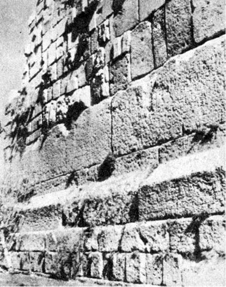
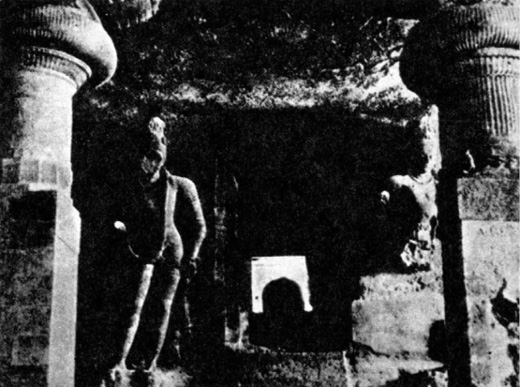
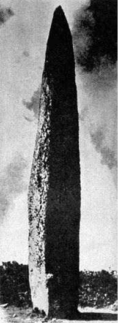
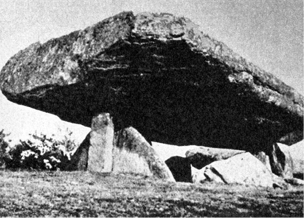
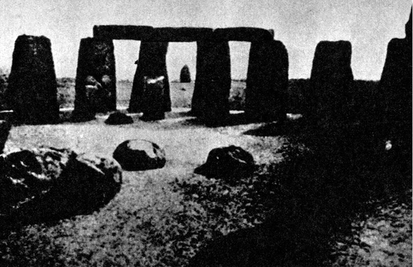
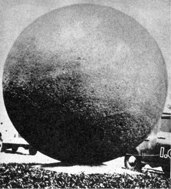

> _Nevíme, čím ve skutečnosti jsme, dokud nezpracujeme  
> myšlením průběh činností._

JOHN DEWEY, 1930

> _V potřebách shledáváme určitou hierarchii, od základních,  
> společných bez výjimky všem lidem (ba i zvířatům), až po ty,  
> které v určitých společenských uskupeních vyjádřeny být  
> nemusí. To, co takto obecně platí pro společnost jako celek,  
> platí obdobně i pro jedince. Každý člověk má svou stupnici  
> hodnot, kterými přiřazuje jednotlivým potřebám jistou váhu._

JIŘÍ ŠULC: ČLOVĚK NA POKRAJI SVÝCH SIL, 1971

Roku 1968 byla severně od bahamského ostrova Andros při leteckém snímkování náhodně objevena 2–3 metry pod hladinou moře obrovská zeď, dlouhá nejméně 500 metrů, sestavená z přesně opracovaných kamenných kvádrů o průměrné hmotnosti asi 25 000 kg. Stavba, jež nepochybně vznikala na souši, je tak dokonalá a lícování kvádrů tak přesné, že již 10 000 let (jak prokázaly zkoušky pomocí C 14 i další pomocná datování) odolává nejen vlnám, ale i tajfunům a uragánům, které jsou zde doma. Kyklopská stavba nejasného významu je tedy přibližně stejně stará jako pyramida Cuicuilco jihovýchodně od Mexico City, pokrytá lávou sopky Cerro Xitle, jež naposledy promluvila před 8–10 000 lety.

Nestalo se vlastně nic zvláštního – přibyl jen další doklad k nespočetným již existujícím o mimořádné schopnosti našich dávných předků opracovávat kámen a přesouvat jej na často ohromující vzdálenosti.

Vznik a účel baalbecké terasy jsou neznámé (její původ nemá nic společného s komplexem „propagačních“ římských chrámů monumentálních rozměrů z 2. a 3. století n. l., pro něž sloužila jako základna), tím spíše, že údolí Bekká v pohoří Antilibanonu stěží mohlo nasytit a uhasit žízeň potřebného počtu pracovníků a cesty k němu jsou dodnes nevalné. Do základů byly vloženy obrovské kamenné kvádry o váze několika set tun; největší z nich, tzv. Trilithon, o rozměrech 23,47 m × 4,57 m × 2,27 m, má hmotnost 820 tun. Je tedy padesátkrát hmotnější než kvádry, použité ke stavbě egyptských pyramid, a nejpokročilejší technika starověku, zpodobená na egyptských reliéfech, by k manipulaci s ním vyžadovala soustředění a současné nasazení asi dvaceti tisíc dělníků, což si lze těžko představit. Kvádr byl totiž nejen přesunut z nedalekých lomů, ale vyzdvižen do výše sedmi metrů. Sovětský fyzik Matvěj Agrest napsal doslova: „Transport takového bloku a jeho vyzdvižení do výše sedmi metrů je problém neřešitelný i pro dnešní techniku.“ Něco na tom je – roku 1964 byla do Muzea umění v městě Mexiku dopravena socha boha deště Tlaloka z 50 km vzdáleného Coatlinchanu, vážící „pouze“ 170 tun. Transport byl proveden s technickou pomocí USA, trval řadu měsíců a vyžádal si náklad 200 000 dolarů. Hlavní inženýr stavby prohlásil, že to byl výkon na samé hranici možností.

V Baalbeku však je ještě větší kámen, ne zcela vybavený z lomu. Je poněkud skloněný, což patrně zavdalo příčinu k romantickým interpretacím baalbecké terasy jako startovací rampy nepozemšťanů (lidově se nazývá „kámen těhotných“), a jeho hmotnost je asi 900 tun. Názorně: kolona pětitunových nákladních automobilů, jedoucích v předepsaných odstupech 50 metrů a naložená částmi „kamene těhotných“, by byla dlouhá 90 km, čelo by tedy bylo v Plzni, zatímco by poslední vozy opouštěly Prahu.

  

> Baalbecká terasa s obrovitými kamennými kvádry

Až dosud největší monolitní blok kamene, jenž byl známým způsobem přesunut, byl blok švédské žuly o hmotnosti 1250 tun pro podstavec jezdecké sochy Petra Velikého v Leningradě. Přesun byl provedený roku 1769 na bronzových koulích. Existují doklady např. o přesunu Caligulova obelisku v Římě r. 1586 (hmotnost 325 tun) i o přesunu a důmyslné, i když nesmírně pracné stavbě egyptských obelisků s použitím mírně skloněných náspů, podepíraných opěrnými zdmi a při potřebné výšce až několik kilometrů dlouhých. Záhadou zůstává manipulace s kvádry až 2000 tun hmotnými, použitými jako stropní překlady známé Černé pagody v Indii v Konáraku, která je dnes v rozvalinách. (Za svou proslulost vděčí erotickým chrámovým reliéfům.) To vše umožnil dostatek pracovních sil, tažných zvířat, dokonalých lan, případně technických zařízení. V pradávných dobách megalitických kultur, považovaných za vyvrcholení neolitu a za konečné a nejúspěšnější utkání člověka, usilujícího střetnout se s časem a stavět pro věky, s kamenem, však tyto podmínky splněny nebyly. A přesto k transportům obrovských kamenných bloků docházelo.

Megality jsou nalézány na mnoha místech světa – na všech atlantských březích Evropy, ale i v Maroku, Alžíru, Sýrii, Egyptě, Indii, na Markézách – takže dokonce někteří autoři soudili na „celosvětovou výměnu kultury“ a rázem ovšem přešli k problému Atlantidy, Lemurie nebo země Mu.

Megality, ať už v podobě menhirů (samotných balvanů), dolmenů (umělých jeskyň) či kromlechů (kamenných kruhů s překlady) sloužily zřejmě kultu mrtvých, někde příbřežní navigaci plavců – např. na březích Finistère, kde začíná kanál La Manche, – bohoslužbám pohanských obětních kultů a astronomickým pozorováním, umožňujícím víceméně přesně určit okamžiky slunovratů, a tím i největších slavností roku.

  

> Rozvaliny Černé pagody s mimořádně hmotnými překladovými kvádry, tvořícími vlastní stropy celých prostorných místností

  

> Jedenáct metrů vysoký menhir v Kerlons, Finistère, jenž patrně sloužil pobřežní navigaci

Někdy to byla práce téměř neuvěřitelná. Tak např. proslulé Stonehenge asi 130 km od Londýna bylo vybudováno jednak z osmdesáti šestitunových balvanů modrého doleritu, dopravovaného jako vynikající materiál na válečné sekerky z pahorku Prescelly Hills v Pembrokeshiru dvě stě kilometrů vzdáleného (později byl dolerit použit na čepy a zádlaby), a dále z jedenaosmdesáti padesátitunových balvanů z tvrdého pískovce, vylámaných ve vzdálenosti asi 35 km od Stonehenge v Malboroughu. Třicet balvanů bylo vztyčeno, ostatní otesány do překladových kamenných kvádrů.

Ponechme zatím stranou otázku, proč ta námaha, a ptejme se, jak byl transport, jenž je jednoznačně prokázán jak identifikací lomů, tak několik set kilopondů těžkými „střípky“ po cestě, proveden. Archeolog profesor Atkinson s několika desítkami svých studentů v potu tváře zrekonstruoval o prázdninách roku 1954 prostředky, které měl pravděpodobně k dispozici lid zvoncových pohárů, tvůrců Stonehenge, transport jednoho šestitunového balvanu. Trval několik měsíců, nepočítaje čas na přípravu vorů, na nichž byla část trasy absolvována, ponechanou odborníkům. Na padesátitunové balvany si pochopitelně mladí nadšenci netroufli.

Takových příkladů bychom mohli jmenovat desítky: kamenné bloky hradby Sacsayhuamanu (ještě se k nim vrátíme), podivuhodná zeď pod hladinou u Androsu, monolitní brána slunce v Tíwanaku, opracované bloky kamene odhadované na desetitisíce tun v různých místech And…

  

> Dolmen v Locmariaqueru, známý pod jménem Stůl kupců, s obrovitým překladovým balvanem

  

> Pohled ze Stonehenge ke kamenu Hele (Hell Stone), sloužícímu jako vizír při určování slunovratů

Něco zde nesouhlasí. Žijeme v představě, že člověk prvobytně pospolné kmenové společnosti, který megalitické stavby budoval, žil v poměrně malých společenstvech, omezených možností obživy lovem, sběračstvím a pastevectvím. Tak primitivní způsob obživy vyžadoval značně velký rajón pro každý rod či kmen. Kde se vzaly lidské síly, nutné k tak mohutným dílům? Kde stovky silných mužů, schopných pohnout kameny Stonehenge? Kooperace mezi rody se nezdá být pravděpodobná, zejména šlo-li o tak úzce omezené kmenové zájmy, jako získání materiálu na sekerky, určené k exportu, z něhož měl zisk jen okruh obyvatel Stonehenge (podle rozměrů dobytčí ohrady nevelký), pohřeb předka, pro cizí rody lhostejného, nebo určení počátku slavnosti, konané s vyloučením širší veřejnosti.

A byli-li tito silní, nejzdatnější mužové rodu či kmene uvolněni k tesání, transportu a vztyčování megalitů na mnohé a mnohé měsíce, jak tuto skutečnost sloučit s představou každodenní pracné reprodukce vlastní pracovní síly získanou potravou? Otrok byl tehdy zbytečným luxusem a břemenem a zajatec byl nejekonomičtěji využit jako surovina k přípravě pokrmu.

A jestliže přece jen bylo nejsilnějším mužům umožněno zanechat lovu a ostatní práce svrhnout na bedra starců a žen, takže životní úroveň kmene musela takřka katastrofálně klesnout, jak silný musel být impuls, jak závažný důvod, který k tomu vedl?

Jistě nelze odpovídat dnešní racionální logikou – kultovní motivy mohly být velmi silné a působivé –, avšak není tato víra ve všemocnost kultu jenom východiskem z nouze? Srovnávací etnografie nám to rozhodně zkoumáním životních zvyklostí „posledních svědků pravěku“ nepotvrzuje. Skupinky obyvatel Země, žijící na kulturní úrovni doby kamenné (původní obyvatelé Austrálie, afričtí Křováci, trpasličí kmeny afrických Pygmejů, Negrité aj.) jsou ovšem neobyčejně vynalézavé a dokáží se obživit a přežít i v nejobtížnějších podmínkách, do nichž byly vyspělejšími sousedy zatlačeny. Nikdy však nedělají „zbytečnosti“. Jejich výrobní nástroje všeho druhu přesně odpovídají účelu, k němuž jsou určeny, jejich kultovní předměty jsou prostinké a nevyžadují nadměrné pracovní investice (australské čuringy, pygmejské fetiše apod.). Také stavby, pokud vůbec v těchto společnostech existují (stromová obydlí, společenské domy, tzv. domy mužů, iglú, teepee), jsou prosté a budované velmi racionálně. Nikde nenacházíme obdobu Stonehenge, nikde obdobu fantastického Sacsayhuamanu, jehož hradby (v jejich obrannou funkci v běžném smyslu slova nevěřím) jsou zbudovány z kyklopského zdiva. Jednotlivé balvany mají rozměr až 9 × 4 × 5 m a hmotnost mnoha desítek tun. Jsou naprosto přesně opracovány – nelze mezi ně vsunout ani čepel nože, ani žiletku, přičemž styčné plochy nejsou hladké, ale vypuklinám odpovídají vydutiny sousedního balvanu. Podobně přesně jsou opracovány i kvádry v Baalbeku, zvláštní „potrubí“ (které se mnoha charakteristikami, např. ostře pravoúhlými „koleny“ a především chyběním spodních částí vodnímu potrubí příliš nepodobá) v Tíwanaku a řada dalších megalitických staveb.

Konzultoval jsem tuto podivnou skutečnost jednak s mistry kameníky, jednak se zesnulým přítelem profesorem sochařské Akademie V. Vokálkem a dozvěděl se, že při dostatečné zkušenosti dávných řemeslníků a dobrých nástrojích je taková přesnost možná, je však nevyhnutelné stále zkoušet, jak styčné plochy lícují (což je u stotunových balvanů, neustále zdvíhaných a opět spouštěných, patrně dost obtížné – nejsilnější pojízdné jeřáby mají nosnost sotva několika desítek tun…), v každém případě však práci podstatně prodlužuje. Vokálek odhadl čas, potřebný na konečné přesné opra­cování jednoho bloku v hradbě Sacsayhuamanu, z vojenského hlediska naprosto zbytečné, na několik měsíců usilovné práce kolektivu velmi zručných kameníků.

O schopnosti našich předků opracovávat kámen rozličným způsobem není sporu, a o dokonalosti, které dosahovali, rovněž ne. Bohužel dosud nebylo provedeno dostatečné množství pokusů, rekonstruujících kamenická a sochařská díla starých kultur předpokládanými nástroji: jsem si jist, že by přinesly zajímavé poznatky a odstranily mnohé pověry a zjednodušená vysvětlení. Vrcholnou ukázkou jemného díla z kamene jsou např. mayské basreliéfy z velmi těžko opracovatelného nefritu, vznikající podle J. E. S. Thompsona patrně dřevěnými pilkami a vrtačkami, podsypávanými tvrdým křemenným pískem, především však tzv. mayské excentrické čepele s vyštípanými (nebo jinak vypracovanými) profily bohů, lidí a zvířat, zhotovené ve fantastických a neuvěřitelně složitých tvarech z obsidiánu nebo z pazourku, tedy z materiálů křehkých a štěpných. Praktické potřebě nikdy nesloužily – jsou nalézány ve skrýších pro obětiny.

O kamenné posedlosti našich dávných předků by bylo ovšem možné popsat ještě tisíce stránek. Spokojme se s jediným posledním příkladem.

Zvýšený zájem o středoamerické a jihoamerické kultury přivedl do pralesů řadu archeologů, mj. i profesora Marcela Hometa, jenž roku 1940 objevil v severní Brazílii, v povodí horního toku Rio Branco gigantické, patrně mnohými generacemi ze skály vytesané kamenné vejce, 100 metrů dlouhé a 30 metrů široké, nazývané místními obyvateli piedra pintada (malovaná skála). Jeho stěny jsou pokryty na ploše 600 m2 symbolickými, zřejmě astronomickými nebo astrologickými kresbami dosud neobjasněného významu. Hometův objev povzbudil další badatele. A záhy prolétla světem (zaměstnaným však tehdy většinou jinými starostmi, a proto celkem nepovšimnuté) zpráva archeoložky Doris Z. Stoneové: ve středoamerickém státě Kostarika jsou na nejpodivnějších a nejneočekávanějších místech stovky a snad tisíce geometricky naprosto přesných kamenných koulí o průměrech od několika decimetrů až po několik metrů. Nejtěžší až dosud objevená koule váží 16 tun a spolu s dalšími byla převezena místními podnikavci jako plastika, zdobící veřejné prostranství v hlavním městě San José.

  

> Jedna z kostarických koulí o průměru 2,16 m a hmotnosti 16 tun zdobí bez jakýchkoli úprav a retuší náměstí v San José

Stoneová ve své zprávě napsala: „Koule z Kostariky musí být připsány k nerozluštěným megalitickým hádankám našeho světa…“

Taková upřímnost se ovšem neodpouští. Objevily se hned dvě teorie: jednu z nich zastávají místní obyvatelé, přesvědčení, že v koulích je ukryto zlato, takže mnoho jich bylo již rozbito. S druhou přišli vědci a poučili madame Stoneovou, že koule vznikly velice prostým způsobem, totiž na svazích sopek kutálením se pevného jádra, postupně obalovaného plastickou lávou jako sněhová koule sněhem.

Je to pěkná a důvtipná teorie. Opravdu nelze vyloučit, že by v jednom z mnoha a mnoha tisíců případů mohla takto vzniknout geometricky přesná koule se zcela pravidelným a jakoby hlazeným povrchem. Potíž je v tom, že takové jsou kostarické koule bez výjimky všechny, a zdá se, že byly zmenšováním upravovány tak dlouho, až bylo dosaženo dokonalé sféričnosti. Další potíž s teorií „sněhových koulí“ je v umístění nalezišť těchto podivných objektů. Podle ní by se totiž zjevně měly nacházet toliko na úpatí sopek a nikde jinde.

Nuže, není tomu tak.

Všetečný a rozhazovačný Däniken dokázal těsně před dopadem neúprosného ramene daňového zákona stihnout i Kostariku a prolézal pralesy a močály, přičemž si zejména stěžoval na ohavné pavoučí potvory, napínající sítě právě na stezkách. Přinesl pěknou fotografickou i svědeckou dokumentaci, souhlasící s jinými prameny.

Koule neleží na úpatí sopek. Lze je nalézt na mořském pobřeží v Golfo Dulce, uspořádané v dokonalé přímce.

Jsou v bahnitých pralesích, daleko od hor a v rovinách.

Dvě obrovské koule jsou na ostrově Camaronal.

Celá řada jich byla nalezena na samých vrcholcích Cordillera Brunquera…

Domorodci jim říkají „nebeské míče“, což Dänikena pochopitelně potěšilo, zároveň však poctivě dodává, že teorie o takto vyjadřovaném slunečním kultu není pravděpodobná: všechny středoamerické a jihoamerické kultury totiž uctívaly Slunce ve formě zářícího disku, nikoli koule.

Kostarické koule jsou zkrátka artefakty, vzniklé opracováním granitových bloků těžkých až 24 tuny (což odpovídá minimální velikosti výchozího kvádru pro šestnáctitunovou kouli). Jsou rozmístěny do jakýchsi záměrně zvolených obrazců, přičemž samotný transport vlhkou, bahnitou a členěnou krajinou, případně do svahů (nikoli naopak), musel představovat mimořádný technický problém. Domorodci neradi vodí ke koulím turisty, ačkoli si jinak rádi přivydělají jakoukoli prací. Lomy, z nichž by pocházel materiál, nebyly nikde nalezeny, a ovšem ani „mateřské“ sopky, ačkoli Kostarika je opravdu v pásmu vulkanicky aktivním. Zdá se tedy, že jde o ukázky prazvláštní megalitické kultury, čemuž nasvědčuje i značné zapadnutí některých koulí do země.

Proč tato obrovská námaha? A jakých prostředků bylo použito?

Odpověď zatím nenalézáme. Rozkládá se tu stín. Fantastickou, ale z hlediska všeho, co si dovedeme o megalitických kulturách představit, přece jen rozumnou otázkou je: nebylo všechno vlastně jinak? Vyžadovala kamenná posedlost opravdu takové společensky nutné množství práce, jaké předpokládáme? Nechodily kolosy Velikonočního ostrova moai opravdu „samy“, jak to o nich tvrdí domorodci a jak přísahají i obyvatelé Tíwanaku a Sacsayhuamanu o obrovských megalitech, piedras cansadas…?

Tím můžeme stručnou přehlídku indicií, naznačujících pravděpodobnou existenci stínů v dávné minulosti lidstva, skončit.

Badatelé, neochotní přijmout předkládaná schémata dávného vývoje lidských společností v pravěku, nejméně 300krát delším než období historické (1,75 miliónů let oproti 5000 let), se v podstatě dělí na dvě skupiny: první z nich uvažuje o možnosti dávných civilizací, předcházejících zmíněnou nám známou historickou dobu a zanechávajících své dědictví ve formě koruptel, útržků znalostí nebo nevysvětlitelných vědomostí. Někteří z nich jdou ve svém tvrzení tak daleko, že považují první vyspělé civilizace za dědictví, za jakousi „novou vlnu“ dávno zapomenutých kultur – a nejsou to vždy nekritičtí atlantomané, nadšenci bájné země Mu nebo Lemurie, ale vážní badatelé. Předpokladem takového vývoje je ovšem opuštění představy o univerzálním a veškerému lidstvu vlastním způsobu života, kultury a společenské organizace, jenž je době před 10 000 lety připisován.

Druhá skupina uvažuje o možnosti ovlivnění naší Země a jejích obyvatel kontakty s mimozemskými civilizacemi.

Přejdeme i tedy k pokusu o rekonstrukci takové hypotetické civilizace, vycházejícímu jednak ze zjištěných indicií, jednak z poznání ještě dnes žijících reprezentantů doby kamenné, kteří si zachovali jisté schopnosti, jež postup civilizace učinil jinde zbytečnými, nebo které se v průběhu tisíciletí ztratily.

O ztrátě není sporu – konstatoval ji už Karel Marx ve svém Úvodu ke kritice politické ekonomie: „… všechna mytologie přemáhá, ovládá a utváří přírodní síly v obrazotvornosti a obrazotvorností; mizí tedy se skutečným ovládnutím těchto přírodních sil.“

Buďme nepředpojatí. Nevíme, jak by taková předpokládaná civilizace mohla vypadat, jaké by byly její zvyky a obyčeje. Jisto je jedno: byla by nám velmi, velmi cizí. Jako civilizace delfínů.
