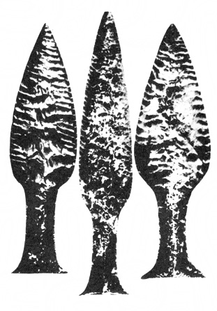

> _Za onoho dne, onoho dávného dne,  
> za oné noci, oné vzdálené noci,  
> onoho roku, onoho dávného roku,  
> kdy vše potřebné s nádherou vzešlo…_

SUMERSKÁ EPICKÁ BÁSEŇ

Uvedli jsme v předmluvě, že rozptylování stínů nad dávnou minulostí lidstva je takřka neřešitelným úkolem. Jednou z nejobtížnějších částí tohoto úkolu je rekonstrukce hledané hypotetické civilizace.

  

Nelze použít metody, podle níž roku 1876 entomolog Paul Mayer sestavil hypoteticky nejprimitivnějšího předka všeho hmyzu, Protentomona, totiž sestupu k nejprimitivnějším typům a k embryonálně zakládaným tvarům. Nevíme, zda Protentomon kdy žil, právě tak jako nevíme, zda naše hledání ztracené „civilizace delfínů“ není předem odsouzeno k fiasku, ale žil-li, pravděpodobně se opravdu podobal málo elegantnímu červovitému stvoření Paula Mayera. Veškerá biologická zkušenost to potvrzuje a zároveň umožňuje i tak dalekosáhlé extrapolace se slušnou dávkou pravděpodobnosti. Ne tak zkušenost historická a etnologická. Dávné populace nemusely být (a obvykle nebyly) primitivními v konvenčním smyslu tohoto slova, stejně jako nejsou „primitivní“ příslušníci současných přírodních národů. Jsou jen jiní než my. Jejich mentalita, jejich způsob myšlení jsou daleko spíše esoterické (jak správně poznamenává francouzský archeolog Francis Mazière) než primitivní. Zaměňujíce úroveň technické civilizace a stupeň nadšení, s jakou je přijímána, s obecnou úrovní a s poměrem k životu, dopouštíme se zjednodušení stejně jako fotbalový fanoušek, který každého, kdo niterně neprožívá skutečnost, že dvaadvacet mužů kope do míče, a nezná tyto hrdiny jménem, považuje za debila, neschopného jakéhokoli společenského styku.

Tyto předsudky je třeba přemoci dříve, nežli se pustíme do obecných úvah o možné struktuře a charakteru společnosti hledané civilizace, abychom se vyhnuli omylům. Nevyhnuli se jim mnozí badatelé (a především mnozí neodborníci, ohromení faktografickým materiálem, badateli shromážděným), stojící bezradně nad ne­uvěřitelnými znalostmi přírodních národů, včetně nejzaostalejších. Pygmejští negritové Pinatubo přesně klasifikují 15 druhů netopýrů a 20 druhů mravenců, botanické slovníky nejzaostalejších kmenů mají obvykle kolem 2000, ale i více přesně odlišených výrazů, spojených s botanickými druhy i jejich varietami, a to dokonce jemněji než naše botanika – příkladem jsou např. Hanunóové z filipínského ostrova Mindoro, rozlišující (Conklin): „… svůj lokální botanický svět v nejnižší rovině kontrastního členění na více než 1800 taxa, jež se podle lidového vědění vzájemně vylučují, kdežto botanikové rozdělují touž flóru – podle druhů – na necelých 1300 taxa, definovaných z hlediska vědeckého…“

Podobné znalosti nalezneme v rozeznávání všech kategorií zvířat i rostlin, o nichž, především o rostlinách léčivých, se ještě zmíníme.

Je pochopitelné, že tato znalost byla připisována „intimnímu styku divocha s přírodou“, „tlakem potřeb“ a dalšími frázemi, sjednotitelnými zhruba pod společného jmenovatele nezbytného zkoumání a praktického využívání přírody člověkem, který si po desetitisících let vytvořil vzhledem ke každodenním potřebám i rozsáhlé taxonomické systémy.

Tlak nezbytnosti ovšem nepopíráme, ani význam praxe. V některých případech přímo bije do očí. La Barre upozorňuje na skvělou taxonomii brambor, vypracovanou Aymary, patrně potomky legendárních Collů, kteří vybudovali Tíwanaku, jejichž výživa ve výšce nad 4000 m n. m. je podmíněna vysokou a rozvinutou botanicko-agronomickou kulturou. Vskutku – Aymarové znali techniku dehydratace brambor, kterou převzala za II. světové války americká armáda. Aymarský bramborářský slovník, představující jen trosky starších vědomostí, dodnes rozlišuje více než 250 odrůd, a to naprosto přesně a bezpečně. Lze tedy souhlasit s autory, litujícími, že staří cestovatelé nespoléhali na domorodé taxonomie, ale za každou cenu vytvářeli vlastní názvy, takže totéž jméno obdrželo často několik druhů, rodů i podskupin a ovšem naopak tentýž druh byl pojmenován deseti i více různými názvy.

Tato jasná souvislost taxonomické teorie a praxe v celé šíři je však ojedinělou výjimkou. Již dosti dávno bylo zjištěno, že naprostá většina přesně pojmenovaných exemplářů nemá pro místní obyvatele nejen žádný bezprostředně praktický význam, jako jídlo, zdroj léků či jedů apod., ale je i kultovně zcela lhostejná. Rozlišování jednotlivých druhů mravenců a netopýrů, pojmenováni mnoha desítek hvězd, jemné rozlišování odrůd stromů a keřů, jejichž dřevo ani plody nejsou zužitkovány, je pro indiána kmene Hopi, Křováka či negrita prakticky stejně bezcenné jako pro evropského bankovního úředníka. S tím rozdílem, že tento bankovní úředník (přes hlasité zdůrazňování opaku) mívá dosti času sednout si na bobek nad mraveniště nebo zírat ke hvězdám a ukojit svou zvědavost, zatímco přírodní národy sváděly a někde dosud svádějí každou hodinu a každou minutu závod s hladem a mnoho času jim nezbývá.

Musíme rovněž opustit velice pohodlný systém domněnek o ná­hodném původu nejvýznamnějších objevů a vynálezů lidské prehistorie. Náhoda tohoto druhu je (aniž zdůrazňujeme nevelký počet tehdejší lidské populace, nedovolující statistické operace s velkými čísly) téměř stejně nepravděpodobná jako náhodný vznik benzínové pumpy. Po dlouhé řadě let, kdy byla vědci i školními učebnicemi přejímána tvrzení, posvěcená neustálým opakováním, provedlo několik všetečků pokusy. Výsledek byl katastrofální. Bylo zjištěno, že když se do ohniště dostane několik kusů měděné nebo jakékoli jiné rudy, nestane se vůbec nic, a už vůbec není vytaven kov. Nejjednodušší způsob, jak získat roztavenou měď, je tavení jemně zpráškovaného malachitu v dobře uzavřené hliněné nádobě. Získání železa je ještě daleko obtížnější a složitější. Stejně absurdní je domněnka o náhodnosti bleskurychlé aklimatizace kulturních rostlin ve zcela nových podmínkách, o „náhodnosti“ domestikace zvířat, o počátcích keramiky (doporučuji vlastní experiment, jak složité je nalezení vhodného jílu, prostředku k jeho odtučnění, nejvhodnějšího paliva, teploty a doby vypalování, stupně oxidace, atd. atd., aby vznikla třeba nejhrubší nádoba, podněcující k další činnosti), dokonce i o náhodnosti vzniku jemných neolitických technik tak dokonalého zpracování kamene, že se dnes vymyká našim možnostem, a to nejen v megalitických stavbách, ale i např. napodobením mayských rituálních pazourkových čepelí.

> Pazourkové neolitické dýky z kodaňského muzea dokazují neuvěřitelnou zručnost a trpělivost výrobců

A tady dospějeme k čemusi, co Claude Lévi-Strauss nazývá ne­olitickým paradoxem, spočívajícím ve skutečnosti, že se člověk tehdy dokonale utvrdil v ovládání hlavních zručností a civilizačních dovedností, aby se jeho tvůrčí a objevitelský elán, jak se alespoň zdá, na několik dalších tisíciletí zastavil a ožil švihnutím jakéhosi kouzelného proutku teprve moderní vědou. Lévi-Strauss (a s ním mnozí další etnologové) správně vidí vysvětlení tohoto zvláštního faktu ve dvou zcela rozličných způsobech vědeckého myšlení, nerozlišených snad rozdílným stupněm vývoje lidského mozku, ale „…dvěma různými strategickými rovinami, v nichž vědecké poznání může na přírodu zaútočit…,“ cestou _magie_, bližší prvotní smyslové intuici, a cestou vědy, této smyslové intuici vzdálenější.

Čtenáře prosím, aby přijal výrazy „magie“, „magický“ nikoli ve smyslu podezřelého čarodějnictví, rovněž však nikoli jako tápavý a nedokonalý obraz vědy. V podrobnostech odkazuji na moderní etnologie, zabývající se touto problematikou obsáhleji a zasvěceněji; pro naše úvahy postačí zjištění, že i magie je systémem, odvozeným z reality, jakousi metaforou vědy, orientující se obvykle na jiný typ jevů než věda a – pochopitelně – ve svých praktických výsledcích méně úspěšnou. Je však rovněž systematická, a to občas s hrůznou důsledností, jejíž výhodou je skutečnost, že i „nevědecká“ třídění a katalogizace přírodních jevů jsou výhodnější než žádná a představují pokrok oproti chaosu nebo pasivnímu vnímání zevního prostředí. Magie – stejně jako věda – nejen připouští, ale přímo předpokládá aktivní pozorování a experimenty, prověřující hypotézy a schopné využít pozorování a uvažování k objevům na úrovni smyslového poznání.

Tato magická „věda konkrétního“ je prvotní, o desetitisíce let starší nežli vědy exaktní a přírodní, dosahující ovšem jiných a méně omezených výsledků. Existuje dosud paralelně s moderní vědou u celé řady přírodních národů, ovládaných všemocnými totemy a lišících se od národů rozvinutých především usilovnou a nesmírně obratnou snahou o anulování jakéhokoli vlivu historického dění a vývoje společenské situace na jejich rovnováhu a kontinuitu. Je proto určitá naděje, že tito „poslední svědkové pravěku“ přenesli v poměrně čisté a stabilizované formě jisté rysy prvotních společností, mezi nimiž by měla být i naše „civilizace delfínů“…

Etnologie vyřešila v posledních desetiletích na základě obrov­ského srovnávacího materiálu toto schéma a většina jeho zastánců předpokládá, že se i magická paralela vědy vyvíjela zvolna, postupně a pracně. Nuže, domnívám se, že tomu tak nebylo, že k zdravému rozumu odporujícímu tvrzením o nenáhodnosti a leckdy bezprostřední nepraktičnosti neolitických znalostí (jichž jsou znalosti přírodních národů odrazem nebo přímým přenosem) musíme přidat ještě stejně podivné tvrzení o poměrné náhlosti, ba explozívnosti jejich vzniku.

I když jde vývoj člověka od prvoka tak podivuhodně přímou a ekonomickou cestou, že jsme v pokušení souhlasit s Koestlerovým aforismem, týkajícím se především biologického výběru a přizpůsobení: „Tah budoucna je stejně reálný a někdy i významnější než tlak minulosti“, i když zní našemu materialistickému sluchu značně nezvykle, než si uvědomíme, že tímto „tahem budoucnosti“ může být prostě optimalizace funkcí ke stále vyšším a vyšším formám pohybu hmoty. Přes tuto podivuhodnou přímost, ba dokonce jistou zkratkovitost vývoje, jenž z nepochopitelných důvodů poskytl pětiprsté končetiny již krytolebci, s funěním vystupujícímu jako konkvistador na souš, aby je zachoval jen pro velmi málo „protekčních“ živočichů, jejichž vývoj neměl být brzděn zbytečnými oklikami. Přes tuto přímost nelze vysvětlit vývojovou explozi rozumových schopností člověka, Homo sapiens sapiens (tedy cromagnonce, od něhož vede přímá cesta k nám), jinak než velmi významnou a revoluční genetickou proměnou větve, jež se kolem počátku poslední doby ledové odštěpila ze společného kmene, pokračujícího pak větví nean­dertálců odsouzenou k zániku. Kostry tohoto typu Homo sapiens sapiens jsou zpočátku neobyčejně vzácné – avšak brzy, na sklonku poslední ledové doby, se ve zhoršených klimatických podmínkách přímo explozívně rozmnožují, zatímco vládce staršího paleolitu, neandertálec, navždy mizí. Podle některých nálezů, zejména na území Jugoslávie, se zdá, že odlišení cromagnonců a neandertálců bylo tak nápadné, že neandertálci byli příležitostně loveni jako zvěř technicky pokročilejšími cromagnonci; to znamená, že se zde ztrácí instinkt druhové sounáležitosti, běžný a důležitý mechanismus zachování druhu u většiny živočichů.

Podotýkám, že tuto ztrátu pocitu druhové sounáležitosti mezi cromagnonci a neandertálci považuji za pravděpodobnou i přes nálezy v jeskyních Karmelu (Izrael), naznačující, že mezi cromagnonci a neandertálci docházelo ke stykům a k plození společného potomstva. Pro zajímavost dodejme, že někteří antropologové považují Basky a severoafrické Berbery za přímé potomky cromagnonského člověka, zatímco značná část ostatní populace prý vznikla smíšením genetického fondu cromagnonců s neandertálci.

Využívám této příležitosti, abych se co nejstručněji a velmi zjednodušeně zmínil o pravděpodobné podstatě biologické změny, vedoucí posléze (kromě faktoru práce) k hominizaci a humanizaci zvířete, jež se stalo člověkem.

Soudobá genetika předkládá důvěryhodné argumenty tvrzení, že hybnými pákami variability živočichů i rostlin a tím jejich druhového vývoje jsou:

1\. mutace,

2\. rekombinace genů,

3\. organizace chromozómů,

4\. přirozený výběr,

5\. reproduktivní izolace.

Mutace nehraje v této sestavě hlavní, řídící, ba ani podstatnou úlohu – mimo jiné proto, že se přibližně pouhá tisícina mutací ukáže v důsledcích progresivní a výhodnou, a to pouze ve spolupráci a za spoluúčasti ostatních jmenovaných faktorů. Daleko větší vliv na dědičné změny mají, jak se zdá, zevní vlivy, umožňující uplatnění optimálním kombinacím tzv. genového fondu a genetické rekombinace.

Vyjmenované faktory evoluce, o jejichž upřesnění se zasloužili především angličtí vědci J. B. S. Haldane a R. A. Fisher, Američan S. Wright a sovětský genetik S. S. Četverikov, můžeme opsat termíny z oblasti automobilismu, jenž je širší veřejnosti patrně bližší než moderní genetika: podobá-li se vývoj druhu jízdě automobilem, pak mutace představují benzín, pohonnou hmotu, jedinou možnost, jak změnit genetický základ. Sám benzín však dopravu nezajistí. Pohání motor, a tímto motorem evoluce je genetická rekombinace zárodečných buněk, jejich genů a chromozómů, které teprve umožňují uplatnění mutací. Jejich účelné řízení tak, aby co nejlépe odpovídaly požadavkům, zajišťuje přirozený výběr – řidič našeho fiktivního automobilu. Organizace chromozómů, zpětně ovlivňující rekombinaci a do jisté míry ji řídící, můžeme srovnat s volantem a pedály vozu. A konečně reproduktivní izolace, omezující možnost výměny genů a pečující o jejich optimalizaci, se podobá silnici, omezující sice řidiče, ale zároveň svou úpravou i značkami usnadňující jízdu.

Toto vše musí být koordinovaně v činnosti, aby naše vývojové auto, které jsem si vypůjčil od G. Ledyarda Stebbinse, dojelo k cíli.

Neandertálec byl skvěle přizpůsoben prostředí, dokonce snad lépe než cromagnonec, a ani jeho mozkovna nebyla co do objemu nijak pozadu – spíše naopak. Jeho hustě osrstěné (jak předpokládáme) tělo, robustní kostra a skvěle vyvinutý skelet lbi slibovaly růžovou budoucnost, která se však nedostavila. Zdá se, že podlehl kvalitativně vyšší inteligenci holých tvorů, s nimiž by, kdyby šlo o pořádnou rvačku, snadno zatočil.

Genetická změna, jež hominizovala první skupinku pralidí, musela být komplexní a velice šťastná, umožnila-li přežití tak choulostivého živočicha do doby, než se mu podařilo zhodnotit a využít své nově nabyté duševní schopnosti. A – což zdůrazňujeme – tato doba nesměla být příliš dlouhá.

Pokud smíme soudit z poznatků zoologie, není pouhý kvalitativní rozdíl inteligence toho či onoho zvířete, projevující se schopností adaptace změněným podmínkám apod., vždy úměrný schopnostem přežít a zachovat rod a druh. Některé příklady jsou velmi poučné: takřka příslovečně důvtipným zvířetem je rosomák, obývající kdysi rozlehlá území Sibiře, Kanady, Aljašky a USA od nejzazšího severu až do Kalifornie. Je jediným zvířetem, které nemůže být chytáno do pastí jakéhokoli druhu – a to není lovecká latina, ale fakt, že ukradne nejen návnadu, ale z rošťáctví (jak se trappeři domnívají) občas i past samotnou. Jeho velmi cennou kožešinu lze získat jen dobře mířeným výstřelem. K tomu dochází velmi zřídka, a kožešina rosomáka je proto na trhu raritou; přes dobré možnosti obrany proti nepřátelům je však toto zvíře zatlačeno na nejsevernější pobřeží Kanady a odsouzeno ke zkáze.

Opakem je vačice opossum (Didelphus virginiana), lavinovitě „dobývající“ v posledních letech celé území USA a představující vážný hospodářský problém. Jediným způsobem obrany a důvodem přežití je pro opossum předstírání smrti, trvající často celé hodiny, plodnost a nevybíravost v potravě. Co do inteligence je opossum v živočišné říši čímsi na způsob obecního blba: zvykne-li si v létě sedávat v zoologické zahradě na rourách ústředního topení, sedí na nich i v zimě až do těžkých popálenin, i když je na dosah větev nebo jiný úkryt.

Přesto se vačici podařilo zachovat úctyhodnou genetickou stabilitu omezením genového fondu, jenž nemusel produkovat nové účelné mutace po plných 60 miliónů let. Díky tomu se dostala i do mnoha specializovaných genetických pojednání a zdomácněla tam stejně jako v lidovém slangu výraz „to play ’possum“ – dělat mrtvého.

Tento příklad nelze pochopitelně mechanicky přenášet na člo­věka, je však přesto varovnou připomínkou, abychom samotný mozek a jeho schopnosti v přírodním nelítostném koloběhu příliš nepřeceňovali. Pro cromagnonce bylo existenční nutností _využít_ svého zbrusu nového mozku, umožňujícího i s nadbytečnými deseti miliardami neuronů v podstatě vše, co náš mozek. Tuto nezbytnost si pochopitelně neuvědomoval, avšak – a o tom jsem přesvědčen – pociťoval nutkavou potřebu kapacitu využít a naplnit, a tuto potřebu přenášel na všechny další generace.

Je-li dovoleno použít přirovnání: první generace Homo sapiens nebyly sympatickým, ač málo gramotným Edmondem Dantésem, jemuž moudrý abbé Faria, zastoupený matkou přírodou, poskytl krok za krokem základní vzdělání až k vytoužené metě metamorfózy v hraběte Monte Christa. Cromagnonec byl Edmondem Dantésem, celkem spokojeným ve své kobce pod pevností If do té doby, než s úžasem a znepokojením zjistil, že se _změnil_ v abbé Fariu, který musí svůj mozek zaměstnávat jakkoli, ale co nejintenzívněji. Tato neočekávaná změna jej zastihla v kobce primitivních a převážně instinktivních relací k okolní přírodě, jež musela být, aby bylo nové kapacitě mozku učiněno zadost, změněna ve složité předivo poznané, skutečné i předpokládané magické zkušenosti.

Tehdy začal být svět člověkem _lidsky_ nahlížen, katalogizován a posléze přetvářen, bylo-li to zapotřebí. Vedle ukájení bezprostředních potřeb, vedle realizace základních pudů a instinktů se otevřel obrovský, ačkoli nikoli nekonečný prostor poznávání a experimentování, byť bezprostředně neužitečného, rozvinula se a prudce košatěla řeč, vyvíjející se ne jako předpoklad a zdroj, ale jako výsledek a přímý prostředek nezbytné potřeby strukturalizace dosavadní nedostatečně rozlišené vězeňské kobky přírody.

Rozvoj lidské řeči můžeme ovšem rekonstruovat pouze hypoteticky od signálů přes kinetickou, pohybovou řeč, o níž v třicátých letech uveřejnil rozsáhlé práce sovětský badatel Marr, až ke složité, artikulované řeči se syntaktickými elementy řečové komunikace. Odvážím se dokonce říci, že se řeč v dnešním slova smyslu vyvinula jaksi mimo její původní, efektivní složku, dostačující potřebám pračlověka, stejně jako postačuje druhová „řeč“ primátům, papouškům, psům nebo jelenům. Český vědec Milan Morávek trefně konstatuje, že „… slovník rozzuřeného fotbalového fanouška není o mnoho bohatší než slovník pračlověka, který se hnal za kořistí, než mu padla za oběť“. Bohatší patrně nejsou ani zvukové projevy v bolestech a bezprostředním nebezpečí života, ať již je vyvolal chobot mamuta, nárazník automobilu či střepina granátu. Jisté je, že teprve s výrazným skokem vpřed v dlouhém procesu polidšťování nahé opice shledáváme na fosilních lebkách nejen známky vývoje mluvidel (proměny dolní čelisti, čelistních dutin a krčních chrupavek), ale i asymetrii obou polovin lebky, způsobenou především rozvojem spánkové a temenní oblasti mozku, související přímo s řečí, jejíž centra jsou uložena jen v jedné polovině mozku.

Odhadnout, byť i velmi přibližně, dobu, kdy k této proměně došlo, je velmi obtížné a u rozličných autorů nalezneme nejrozličnější údaje. V každém případě je více než dost vzdálená, aby v nejdávnější minulosti lidstva, kam se nám zatím nepodařilo nahlédnout a kam – bohužel – budou i v budoucnosti naše pohledy velmi obtížné a jednostranné, vznikla zcela zvláštní magická strukturalizace světa, překvapujícím způsobem podrobná a dokonalá, a aby byly provedeny mnohé experimenty, vedoucí v příznivých případech k výsledku. Nelze dost dobře pochybovat, že etnické skupiny, zabývající se až podivuhodně podrobnou taxonomií a budující významosloví řeči s hysterickým puntičkářstvím (v jazyce australských domorodců je např. jednoslovný výraz pro „starou vačici, která vylezla na strom, ale opět slezla“ nebo pro „ptáka emu, kývajícího se zprava doleva“, zcela odlišný od výrazu pro „ptáka emu, kývajícího se nahoru a dolů“), mohly dospět k celé řadě zajímavých odhalení skutečností a vztahů, objevovaných teprve moderní vědou. Tím spíše, že metody indukce a dedukce byly používány spíše intuitivně a každý jev byl zprvu zkoumán jako jedinečný a zvláštní.

V některých případech a především v některých aspektech je nadstavba velmi primitivní základny svrchovaně složitá – týká se to např. složitých a takřka matematicky přesných pravidel uzavírání sňatků, s nimiž se setkáváme u celé řady primitivních kmenů, „posledních svědků pravěku“, u jihoafrických Křováků žijících na úrovni nespecializovaných paleolitických lovců a sběračů, nebo u středoaustralských domorodců, jejichž civilizace je ještě nižší.

Některé jihoamerické indiánské kmeny v poříčí Amazonky dokonce podřizují důmyslným předivům příbuzenských vztahů nejen společenskou strukturu, ale i architekturu vesnice a dispozici svých sídel, denní program, svá tabu, zkrátka celý život.

Toto zdánlivě pošetilé puntičkářství je ve skutečnosti svrchovaně účelné a k zachování rodu nezbytné; přes naprostou neobvyklost a podivné pověry je ve svých důsledcích logickým a geneticky velmi dobře působícím souhrnem pravidel, zaručujícím – v mezích možností – zdravé, dědičně nezatížené potomstvo i při sňatcích uprostřed etnicky a zvykově izolované skupiny.

Na ukázku, jak hluboko může tento zvláštní druh společenské nadstavby propracovat svá pravidla, uvádím velmi zkráceně výňatek z knihy Jense Bjerra Poslední lidojedi o domorodcích ze středoaustralské rezervace Yendumu:

„Chceme-li pochopit jejich způsoby sňatků a rodinné vztahy, musíme zapomenout na všechno, co víme o našem příbuzenském systému. Základní rozdíl je v tom, že Australané nepovažují dítě za prostý výsledek pohlavního styku, nýbrž za ducha, který se znovu vtěluje na svět. Jejich společenství nejsou vytvořena z pokrevně příbuzných rodin v našem smyslu, ale ze skupin a podskupin, formálně rozlišených podle toho, jak vyslovují jména jednotlivců uvnitř skupiny. Dítě dostane jméno podle toho, ke které skupině patří jeho matka a „otec“. Tohle jméno pak určuje, kteří členové skupiny jsou jeho možnými manželskými partnery. Základní jména jsou složena ze slabik, jež je možno přeskupovat asi jako karty při složité pasiáns. Slovo „otec“ v jazyce domorodců znamená… celou řadu mužů, kteří prostě patří do užší skupiny, v níž je také „skutečný otec“. Všichni členové hlavní skupiny jsou považováni za „bratry“ bez ohledu na skutečné pokrevné příbuzenské vztahy… Tentýž princip platí samozřejmě i ve všech ostatních rodinných vztazích. Dítě nazývá „matkou“ všechny ženy skupiny, do níž patří jeho skutečná matka. Když se muž ožení, matka jeho ženy se nestává jeho tchyní jenom proto, že se oženil; muž si bere dceru určité ženy proto, že tato žena, spolu s ostatními v téže skupině, už podle předpisů o sňatku jeho budoucí tchyní byla. Nejbližší příbuzný, kterého si podle pravidel muž může vzít, je jeho poloviční sestřenice. Může si vzít ženu jen z určité podskupiny jiné hlavní skupiny, než ke které sám patří, a to jen tehdy, když má žena předepsáno se do jeho podskupiny provdat. Kdyby si muž, takto oprávněný oženit se s vdovou, vzal místo ní její dceru, dopustil by se krvesmilstva, stejně jako někdo, kdo by si místo určité dívky vzal její ovdovělou matku…“

Snad ještě složitější vztahy nalezla československá vědecká expedice Moravského muzea, uspořádaná roku 1969 do Arnhemské země za vymírajícím kmenem Renbaranků. Navzdory jejich takřka naprosté asimilaci „bílou“ civilizací přetrvávají složité sňatkové předpisy, vyžadující exogamní sňatky, i nadále, a zachovaly si dokonce charakter kategorického imperativu; žena, jež je překročila, byla všemi opovrhována a přehlížena, protože „… she married a bad skin“, jak vysvětlili její soukmenovci opovržlivě.

Co to vše znamená? Především vážné memento, abychom se, podobně jako při posuzování indicií věcných, nenechali unášet podivem, vyplývajícím jednak z vlastní neznalosti, jednak z podceňování možností dávných civilizací.

Za druhé nesnažit se objevovat vědecké snahy a racionální tendence „společnosti delfínů“, po níž pátráme. Ať již existovala kdykoli, musíme připustit, že mohla být proniknuta magickým přístupem k okolní přírodě i k sobě samé. Tato výminka poskytuje možnost srovnávat se současnými společnostmi přírodních národů, aniž bychom byli pronásledováni přílišnými výčitkami svědomí nad přehnaně odvážnými analogiemi a zároveň aniž bychom byli zbaveni potěšení z objevů technických postupů, charakterizujících (podle termínu Gordona Childa) neolitickou revoluci, nebo dokonce ji předcházejících.

Za třetí nám předchozí úvaha alespoň velmi zhruba naznačí, jaké zbytky a památky této dávno ztracené společnosti smíme očekávat, a kdy je dovoleno přisuzovat jim význam důležitých dokladů dávné protohistorické kompaktní civilizace.

Tím vším ovšem není řečeno, že bychom se museli v kulturách toho či onoho typu setkat s uniformitou a vzájemnou podobností, především pokud jde o společenské návyky a zevní životní formy. Právě naopak.

Ani velice podobný stav a úroveň materiálního rozvoje nejsou zárukou, že můžeme usuzovat na vzájemné analogie života těchto společností. Dokázala to mj. etnoložka Ruth Benedictová, popisující ve své knize Typy kultur (Boston, 1934) velmi detailně charakteristiky tří primitivních společností: pueblanských indiánů kmene Zuni v jihozápadní Americe, obyvatel ostrova Dobu v Tichomoří a indiánů kmene Kwakiutlů na severozápadním pobřeží Ameriky (cit. D. Riesman).

Pueblanští indiáni jsou družní a mírumilovní, netouží vyniknout a jejich zřejmou touhou je, aby byli považováni za dobráky. Milostné vztahy nevedou ani v havarijních situacích k nadměrným citovým odezvám, rovněž smrt je přijímána klidně. Značné rozdíly ve hmot­ném postavení jednotlivců nejsou zdůrazňovány a nepřenášejí se do sféry společenského rozlišování. Rodiny i celá společnost spolupracují.

Obyvatelé ostrova Dobu jsou společností paranoiků, předhánějících se – alespoň v líčení Benedictové – v kouzlech, vzájemném okrádání a očerňování. Nevěrnost je naprosto a hystericky odsuzována, takže manželé upadají co chvíli do preventivního zajetí příbuzných z manželovy či manželčiny strany. Hospodářský život je založen na dravém a bezohledném obchodování, zdůrazňování majetku a naději, že se lze obohatit i kouzly, krádeží nebo podvodem.

Třetí společnost, společnost Kwakiutlů, je rovněž silně soupeřivá, ovšem soupeřivost se projevuje především v okázalé, furiantské a hýřivé spotřebě, vedoucí od slavných potlachů (čti potlačů), při nichž se náčelníci vzájemně předhánějí v kvantitě i kvalitě předkládaných pokrmů, přes pálení pokrývek a měděných plechů, představujících platidla, až k nejzazším pokusům o získáni slávy spálením vlastního domu nebo kánoe. Společnost Kwakiutlů je ovšem karikaturou „spotřební společnosti“ – ale není v mnohém z nás kousek Kwakiutla, domorodce z Dobu i indiána Zuni…?

Pradávné civilizace si patrně osvojily některé schopnosti a do­vednosti, řešící problematiku, se kterou se my vyrovnáváme zcela jinými, technickými metodami. Nejnovější doba, obírající se už, doufejme, definitivně bez senzací a nepředpojatě, širokým komplexem jevů, zahrnovaným obvykle do rámce tzv. psychotroniky, naznačuje, o jaké schopnosti mohlo jít.

Problematika je velice rozsáhlá, ale pokusme se alespoň naznačit, proč povahujeme ztracené „civilizace delfínů“ za obzvlášť schopné zanechat svým nástupcům jednak znalosti, dnes jen zčásti použitelné nebo zcela nepochopené, jednak pomníky činnosti, o jejichž vzniku se smíme jen dohadovat.

Člověk zajistil biologickou existenci svého druhu teprve tehdy, když se stal z vegetariána, sběratele hlíz a oříšků, poživače kořínků a nejvýše nahodilého konzumenta menších a málo pohyblivých živočichů (plžů, žab apod.) všežravcem a později lovcem. Příjem kvalitních bílkovin v dostatečném množství umožnil genetický rozvoj organismu, celoroční lov otevřel cestu do oblastí sezónně vegetačně nepříznivých, kdy v zimě nebyl dostatek rostlinné potravy. Člověk je jediným z primátů, jenž rozděluje svou potravu do několika denních dávek (jako všichni masožravci a dravci), na rozdíl od opičího příbuzenstva, libujícího si v ustavičném jídle po nepatrných dávkách. Také záliba v teplé potravě je, jak se zdá, dědictvím pradávné minulosti a návyku na syrové, čerstvě ulovené maso.

Lov lze tedy považovat za jednu z prvních a nejzávažnějších činností hominizovaného pračlověka.

Nejprimitivnější křovácké a pygmejské kmeny nemají zbraně, jimiž by byly schopné větší zvíře na dálku zabít, a dodnes se spokojují s jeho uštváním. To však představuje již potřebu výborné vzájemné komunikace členů tlupy, stopařské schopnosti, pevné vědomí cíle, přetrvávající i několik dnů, dělbu práce atd. atd., tedy společnost relativně uspořádanou, právě tak jako kolektivní vytváření pastí, naháňky zvířat do strmých roklí apod. Předchozí fáze byla patrně primitivnější – jisto je, že lovci (zejména lovci paviánů) byli již před miliónem let australopithecini, ozbrojující se vhodnými kameny nebo velkými kostmi kopytníků a snad i zbraněmi jakžtakž opracovanými. Jejich způsob lovu byl patrně velmi prostý: jako mnoho dravců číhali na vhodných místech a ve vhodném okamžiku se na kořist vrhali.

Za statisíce let tohoto způsobu lovu si nepochybně osvojili poznatek, který je znám a používán všemi loveckými kmeny a který potvrdí každý zkušený lovec dodnes: díky dosud neurčeným detekčním schopnostem mozkomíšní soustavy většiny (a snad všech) lovných zvířat je neobyčejně těžké přiblížit se vyhlédnuté kořisti ve stavu „lovecké horečky“.

Nehodlám zde tuto skutečnost blíže rozebírat – staří myslivci vědí, co mám na mysli. Vědí, že šoulačka na srnce nebo jelena, které na pochůzkách revírem potkávali pravidelně, je velmi obtížná. Eskymáci, číhající u tuleních děr, vědí, že musí být nejen v absolutním klidu fyzickém, ale i duševním, aby si tuleň z několika děr vybral i onu, kde číhá lovec s harpunou. Sebeukázňující cviky indiánských mladíků severoamerických kmenů, odkázaných na lov plaché a velké zvěře, k níž se přibližovali i s lukem na několik metrů, neměly jiný smysl než naučit lovce vnitřnímu klidu i v rozhodujících okamžicích. A obrazy lovných zvířat ve francouzských a španělských jeskyních, často poškozené hroty oštěpů a mlaty, nesloužily magickým obřadům, předcházejícím symbolicky lov. Ve skrytu, aby to zvěř netušila, (jak jistě tvůrci věřili) byly před lovem vybouřeny lovecké vášně a vyčerpány emoce, takže mohl nastat žádoucí stav klidu. Totéž platí o loveckých obřadech, např. o australském obřadu bora nebo podobných rituálech afrických Pygmejů. Tyto lovecké tance probíhají velmi divoce a bouřlivě, obraz zvířete je stokrát probodán za řevu a divokého křepčení – lov sám, jak dobře víme, vypadá pak zcela jinak.

Snad na něco podobného myslel Marx, psal-li v Kapitálu: „… je mnohem snazší nalézt rozborem pozemské jádro mlhavých náboženských představ než naopak z těch nebo oněch skutečných životních poměrů vyvodit odpovídající jim náboženské formy.“

Teprve daleko později se tyto ryze užitkové „lovecké rozcvičky“ staly obřadem, teprve později se staly magií a kultickou součástí náboženství.

Pro nás je důležité, že znalost „soustředění na nesoustředění“, trvalého odpoutání pozornosti, je základním předpokladem, jak dosáhnout jistého ryze tělesného stavu (tedy nikoli stavu „osvícení“ nebo „jasnozření“). Podle materialistického zkoumání vzniku náboženství, které neodmítá pomoc fyziologie a neurofyziologie, je tento stav jedním ze základních kamenů všech náboženství (ve spojení s kulty a mýty) ve formě mystiky. A nejen to. Je také předpokladem disponování většiny jedinců k aktivní nebo pasívní účasti na třech základních úkazech psychotroniky, telepatii (přenos informace z člověka na člověka dosud neobjasněným neuropsychickým procesem), telegnózi (poznávání objektivních skutečností pomocí specifických schopností mozkomíšní soustavy) a konečně psychokinezi (dosažení měřitelného fyzikálního efektu vysíláním dosud nezjištěné formy energie člověkem). Psychotronika, která se v posledních letech vymanila ze zajetí laických představ o „věštění“, „okultismu“ a podobných nesmyslech a stala se nejspíše jakousi bionikou člověka, je kromě jiného rozhodně schopna zvýšit i sebepoznání člověka.

O to – a o nic jiného – nám jde.
