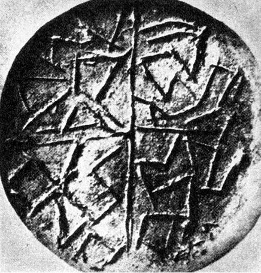
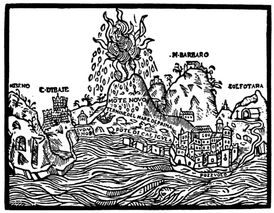
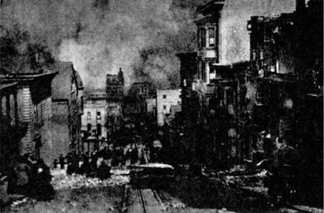

> Ráno osvítil krvavý, kalný sluneční kotouč rozvaliny, hořící zahrady, zástupy lidí zmučených výstřednostmi, zešílevších, hromady mrtvol. Magacitlové se vrhli k létacím přístrojům, majícím tvar vejce, a začali opouštět Zemi. Odletěli do hvězdného prostoru, do vlasti abstraktního rozumu. Několik set přístrojů odletělo. Rozlehl se čtvrtý, ještě silnější zemní náraz. Od severu se zvedla z popelavé mlhy oceánská vlna a šla po Zemi, ničíc vše živé.

> Zvedla se bouře, blesky padaly na Zemi, na obydlí. Vyřinul se lijavec, létaly zbytky vulkanických kamenů. Pod ochranou zdí velikého města pokračovali Magacitlové z vrcholu stupňovité pyramidy, obložené zlatem, v odletu z dýmu a popelu do hvězdného prostoru oceánem padajících vod. Tři nárazy jeden po druhém rozbily zemi Atlantidy. Město Zlatých bran se ponořilo do kypících vln.

ALEXEJ NIKOLAJEVIČ TOLSTOJ: ZEMĚ ZŮSTALA TAM

Zabýváme-li se dávnými a ztracenými civilizacemi, můžeme s jistotou očekávat otázku, jak došlo k jejich zániku a zda je vůbec možná tak dokonalá likvidace, abychom dnes shromažďovali jen nejasné, nepatrné a ne vždy průkazné střípky indicií.

  

Je to možné a stalo se to mnohokrát i v dobách historických, nám daleko bližších, poskytujících písemné záznamy. S překvapením jsme odkryli teprve nedávno říše Sumerů, Chetitů, Chazarů, pouštní civilizace starého Peru, kvetoucí kultury v oblasti dnešní Sibiře, Harappu a mnoho dalších, ačkoli v žádném z vyjmenovaných případů nešlo o „civilizaci delfínů“, zanechávající jen nemnoho hmotných památek, ale o společenství s rozvinutou materiální civilizací. Takřka každým dnem objevují archeologové další a další dosud neznámé památky zapomenutých civilizačních okruhů, které je leckdy těžko zařadit, ačkoli mohly mít výrazný vliv na dějiny světa. Je např. nesporné, že to byli právě Chazaři, kteří v 7. a 8. století našeho letopočtu význačně přispěli k zaražení arabské expanze, směřující východní čelistí strategických kleští (západní objímala Pyrenejský poloostrov) do nitra Evropy vyzkoušenou cestou kočovných kmenů přes Kavkaz a kolem Kaspického jezera. Nebýt jejich úporného a osudného boje, vyvíjely by se patrně dějiny Evropy zcela jinak.

Takřka každým dnem znovu ověřujeme – s jistým stupněm mrazení – že naše planeta chystala a ještě může chystat zkázu mimořádných rozměrů a že bychom neměli být ukolébáni iracionálním optimismem: nám se to nemůže stát.

> Hliněná pečeť z prehistorické mohyly v Karanovu, opatřená – podle mínění autora – anepigrafickými znaky napodobujícími písmo

Vypočítejme alespoň některé nepříliš povzbuzující možnosti kataklyzmat, jež mohly v minulosti „vygumovat“ všechny stopy dávných civilizací tím spíše, bylo-li jich v materiální oblasti poskrovnu a jestliže civilizační oblast byla – jak očekáváme – rozsahem omezena.

Možnost zničení kvetoucí civilizace a vyspělé kultury sopečným výbuchem je většinou opomíjena – neprávem.

Nemusíme vzpomínat, jak je zvykem, pouze na výbuch sopky Krakatoa, který zničil roku 1883 po dvou stech letech naprosté nečinnosti vulkánu dvě třetiny ostrova nedaleko Sumatry a zahubil 36 000 lidí v přístavech Télok-Betong, Batam, Anjer a Tjérigin 35 m vysokými vlnami. Výbuch, který rozmetal vulkán, bylo slyšet u protinožců, jeho hluk oběhl třikrát Zemi a s 18 milióny m3 hmoty, vyhozené spolu s 36 triliony kg sopečného prachu z vulkánu, představuje pravděpodobně největší geologický převrat v historické době lidstva. Některé sopky dokonce v celé své historii neprojevovaly aktivitu – tím větším a hroznějším překvapením byl výbuch Mount Lemingtonu v Západním Irianu, který stál roku 1950 smrt tří tisíc lidí. Výbuch sopky Puyehue v Chile 27. května 1960 zabil nebo poranil asi 5000 lidí.

Lidstvo mělo mimořádné štěstí docela nedávno, roku 1912 a roku 1956.

Roku 1912 se na Aljašce vzbudila sopka Katmaj, považovaná celá století za vyhaslou tak dokonale, že místní domorodci už zcela zapomněli, že Katmaj vůbec kdy byla sopkou. A přece pojednou promluvila, vytvořila dnes turisticky atraktivní Údolí tisíce dýmů, a při svém výbuchu vyvrhla takové masy lávy, že by město velikosti Velké Paříže pokryly do výšky 30 metrů.

V roce 1956 začala na Kamčatce zcela neočekávaně chrlit lávu dávno vyhaslá sopka Bezymjannaja, Bezejmenná. Vystřelovala sopečné bomby a lapilli do okruhu padesáti kilometrů. 1500 km2 hustého lesa, který sopku obklopoval, bylo zahlazeno z povrchu země tak důkladně, jako by tu vybuchla termojaderná nálož. Těžké balvany doletovaly až 4 km daleko.

Proti těmto katastrofám není lidstvo pojištěno ani v budoucnosti, a není pravděpodobné, že by milosrdný osud dopřával nepředstavitelným vulkanickým silám ukázat svou sílu jen v neobydlených nebo řídce obydlených oblastech zeměkoule. Na zemi je – podle známého belgického vulkanologa a geologa dr. Harouna Tazieffa – nejméně dvacet zdánlivě vyhaslých sopek, schopných každým okamžikem zahájit zničující činnost. Některé z nich jsou v bezprostřední blízkosti moderních velkoměst, proti jejichž zničení by byla katastrofa Herkulanea, Pompejí a Stabie bezvýznamnou epizodou. Mexico, Neapol, Seattle nebo Clermond-Ferrand ve Francii jsou v prvním pořadí rizika. Čas, totiž náš lidský čas, nic neznamená pro zuřící síly pod povrchem Země. Dnešní energetické prostředky lidstva absolutně nejsou schopny hrozící výbuch odvrátit a soptící vulkán jakkoli ovlivnit – ačkoli i o to se, ovšem s opačným úmyslem, snažili Spojenci, shazující za války těžké letecké bomby do kráterů Vesuvu a Etny.

Vždyť ani o Vesuvu nikdo nepředpokládal, že by v něm dřímala jiskérka vulkanické síly. V jeho kráteru, ozdobeném bujnou vegetací, bývaly pořádány oblíbené zábavy, tábořily tu Spartakovy pluky. A pak přišel rok 79 se zkázou Pompejí, Herkulanea a Stabie, jež pak ležely takřka 2000 let skryty vrstvou popela, zapomenuty a neznámy, nebýt pietní vzpomínky Plinia Mladšího na svého všetečného a příliš vědecké zvědavosti oddaného strýce, který při pozorování erupce zahynul.

Přes veškerou hrůzu takové katastrofy, předstihující výbuch Krakatoy, Hirošimu i Nagasaki, by ovšem nedošlo ani ke zkáze, ani k vážnější dezintegraci civilizace.

Poněkud jinak by však situace vypadala, kdyby byla předpokládaná civilizace prostorově omezena, např. ostrovní, nebo šlo-li by o vulkanický výbuch o několik řádů ničivější.

Velmi přesně vyjadřuje neblahé možnosti, které by mohly naši Zemi potkat, Haroun Tazieff: „Lidstvo mělo dosud velké štěstí. Katastrofy Pompejí a Krakatoy nejsou ničím proti tomu, čím nás mohou hlubiny Země ještě překvapit. Naše planeta je malý šrapnel, kroužící vesmírem.“

Domnívám se, že podstatnou součástí našich úvah o možném postižení dávné, neznámé civilizace sopečným výbuchem by měla být skutečnost, že lidstvo okolí vyhaslých nebo klidných sopek odedávna vyhledává a právě zde zřizuje svá sídla. Je to způsobeno jednak nezbytností, totiž osídlováním sopečných ostrovů, jež vulkány vytvořily a kterým dominují. Díky tomu bylo např. v jediném okamžiku – doslova – 8. května 1902 zničeno žhavou vlnou a poté deštěm popela sopky Mont Pelé kvetoucí město Saint-Pierre de la Martinique, v němž padlo za oběť smršti hořících plynů, zapalujících město i lodi v přístavu, 30 000 lidí. S těžkými popáleninami přežil jen jeden jediný muž: k smrti odsouzený vrah Joseph Surtaut v kobce vězení…

Dalším důvodem je mimořádná úrodnost zvětralých láv na úpatích sopek a v údolích kolem nich, tedy tam, kde již jednou proudil ničivý živel a kudy by se patrně znovu ubíral při další erupci. Na lávových svazích dozrává nejlepší víno, ovocné stromy poskytují nejvydatnější úrodu. Sopky vždycky lákaly zemědělce, kteří se nenechají ani na Havaji, ani na svazích Vesuvu odradit nebezpečím tím spíše, jestliže – a to musíme u neolitického člověka předpokládat – takové nebezpečí ani netuší. Tak může vzniknout městská aglomerace, „nervové centrum“ kultury právě kolem sopky, v místě odsouzeném budoucností k úplnému zániku nebo alespoň k rozsáhlé destrukci, jež sama o sobě může vážně ohrozit integritu civi­lizace.

Konečně třetím možným důvodem záměrného osídlení nejbližšího okolí sopek jsou teplé prameny, v chladném severském podnebí nejen vítané, ale např. na Islandu, zemi bez stromů, pouze s naplaveným dřívím, takřka životně důležité. Výskyt horkých pramenů, signalizujících blízkost sopečných krbů, určil výběr místa pro Reykjavik i pro řadu selských sídel. Nejstarší z nich byla nalezena teprve roku 1940 poblíže Reykholtu – pod několikametrovou vrstvou lávy, pemzy a sopečného popela…

AIV (Association Internationale de Volcanologie – Mezinárodní vulkanologická společnost) provádí katalogizaci oblastí sopek na celém světě. Do roku 1960 jich bylo uvedeno jedenáct, přičemž v přehledu (cit. podle Stegeny) jde ve skupině A o sopky činné v historické době, B o sopky ve stadiu fumarol (výronů plynů) a C ve stadiu solfatar (horkých pramenů):

    

Oblast

Celkový počet sopek

A

B

C

celkem

I. Indonésie, Andamanské ostrovy, Západní Nová Guinea

78

29

21

128

II. Filipíny, Jižní Vietnam

18

12

3

33

III. Havaj

4

0

0

4

IV. Afrika

17

21

4

42

V. Melanésie

30

15

11

56

VI. Střední Amerika

43

9

4

56

VII. Kurilské ostrovy

33

6

0

39

VIII. Kamčatka, severovýchodní Sibiř, Mandžusko, Tibet

25

8

0

33

IX. USA

6

2

7

15

X. Antarktis

7

3

3

13

XI. Arábie a Indický oceán

10

3

0

13

 

271

108

53

432

Předběžné údaje z dosud nezpracovaných území:

 

XII. Středozemní moře

28 sopečných center

XIII. Nový Zéland, Kermadec, Tonga, Samoa

26

XIV. Japonsko, Tchaj-wan

74

XV. Aleuty

44

XVI. Jižní Amerika

83

XVII. Antily

11

XVIII. Island a Jan Mayen

35

XIX. Atlantský oceán

61

Celkem tedy asi 800 sopek ohrožuje v historických dobách lidstvo – a objevení se dalších není nikdy vyloučeno. Velmi bezprostředně by o tom patrně dovedl vyprávět rolník Dionisio Polido, jemuž se při nejpokojnějším zaměstnání na světě, orání, vytvořil právě za zády zárodek nadějného vulkánu. Za dva měsíce dorostl v kužel 250 m vysoký a pak brzy v obrovitou sopku Paricutin, jež donutila obyvatele města San Juan de Parangaricutira opustit.

V podstatě každý z těchto velkých výbuchů byl schopen zničit koncentrované sídliště, a to okamžitě smrští žhavých plynů (Martinique), nebo deštěm popela (Pompeje). V nejlepším případě mohl donutit obyvatelstvo v krátké době opustit s holýma rukama své město a ponechat zde vše, co je činilo „nervovým (a zároveň neuralgickým) centrem“ a odlišovalo od satelitních provincií. Také proto se pozornost atlantologů soustřeďuje na sopečná území, kde jsou hledána dávno zničená sídla jejich vytoužené Atlantidy.

Jedním z těchto míst je tzv. Středoatlantský hřbet, odpovídající geo­graficky nejčastějším údajům o hlavním městě Atlantů („na západ od Sloupů Héraklových“), svým reliéfem pak naznačující, že v nedávné době – asi před 12 000 lety – mohly jeho vyčnívající vrcholy tvořit systém ostrovů ve středním Atlantiku. Sám antiatlantolog Lajos Stegena, který ne vždy přesnými argumenty polemizuje se zastánci Atlantidy, připouští, že z vulkanologického hlediska není zkáza Atlantidy, ležící v této oblasti, vyloučena: je tu soustředěno 61 činných sopek, Heezen tu naměřil intenzívnější tok zemského tepla a byla zde zjištěna až dosud největší známá morfologická abnormalita mořského dna.

Druhým místem, kde, jak tvrdí profesor Galanopoulos, zničil sopečný výbuch rozkvetlou civilizaci, trvající v paměti lidstva jako Atlantida, je Egejské moře. Asi před 3400 lety vychrlila sopka Santorin 20–30 metrů mohutnou vrstvu pemzy, a na místě, kde byla větší část ostrova Stronghyli, se utvořila vulkanická kaldera, asi čtyřikrát větší než kráter po výbuchu sopky Krakatoa, což samo o sobě svědčí o síle exploze.

Ničivá vlna tsunami těžce poškodila kolem roku 1500 před n. l. minojská města na pobřeží Kréty a zpustošila břehy Egejského moře. Podle prof. Galanopoulose byl ostrov Stronghyli (jinak též Kallisti = Nejlepší) onou Atlantidou s poměrně vysokou civilizací. Ještě dnes lze na dně kaldery nalézt stopy průplavů a přístavních hrází. I označení „za Héraklovými sloupy“ by mohlo odpovídat; hlavním Héraklovým působištěm byl totiž Peloponnésos a původními, skutečnými Héraklovými sloupy mohly být dva mysy jeho jižního pobřeží, Maleas a Matapan (Tainaron), jejichž obeplutí prý platilo ve starověku za dosti obtížný nautický výkon.

V každém případě je možnost vulkanické katastrofy, ničící civilizaci nebo alespoň její centrum, zcela reálná tím spíše, že právě civilizační centra vulkanické oblasti z různých důvodů vyhledávaly: většina sopečných center v tropickém a subtropickém pásmu leží, což je geologicky pochopitelné, při okrajích zlomů, a tedy při březích oceánu, kde se usazovaly i přímořské národy. Zcela podobně bychom mohli mluvit o zemětřeseních, o zhoubných vlnách tsunami, vyzdvižených podmořskými erupcemi, o pronikavých místních klimatických změnách, jež samy o sobě mohly těžce postihnout omezená území, shodou okolností představující „citlivý objem“ dávné civilizace. Málo se např. myslí na možnost útoku tropického orkánu, a přece je jeho energetická bilance fantastická: představuje tři atomové bomby středního kalibru za vteřinu. Za největšího zaznamenaného orkánu, jenž postihl roku 1780 západoindické ostrovy, zahynulo 20 000 lidí a „… těžká děla byla jako třísky odhozena dále než sto stop od místa, kde předtím stála…,“ jak vyprávěl očitý svědek, anglický admirál Rodney. Po orkánu, který roku 1938 zaútočil na břehy Nové Anglie, vydala admiralita prohlášení, že staré mapy tohoto úseku pobřeží ztratily platnost. Stovky kilometrů pobřeží změnily v pravém smyslu slova před očima tvářnost.

Energie velkého orkánu se rovná energii více než 10 000 megatunových jaderných pum a zdvihne do výšky 2–3 miliardy tun vody. Výbuch termonukleární bomby v Bikini zvedl k obloze „jen“ 10 miliónů tun vody…

Mimochodem budiž ovšem řečeno, že orkány a „větry, které bijí“, což je doslovný překlad japonského „tajfun“, život nejen berou, ale i rozšiřují. Tuto možnost nesmíme pustit ze zřetele, uvažujeme-li o způsobu rozšíření některých rostlin nebo i drobných živočichů mezi vzdálenými ostrovy a snad i kontinenty. Mělo by se na ni myslet dříve, než jsou rozpřádány difusionistické nebo dokonce atlantologické úvahy – vždyť přemísťovací úloha orkánových „mostů“ může být za jistých okolností významnou. Kobylky, zavlečené orkánem, zasypávají lodě až 2000 km daleko od afrického pobřeží a roku 1954 uložil orkán Gizela na pobřeží USA lastury, těžké až tři kilogramy, z mělčin kolem Haiti, tedy ze vzdálenosti nejméně 1500 km. Stejným způsobem mohou být přenášeni např. ptáci, ryby, obojživelníci (deště žab jsou známé z bible; roku 1919 sbírali chlapci na ostrově Rhodu až 11 cm dlouhé rybky, spadlé z nebe, do věder a prodávali je), krysy, a samozřejmě i rostlinná semena, lehké plody a klíčení schopné odnože. Sovětský badatel D. V. Nalivkin ve své monografii o orkánech na tuto možnost zvlášť upozorňuje – uveďme jako limitující faktor místa, kde se nad mořem orkány, tyto „děti moře“, hynoucí nad pevninami, rodí: Žluté a Karibské moře, daleko menší měrou u severních břehů Austrálie a Nové Guineje.

Navzdory obrovskému množství orkánů a tajfunů (jen v USA bylo v letech 1916 až 1961 zaznamenáno 11 053 smrští), jež za milióny let naši planetu postihly, můžeme podle pravděpodobnostního počtu předpokládat jejich přímý vliv na zoobotanické dějiny Země od dosažení přibližně dnešní polohy kontinentálních ker pouze v těchto oblastech.

Mohly však způsobit – a nepochybně často způsobily, jak jsme se zmínili v kapitole o dávných lodích – mohutné zátopy a snad i legendární potopy.

Ani tím však nejsou vyčerpány možnosti všech malérů, jež mohly kvetoucí civilizaci postihnout tak dalece, aby došlo k postupné degeneraci a úpadku.

Za mnoho romantičtějších možností uveďme alespoň jednu – „divoký oheň“, jehož problematikou se zabývá např. Jacques Bergier ve studii s charakteristickým názvem Tajemství ohně.

Pěkně utříděné, završené a kompletní fyzice 19. století nebylo nic neznámo a tajemství neexistovala – natož aby se snad nějak vázala k něčemu tak banálnímu jako k ohni. Oheň byl prostě svazkem plamenů a plamen hořícím sloupcem plynů nebo par – ještě já jsem se tuto definici ve škole učil. Dnes je oheň za přítomnosti jistých atomů a radikálů pro fyzika plazmou o nízké teplotě, tedy stavem hmoty, jejíž atomy a molekuly jsou smíchány s atomy a molekulami fyzikálně nestabilními, z nichž některé, jak prokázal např. Siegfried Klein, mají mimořádně vysokou teplotu, jakou nacházíme v plazmě tzv. horké. To je samo o sobě pozoruhodné – ovšem spíše pro plazmové fyziky. Podivnější však jsou zvláštní projevy „divokého ohně“, soustřeďující se, jak se zdá, z nevysvětlitelných (nebo lépe řečeno dosud nevysvětlených) příčin především na hustě osídlená místa.

> Vznik Monta Nuova u Pozzuoli roku 1538 sopečným výbuchem

Charakteristické znaky obrovských a mimořádně ničivých ohni­vých smrští nevysvětlitelného původu jsou (podle Bergiera):

1\. Podstatně zvýšená teplota atmosféry, vzhledem ke zjištěnému vzniku ultrafialových paprsků nejméně 10 000 až 13 000 K, což je více, než se až dosud podařilo laboratorně dosáhnout jakoukoli chemickou reakcí.

2\. Šíření po „silokřivkách“, jakýchsi zónách, které nejsou plameny překračovány, i když veškeré podmínky k šíření jsou dány. Tento případ nastal např. po těžkém bombardování Hamburku zápalnými pumami roku 1943 – zde je ovšem primární zdroj ohně jasný a nepochybný.

3\. Periodičnost, tendence se opakovat v kratších nebo delších časových intervalech na týchž místech.

4\. Zvýšená radioaktivita půdy po požáru navzdory nižšímu množství radioaktivních hornin, než by odpovídalo naměřené hladině.

> Vzácný a unikátní snímek požáru Chicaga ještě před okamžikem, než se změnil v divoký oheň

Nejlépe prozkoumanou a co do rozměrů patrně největší divokou ohnivou smrští, prostudovanou řadou historiků, fyziků, požárníků atd., je známý požár, jenž v noci z 8. na 9. října roku 1871 (tedy v době, kdy nelze obviňovat elektroinstalace, hořlavé pohonné látky nebo dokonce radioizotopy), zničil Chicago.

Oheň vznikl, jak se dodnes odborníci domnívají, v chlévu paní O’Learyové, jejíž neklidná kráva převrhla hořící lampu (Chicago roku 1871 bylo sice co do počtu obyvatel velkoměstem, avšak co do charakteru většinou velkou vesnicí a samozásobitelská kráva paní O’Learyové nebyla žádnou výjimkou) – do určitého okamžiku obvyklý a zdánlivě snadno lokalizovatelný požár bloku přízemních domků, oddělených od dalších objektů širokými ulicemi, se však z neznámých příčin změnil v divokou a nezvládnutelnou bouři plamenů, zuřící 27 hodin. Pozoruhodné je, že ve stejném nebo velmi blízkém okamžiku došlo v Chicagu a bezprostředním okolí k několika důlním katastrofám, způsobeným snad posuvy půdy. Vyžádaly si daleko více obětí nežli sám požár, jenž strávil těla 250 obětí a sežehl 17 500 domů. Žár byl fantastický – největší kamenné bloky žhnuly třešňovým žárem, plameny měnily barvu z jasně rudé do smaragdově zelené. J. W. Sheahan a G. P. Upson ve své analýze katastrofy napsali doslova: „Cosi ve vzduchu živilo tento oheň, který byl zcela jiný než ostatní známé ohně.“

Další skutečnosti, neméně podivné, připadá hlášení hlavního strážmistra chicagských hasičů Medilla: současně s požárem, vzniklým ve stáji paní O’Learyové, vzňal se i tři kilometry vzdálený kostel sv. Pavla a další objekty. Železné pruty ve skladišti se slily v kompaktní hmotu, ačkoli nejbližší hořící budovy byly sto metrů daleko. Budovy z kamene se změnily v „cosi“, šestipatrové domy se „vypařily“. Podle Medilla „i mramor hořel jako uhlí“. Domy, dosud vzdálené od zuřícího požáru, začaly hořet z nitra. Na okrajích města byly nalezeny desítky mrtvých beze stop popálení a daleko od ohně. Další desítky záhadných úmrtí byly zjištěny v řece a rybníku u Williamsova mlýna. A jako by ani toho nebylo dost, vypukly toho dne rozsáhlé požáry prérií a lesů ve Wisconsinu, Michiganu, Iowě, Indianě, Illinois, Minnesotě, Kansasu, Nebrasce, v Rocky Mountains, Sieře i Alleghanách. Ve stínu katastrofy Chicaga zůstala skutečnost, že téhož dne lehly stejně podivným způsobem popelem města City of Holland a Manistee (280 km a 480 km od Chicaga) i osada Forester.

Podzim roku 1871 nebyl nijak zvlášť suchý, ostatně i kdyby tomu tak bylo, sotva by sucha zachvátila tak obrovské oblasti. C. W. Chamberlain, který se požárem Chicaga zabýval, podává naprosto nesmyslné a astronomicky absurdní vysvětlení: pád chvostu Bielovy komety ve formě deště žhavých meteoritů a otravy plyny z kometárního chvostu. Nezmiňoval bych se o této nehoráznosti, kdyby nebyla citována v knize P. Colla, jež v roku 1973 vyšla i u nás.

Bergier podotýká, že některá fakta by byla vysvětlitelná v úrovni dnešní vědy jedině tehdy, kdyby oheň zasáhl sklady vysoce hořlavých chemikálií, např. zpráškovaného hliníku nebo hořčíku – jenže tehdy podobné chemikálie neměly použití a téměř neexistovaly. Stejně nepravděpodobná je jejich účast na sérii ohnivých bouří, děsících v zimě roku 1904 celou Anglii, především Wales, o níž napsal list Liverpoolské echo 18. ledna 1905, že se „celý Wales ocitl v moci nadpřirozených sil“. Domy hořely, ačkoli se v nich netopilo, a to i tehdy, byly-li opuštěny nebo naopak přísně střeženy. Docházelo ke vzpourám, nepokojům a náboženským exaltacím; události nejsou dodnes vysvětleny.

Není vyloučeno, že divoký oheň měl účast na nevídaných požárech v okolí Moskvy v suchém létě roku 1972. Dmitrij Novopljanskij napsal v listu Pravda o příhodě, v níž položili životy v boji s ohněm tři stateční sovětští vojáci:

„Takový atmosférický jev tady u Moskvy nikdo nepamatuje. Nedaleko jedné dělnické obce se naráz zvedla smršť. Větrný sloup unášející s sebou trsy přeschlé rozpálené rašeliny se zvedl k obloze. Vzepjal se do padesátimetrové výše a zamířil přímo ke stohům několika tisíc tun rašeliny, které lemovaly úzkokolejnou trať a z nichž se v žáru slunce kouřilo. Jen se jich dotkl svým spodkem a v okamžiku zahořel v celé své výšce. Pohled na ohnivou smršť byl příšerný. Ve vzduchu létaly hořící kusy suché rašeliny. A vtom už vzplanula celá třistahektarová plocha. Byl to gigantický požár. Uragán rozmetal rašelinové stohy. Staré nevymýcené stromy vzplanuly jako stovky pochodní, zahořela i země…“

V tomto případě hrálo jistě hlavní roli sucho a vedro, ale i tak je vznik plošného požáru nápadně rychlý a explozívní.

Meteorologové ohnivé smrště znají a připouštějí – tvrdí však, že na jejich počátku musí být silný požár nebo výbuch (což by odpovídalo požáru Chicaga), jehož oheň se pak „osamostatní“ v smršť plamenů, živenou dosud nejasným chemickým nebo fyzikálním procesem. Také vulkanologové jsou s tímto jevem obeznámeni – některé sopky ohlašují ohnivé smrště vypouštěním dýmových kol, podobných kouřovým kroužkům zkušeného kuřáka – ani oni však nenabízejí vysvětlení.

Mohutné ohnivé smrště byly zaznamenány ve španělské provincii Almeria roku 1945 a v portugalském městě Figueira 6. července 1949. Navzdory komplexnímu průzkumu, magnetometrickým měřením, analýze atmosférických podmínek a meteorologické situace i geologickým sondám nebylo nalezeno uspokojivé vysvětlení. Tím spíše zůstávají nevysvětleny periodické a dosti časté ohnivé smrště v jihoamerických Andách nebo ojedinělá smršť divokého ohně v Tanzánii. Atmosférická elektřina, která snímá hříchy světa a je obviňována ze zrodu UFO i dalších strašidel našeho kosmického věku, byla pro nedostatek průkazného materiálu tentokrát osvobozena a pozornost se obrátila ke kosmu.

Stalo se tak po výpovědi pilota pokusného rekordního raketoplánu Bell X-15 Joe Walkera, doložené několika fotografickými snímky. Walker ve výši 246 000 stop (74 784 metrů – piloti Bell X-15 dosahují při pokusných letech výšky 100 km a více, což je opravňuje k titulu kosmonaut, udělovanému NASA) se setkal s ohnivou bouří, jež se později rozpadla na pět nebo šest menších ohnivých vírů. Jeho pozorování, k němuž Walker moudře odmítl připojit jakoukoli domněnku, podpořil na tiskové konferenci AP, konané 11. května 1962, kosmonaut John Glenn. Doporučil zkoumání tohoto problému a vyslovil se ve prospěch možnosti existence „koncentrované radiační energie“ ve stratosféře nebo v kosmu. Těžko říci, zda ho k tomu přiměla vlastní zkušenost, domněnky, kolegialita nebo fantazie. Těžko si v souladu s dnešní vědou koncentrovanou radiační energii, nebo dokonce oheň v prázdnotě kosmu představit, i když je ovšem známo, že se při silných slunečních bouřích vytvářejí částice o vysokých energiích, ba i celá oblaka plazmy, letící obrovskými rychlostmi a dosahující v některých případech Země už za půl hodiny.

Ale Chicago přece jen shořelo. Podivně a dosud nevysvětlitelně. Tím podivněji, že se ohnivou smršť nepodařilo vyvolat ani čtyřiceti meteotrony, obrovskými naftovými tryskami, namířenými na Sahaře do jednoho bodu. Vznikl ohnivý sloup, vzdušný vír – a nic víc.
