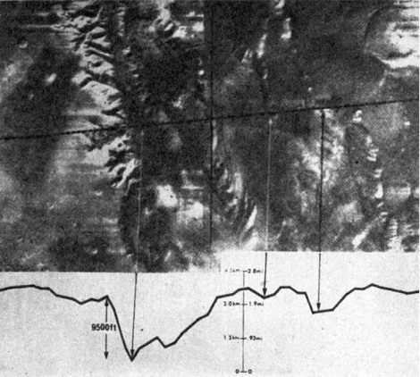
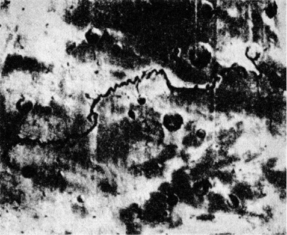

> _V těchto věcech je třeba postupovat obezřele, neboť člověk se často zmýlí a dopouští se zejména dvou omylů: jedni popírají všecko neobyčejné a druzí překračují rozum a upadají do magie. Je tedy třeba vystříhat se těch početných knih, které obsahují verše, znamení, modlitby, zaklínadla a obětní formule, neboť to jsou knihy ryzí magie, a jiných, kterých je nekonečné množství a jež neobsahují ani sílu umění, ani sílu přírody, ale výmysly kouzelníků. Na druhé straně je však nutno uvážit, že mezi knihami pokládanými za magické jsou takové, které magické vůbec nejsou a obsahují tajemství mudrců… Jestliže někdo nalezne v těchto dílech nějaký postup přirozený nebo umělý, nechť si ho ponechá._

ROGER BACON (1214–1294)

Kosmická tělesa, především hvězdy, mění v souladu se svým vývojem spektrum, právě tak jako mění absolutní i ze Země pozorovatelnou (zdánlivou) hvězdnou velikost, vyjádřenou Pogsonovou stupnicí, magnitudu. U některých hvězd byly tyto proměny pozorovány již v epoše vědecké astronomie, o jiných se to dozvídáme z astrologických pramenů, v některých případech se pouze dohadujeme.

Před několika desítkami let proběhl v české odborné literatuře dosti temperamentní spor o dávnou barvu Síria, nejjasnější hvězdy oblohy, jehož se u nás zúčastnil prof. Arnošt Dittrich na jedné a prof. Jan Bor na druhé straně. Bor, opíraje se o staré prameny, tvrdil, že Sírius, soudě podle zpráv babylónských, egyptských, řeckých i římských, byl kdysi červený. Svědčí o tom i jeho pojmenování; např. babylónský Šukudu – zářící měď, i rudý šat s ním ztotožněných bohů a bohyň, rudá barva obětin, přinášených Síriovi v Římě 25. dubna každého roku, a konečně i svědectví Ptolemaia, Horatia, Seneky a Aviena. Podobnou změnou – podle Bora – prošel prý i Algol (beta Persei), dnes jasně bílý, ale podle arabského hvězdáře Sufiho ještě rudý.

Dittrich kladl Borovy vývody jeden za druhým na lopatky a prohlašoval, že rudá barva starověkého Síria pochází z pozorování jeho heliaktických východů (tzn. současných s východem Slunce), důležitých např. pro egyptský kalendář, a tím pro určení agrotechnických lhůt, atmosférou, takřka ustavičně znečištěnou zvířeným pouštním prachem a pískem, pohlcujícím krátkovlnné paprsky. Zdá se, že měl pravdu.

Jsou-li i skutečné, pouhým okem pozorovatelné změny hvězd možné a vzhledem k velkému počtu hvězd i poměrně časté, nelze to tvrdit o planetách, přesněji řečeno o prastarých astrologických objektech Merkuru, Venuši, Marsu, Saturnu a Jupiteru. Doba, po kterou jsou lidmi sledovány a po kterou sahá společenská paměť lidstva, je v geologickém životě planet pouhým zlomkem sekundy (viz „film“ pozemského života[^1], během něhož by musely povrch planety postihnout závažné a velmi rozsáhlé změny, měnící jeho barvu (nebo barvu atmosféry), aby vzdálený kosmický pozorovatel zjistil něco nápadného. K takovým proměnám nepochybně docházelo s rozvojem nebo naopak s ústupem vegetace, zvyšováním nebo snižováním oblačnosti atd., byly to však obvykle změny tak pomalé, že i jejich průběh v miliónech let označujeme za katastrofický. Pro globální změnu, probíhající např. v časovém řádu staletí, už nemáme výraz, stupňující pojem katastrofičnosti.

Mimořádnost ovšem neznamená nemožnost – charakteristickým příkladem jsou povrchové změny impozantních rozměrů a dosud nejasné podstaty v atmosféře Jupitera, především pověstná rudá skvrna (Great Red Spot – odtud zkratka GRS) na rozhraní jižního rovníkového pruhu a jižního tropického pásma Jupitera, pozorovaná poprvé patrně roku 1664 R. Hookem a v dalších stoletích pak střídavě mizející, znovu se objevující a nabývající výraznosti. Jde o útvar o rozměru asi 40 000 km × 13 000 km s měnivou rotací, a tedy nespojený pevně s povrchem planety, i když poměrně kompaktní. Naprostá planetologická odlišnost Jupitera od Marsu ovšem vylučuje srovnávání, přesto však je GRS dokladem možnosti značných planetárních změn v poměrně rychlém sledu.

Jsou nám ostatně známy i ze samotného Marsu. Nejvýraznější dlouhodobou změnu jeho povrchu v posledním století – význačné ztemnění v oblasti kanálů Thoth-Nephentes východně od Syrtis Maior – zpozorovali a pravidelně sledovali čeští vědci již roku 1950 (A. Rükl). Jejich priorita je uznávána především sovětskou literaturou – jinak si ji připsali o čtyři roky později pracovníci hvězdárny na Mt. Wilsonu. Tato změna i další sekulární změny na Marsu jsou vysvětlovány převážně změnami klimatu, projevujícími se buď změ­nami vegetace, vlhnutím podkladu, nánosem prachového pokryvu nebo cirkulací v troposféře.

Při studiu náboženské a astrologické literatury si pozorný čtenář povšimne, že kromě přirozeného a obvyklého „životního běhu“ bohů, rodících se s obtížemi z kmenových a rodových božstev a prožívajících pak období svrchované úcty, aby zcela zapomenuti odešli ze scény, lze pozorovat takřka současně v několika starověkých kulturních centrech prudký a nevysvětlitelný vzestup slávy, moci a autority bohů Marsu zasvěcených nebo s Marsem ztotožněných, přičemž se tito bohové současně stávají bohy války, bojů a zmaru. Zjištění je možné učinit teprve po podrobnějším studiu pokud možno původních pramenů; většina dějin astronomie a astrologie se totiž spokojuje s ujištěním, že Mars byl planetou a bohem války „odpradávna“.

Napadlo to i člověka všestranně vzdělaného a pilného ve vyhledávání dokladů pro své hypotézy, Immanuela Velikovského. Velikovsky studoval přírodní vědy v Edinburghu, věnoval se historii i právům, v Moskvě obdržel doktorát medicíny, biologické přednášky navštěvoval v Berlíně, neurofyziologické v Curychu a pro poučení o psychoanalýze si dojel k prof. Freudovi do Vídně. Velikovsky věnuje veškerý svůj čas a energii shledávání důkazů o naprosté serióznosti informací Starého zákona. Studium Starého zákona doporučil sice izraelským geologům sám bývalý předseda vlády Ben Gurion a podle starozákonných textů, vykládaných až dosud jako metafory, byly objeveny zásoby rud, stavebního kamene, vody, zemního plynu a nafty; Velikovsky však věří bibli stejně doslova a pevně jako Heinrich Schliemann Homérovým eposům. Zasvětil život pošetilé myšlence: dokázat, že se Slunce opravdu na prosbu Jozue zastavilo (Kniha Jozue, kap. 10, 12 atd.), jakkoli snad ne přesně nad Gabaonem, že Exodus byl doprovázen planetárními kataklyzmaty, dokonce vzájemnými kolizemi planet, o čemž z této jinak velmi dobře popsané doby nemáme prý díky „kolektivní amnézii“ mimo hebrejské prameny žádných zpráv…

Velikovsky si povšiml rychlého vzestupu významu bohů, spojovaných s Marsem a válkou, na přelomu prvního tisíciletí před n. l. a domnívá se, že tehdy došlo ke srážce Venuše s Marsem a možná ještě k dalším interplanetárním haváriím, po nichž se dostal Mars do blízkosti Země a hrozil jí zkázou. Bohové Marsu zasvěcení nebo s Marsem ztotožnění se stali nejděsivějšími postavami Olympu všech náboženství.

Netřeba snad dodávat, že tuto fantazii odmítáme jako astronomicky neopodstatněnou a z hlediska vývoje planetární soustavy a její mechaniky takřka vyloučenou. Tím ovšem jsme nesprovodili ze světa fakt, že až asi do 9. století před n. l. nehraje např. asyrsko-babylónský bůh Nergal, ztotožněný s Marsem, v panteonu mezopotámských bohů žádnou zvláštní úlohu. Ani v tehdejší astrologii neměl Mars vynikající místo – na stropě hrobky architekta královny Hatšepsovet, stavitele Senmuta, zdobené kresbou oblohy se zvěrokruhem a planetami, Mars dokonce zcela chybí. Teprve další dvě století nejen spojila Mars s bohy války, ale učinila z těchto bohů vynikající postavy nebeských hierarchií, nejednou dokonce bohy nejvyšší.

Opatrnost velí prozkoumat nejprve domněnky, vycházející z nejpřirozenějšího vysvětlení, tedy především z relativně dlouhého období klidu a míru, odsunujícího bohy války do pozadí na úkor bohů plodnosti, stád, moře atd. Pro tuto domněnku nenacházíme však ani nejmenší oporu, a bude-li v budoucnosti vynalezen stroj času, rozhodně nedoporučujeme neurotikům, toužícím po klidu, léčebnou návštěvu „úrodného půlměsíce“ a vůbec východního Středomoří na přelomu druhého a prvého tisíciletí před n. l.

Národy se tehdy opět jednou daly do pohybu, vyvolaného snad v prvopočátcích (jako již několikráte) dalším vysycháním středoasijských stepí, vyhánějících své obyvatele, a srážkami podobnými nárazům koulí vlnostroje, dosahujícího odstředivě až na okraje obydleného světa. Velké egejské stěhování přivedlo na scénu nové indoevropské kmeny, pod jejichž náporem se zhroutila říše Chetitů. Dórové vyvrátili mykénskou civilizaci. Itálie, Mezopotámie i Egypt se zmítaly v bojích takového rozsahu, že s nimi snad lze srovnávat jen „světovou válku“ počátkem 7. století n. l., kdy byly celá Asie a celá Evropa zality krví bojů všech proti všem od Číny až po Byzanc, Řím, Franky, Langobardy, ba dokonce i španělské Vizigóty. Jen Británie na západě a Japonsko na nejzazším východě (chystající však tím usilovněji vpád do Koreje) se tohoto běsnění nezúčastnily.

Hypotéza dobové nepotřebnosti válečných bohů tedy neobstojí. Nacházíme je před zmíněným miléniem i po něm na celém světě, pokud tak hluboko dosáhne společenská paměť, někdy dokonce podpořená písemnými záznamy. Dalším poměrně rozumným vysvětlením zjevného nezájmu astrologie i náboženských soustav o Mars v době před rokem 900 před n. l. by mohlo být i pozdější spojování válečných bohů těchto bouřlivých dob s jinými planetami než Marsem.

Řekněme hned, že takový případ, existuje-li vůbec, je ojedinělý. Nehledě na starořeckého Area a římského Marta, kteří jsou oba ztělesněním Marsu, je Marsem i „krví poskvrněný bořitel zdí“ Huitzi­lopochtli, bůh války Aztéků, „král bitev, přinášející porážky i vítězství“ Nergal, starobabylónské, původně však chaldejské božstvo, nazývané quarradu rabu, velký válečník – meč. Skythové uctívali planetu Mars přímo a bez personifikace. Při obřadech ji zastupoval meč nebo lépe řečeno šavle. Číňané, právě tak jako staří Římané, nazývali Mars „vlčí hvězdou“ (latinsky Lupus Martius), což je, jak se zdá, blízké starogermánskému bohu-vlku Fenrirovi, zhoubci samotného Odina, a snad i slovanskému astrálnímu vlkodlakovi, uhánějícímu v mracích a pohlcujícímu (patrně zastíněním mraky) Slunce a Měsíc. Planetární bůh války a smrti Hindů, Šiva, „uložil své semeno do ohně“, jak nás zpravuje Kalidása, z kteréhožto spojení se zrodil Mars-Kumara, přemožitel kosmického démona Taraky, soužícího svět.

Ani zde tedy nelze hledat vysvětlení. Mars, nápadně rudý a evokující svou barvou představu krve, smrti, zmaru a železa, resp. železné rudy, se stal pochopitelně planetárním obrazem boha války. „Odpradávna“, přesněji řečeno asi od přelomu druhého a prvého tisíciletí před n. l. Jak tomu bylo ještě dříve?

Písemných pramenů je ovšem dosti pořídku, ale i tak můžeme se slušnou dávkou jistoty zjistit zcela překvapující fakt: v těchto dávných dobách byla planetou hrůzy a zmaru – Venuše. Stříbrný skvost našich svítání a soumraků, planeta ztotožňovaná s bohyní lásky, líbezná Krasopaní.

V některých nejstarších civilizacích byla Venuše dlouho zaměňována s Jupiterem, což se až do dosti pozdní doby odráží i ve velice podobných astrologických aspektech obou planet. Zaměňování Venuše s Jupiterem při jinak poměrně rozvinuté prvotní astronomii je neklamnou známkou účelového využití znalostí oblohy i mimo astrologickou oblast; tak např. staří Polynésané nazývali Fauma nebo Paupiti obě planety – jejich zájem byl vzhledem k existenční nezbytnosti astronomické navigace na široširých pláních Pacifiku zaměřen výhradně ke hvězdám. I v nejstarších egyptských záznamech jsou bohové Isis a Horus, ba dokonce i Amon střídavě ztotožňováni s Venuší i Jupiterem, zatímco o sounáležitosti např. Osirida se Saturnem není pochyb. Také v tomto případě byl prvotní astronomický zájem neastrologický: stabilizoval kalendář a s ním i agrotechnické lhůty, jež měly pro egyptské záplavové hospodářství životní důležitost. K tomu se ovšem hodily hvězdy daleko lépe než planety – staří Egypťané si zejména všímali heliaktických východů Síria, jimi zvaného Sopdet, řecký Sothis.

Rovněž staří Číňané měli velmi rozvinutou astronomii, vynucenou potřebou přesného kalendáře pro obdělávání sprašových ploch (staročínský rok měl již v nejstarších nám známých pramenech délku 365 ¼ dne, takže dosahoval přesnosti juliánského kalendáře, platného v Evropě až do konce 16. století), která přinesla obdivuhodné výsledky. Pozorovali a zaměňovali Jupitera a Venuši, opomíjejíce Mars. Je to tím zajímavější, že v dokladech, sahajících až do 3. tisíciletí před n. l., nacházíme celou řadu čínských pozorování nov, komet, zatmění Slunce i Měsíce atd.

Musíme se tedy obrátit k civilizacím, jejichž rozlišování Jupitera a Venuše bylo díky pokročilé nebo alespoň obecně prováděné astrologii, čtoucí své horoskopy především z postavení planet, spolehlivé a jednoznačné. Týká se to především mezopotámských civilizací, jež sice v prvopočátcích sledovatelné historie ztotožňovaly s Ištarou nejprve Jupitera, později Venuši (Jupiterovi byl záhy „přidělen“ bůh Marduk), brzy však již měly v rozlišování obou planet zcela jasno, což dokazují např. i babylónské klínopisné tabulky, zachycující zdánlivý pohyb Venuše na obloze.

Dozvuky odsouzení Venuše jako smrtonosné planety nalézáme i v Izaiášovi (9,2), žijícím asi v době vlády krále Menaššeho (692–642 před n. l.): „Nebo lid tento chodě v temnostech, uzří světlo veliké, a bydlícím v zemi stínu smrti světlo zastkví se.“

Obrazy egyptské Venuše-Isis, babylónské Venuše-Ištary, a dokonce i daleko pozdější řecká zpodobení Venuše-Pallas Athény byly doprovázeny hady a draky. Také toltécké božstvo, jež později uvolnilo trůn aztéckému Huitzilopochtlimu, „opeřený had“ Quetzalcoatl, bylo ztotožněno s Venuší. Mayové považovali Venuši jakožto jitřenku za velmi nebezpečnou a dbali na znalost jejího heliakického východu, aby byla včas podniknuta opatření na záchranu ohrožených.

Občas byla Venuše vydělována z kruhu ostatních planet spolu se Sluncem a Měsícem v jakousi „svatou Trojici“ – např. ve 14. stol. před n. l. přinášeli Babyloňané Venuši lidské oběti. Stejně tomu bylo v Polynésii, v arabských zemích, ve starých indiánských kulturách Střední Ameriky. V Indii, Egyptě a na Krétě byla Venuše ztělesňována býky – vzhledem k zajímavosti tohoto faktu jsme o něm pojednali v jiné souvislosti.

Nejcharakterističtějším znakem prvotního odsouzení Venuše jako neblahé planety je však její pradávné ztotožnění se Satanem různých národů, Ahrimanem, Setem, Luciferem a především Baal Zevuvem (Belzebubem) – v překladu „pánem much“.

Mimochodem podotýkám, že podivný titul může naznačovat sám o sobě spojení Venuše s vojenským řemeslem: ve starém Egyptě a jeho vlivem snad i v některých říších Přední Asie byla moucha považována nejen za ztělesnění drzosti (nilský ovád je v tomto ohledu obzvláště čilý), ale i – kupodivu – statečnosti. Prof. Obenberger ve stati své Entomologie, věnované dvojkřídlému hmyzu, dokonce uvádí, že staroegyptský metál za statečnost měl podobu mouchy. To umožňuje, jak se zdá, zajímavé interpretace poněkud nejasného titulu „pán much“, který ostatně nenalézáme jen v Babylónii a v Severním království deseti kmenů, nenáviděném biblickými proroky, ale i v íránském textu Bundahis, v Illiadě, kde Arés nazývá Athénu, jíž je Venuše zasvěcena, urážlivě „ovádem“, v Brazílii, kde kmen Bororo nazýval Venuši „písečnou mouchou“ právě tak jako afričtí Bantu i jiní.

Je ostatně zajímavé, že čerti a čertíci celého světa, ztotožňovaní s Venuší, jsou všude zpodobováni s rohy, a to, jak se zdá, od pravěku. Rohatí čerti nestraší jen v křesťanské démonologii, ale i u starých Germánů, v indiánských pohádkách, v Polynésii, zkrátka i tam, kde rohatá zvířata neexistují.

Vraťme se však k titulu „pán much“.

Velikovsky se domnívá, že tento nelichotivý název obdržela Venuše díky kosmické planetární kolizi, kdy „jako zlatá moucha“ letěla oblohou. Nehledě k nepravděpodobnosti takové události by kosmický děj, pozorovaný ze Země, rozhodně neopravňoval takové přirovnání. Daleko spíše se dobereme skutečného smyslu Baal Zevuva z rozličných mýtů, popisujících planetu Venuši jako „dárce“ nebo „rozsévače“ much, ať už blíže neurčeným způsobem, nebo v podobě jednorázové katastrofy, např. jedné z egyptských ran.

Zde je vysvětlení, objevení se Venuše na východním obzoru znamenalo pro národy východního Středomoří signál počínajícího se dne, kdy se budily mouchy, trýzeň těchto oblastí. Její záře na západě svolávala mouchy zpět do úkrytů. Je dokonce možné, že stará řecká domněnka o rození much a včel z býků, jež mohla být z Egypta přes Krétu importována do Řecka, má původ astrální, totiž z planety Venuše zasvěcené býku. Lidstvo od nejstarších dob věřilo v prvoplození; snad opravdu panovala domněnka, že planeta Venuše ráno rodí mouchy a že k ní večer opět odlétají.

V horkých krajinách nebývá slunce nositelem příjemných pocitů a nestává se bohem, alespoň ne bohem hlavním. Pokus Amenhotepa IV. o zavedení kultu jediného boha slunce Atona v Egyptě ztroskotal nejen na odporu kněží ostatních bohů. Pouštní civilizace starého Peru uctívaly jako hlavního boha Měsíc – avšak již o několik set kilometrů dál na drsných a chladných náhorních planinách And vládlo panteonu bohů Slunce. Venuše jako jitřní ohlašovatelka denního žáru, much a jiných svízelí měla tedy kromě své narudlé barvy dost a dost vlastností, aby byla ztotožněna se zlými bohy. Ponecháme-li stranou Velikovského domněnky o planetárních kolizích, pozorovaných užaslými pozemšťany, zbývá ještě dostatek důrazných argumentů.

Zlá planeta musela být výrazná nejen proto, že zla, války a smrti je odjakživa dost, ale i vzhledem k nezbytnosti opatřit si dostatečně mocného kmenového či národního boha války, pomocníka na výboj i odboj. V úvahu tedy připadala Venuše, Jupiter, Saturn a Mars. Slunce a Měsíc, považované rovněž za planety, stály jaksi „mimo soutěž“, Merkur je pouhým okem vidět jen velmi zřídka a obtížně, Uran je nepatrnou „hvězdičkou“ na hranici viditelnosti.

Jasností se tedy hodila nejspíše Venuše a Jupiter, Venuše dostala nezáviděníhodnou přednost. Především díky narudlé barvě nad obzorem, kde byla pozorována nejpokročilejšími starověkými civilizacemi a jíž se lišila od stříbrného Saturna a zlatého Jupitera i – jak autor věří – od dnes rudého Marsu. Mars byl zavržen i pro podstatně nižší jasnost, kolísající podle vzdálenosti od Země (55–400 miliónů kilometrů).

A přece nastala kolem přelomu tisíciletí změna a na uvolněný trůn Venuše zasedl ve funkci zlověstné planety války, zmaru a krveprolévání Mars.

Přirozeným, bohužel nepřijatelným vysvětlením této podivné skutečnosti by mohlo být ovlivnění astrologie kulturami, žijícími v pásmech mírnějších a v atmosféře čistší, prosté pouštního nebo sprašového prachu, dodávajícího Venuši narudlé zbarvení, bez každodenní trýzně úpalu a nevyhnutelných much. Taková civilizace by ovšem mohla od samého počátku prohlásit Venuši za šperk oblohy, planetu milenců a lásky, a mezi ostatními planetami vybrat „černého Petra“, například Mars. Neexistuje však. V době, kdy nastala radikální změna astrologického aspektu Marsu, byla jediná nám známá kulturní oblast, splňující některé z podmínek, „zlatá Egeis“, mrtva. Krétské paláce byly v rozvalinách a ostrov takřka vylidněn. Kdysi slavné Mykény zpustly. Nad prvním řeckým osídlením východního Středomoří se snesla noc, jejíž rozbřesk přinesl až „řecký zázrak“, vzdálený celá staletí v budoucnosti. Odjinud mohl tento astrologický názor do Mezopotámie proniknout jen stěží.

Nabízím domněnku: radikální, děsivou a především náhlou změnu barvy Marsu. Žádná planeta není dnes barvou nápadnější – Mars, zejména v příznivé opozici, září na obloze jak kapka žhavého kovu nebo rudý lampión a přímo volá po pochmurných asociacích, jež se s ním v mýtech i astrologii posledních tří tisíciletí pojí. Rychlá změna barvy např. z namodralé nebo nazelenalé k rudé by nejen nemohla uniknout pozornosti, ale musela by naopak vést k pochopitelnému spojení tohoto jevu s obecným neklidem, válkami a katastrofami, na něž, jak se zdá, nebyl přelom 2. a 1. tisíciletí před n. l. chudý.

S tímto náhlým zbožněním může také souviset obřad taurobolie, pocházející zřejmě z předoasijského nebo egyptského kulturního okruhu: zasvěcenec, jenž měl být obrněn proti úkladům a úspěšný v boji, sestoupil do jámy, na jejímž roštovém poklopu porazili hiero­fanté býka tak, aby jeho krev stékala za odříkávání patřičných výroků do jámy na adepta. Tvrdí se, že tomuto prastarému zvyku byl podroben i římský Iulianus Apostata (331–363 n. l.), aby z něho byla smyta svěcená voda křtu, jehož se zřekl. Je ovšem otázkou, zda celá historie není jen jednou z nesčetných agitačních pomluv, jimiž křesťané postavu císaře, usilujícího o restauraci pohanství, dodatečně opředli. Krví zkropený zasvěcenec se, jak víme, stával do jisté míry bohem; možná že šlo o astrální pantomimu zrození boha – Marsu – změnou jeho barvy v rudou, odejmutou planetárnímu býku – Venuši.

Neméně zajímavý je athénský svátek tzv. bufonie, zřejmě prastarý; již v 5. století před n. l. se zdál mnohým směšný a jeho smysl byl zcela nejasný. Spočíval v porážce býka sekerou, kterou kněz, jenž porážku vykonal, odhodil a prchal, pronásledován účastníky slavnosti. Na soudu, který se po jeho dostižení konal, byla z vraždy obžalována sekera, odsouzena a utopena v moři.

A. P. Každan se domnívá, že „tato hádanka má své kořeny pravděpodobně ve staré totemistické víře; když dříve lidé zabíjeli totem (býka-Dia), prosili ho za odpuštění, a když pak pojídali jeho tělo, věřili, že tak zajišťují jeho budoucí vzkříšení a sobě hojnost potravy“.

Toto vysvětlení je jistě možné a přijatelné již proto, že podobné zvyky byly zjištěny u Evenků, u některých severoamerických indián­ských kmenů i jinde, týkaly se však vždy lovných zvířat, medvěda, jelena, bobra apod., představujících totemy, charakteristické pro lovecké, nikoli rolnické populace. Další možnou námitkou je nevýznamnost hovězího dobytka pro potravu starých Řeků, na jejichž chudých pastvinách se spíše uživily ovce a kozy, představující spolu s rybami hlavní zdroj živočišných bílkovin. Konečně je zajímavé, že tradice nepřenesla ani náznak významu bufonie do 5. stol. před n. l., kdy vedle vyvíjejícího se státního polyteismu stále ještě dožívaly staré kulty. Taková koexistence byla prokázána např. vykopávkami Velkomoravské říše, kde vedle křesťanských svatyň existovala i pohanská božiště, hojně navštěvovaná příznivci starého náboženství, ba i ve starožidovském náboženství. Nerudný Jahve, rozhodně nevynikající snášenlivostí, byl dlouhou dobu nucen přihlížet, jak jsou kromě něho uctívány i ašery, dřevěné sloupy, kameny zvané masseba, ba dokonce i kozlí duch pouště Azazel.

Neměli bychom se vzdávat astrálního vysvětlení bufonie dříve, než bude celá záležitost řádně prozkoumána. Lze ji vysvětlovat jako reflexi změny barvy Marsu (sekery, kovu), která byla vnořena do krve býka (Venuše), takže zrudla. Božstvo zla, války a krveprolévání bylo symbolicky utopeno.

V tomto případě by bylo 500 let dostatečnou dobou, aby se původní smysl rituální němohry vytratil, nebo se stal koruptelou, zejména díky úsilí kněží státního kultu, spojujícího s býkem ne už Venuši, ale Dia.

Dalším možným vysvětlením náhlé změny aspektů Marsu by mohlo být objevení fází Venuše, které způsobilo její okamžitou feminizaci a vyloučilo ji z možných kandidátů na pochybnou čest boha války. Výjimku mohly činit leda národy, kde žena zastávala méně podřadné postavení než např. v Orientě a mohla se zúčastnit boje nebo alespoň bojových her. Tím by byla vysvětlena dosti podivná a ojedinělá bohyně války starých Řeků, Pallas Athéna, personifikace planety Venuše, dělící se ovšem o svůj resort s bohem neúprosného boje, Areem-Marsem. Stará orientální božstva války, zasvěcená Venuši, se však rázem feminizovala a změnila poslání. Starost o válku převzali očividně schopnější bohové mužského pohlaví.

Vraťme se však k základní otázce: mohlo k tak náhlé a nápadné změně barvy celé planety dojít?

V podstatě ano. Podivné údobí pozemského permotriasu je toho nepřímým důkazem, i když na Zemi asi probíhala změna podle mínění většiny autorů daleko povlovněji. Zemské souše, dříve pokryté bohatou vegetací, by se počátkem triasu jevily pozorovateli z Marsu jako nám dnes celý Mars, vděčící zřejmě za svou rudou barvu červeným pouštím, zaujímajícím většinu povrchu. Zdají se tomu nasvědčovat jak spektroskopické analýzy pozemskými teleskopy, tak snímky a údaje kosmických sond, vyslaných až dosud k rudé planetě, ačkoli se o složení Marsových pouští jen dohadujeme a názorů je celá řada.

Smíme se jen dohadovat, jak k takové havárii planetární vegetace může dojít. Možností je celá řada – především radikální změna biotopu, způsobená např. kontaminací atmosféry chemicky vysoce aktivními složkami z mocných sopečných výbuchů nebo z ohonu některé komety, prudké zvýšení kosmického záření z neznámých příčin nebo např. poruchou či dočasným zmizením ochranného pláště planety (podotýkám, že kosmické sondy SSSR ani USA zatím neobjevily měřitelné magnetické pole Marsu), i celá řada dalších planetárních dějů. Podle snímků kosmických sond se zdá, že Mars byl kdysi vodou daleko bohatší než dnes…

  

> Překvapující snímek Marineru 9 dokazující na Marsu v oblasti Tithonius Lacus nepochybné stopy eroze, způsobené nejpravděpodobněji vodou

  

> Na dalším snímku téže série je několik set kilometrů dlouhá „řeka“, stěží vysvětlitelná jinak než vodní erozí

Uveďme jen jediný námět, opět s poukazem na naše pozemské znalosti: kdyby podivný a možná, kdo ví, z vesmíru importovaný polysacharidový, nikoli bílkovinný choroboplodný zárodek, způsobující „kuru“ a „scrapie“ si nevybíral výhradně nervový systém ovcí, koz a lidožroutů, ale byl naopak schopen úspěšně parazitovat na jakémkoli bílkovinném hostiteli, jemu chemicky patrně bytostně cizím, hrozilo by celému pozemskému životu, celé živočišné i rostlinné „dekoraci“ smrtelné nebezpečí úplného vyhubení, pokud by včas nevyvinula účinné ochranné látky; a to by bylo při vysoké virulenci a naprosté cizorodosti infekčního agens velice obtížné a spíše nepravděpodobné. A kdo je schopen zaručit, že se takové zárodky ve stavu anabiózy ve vesmíru nevyskytují? Že se nemohou dnes či zítra, i když jako výjimka, opakující se snad po miliónech či miliardách let, ocitnout na naší planetě a zahájit zhoubné dílo, proti němuž by nejhroznější morové epidemie byly nevinné?

Tuto domněnku nabízím toliko k úvaze, vždyť již blízká budoucnost – patrně rok 1981 – přinese díky kosmonautice o Marsu kýžená fakta, nahrazující mnoho dohadů. Chápu také, že by shoda takové události s relativně nesmírně krátkým okamžikem lidské kulturní historie byla mimořádná – proto však ne vyloučená. Od prvního pohledu k Marsu nás, jak se zdá, čekalo jedno překvapení za druhým, nepravděpodobnost stíhala nepravděpodobnost tak vytrvale, že se většina areologů vzdala naděje i úsilí uvést je v uspokojivý soulad. Možná, že by hypotéza o zneobyvatelnění nebo alespoň podstatném zhoršení podmínek na Marsu asi před 3000 lety mohla přispět k ustavení logického řetězu domněnek o „signálech“ a snad i o tolik odsuzovaných „kanálech“, na jejichž definitivní popření či potvrzení dalšími snímky, pořízenými z blízkosti rozčilující planety, stále čekáme.

Rozhodně se nelze domnívat, že by před třemi tisíci lety poskytovala flóra, a snad dokonce i fauna Marsu analogii pozemského života např. v permu. Pokud nepředpokládáme úplnou změnu složení atmosféry, je to vyloučeno. Nicméně však zůstává možnost primitivního života, schopného i navzdory obtížným podmínkám (obtížným pro nám známé formy živočichů a rostlin, jakkoli ne život vylučujícím) ovlivnit barvu povrchu Marsu: podle domněnek astrobotaniků N. P. Barabaševa, G. A. Tichova, P. Gauroye a řady dalších je i velmi skromná pokrývka nejnižších rostlin schopna absorpcí části spektra podstatně změnit alespoň barvu souší, na Marsu zřejmě zaujímajících povrch celé planety. A pokud jde o náhlé umírání, o umírání ve velmi krátkém rozmezí, spatřují je někteří vědci (Hugh Miller, W. Buckland, George McCready Price aj.) i ve zmíněném pozemském permotriasu, domnívajíce se, že rudý pískovec s nesčetnými zbytky fosilizované mořské flóry a především fauny dovoluje soudit na náhlý a překvapující zvrat pozemských podmínek.

Není divu, napadne-li nás fantastická otázka: jak asi by reagoval život na Marsu na zavlečení pozemských zárodků? Co by se s ním stalo, kdyby zde přistáli cizí kosmonauti, kteří nejprve navštívili Zemi, a vzhledem k nízké úrovni nalezených organismů neprovedli patřičná ochranná opatření…?

Abych předešel výtkám zasvěcených čtenářů, podotýkám, že je mi známo i dosti všeobecně přijímané vysvětlení vzniku bojovné astrologické charakteristiky Marsu (Gundel, Boll, Henseling aj.) z jeho zdánlivého pohybu mezi hvězdami za opozice, spojeného s výraznými změnami jasnosti.

Jde sice o důvtipnou, ale nepravděpodobnou a mentalitě staro­věkého pozorovatele oblohy neodpovídající interpretaci tzv. planetární kličky, vznikající sčítáním skutečného pohybu Marsu a jeho pohybu zdánlivého, způsobovaného oběhem Země kolem Slunce, v pohyb jediný. Při pozorování v předjitřní hodině spatřujeme při Marsově kličce, že zprvu denně vychází přibližně ve stejný čas a pomalu se blíží k východu, kde jej hrozí pohltit Slunce. Pak se jeho postup zpomalí, Mars se zastaví a počne „couvat“ zpět k západu, avšak zanedlouho, zatímco jeho jasnosti („bojovnosti“) zřetelně přibude, se po dosažení krajního „ústupového bodu“ opět statečně vydá k východu, kde těsně před východem Slunce zapadne, nebo je jeho paprsky pohlcen.

Astrologické domněnky o jednotlivých, okem viditelných planetách jsou prastaré, pocházející z nejstarších dob předlogické fáze lidstva, kdy vznikaly první báje astrálního charakteru – o zajíci, který o sázku nedohnal ježka (Měsíc, marně „předbíhající“ Slunce a vždy znovu a znovu pohlcený), o Červené karkulce (Slunci, pohlceném patrně polární nocí nebo zatměním), o sedmi kůzlátkách a o zlém vlku (Plejádách a Měsíci, který se k nim přibližuje) a další. Vyprávíme je svým dětem, netušíce, že jim sdělujeme prastará pozorování oblohy. Od velice časně utvořených představ o vlivech nebeských těles na lidské osudy se základní hlediska astrologie nezměnila. Svědčí o tom její proniknutí do povědomí a do řeči, které si už namnoze ani neuvědomujeme. Je nám sice jasné, co je míněno marciální postavou nebo žoviální povahou, málokdo si však vzpomene, že to jsou vlastnosti, připisované lidem zrozeným pod vlivy Marsu nebo Jupitera (genitiv Jovis). Právě tak jsme přijali desítky dalších astrologických výrazů: aspekt, opozice, konstelace, influenza („vliv“ nebo „výron hvězd“), syfilis čili „francouzská nemoc“ (po­jmenovaná svým dnešním názvem veronským lékařem Fracastorem podle arabského sifl nebo sufl jako „vliv svrchního světa na svět spodní“). Byla nazývána „francouzskou“ nikoli pro nezkrotný galský temperament a jeho případné nevítané následky, tím spíše, že se objevila koncem 15. století takřka současně v celé Evropě (a už vůbec ne pro přítomnost francouzských vojáků v Neapoli, jak se domnívá Jürgen Thorwald), ale jako překlad jejího druhého, dnes už dokonale zapomenutého názvu patursa, zkráceně z passio turpis saturnina, tj. škodlivá saturnská nemoc. Saturn byl v astrologickém předivu domněnek hvězdou západu, především ovšem dvou tehdejších astrologických středisek Toleda a Paříže. A nejen to – tehdejší vědci se všeobecně domnívali, že Evropa vděčí za požehnání náhlé epidemie syfilidy, která se přehnala kontinentem jako smrtící morová epidemie, setkání Saturna s Jupiterem a Marsem v souhvězdí Štíra roku 1484, jež „zkazilo vzduch“, jak ostatně jasnozřivě z propočtů už sto let předem předvídal astrolog Jindřich z Langensteinu. Jestliže se ocitneme v pěkné šlamastyce, netušíme, že jsme opět v hájemství astrologie: z německé zločinecké hantýrky byl převzat výraz „schlimm Massel“, odvozený od hebrejského mazzal, čili „dobrá hvězda“. Tak bychom mohli pokračovat dál a dál.

Stabilizace astrologických domněnek umožňuje dešifrovat důvody toho nebo onoho náhledu, vycházející vesměs z analogií, jež se nabízejí, z primitivních asociací a podobností, nikoli z důvtipných myšlenkových konstrukcí.

Nejlépe to lze vidět na Měsíci, na jehož fázích pravěký zemědělec, životem odkázaný na úspěšný růst svých plodin, sledoval pravidelné „růstové cykly“, zrození, dorůstání, zralosti a vadnutí. Spolu s tajuplnou souvislostí s cykly ženského organismu a s „krátkým spojením“, připisujícím po jasných, a tedy chladných měsíčných nocích dar jitřní rosy Luně, bylo zjevně nutné připsat Měsíci právě ty vlivy, které mu odedávna přisuzují astrologické spisy: „vlhkou plodnost“, vliv na cyklické a rytmické procesy, zosobnění ženy a manželky atd. Z aspektů, přisouzených Marsu (žár, tělová teplota, zánětlivé choroby, krvežíznivost, zvláštní význam pro kováře, lesníky, lovce, vojáky atd.), nás nic neopravňuje soudit, že do prapůvodních úvah o jeho astrologickém charakteru a vlivu vstoupily složitější úvahy než rudá barva, zákonitě vedoucí k ztotožnění s krví, bojem, válkou a zmarem.

Že tomu tak skutečně bylo, můžeme soudit i podle starých záznamů, dokládajících egyptská a babylónská pozorování planet, jejich výšky nad obzorem a pohybu mezi hvězdami daleko dříve, než došlo ke ztotožnění Marsu s bohy války; starověkým astronomům, věnujícím celé noci sledování oblohy, rozhodně planetární klička Marsu neunikla – spíše rolníkům, kteří v předjitřní temnotě neměli co pohledávat pod širým nebem a byli jistě vděčni za několik posledních chvil spánku. Planetární kličku můžeme pozorovat i u Jupitera.

Stejně nepřijatelnou a nepodloženou je domněnka o změně astrologického aspektu Marsu s počátky zpracování železa, jehož rudy barva planety připomíná. V době změny astrologických charakteristik Marsu byla výroba železa ojedinělá a většinou buď utajená nebo alespoň přísně kontrolovaná zákazy vývozu. Zpracování železa z rud (nikoli jen meteoritického) je prokázáno v době před rokem 1000 před n. l. např. u Chetitů, Turanců a Etrusků – avšak změna aspektu Marsu je zjevná i u národů, které nejen samy železo nevyráběly (Egypťané, Babylóňané), ale ani vůbec neznaly (jihoamerické kultury). Domněnka tedy nutně padá.

Závěrem kapitoly poznamenejme, že jsou ustavičně nalézány doklady, svědčící pro jisté rozkolísání názoru v období, kdy se nová barva Marsu teprve stávala výraznou a kdy do povědomí lidstva vstupoval Mars jako „rudá planeta“. Příkladem je taoistický názor astrologicko-univerzalistického pojetí vesmíru, státu a lidského života, který odolal i vpádu konfucianismu a přizpůsobil se posléze buddhismu. Taoismus byl v definitivní formě stabilizován asi v 6. století před n. l. v dílech filozofa Lao-c‘, lze však předpokládat, že jeho astrologická systematika je nejméně o několik století starší vzhledem ke své až komické propracovanosti, přidělující dokonce jistým souhvězdím a částem oblohy příslušná státní resortní ministerstva, jejichž personální stav byl určován počtem viditelných hvězd v dotyčném souhvězdí.

Pro naše úvahy není bez významu taoistická tabulka astrologické systematiky planet, z níž vyjímáme jen rubriky „konkurujících“ planet Venuše a Marsu:

  

MARS – radost (!) – krev a slezina – srdce – hořkost – oheň – léto – jih

VENUŠE – žal (!) – pokožka a vlas – plíce – břitkost (!) – kov (!) – podzim – sever

  

Porovnáním obou rubrik shledáme, že astrologické aspekty Venuše jsou ještě zřetelně poznamenány jejím nedávno všeobecně uznávaným negativním vlivem i spojením s kovem, zatímco krvavá role Marsu není dosud důsledně dovedena do konce.

Tolik tedy o katastrofě, která snad postihla v nedávné době sesterskou planetu Mars a proměnila její rostlinnou (přinejmenším) dekoraci. Teď už nezbývá než čekat, až první člověk vystoupí na povrch Marsu a vrátí se s pokladem nasbíraných vzorků, které naši domněnku potvrdí, nebo vyvrátí.

[^1]: Odkaz k závěru textu kapitoly _Formy života ve vesmíru_. _Pozn. red._
