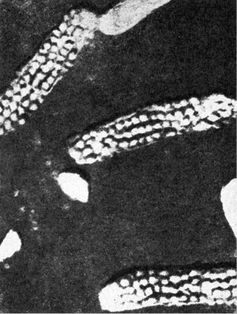
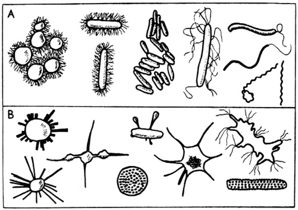
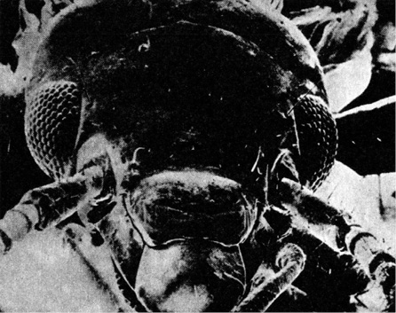

> _Nejzajímavější vlastností života je, že dovede pro sebe využít jak dějů čistě atomárních, tak i dějů makroskopických._

> _V tom je jeho úspěch._

FERDINAND HERČÍK: OD ATOMU K ŽIVOTU, 1946

V předchozí kapitole jsme se přesvědčili, že podle slušně doložených a logických předpokladů soudobé astronomie a zejména kosmogonie máme plné právo předpokládat, že ve vesmíru, dosažitelném našemu pozorování a zkoumání optickými nebo radioastronomickými přístroji, je značný počet planetárních systémů, připouštějících vznik života za podmínek podobných pozemským. Pokusme teď stejně střízlivými a opět co nejlépe dokumentovanými pracovními domněnkami dospět alespoň k rámcové představě, jaké formy by tento mimozemský život mohl mít.

  

Celá řada astronomů a tzv. exobiologů různých původních profesí překonává autory science fiction v míře fantazie, s jakou líčí možnosti a tvary mimozemského života, ačkoli k tomu patrně nejsou důvody. Naše Země je obrovskou laboratoří, poskytující nejrůznější prostředí od horkých pramenů až k ledovým vrcholům velehor, od bezvodých pouští až k hlubinám oceánských příkopů. Vytvořila se zde neuvěřitelně pestrá paleta životních forem, z nichž některé nám k našemu údivu ukázal teprve stereoskan, mikroskop, otevírající brány k fantastickému světu hmyzu a prvoků, tak jak skutečně vypadají.

Není důvod domnívat se, že by chemicky přesně určený nerost krystaloval na planetě vzdáleného slunce v jiné soustavě než na Zemi – odporují tomu fyzikální zákony. Právě tak není důvodu domnívat se, že zkušenosti získané v „laboratoři Země“ nelze zobecňovat pro celý kosmos – ovšem s jistou dávkou opatrnosti.

> Snímek jednoho z nově objevených a tvarově svrchovaně neobvyklých půdních mikroorganismů, pořízený D. I. Nikitinem

> Pro srovnání obvyklé a známé tvary půdních mikroorganismů (A) a některé nové formy objevené D. J. Nikitinem a dalšími (B)

> Teprve stereoskanový mikroskop nám ukázal skutečnou tvarovou rozmanitost pozemské fauny. Hlava škvora, osmdesátkrát zvětšená

Podstatu života lze sotva redukovat tak dalece, aby se biologie rozpustila v chemii, fyzice a dalších pomocných exaktních vědách, zabývajících se makromolekulami, zejména DNK, desoxyribonukleonovou kyselinou. Život zcela jistě není, jak to formuloval např. Müller, jen okrajovým jevem kolem rekombinace a mutace genů, tedy vlastně DKN, a ovšem stejně jistě není, jak tvrdil Schrödinger, řízen molekulami, poslouchajícími zákonů božské kvantové mechaniky. Přesto však i tento svrchovaně složitý jev, vyvíjející se v časové posloupnosti vyšších forem pohybu hmoty, jenž nemůže být beze zbytku vysvětlen zákony, plně platícími pro pohyb nižších forem, připouští i bez nebezpečných zjednodušení rámcové určení, a dokonce předvídání ze svých elementárních stavebních kamenů, nejen pokud jde o složité makromolekuly, ale i, v prvém stupni úvah, o atomy prvků. Z devadesáti dvou přirozených prvků, stavebních kamenů naší Země a celého vesmíru, bylo nalezeno v živých organismech něco přes půl stovky. Všem organismům jsou společné tzv. obligátně biogenní prvky: uhlík, vodík, kyslík, dusík, fosfor, síra, vápník, železo, hořčík a draslík. Kromě nich nacházíme v rostlinách i živočiších ve větším nebo menším množství měď, sodík, křemík, zinek, mangan a některé další prvky jako prvky stopové, pro život významné nebo nezbytné.

Život vznikl nepochybně výběrem vhodných stavebních kamenů, jejich postupnou skladbou ke stále složitějším sloučeninám v procesu komplikace vazeb a funkcí, kdy selekce měla význačnou úlohu. Přesto se však nezdá náhodnou kolerace mezi relativním zastoupením prvků ve vesmíru a jejich účastí na výstavbě bioplazmy. Relativní zastoupení prvků je nám uspokojivě přesně známo díky spolupráci celé řady vědních oborů, geologie a mineralogie, fyziky kosmických paprsků, astrofyziky a v poslední době i kosmonautiky, kritickým rozborem pozorovacích podmínek, pokud možno zbavených pozorovacích a metodických chyb. Kosmogonie zjišťuje tato data zejména ve snaze extrapolovat minulost vesmíru a dospět tak k upřesnění teorií o původu prvků, o nichž jsme se již v minulé kapitole letmo zmínili.

V souvislosti našich úvah je lhostejné, přidržíme-li se hypotézy rovnovážné (Čandrasekar a Heinrich, 1942), opírající se o radio­aktivní rozpady, polyneutronové (Mayer a Teller, 1949), usuzující na vznik těžkých prvků z chladné předhvězdné hmoty, nebo nejnovějších teorií nestacionárních, zastávaných např. Gamowem, kladoucích vznik těžkých a středních prvků do prvé půlhodiny, která při rozpínání vesmíru uplynula od Big Bangu. Závažný je výsledek. Dovoluje vyčíst jisté závislosti, jejichž četnost opravňuje k domněnce, že nejde o náhodu.

Především je nápadné, že průměrný počet atomů daného prvku v jednotce objemu prostoru klesá přímo úměrně s růstem atomového čísla, a to do atomové hmoty 100 zhruba podle geometrické posloupnosti, od atomové váhy 100 pozvolněji a méně výrazně.

Kromě tohoto poklesu s geometrickou řadou pozorujeme i odchylky, z nichž dvě první se netýkají pouze vzniku atomových jader, ale i obecných úvah o skladbě života:

1\. „Železný vrchol“ – tj. výrazné maximum pro atomové hmoty 53–63.

2\. Minimum v oblasti lehkých prvků – daleko rychlejší pokles relativního zastoupení prvků za héliem, než by odpovídalo poklesu s geometrickou řadou. Přímce, odpovídající exponenciální funkci, se čára přibližuje po výrazném zlomu v oblasti uhlíku. Proto jsou uhlík, dusík a kyslík daleko hojněji zastoupeny než lithium, berylium a bór, navzdory nižším atomovým číslům těchto prvků.

Vyškrtněme z našeho přehledu zcela nebiogenní hélium, vznikající v obrovském množství při proton-protonové reakci hvězd prvé generace, jež z této reakce čerpaly energii. Také dnes září hvězdy třetí generace, jejichž matečná látka byla již obohacena těžkými prvky, díky přeměně vodíku v hélium tzv. uhlíko-vodíkovým cyklem.

Zbývají čtyři prvky, které relativní početností ve vesmíru stojí v čele: vodík, uhlík, dusík, kyslík. Ihned za nimi se řadí – jaksi v rozporu s nalezenou pravidelností poklesu logaritmu početnosti se vzrůstem atomového čísla – železo, jako nejvýznamnější prvek katalický.

Je náhodné, že právě těchto pět prvků hraje v biogenezi, ve skladbě nám známé bioplazmy, přední a rozhodující roli? Vysokoškolské učebnice biologie uvádějí většinou jako obligátně biogenní prvky pouze čtyři – na prvním místě fakultativně biogenních železo. Jsem přesvědčen, že nejde o shodu náhodnou, ale o přímou příčinnou vazbu, hrající přinejmenším stejně důležitou roli u kolébky života jako další důvody, jež navrhuje např. Vladimír Úlehla: „Kdo je zvyklý ptát se proč, tu se otázky takové nezdrží. Odpovídat na proč jako skoro vždy lze jen domněnkou: buď že si život vybírá materiál pohyblivý, a proto reaktivnější, jenž dovoluje hráti na všech pochodech životních virtuózní hru, které by nebyly schopny těžkopádné prvky o velké váze atomové; nebo že se život vyvíjel současně, jak vznikaly prvky z těžkých (tuto domněnku však vyvrátila moderní kosmogonie – pozn. aut.), nebo konečně že většina těžkých prvků nevstupuje s hlavními stavebními kameny života, s uhlíkem, dusíkem, vodíkem a kyslíkem, do vazeb tak pestrých jako prvky lehčí.“

Naprostou nezbytnost a elementárnost uhlíku, vodíku, kyslíku a dusíku (k nimž můžeme připočítat fosfor) prokazuje i jejich absolutní nenahraditelnost, nemožnost substituce jakýmkoli jiným prvkem, zatímco např. mnohé rostliny mohou růst, i když nemají sodík, některé organismy (i živočichové – moucha Drosophila) mohou žít bez vápníku. Sodík a draslík, chlor a brom se mohou navzájem často substituovat. Železo je nenahraditelné nejen jako „přenašeč kyslíku“ v krevním barvivu hemoglobinu, ale jako rozhodující součást buněčného enzymu cytochromu, umožňujícího buňkám příjem kyslíku, a tím výměnu látkovou vůbec.

V ojedinělých případech přejímá funkci železa jako přenašeče kyslíku měď – např. u ústřic a chobotnic. Zdá se však, že se tento „pokus“ příliš nevydařil. Modré krevní barvivo, obsahující jako rozhodující složku měď, není schopno přenášet kyslík ani zdaleka tak vydatně jako hemoglobin, a nepředstavuje patrně žádnou výhodu – spíše naopak. Zdá se, že v těchto případech jde o variantu sice slučitelnou se životem a v podmínkách vzniku snad dokonce výhodnou (nedostatek železa? nadbytek mědi?), v dlouhodobých důsledcích však nutně vedoucí ke slepé uličce vývoje.

Chemické vlastnosti základních, plastických biogenních prvků jsou zároveň i vysvětlením otázek, jež si položil Úlehla a s ním i mnozí jiní.

Pro život závažnými charakteristikami uhlíku jsou:

a) jeho malá reaktivita, bránící prudkým reakcím,

b) je schopen slučovat se se všemi biogenními prvky,

c) je schopen tvořit řetězce a kruhová jádra molekul takových rozměrů, že je splněna jedna ze základních podmínek nám známého života – totiž koloidního stavu bioplazmy,

d) všechny valence uhlíku nemusí být nasyceny, což umožňuje vznik sloučenin labilních, snadno reagujících,

e) díky těmto i dalším vlastnostem (izomerie, stereoizomerie) je uhlík schopen vytvářet ze všech ostatních prvků největší počet sloučenin, teoreticky (a patrně i prakticky) milióny,

f) mnohé sloučeniny uhlíku uvolňují při štěpení dostatek energie, aby byla umožněna látková a energetická výměna organismů,

g) asymetrické uspořádání uhlíkových atomů v molekule podmiňuje její optickou aktivitu, jež se zdá být jednou z podmínek života, soudě podle svrchovaně vzácného výskytu symetrických sloučenin a látek opticky neaktivních v bioplazmě.

V celé soustavě prvků je jen jediný prvek, který by mohl v základním modelu živé hmoty, nám známém (to je třeba mít stále na paměti) ze života pozemského, uhlík zastoupit: křemík. Tento prvek je obsažen především v tuhých obalech některých prvoků a řas, v podpůrných tkáních rostlin, v živočišných tělech v málo aktivních orgánech. Jako biogenní prvek se tedy v „pozemském modelu“ života nijak zvlášť neuplatnil, a to ani jako prvek katalytický. Jeho chemické vlastnosti však stále znovu poutají pozornost exobiologů, snažících se přírodě navrhnout svůj vlastní model života, odlišný od života pozemského.

Vycházejíce z obecného asimilačního plánu, jenž je pro všechny pozemské organismy víceméně shodný, navrhují nahradit ve svém modelu uhlík křemíkem, prvkem uhlíku nejpodobnějším, jehož sloučeniny jsou ještě ke všemu – což tito exobiologové neopomenou zdůraznit – chemicky i fyzikálně odolnější než analogické sloučeniny uhlíku. Většinou ovšem opomenou dodat, že tato odolnost je vykoupena nedostatkem vlastností, vypočítaných uhlíku; především neporovnatelně menším množstvím možností, jež spojování křemíkových atomů dovoluje, horšími předpoklady energeticky výhodných štěpných reakcí atd. – to vše bez základní výhody: zbavení se nutnosti koloidního stavu protoplazmy. Tu by takový křemíkový život dosahoval jen v mezní, teoreticky velmi obtížně konstruované skladbě, jejíž stabilita vůči zevním vlivům, zejména termickým, by byla ještě ke všemu patrně daleko nižší než „obyčejného“ života uhlíkového. Zastánci křemíkového života přehlížejí nebo nepovažují za důležité, že se křemík zřejmě neosvědčil jako plastický biogenní prvek pozemského života, což je tím nápadnější, že jeho množství v živých tkáních (v lidském těle např. tvoří křemík toliko 0,0008 % váhy oproti 20,2 % váhy uhlíku) je v příkrém a ze všech biogenních prvků nejnápadnějším nepoměru k obsahu křemíku v zemské kůře – celkem asi 26 % převážně vázaného na SiO2, tvořící 60 % zemského povrchu. Lze tedy předpokládat, že „křemíkový život“ není, ať už geneticky nebo skladebně, pro pozemské a jim podobné podmínky vhodný a že by se mohl uplatňovat nejvýše v podmínkách svým historickým vývojem a současným stavem od podmínek pozemských podstatně odlišných. Rozhodně je nutné odkázat do říše bájí a na stránky science fiction „křemenné bytosti“, podobné pozemským živočichům, nebo dokonce lidem, tedy v makrostruktuře determinovaným týmiž nebo velmi podobnými podmínkami, jako život nám známý, v mikrostruktuře však naprosto odlišným, se zcela odlišným mechanismem dědičnosti, nevázaným kódem složité struktury, představované v každé buňce nám známých forem života obou říší, živočišné i rostlinné, vlákny kyseliny desoxyribonukleové. Tato vlákna, dlouhá v každé lidské buňce asi 50 cm (!) a svou celkovou délkou u jediného člověka tedy spojující šestsetkrát Slunce se Zemí, uchovávají v každé ze šedesáti bilionů lidských tělových buněk zprávy, jež by v binárním systému (podle odhadu dr. Beadlese) zaplnily tisíc svazků slovníkového formátu. Neméně důležitou vlastností DNK je schopnost rozdělit se podélně dosti složitým procesem ve dvě zcela identické molekuly a předat tak bez zkreslení všechny dědičné informace. Fytopaleontologové se domnívají, že takto podmíněné dělení buněk, mitóza, je staré jako buněčný život sám, ba ještě starší, spadající do éry tzv. euka­riontů, předchůdců dnešních řas, z nichž nejstarší byly objeveny roku 1966 v kalifornském Údolí smrti. Již tyto organismy, staré nejméně miliardu let, byly schopné fotosyntetizovat látky, nezbytné k prvotnímu životu, a odštěpovat z vody kyslík pro vyšší vícebuněčné organismy. Žádné sloučeniny křemíku, schopné zajistit tyto funkce, nebyly dosud zjištěny a nelze je ani teoreticky předpokládat.

Mimochodem podotýkám, že představa života, od počátku schopného být životem nazván, a tedy nastupujícího po známých „organizovaných kapkách“, koacervátech akademika A. I. Oparina, konstituovaných na základě informací řetězů DNK, přináší řadu svízelí.

Přesto, že tento problém souvisí s tématem naší knihy jen okrajově, alespoň několik slov o něm: v původní bezkyslíkaté pozemské atmosféře, složené především z molekul H2, H2O, NH3 a CH4 spolu s poměrně značným podílem vzácných interních plynů, vznikaly štěpením vodních molekul jednak kyslík, jednak vodík, unikající do meziplanetárního prostoru. Z vodních a dalších molekul se účinkem slunečního záření, zejména krátkovlnné části spektra a za účasti mohutných elektrických výbojů nepředstavitelných bouří, tvořily první organické sloučeniny. Experimentálně se podařilo tento proces napodobit; výtěžkem byl glycin, alanin a další aminokyseliny i jiné organické látky. A ne v nepodstatném množství: Carl Sagan odhaduje celkovou hmotu takto vytvořených, život předcházejících organických látek za 3 miliardy let (což je dnes nejčastější odhad trvání naší planety před vznikem prvého života) nad každým cm2 povrchu Země na několik kilogramů. Rozpuštěny v moři mohly poskytnout poměrně „výživný bujón“, asi 1 %.

V tomto „bujónu“ se bezpochyby rozvinul život až k formám, podle Ljapunova „kódovaným stavem molekul DNK“ – neboť jinou formu života, jiný model, jiný typ přenosu dědičnosti jsme neobjevili a asi neobjevíme ani v budoucnu. Mohlo k tomu dojít dvěma způsoby: náhodnou shodou okolností, nebo, jak tvrdí marxističtí přírodovědci, v rámci zákonitého zdokonalování a zjemňování materiálního pohybu hmoty až k nejvyšší formě, k životu.

Laboratorní syntéza DNK a RNK (ribonukleové kyseliny, zastávající v buňce jakousi úlohu „pošty“ mezi jadernými strukturami a výkonnými buněčnými organuly, uloženými mimo jádro v cytoplazmě) se zdařila, ovšem v podmínkách, které sotva můžeme v praoceánech očekávat, ačkoli ani to není zcela nemožné vzhledem k obdobím prudkého zvýšení intenzity kosmických paprsků, výbuchům blízkých supernov, výkyvům zemské geotermiky, sopečným výbuchům, záření radioaktivních zemských krbů nebo konečně zásahům tak efektivním, jaké až dosud (a ne se stejným výsledkem) můžeme experimentálně docílit jen nasazením nejmocnějších urychlovačů částic: roku 1963 zaregistrovalo mnoho počítačů kosmických částic a observatoří spršku kosmického záření, vyvolaného jedním jediným atomovým jádrem vodíku, jež k nám přiletělo z kosmu mimo Galaxii, urychleno energií devadesáti trilionů elektronvoltů, tedy miliardkrát větší, než jakou poskytují největší pozemské urychlovače částic…

  

I když předpokládáme nejen obecnou existenci, ale i místní přítomnost potřebných bází, skládajících aminokyseliny, je náhodný vznik „životaschopného života“, tedy života, vybaveného smysluplnou informací, zakódovanou v řetězci DNK, náhodou opravdu výjimečnou, pokud uvažujeme o životě, analogickém jevům, které jako život označujeme.

Nejjednodušší forma nám známého života, představovaná např. velmi primitivními druhy bakterií, obsahuje v buňce alespoň 2000 genů (cystronů), z nichž každý reguluje činnost některého z enzymů. Toto číslo představuje, jak se zdá a jak odpovídá našim dnešním poznatkům, dolní možnou mez; menší počet elementů, řídících enzymatickou činnost buňky, by nebyl slučitelný se životem.

Každý z těchto genů je zakódován asi 1000 „slovy“ – aminokyselinami, z nichž opět každá aminokyselina obsahuje 4 báze. Celkem tedy musíme i v nejjednodušší formě buněčného života předpokládat minimálně 6 000 000 článků aminokyselin, jejichž čtyři báze poskytují

> 46 × 105

možností. Pravděpodobnost, že vznikne taková kombinace, jejíž bezchybnost a dokonalost je podmínkou smysluplné informace, a tím i života, lze tedy vyjádřit poměrem 1 : 4 – za níž následuje milión nul. Takřka nekonečně malá pravděpodobnost samovolného vzniku prostou náhodnou kombinací a rekombinací vynikne, uvědomíme-li si, že od vzniku života na Zemi uběhl počet vteřin, vyjádřitelný číslem s pouhými 13 nulami. Máme však právo domnívat se, že doba, jež uběhla od vytvoření pozemských podmínek snesitelných životu do objevení se prvních primitivních organismů, byla podstatně kratší, ba až neuvěřitelně krátká.

  

Ostatně, abychom zůstali u příměru použitého na jiném místě: ani samovolné vytvoření potřebných enzymů nezajistilo prvotnímu organismu život – nebyly by totiž schopny reprodukce, a velice brzy, v několika minutách, by došlo k vyrovnání energetických hladin, k smrti buňky. Rovněž sama náhodně vytvořená pentle DNK (což je ještě nepravděpodobnější) by byla bezcenná bez substancí, na nichž by mohla rozvíjet svou činnost. Analogicky: i když připustíme náhodný vznik auta protřepáváním kontejneru naplněného nejrozmanitějšími součástkami, nebude toto auto schopno provozu bez silnic, benzínových rafinérií a pump, gumáren, vyrábějících pneumatiky, atd.

Může se ovšem vyskytnout námitka, že prvotní život byl jednodušší než dnes známý, že informace, potřebné k jeho zachování a pokračování, byly podstatně skromnější, ba že snad představoval jakýsi předstupeň na daleko prostších principech. Tuto námitku nelze zatím zásadně vyvrátit – všechny naše vědomosti ji však popírají. Jednota kódového systému veškerého života naší Země s jeho nespočetnými variacemi a morfologickou pestrostí nás nutí k myšlence, že se vyvinul ze společného základu, založeného na jednotném principu enzymatické koordinace a korelace řetězci nukleových kyselin, jejichž maximální jednoduchost je limitní a představuje i tak vysoce složitý aparát. Použijeme-li naposled již dost přetíženého příměru: i nejstarší dědeček automobil vznikl jako složitý výrobek s koly, řízením, pístovým motorem, brzdami, rozvodem atd. atd. a jen takto, dialektickým kvalitativním zvratem, jej můžeme pochopit a odvodit dnešní typy. S koloběžkou či drezínou jeví jistou „podobnost“ – nic víc.

Nelze než souhlasit s vědci, kteří prohlašovali, že biosyntéza, vznik živého organismu (dnes by patrně mluvili skromněji o syntéze makromolekuly DNK nebo viru), náhodně ze směsi organických sloučenin, je asi stejně málo pravděpodobná jako vznik nikoli automobilu, ale přesně jdoucích hodinek, potřepáváme-li pytlíkem, naplněným všemožnými součástkami, pery, kolečky a šroubky. Tím dokazovali podle vlastního světového názoru buď nezbytnost zásahu nadpřirozené, paravědecké vůle, nebo tendenci neživých soustav k ustavičnému zdokonalování, tedy proces opačný obecně uznávanému poklesu míry organizovanosti a zvyšování entropie.

„Potřásání pytlíkem“ se ovšem odehrávalo nejméně po celou miliardu let v nespočetných kapkách světového praoceánu v každém okamžiku, v každém zlomku vteřiny, kdy byl roztok organických sloučenin vystaven nejrůznějším chemickým a fyzikálním vlivům.

Země kromě toho nemusela „třepat pytlíkem“ nekonečně. Všechno nasvědčuje tomu, že první vzniklý dokonalý stroj byl zároveň strojem posledním, který zabránil jakémukoli dalšímu „třepání pytlíkem“ jednou provždy. Budoucnost, schopná zakódovat do řeči počítacího stroje obrovské množství časových, chemických, fyzikálních i dalších faktorů vzniku života na Zemi, budoucnost, jež pozná a popíše všechny součástky v „pytlíku“, nalezne snad i řádovou shodu mezi dobou, jež uplynula na Zemi od jejího vzniku až k objevení se života, a počtem pravděpodobnosti, předvídajícím tuto možnost, měnící se s přibýváním času v jistotu.

Poslední potřebný důkaz, skvěle potvrzující materialistický světový názor v biologii, totiž syntéza života, živých organismů, byl podán kolektivem Arthura Kornberga, amerického biologa, odměněného roku 1959 Nobelovou cenou. Jeho práce vyvrcholila roku 1967 biosyntézou jednoduchého viru fí X 174 z 5500 nukleotidů ve čtyřech skupinách, seřazených v přesně určeném rozsahu a pořadí. Umělý virus, na jehož biosyntéze měl rozhodující podíl Kornbergův objev polymerázy DNK, schopné uskutečnit stavbu molekuly DNK v přesných proporcích, se chová naprosto totožně jako virus přírodní: vniká do baktérií, rozmnožuje se v nich a posléze je ničí. Kornbergova biosyntéza prokázala s konečnou platností neplodnost idealistických názorů na vznik života i na účelnost – sám Kornberg to vyjádřil velice precizně: V oblasti biologického průzkumu je jen jedno vědecky únosné stanovisko, totiž předpokládat, že příroda nemá cíl.

Laboratorní syntéza viru fí X 174 mimo jiné upřesnila naše znalosti o „součástkách, jež musí být obsaženy v pytlíku“ – jsou to proteiny, hlavní složka buňky, jež se však samy nemohou reprodukovat, nukleinové kyseliny, jež jim to jako nositelky dědičnosti umožňují, a konečně proteiny charakteru enzymů, jejichž katalyzační činnost spíná celý podivuhodný cyklus prvotního vzniku života.

Jistě – bylo třeba nesčetných opakování a mimořádné „náhody“ (která není ničím jiným, než mírou možnosti); ale což není takových podivuhodných shod okolností kolem nás celá řada? Jsem si vědom nepřiměřenosti tohoto přirovnání, přesto si je však nemohu pro jistou plastičnost odpustit: Plinius Starší v 37. díle své Historia Naturalis vypráví o leštěném achátu, jenž byl majetkem krále Pyrrha. Zobrazoval „bez zásahu umění“ Apollóna s lyrou v ruce v doprovodu devíti Múz, třímajících sobě vlastní atributy. Achát byl zdrojem četných úvah; v 16. století se domnívá Cardano, že jde o zkamenělý obraz, o století později tvrdí Richelieuův knihovník Caffarel, že je „spontánním zázrakem“…

Kolik tisíců nebo statisíců „bitů“ se spojilo v optimálním pořadí, aby poskytly při zpracování achátu, vyžadujícím další tisíce náhodných „bitů“ v hloubce řezu, jeho směru atd. atd., vznik – pouhé kamenné hříčky přírody?

Podmínky, „součástky“ ovšem musely být dány. Mohli bychom protřepávat pytlík hodinářských dílců celou věčnost, aniž bychom stvořili myš. Mohli bychom celou věčnost působit na „bujón“ pramoří nejrůznějšími druhy energií, aniž bychom získali hodinky. Je to další důkaz, že život je přiměřený zcela základním okolnostem svého vzniku, jež se, jak víme, patrně vztahují i na mnoho těles mimozemských.

Zbývá vysvětlit, proč první „stroj“ života byl zároveň „strojem“ posledním, železným dogmatem, jen velmi pomalu v rytmu miliónů let obměňovaným a zdokonalovaným.

Jeden jediný pár much by za ideálních podmínek produkoval takové množství potomků a prapotomků, že by za několik měsíců jejich váha překročila váhu Země. Totéž – za poněkud delší dobu – by dokázala jediná bez překážek se množící baktérie.

Stejně tomu bylo při vzniku života. První chuchvaleček „vysoce stabilní hmoty“ využívající k vypracování záchovných reakcí informace, jež obdržel po dlouhém bezvýsledném „protřepávání pytlíkem“ darem v podobě molekuly DNK, se pojednou ocitl v živné polévce obrovského oceánu, jakoby připravené pro něj. Miliardkrát, biliónkrát již shoda okolností vytvořila „stroje“ podobné jemu – ale s nepatrnými závadami, bránícími chodu. Pokud se nerozložily, nezahynuly – a lze mluvit o hynutí tam, kde nemůžeme použít slova „život“? – byly nesčíslným potomkům prvého dokonalého „stroje“ vítanou potravou, přinášející látky na vyšší energetické úrovni a urychlující tak příboj života, jenž se jako vlna tsunami hnal světovým oceánem.

Naprosto stejná situace nastala, byl-li vývoj života výsledkem zákonitého procesu zjemňování pohybu hmoty a postupoval-li přes Oparinovy koacerváty od postupného vytváření složitých bílkovinných struktur až k makromolekulám DNK. I v tomto případě se, jak se zdá, uplatnila rozhodujícím způsobem první makromolekula, schopná dokonale splnit své poslání – kódovat informaci a zároveň předávat kód rozdělením ve dvě shodné molekuly.

Rozdíl oproti prvému způsobu by byl především v akumulaci prvotní životní energie tohoto prvotního života. Zatímco by se v prvém případě dělící se organismy musely spokojit s tím, co poskytoval živný „bujón“ praoceánu, ve druhém případě by se patrně tento prvotní organismus setkával na každém kroku s výsledky zpola dokončené biosyntézy, poskytující jeho dceřiným buňkám nesrovnatelně vydatnější asimilační možnosti a – pravděpodobně – i účinnější základní impuls k dalšímu vývoji rozmnožením v daleko větší míře, než předpokládá náhoda, a tím ke statistickému zvýšení možnosti účelných, progresivních mutací a dalších genetických změn.

Hlavním argumentem pro vznik života z jednoho jediného centra, z jediného „praotce“ tvaru nitkovité makromolekuly, obklopené chuchvalečkem koloidní hmoty, jsou jisté zvláštnosti, jejichž dědici jsme i my v každé tělové buňce, – především očividná přednost, která je při skladbě živé hmoty bez zřejmých důvodů dávána látkám opticky aktivním, zejména levotočivým. Opticky neaktivní nebo pravotočivé látky nejsou obvykle asimilovány, nejsou používány jako stavební kameny, a leckdy jsou dokonce neúčinné i jako léky – mnozí si snad vzpomenou, jak jejich pedantický kantor chemie dbal při odpovědi na skladbu vitamínu C, že je to kyselina l-askorbová, ačkoli se písmenko l zdálo být zbytečností. Nebylo. Je možno zemřít kurdějemi uprostřed hromad kyseliny d-askorbové.

Tuto vybíravost živé hmoty se až dosud nepodařilo uspokojivě vysvětlit. Pravda, obvykle rovnovážnou směs „pravých“ a „levých“ látek lze ovlivnit ve smyslu převahy té nebo oné složky vlivem polarizovaného světla – jenže sluneční světlo není polarizováno a polarizované světlo Měsíce sotva biosyntézu ovlivnilo. (Nebo snad ano? Za prozkoumání by to snad stálo.) Nejpřijatelnější a zároveň nejjednodušší domněnkou se dnes zdá být, že prvotní řetězec DNK byl z dosud nepoznaných příčin – mohla to být např. syntéza na povrchu opticky aktivního krystalu, jak navrhl John Bernal – složen z levotočivých komponent a toto složení předal jako příkaz, značně komplikující látkovou výměnou, všem dceřiným organismům nebo makromolekulám. Stejně nevyřešenou otázkou dosud je, proč si „živé“ bílkoviny vybraly jen malou část asi ze stovky známých aminokyselin, zatímco zbytek odmítají. Možná že věda dříve nebo později objeví závažné kauzální vztahy mezi složením jednotlivých aminokyselin a jejich schopností stát se stavebními kameny živé hmoty. Až dosud nejschůdnějším vysvětlením se zdá, svést to na pradědečka, který prostě z těchto aminokyselin v prvním vláknu DNK vznikl a konzervativně na nich lpí, nemoha jinak.

Existuje ovšem i třetí možnost vzniku života na naší planetě: podle této dnes rozvinuté a do řady pracovních domněnek rozvětvené hypotézy panspermie by byl praoceán jakousi ideální sterilní živnou půdou, do níž byly zaneseny zárodky života, spory nebo mikroorganismy, z vesmíru. Zde se rozmnožily, mutovaly a posléze daly vznik pozemské flóře a fauně od prařasy či jakési prabaktérie až k člověku. Tuto domněnku vyslovil už roku 1907 švédský chemik Svante Arrhenius (a dávno před ním, což se zapomíná, Buffon), který se domníval, že zárodky života jsou schopné překonávat mráz i vakuum kosmického prostoru a cestovat mezi hvězdnými systémy, jsouce vypuzovány tlakem světelných paprsků. Možnost takového cestování dokázal v poslední době teoreticky Carl Sagan, jenž dovodil možnou velikost těchto zárodků, řádově odpovídající pozemským sporám a virům (0,2–0,6 u), a vypočítal jakýsi „jízdní řád“: od Země k Marsu několik týdnů, k oběžné dráze Neptuna několik let, k nejbližším hvězdám několik desítek tisíců let atd. Sám však o možnosti panspermie pochybuje vzhledem k ničivosti pronikavého záření, s nímž by se částice setkávaly a jež by nezbytně zničilo všechny známé formy odpovídajících organismů pozemských. Mohutnou podporu dostala myšlenka panspermie v poněkud upravené poloze pracemi Clause a Nagyho o „organizovaných částicích“, nalezených v meteoritech-chondritech.

Domnívám se – např. na rozdíl od velmi objektivního a opatrného J. S. Šklovského –, že tyto práce jsou dokumentovány solidně a že „organizované částice“, dokonce pojmenované Clausisphaera fissa, Coelestites sexangulatus atp., morfologicky dosti podobné pozemským řasám a prvokům, jsou opravdu fosilizovanými zbytky života na planetě, jejíž roztříštěné zbytky poskytly materiál pásu planetek a rojům meteoritů (na rozdíl od vždy originálního Bernala, jenž je považoval za otisky spor, potulujících se vesmírem).

Pro Oparinovu a Haldaneovu hypotézu o obecném vzniku života ve vesmíru chemickým vývojem se zdají svědčit i výsledky oddělení pro exobiologii Ames Research Center (NASA) o průkazu mimozemských aminokyselin a uhlovodíků v meteoritu Murchinson. Meteor, uhlíkatý chondrit, jenž dopadl v jihovýchodní Austrálii, byl dodán do laboratoře NASA a extrakt z 10 gramů byl analyzován nejpřesnějšími chromatografickými metodami. Prokázaly asi 15 mikrogramů aminokyselin v každém gramu vzorku: glycin, alanin, glutamovou kyselinu, valin a prolin, jež jsou běžně přítomny v pozemských organismech, kromě nich však i 2-metylalanin a sarkosin, které součástí pozemských biologických systémů nebývají, což silně ukazuje na nepozemský původ. Tento předpoklad byl posílen téměř úplnou nepřítomností serinu, jenž je díky potu nejhojněji zastoupen v otiscích prstů a při kontaminaci neopatrnou manipulací by se určitě objevil, jakož i rovnoměrné zastoupení levotočivých a pravotočivých složek, získaných esterifikací. Zatímco tyto deriváty aminokyselin z pozemských organismů jsou, jak víme, vesměs levotočivé, byly získané deriváty směsí látek pravotočivých a levotočivých v přibližně stejném množství – což ovšem nemusí nic znamenat. V nedávné době bylo totiž při průzkumu aminokyselin v horních vrstvách sedimentu mořského dna zjištěno, že část molekul, zprvu díky svému organickému vzniku vesměs s l-konfigurací, se po čase promění v pravotočivé, až vznikne opticky neúčinná směs obou složek, tzv. racemát. Tento poznatek byl prověřen i studiem fosilií, na nichž byla zjištěna doba trvání kompletní racemizace – obnáší asi 15 miliónů let. Od miocénu dále do minulosti nemůžeme tedy využít poměru l- a d-forem molekul jako pomocné datovací metody – po této době ukazují výpočty (předpokládající znalost průměrné teploty prostředí, v němž se zkoumaný objekt nacházel) znamenitou shodu s datováním jinými metodami, např. paleomagnetickým měřením apod.

Rovněž poměr izotopů uhlíku C13 a C12 se zcela jasně lišil od poměru, nacházeného v pozemských organických látkách.

Zdá se nepochybné, že organické sloučeniny byly v meteoritu již před dopadem na Zem. Odpověď na otázku, jež se sama vnucuje, totiž zda jsou tyto organické sloučeniny produktem života, např. „organizovaných částic“ Clause a Nagyho, nebo dokonce vyšších organismů, není možno jednoznačně dát. Některé detailnější výsledky zkoumání (nález alifatických uhlovodíků, jejichž spektrum se nápadně podobá spektru uhlovodíků, vznikajících výbojem v metanové atmosféře atd.) svědčí spíše pro vznik anorganickými pochody – nicméně je to důkaz, že předchůdci života, jeho „ubytovatelé“, se objevují už v intergalaktickém prostoru (kyselina mravenčí, formaldehyd, čpavek, voda atd.) i na planetách „nesličných a pustých“, aby nedočkavě připravovali vítěznou cestu životu.

Tímto pohledem na tendenci hmoty vyvíjet se k životu se fyzikálně blížíme filozofické koncepci Giordana Bruna, oživující v rozličné míře celý vesmír. Jeho názory, považované ještě nedávno za osamocený názorový exces, sdíleli ovšem i mnozí renesanční filozofové a přírodovědci – Marsilio Ficino, Filip Aureol, Theophrastus Bombastus Paracelsus, Hieronymus Cardanus a další, zpěčující se aristotelské koncepci pasívního pojetí hmoty. Z hlediska vývoje přírodovědy to byl nesmírně významný přínos.

Jestliže dnes, nejsouce zainteresovanými odborníky, přijímáme tato zjištění jen s mírným zájmem, je to důkaz, jak daleko se lidské představy o přírodě vzdálily nejen od všenáboženského aktu stvoření, ale i od „životní síly“, vis vitalis, jež nastoupila počátkem minulého století jako náhrada za boha, jemuž byly v přírodovědě sice uctivě, ale rozhodně ukázány dveře. Ještě roku 1827 píše jeden z největších chemiků Jöns Jakob Berzelius (1779–1848) ve své učebnici organické chemie: „Umění, ať jakkoli velké, nedokáže spojovat prvky neorganické přírody tak, jak je spojuje příroda živá; pokusy můžeme vytvořit jen některé sloučeniny a spojení podobných prvků.“

Ke cti Berzeliově nutno říci, že jako každý vědec, jenž si zaslouží tento titul, dovedl uznat chybu. Již za rok píše svému žáku Friedrichu Wöhlerovi blahopřání k epochální syntéze močoviny, první organické látky, vyrobené laboratorní cestou z anorganických výchozích chemikálií: „… Objevil jste cosi, co učiní vaše jméno nesmrtelným. Hliník a umělá močovina, dvě tak kvalitou odlišné věci, objevené krátce po sobě, budou, vážený pane, drahokamy, zdobící váš vavřínový věnec…“

V každém případě je svrchovaně pravděpodobné, že – ať již se pradědeček s prvním vláknem DNK objevil na této planetě jakkoli – byla v tomto okamžiku spuštěna pružina života, jediného, prvotním řetězcem DNK kódovaného. Pro naše úvahy je lhostejné, zda se tato makromolekula vyvinula jako výsledek „protřepávání pytlíku“ zákonným vývojem podle dosud nepoznaných pravidel, nebo zda byla zanesena z vesmíru. Vedle ní neobstál a nevyvinul se – nechceme-li již použít kategoričtějšího „nevznikl“ – na naší Zemi život podle žádného jiného modelu.

Důvod je nabíledni: vznikl-li první zárodek živé hmoty na Zemi jako výsledek téměř nepředstavitelné, statisticky však nutně pří­pustné náhodné kombinace, nebo byl-li přinesen z vesmíru s frekvencí pravděpodobnosti takového „importu“, kterou Sagan odhaduje (a nejsem si jist, zda ne vzhledem k poznané chronologii vývoje naší planety) na jeden zárodek za miliardu let, což skvěle odpovídá zjištěným faktům, měl v obou případech dost a dost času, patrně milióny let, „okupovat“ biogenní prostředky planety, rozmnožit se, vniknout genetickými změnami, jimž přispívalo rozdílné prostředí, v němž se praorganismy nalézaly díky konvektivnímu proudění oceánu, stykem s minerály, rozličným klimatem atd., do všech ekologických „výklenků“ prvotního oceánu. A co hlavního, spotřebovat pro sebe podstatnou část organických sloučenin. „Živný bujón“ se změnil v „akvárium“, poskytující případným dalším zárodkům s odlišně zakódovaným principem života ve vláknu DNK podstatně horší podmínky, ne-li přímo takový vznik vylučující. Nehledě ovšem na okolnost, že by takový nový, novorozený život patrně okamžitě posloužil „starousedlickému“, lépe přizpůsobenému a lépe vybavenému, jako potrava.

V případě, že by vznik života byl výsledkem zákonitého vývoje hmoty, musíme, ač je to v porovnání miliardy let (nejméně), potřebné k jeho vzniku, a snad stovkám nebo tisícům let, nutným k jeho rozšíření a stabilizaci, velmi nepravděpodobné, počítat i se střetnutím rozličných životních kódů; v nich obstál náš statečný pradědeček, navzdory jisté vybíravosti ve volbě aminokyselin a podivínskému handicapu, pokud jde o optickou aktivitu skladebných látek, kterou tak kategoricky odkázal všemu potomstvu. Život jiných kódů prostě zmizel, a pokud existoval, nepodařilo se nám ho nalézt ani v nejstarších náplavech.

Všechny tři možnosti podporují domněnku (a obzvláště silným argumentem je morfologická podobnost fosilizovaných mikroorganismů v chondritech s organismy pozemskými), že náš typ života je typem výběrovým, za daných okolností víceméně optimálním, vycházejícím z podmínek, jaké můžeme očekávat v celém vesmíru na planetách hvězd téže spektrální třídy jako Slunce a kroužících v přibližně stejné vzdálenosti od své hvězdy.

Zdůrazňuji to především proto, že nevyvinul-li se z pochopitelných a popsaných důvodů na Zemi život „konkurenčního“ kódu DNK, byly tu daleko příznivější (teoreticky) podmínky pro vznik paralelních životů zcela odlišných, jež by jednak využívaly základních stavebních kamenů bílkovinným životem opomíjených (křemenný život), jednak by znamenitě prosperovaly z katabolitů bílkovinných organismů a z produktů jejich rozkladu. Mám na mysli další navrhovanou „konstrukci“ života, jejímž autorem je V. A. Firsov a Carl Sagan a o jejíž reálnosti pro planety typu Jupitera uvažuje i Šklovskij, i když připouští, že by to byly „velmi svérázné živé organismy, radikálně se lišící od pozemských“.

V. A. Firsov si představoval tento zvláštní typ života na základě látkové výměny organismů, dýchajících místo kyslíku dusík a v tělových tekutinách chovajících místo vody čpavek. Svou teorii – doložeností a uzavřeností jde skutečně spíše o teorii než o pouhou hypotézu – zakládá na možnosti nahradit v organických sloučeninách ion O’ aminovou skupinou NH, a hydroxyl OH⁻ aniontem NH2⁻. Dochází k hypotetickým sloučeninám: např. kyselinu mravenčí HCOOH nahrazuje sloučeninou NCNHNH2 atd., dokonce až k „čpavkovým“ analogiím nejsložitějších organických látek typu DNK a RNK. Konečným produktem životních pochodů takového života by byly místo vody čpavek a kyan.

Podobné konstrukce, založené na pouhé substituci jedněch základních kamenů života druhými – v tomto případě kyslíku dusíkem – při zachování základního schématu nám známého bílko­vinného života, jsou sice pro badatele užitečnou duševní kulturistikou, patrně však nemohou sloužit jako východisko dalších úvah. Nelze opomíjet základní podmínku života, látkovou výměnu, jejímiž určujícími chemickými procesy jsou oxidace a redukce. A v těchto cyklech je kyslík nejen z hlediska biologického, ale i chemického naprosto nenahraditelný jakýmkoli jiným prvkem, o značně netečném dusíku ani nemluvě.

Zejména z energického hlediska nelze klást rovnítko mezi oxi­daci a slučování s velmi netečným dusíkem, byť by i chemické vzorce valenčně odpovídaly. Dalším z nesčetných úskalí Firsovovy teorie je značná alkalita čpavku, neslučující se s koloidním stavem podstatných součástí bioplazmy, velmi jemně oscilující v nejvýznamnějších životních pochodech kolem středních hodnot ph 7. A konečně voda není tak docela „obyčejnou“ tekutinou jenom proto, že teče z kdejakého vodovodního kohoutku, a nemůže být nahrazena ničím „exkluzivnějším“, ani čpavkem, navzdory jeho dosti vysokému bodu tání i varu, vysokému měrnému teplu, značné dielektrické konstantě i slušné rozpustnosti. Ve všech těchto parametrech ostatně čpavek, posuzujeme-li jej z hlediska biologicky žádoucích vlastností pro známé nám typy života, za vodou zaostává.

Jak po stránce fyzikální, tak po stránce biologické je voda jednou z nejzajímavějších a dosud, ač je to podivné, z nejtajuplnějších chemických sloučenin vůbec. Řadu jejích vlastností dosud nedovedeme uspokojivě vysvětlit.

Nenechme se mýlit jednoduchým chemickým vzorcem, který stojí patrně na počátku chemických znalostí každého z nás. Vodík má tři izotopy (hydrogenium – deuterium – tritium) – rovněž tak kyslík. Voda je tedy vlastně směsí 42 látek, vzniklých slučováním tří izotopů vodíku s třemi izotopy kyslíku.

Voda je rozličného stáří – některá se již na zemském povrchu „zabydlela“ celé dlouhé miliardy let, jiná, tzv. juvenilní, chrlená v množství asi 40 miliónů tun ročně spolu s lávou jícny sopek, je velmi mladá.

Nejzajímavější jsou, však její anomálie, jež jsou – např. Igorem Akimuškinem – považovány za neoddělitelnou příčinu vzniku života.

První takovou anomálií je mimořádná tepelná jímavost, desetinásobně převyšující tepelnou jímavost železa, což brání podchlazení nebo přehřátí mořské líhně všeho života.

Druhou anomálií je ze všech známých minerálů nejvyšší výparná a skupenská teplota, což podmiňuje pomalé vypařování i za největšího žáru a zachraňuje před vyschnutím nesčetné vodní nádrže.

Další zvláštností je rozpínání objemu vody při změně v led a – jak poznamenává sovětský oceánolog V. G. Bogorov – to umožňuje vznik „kožichu“, zahřívajícího mořskou faunu v polárních mořích.

Čtvrtou podivuhodnou vlastností vody je její smršťování při ochlazování, které – na rozdíl od ostatních podobných látek – končí při +4 °C. Od této hranice se při dalším ochlazování voda opět rozpíná. Tato zdánlivě pramálo senzační anomálie má velmi praktický důsledek: zachraňuje život sladkovodním živočichům a rostlinám, přežívajícím zimu v nezamrzající vrstvě této nejhustší, a proto ke dnu klesající 4 °C teplé vody.

Voda má ze všech kapalin kromě rtuti největší povrchové napětí – sloupec chemicky absolutně čisté vody o průměru 3 cm je možné přetrhnout toliko závažím těžším nežli 100 tun. Tato vlastnost umožňuje vodoměrkám rejdit po hladině. Poněkud důležitější je však pro rostlinnou říši – povrchové napětí je totiž přímo úměrné kapilární vzlínavosti a bez kapilární vzlínavosti vody by kořeny rostlin marně pátraly po vláze, dávno ztracené gravitačním poklesem vody v hlubinách Země.

Poslední anomálií je konečně mocná rozpouštěcí schopnost vody při vlastní chemické netečnosti – právě díky této vlastnosti, diametrálně odlišné např. od vlastností amoniaku, se patrně stala kolébkou a nositelem života.

Upozorňuje na to např. Jacques Ménétriér, prohlašující, že ve vodě jsou za přítomnosti jistých urychlovačů rozpustné prakticky všechny kovy, jejichž nezbytná přítomnost jako stopových prvků, katalyzátorů, není u kolébky života vyloučena. Voda prý dokonce může vytvářet chemické sloučeniny, hydráty, i s netečnými atmosférickými plyny jako héliem, argonem a dalšími.

Moderní radiochemie tyto naděje nevyvrací; ionizující záření vodu toliko rozkládá na radikály OH⁻, kombinující se po dvou v molekulu peroxidu vodíku H2O2, a radikály H⁺, kombinující se v molekulu vodíku H2. V čisté vodě se ionizací vzniklé produkty za velmi krátký čas spojují opět v molekuly vody – jsou-li však přítomny látky schopné s radikály reagovat, mohou vzniknout další látky, například chemicky velmi účinný a stálejší radikál HO2, je-li ve vodě rozpuštěn kyslík. Jsou-li ve vodním prostředí (buňce) organické látky, zachycují radikály, přičemž vznikají poměrně stálé organické peroxidy.

Tyto procesy se patrně význačnou měrou spoluúčastnily při vzniku života a hrají dodnes velkou roli v řešení otázek radiobio­logie. Není vyloučeno, že za stopové příměsi jistých prvků může voda vystavená ionizujícímu záření opravdu nabýt překvapujících vlastností.

Obrovskou výhodou vody je ovšem i její relativní dostatek – spolu s polárními ledovci pokrývá voda nejméně ¾ povrchu Země – samotné vody mimo ledovce a oceány, tedy vody převážně sladké, povrchové i spodní, je asi 4320 triliónů m3. Při srážkách každoročně spadne na povrch naší planety 96 bilionů m3 vody, z nichž třetina odtéká řekami, mrzne nebo se ztrácí v podzemí, zbylé dvě třetiny zajišťují existenci rostlinné i živočišné říše na souších.

Tím vším není řečeno, že voda je základem života – i když váhově představuje převažující látku nám známých živých organismů – byla však předpokladem jeho vzniku spolu s jinými jednoduchými chemickými látkami a nezdá se, že by mohla být jakkoli a čímkoli zastoupena.

Tato skutečnost zůstává plně v platnosti i tehdy, bude-li prokázáno Osbornovo tvrzení (F. Osborn: Origin and Evolution of Life – Původ a vývoj života, 1930) o vzniku života ne v oceánech, ale pouze ve vlhkém prostředí, snad dokonce jen v mělkých kalužích a za spoluúčasti vulkanických výparů, dodávajících dusík.

Jak se zkrátka zdá, křemenné bytosti podobné Golemovi Vysokého Rabbiho Löwa Jehudy ben Becalela i štiplavě páchnoucí „amoniakální“ tvory můžeme dobrým právem poctivé argumentace vyřadit z našich úvah. Pokud by se život vyvinul v podmínkách, podobných vývojově i současným stavem podmínkám pozemským, a to v jejich poměrně značně širokém rozsahu (nezapomeňme na mikroorganismy v horských termálních pramenech i v polárních mořích, na baktérie v chladicí vodě reaktorů, na vyplnění všech ekologických výklenků naší planety…), byl by patrně v celém vesmíru životem bílkovinným, koloidním, „uhlíkovým“ a „vodním“, a to i v hranicích fyzikálních podmínek, připouštějících ryze teoreticky vznik „modelů“ jiných.

Otázkou je, zda a jak by se rozvíjel život v podmínkách zcela nepodobných, případně těžko představitelných.

Camille Flammarion, autor kdysi nesmírně populární knihy O mnohosti světů obydlených, je ochoten věřit i v „ohnivé“ a „plynné“ bytosti na hvězdách a hvězdám blízkých planetách, Carl Sagan z Harvardské univerzity považuje za zcela možné, že v husté atmosféře Jupitera existují organismy, připomínající „stabilní plynové koule“, plovoucí v různých úrovních a lovící podobné drobnější plynné bytosti „jako velryby plankton“. Předpokládá i planety se zcela neprůhlednou atmosférou a na nich bytosti s „magnetickýma očima“. Průměr těchto „očí“, mají-li být řádově stejně účinné jako lidský zrak, by byl podle Sagana… nejméně 700 metrů.

Tyto a jiné předpoklady může s konečnou platností potvrdit nebo zavrhnout patrně pouze kosmonautika. Otázkou, kterou si můžeme však klást již dnes, nepochybně je, do jaké míry jsme oprávněni nazývat takové útvary životem, a za druhé – to zejména – zda může styk s takovými projevy organizované hmoty umožnit společnou komunikační rovinu, a tím i – jak se obvykle v jásavém optimismu shodují vědeckofantastické romány – oboustranný zisk.

Odpověď na první otázku je těžší, než by se patrně nebiologovi zdálo: přes veškeré úsilí nebyla dosud formulována obecná definice života, jež by byla schopna vystihnout alespoň nám známé formy a projevy bílkovinného života pozemského; tím méně ovšem smíme doufat v definici ještě obecnější.

Některé definice svědčí spíše o literárním důvtipu autorů: život je choroba hmoty (Němec), život je předivo z elektronů a pozitronů (Gaskellová), život je tvoření (Claude Bernard). Jiné jsou tautolo­giemi, zatíženými pojmy, jež mají vysvětlovat, nebo jejich protějšky: život je rozdíl mezi člověkem a mrtvolou (Reinke), život je souhrn sil, odporujících smrti (Bichat), život je zvláštní útvar pohybu molekul, jehož variacemi jsou všechny životní projevy (Rawitz), život je cyklický vývoj fyzikálně chemické energie na hmotě, která se tím stává protoplazmou (Laurent). Mnohé definice vystihují jen část – a to ne vždy nejpodstatnější – celé složité problematiky: život je schopnost těles být podrážděna podněty (Brown), život je soustava, v níž je hmota ve stavu vypjatém (Mathews), živý organismus je soustavou nepřetržité řady účinků a protiúčinků, jež se odehrávají podle dynamických zákonů, ovládajících transport a přeměnu energie (Osborne). Konečně existují i definice, které se nám zdají být příliš širokými i pro vesmírné měřítko, např.: život je stálé přizpůsobování vnitřních vztahů vnějším vztahům (Spencer).

Ostatně celá řada umělých objektů (nemluvě už o kybernetických přístrojích) dosahuje plné shody s některými definicemi, ačkoli nejsou ani pokusem o biosyntézu, jen podnětem k zamyšlení. Ultramikroskopické kapénky kyseliny paraazoskořičné se v rozmezí 170 až 180 °C – tedy při teplotách nepřipouštějících bílkovinný život – chovají obdivuhodně „živě“, rostou, dělí se a pohybují rytmickými stahy. Stejně podivuhodné jsou umělé améby-měňavky Bütschliho z olivového oleje a uhličitanu draselného nebo Rhumb­lerovy z chloroformu v šelaku. Lezou, vytvářejí panožky, a dokonce „tráví“ nebo vyvrhují vlákna podle jejich „stravitelnosti“, natáčejí se a pohybují ke světlu.

Podobně se chovají tzv. myelinová vlákna, objevená Wirchovem v preparátech rozmačkané míšní tkáně, bohaté myelinem. Známé jsou v této souvislosti i Seddigovy útvary, fototropičtí rtuťoví červíci, rostoucí na zředěné kyselině dusičné, i Královy útvary, pomalu rostoucí na krápnících v Novém Mexiku a ve slovenské Demänové. A nejpodivuhodnější ze všech, útvary Morávkovy, vyrůstající z roztoku želatiny, dusičnanu olovnatého a destilované vody v podobě dutých látek s mohutným prouděním látek od základny ke hrotu. Tato vlákna rostou, zachovávají navzdory naklánění zkumavky nebo překážkám původně zaujatý směr, jsou citlivá na světlo určité vlnové délky, zastavují se v růstu po podráždění dotekem a po dosažení určité délky bez ohledu na stupeň vyčerpanosti „živného“ roztoku.

Nuže – kde je hranice těchto podivuhodných artefaktů a „plynových“ či „ohnivých“ bytostí? A snad lépe řečeno: kde je rozdíl, který jsme schopni my, bílkovinné, uhlíkové bytosti, postihnout jako podstatný a rozhodující? Tak jako nám navždy zůstane cizí skladba a metabolické pochody těchto zvláštních, cizích forem života (existují-li ovšem), tak – a ještě více – nám musí zůstat utajeny jejich duševní pochody (mají-li jaké). Jsem hluboce přesvědčen, že komunikace mezi dvěma tak zásadně odlišnými systémy je tak obtížná, že se její pravděpodobnost rovná nule. Dosud se nám nepodařilo uspokojivě komunikovat ani s delfíny, kteří jsou nám fyziologicky, geneticky, a smím-li to tak nazvat, svou životní problematikou neskonale bližší. Zanechme tedy raději, jak praví Dante, vší naděje. Nebudeme alespoň zklamáni.

Neodmítáme možnost zcela odlišného, nebílkovinného života. Nové odvětví elektroniky, moletronika, prokázalo, že mikrominiaturizace elektronických součástek může dojít až k molekulám, zastávajícím dokonce funkce celých bloků, dnes ještě sestavovaných z řady rozličných dílů. Můžeme-li, alespoň teoreticky, sestavit takový molekulární přijímač nebo vysílač, nelze vyloučit ani další možnosti, organizovanou krystalickou, molekulární a atomární strukturu vyššího řádu, jevící vlastnosti zásadně odlišné od neživé přírody, které bychom volky nevolky museli přiznat jakýsi zcela zvláštní, osobitý a pro nás pravděpodobně nesledovatelný život Nejmodernější definice života ostatně odpovídají tomuto názoru, vycházejíce méně z obecných úvah, často na hranicích filozofie, a více ze současné úrovně poznání molekulární biologie a kybernetiky. Jednou z nich – a jednou z nejvýstižnějších – je definice A. A. Ljapunova: Život je vysoce stabilní stav hmoty, při němž se k vypracování záchovných reakcí využívá informace, jejímž kódem jsou stavy molekul.

Tato definice a jí podobné dobře vystihují stav dnešní problematiky. Není ovšem vyloučeno, že je zejména kvantová biologie upraví a ještě více zobecní.

Kapitolu, připouštím, že pro neodborníka poněkud zdlouhavou a rozvláčnou, můžeme tedy zakončit pokud možno slušně dolo­ženým zjištěním: je pravděpodobné, že pozemský, bílkovinný model života je pro celý vesmír dostupný našemu pozorování modelem jednotným, protože biofyzikálně a biochemicky i z hlediska kvantové fyziky představuje nejen alternativu myslitelně nejlepší (aniž bych se chtěl podobat Voltairovu Panglosovi a prohlašovat, že tento svět je nejlepším ze všech možných světů, což připouštějí jen nejzarputilejší pesimisté,…), ale i odpovídající našim kosmogonickým představám a možnostem vzniku prvních stavebních kamenů dusíkatých látek již v časné fázi planetogeneze.

Pokud pohyb a vývoj hmoty dospěl ve vesmíru k jiným formám samoregulující se organizace (což by byla asi nejspíše vyhovující definice pro celou šíři očekávaných jevů), došlo k tomu se vší pravděpodobností mimo velmi široké hranice, připouštějící bílkovinný život, a způsobem pozemským formám života zcela cizím. Nelze si ani přibližně představit styk člověka s těmito orga­nismy.

Na závěr kapitoly uveďme zajímavý „film života“, názorností podporující až dosud řečené.

Převedeme-li historii naší planety do filmu, probíhajícího přesně 24 hodiny, od půlnoci do půlnoci, bude jakýsi „tah budoucnosti“, směřující k vytvoření života, jinak řečeno zákonitost jeho vzniku, ještě zřetelnější.

Od vzniku Země do její dnešní přibližné podoby uplyne v našem filmu doba do půl třetí, avšak to již plné dvě hodiny, od 00.30 běží na plné obrátky chemická evoluce, připravující materiály, organické „prefabrikáty“ či lépe řečeno prekursory pro vznik života. Pokračuje asi do 10 hodin, zatímco již od 5 hodin počíná vývoj a organizace bílkovinných molekul. Od 6 hodin ráno je přítomen skutečný život ve starším prekambriu, jehož pozůstatky nacházíme dnes v michiganských měděných dolech, v kanadských břidlicích a v jižní Africe v podobě bezjaderných řas, mikrobů i pouhých uhlovodíků, vzniklých fosilací látek biologického původu. Život tedy spěchal obsadit Zemi, tehdy ještě „nesličnou a pustou“…

Primitivní jaderné baktérie se objevují v 8 hodin, anaerobní fotosyntetické baktérie, využívající nevyčerpatelné energie slunečního záření, o dvě hodiny později, zelené řasy, jimž vděčíme za produkci prvního elementárního kyslíku, ve 13.30, prvoci v 18.15.

Již se nad naším filmem šeří, více než tři čtvrtiny máme za sebou, a život, tak nedočkavý v počátečních fázích planetárního vývoje, dospěl zatím jen k drobnohledným a relativně jednoduchým chuch­valečkům živé hmoty – avšak i ty s sebou nosí maršálskou hůl a pružinu dalšího, daleko rychlejšího vývoje.

Primitivní bezobratlí se objevují kolem 19.00 hodin v protero­zoiku, bezobratlí s pevnou schránkou a houby ve 21.15, kdy také život, reprezentovaný sinicemi, počíná opouštět světový oceán a vysílá první nesmělé hlídky na souš.

Teď již musí být časové dělení našeho filmu jemnější. Ve 21.20 se objevují láčkovci, ve 21.25 členovci, trilobiti, kteří dočasně ovládnou mělčiny oceánů, ve 21.30 mechorosty a po deseti minutách, ve 21.40 na počátku ordoviku, první obratlovci, bezčelistní, čili Agnatha.

Ve 21.50 se hlásí o místo na slunci kapraďorosty, ve 22.00 (je právě silur) čelistnaté ryby, ve 22.10 hmyz a štíři, obývající pralesy suchozemských tajnosnubných rostlin.

Ve 22.20 se vydávají na cestu ke druhé kolonizaci souše oboj­živelníci zároveň se vznikem nahosemenných rostlin, ve 22.25 se objevují dvojdyšné ryby, schopné výletů na souš a přetvoření ploutví ve výrůstky, přejímající funkci končetin krytolebců, za pět minut po nich vznikají v karbonu plazi, ve 22.40 žáby a v triasu, úderem 23 hodin, se objevují krokodýli a krytosemenné rostliny. Do konce filmu zbývá už jen jedna jediná, poslední hodina…

Její počátek patří jurským praještěrům, pak se postupně objevují první primitivní savci (23.10), žraloci (23.13) a ptáci (23.15), v křídě kytovci (23.22), primáti (23.25) a po nich vačnatci. Těsně po půl dvanácté (23.31) se objevují v kenozoiku první kopytník, po minutách za ním velbloudi, nosorožci, netopýři, supi a koně (v eocénu), v nastávajícím oligocénu hlodavci, kurovití, rackové, sloni, opice a šelmy. V 23.51 žirafy, tuleni a dutorozí.

Do půlnoci zbývá již jen 7 minut…

Teprve se na velkém jevišti planety objevuje lidoop a za dvě minuty nato, ve 23.55, začíná vlastní vývoj člověka, objevujícího se v podobě australopitheka (Homo habilis) přesně jednu minutu před půlnocí, jehož fyzický vývoj pokračuje až do antropozoika.

Prosím, neopouštějte ještě promítací síň! V poslední čtvrtině vteřiny (!) se na promítacím plátně mihne celá epocha lidské psychosociální evoluce, v níž je skryto Mohendžodáro, Sumerové, Babylón, pyramidy, Tíwanaku, Řím, Napoleon, Charlie Chaplin a Jurij Gagarin. Prof. Josef Koštíř, z jehož díla uvedenou „filmovou“ chronologii života na naší planetě po úpravách vybírám, sám varuje před nekritickou vírou ve vše, co bylo řečeno, a zdůrazňuje, že jde o dohady, byť i podepřené logikou a experimenty. Buď jak buď, zamyšlení nad naším „filmem“ se mi zdá být téměř stejně radikální terapií velmi virulentního lidského pocitu vícecennosti, jako pohled na hvězdnou oblohu…
