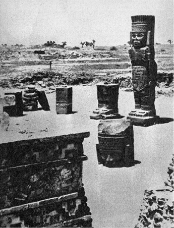
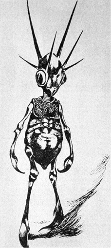
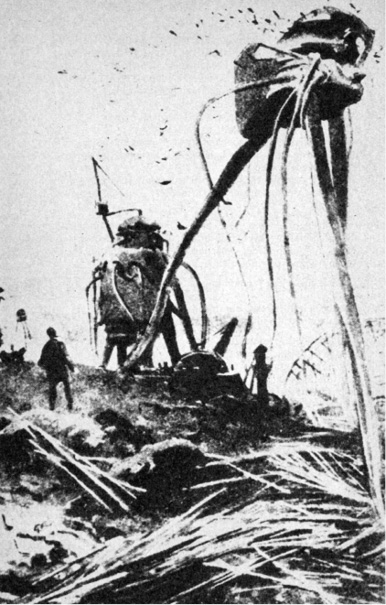
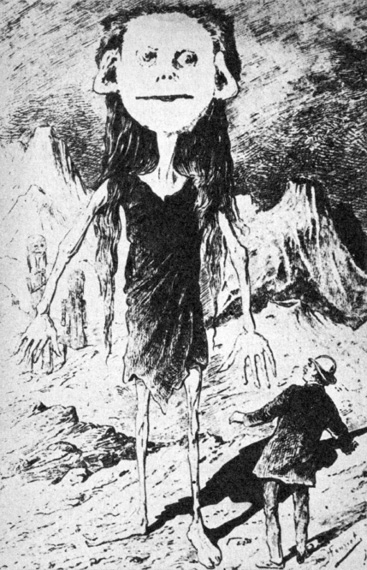

Na Sirkomě byli sice nepříjemní vojenští velitelé, ale zato tu měli výborná jablka, což se nedalo říci o mnoha jiných planetách. Tam často obojí nestálo zanic.

JEAN HOUGRON, ZNAMENÍ PSA

Stejným způsobem jako pan Krauskopf doktora Štědrého se pokusíme vykalkulovat i my možné nepozemšťany. Oproti panu Kraus­kopfovi máme dvě základní nevýhody: chybí nám jeho přesné znalosti všech potřebných okolností, které můžeme spíše jen tušit, a za druhé páně Krauskopfův důvtip. Nicméně se nevzdáváme pokusu.

Při pátrání po onom záhadném panu X ze vzdálené planety cizího slunce je zcela nezbytné pečlivě zachovat ucelený řetěz dedukcí, snažících se o co nejobjektivnější a nejstřízlivější analýzu skromných předpokladů, jež jsou nám k dispozici. Cesta za panem X bude poněkud složitá úzkostlivým dodržováním dvou základních pravidel, jež si na pouti za ním vepisujeme na štít:

1\. Respektovat strukturnost života na Zemi i jeho možných analogií ve vesmíru; jejich izolaci, nezbytnou pro detailní úvahy, vyvažovat svrchovaným ohledem na celistvost prostředí;

2\. vyhnout se oddělení jakékoli předpokládané formy života od časového činitele, od historie, která jí protéká a jejímž je výsledkem.

Není to snadné – odměnou by mělo být poznání takové úrovně, abychom nebyli odkázáni pouze na fantazii spisovatelů science fiction. Nelze ovšem doufat, že bychom při setkání s nepozemšťanem mohli hrdě prohlásit: „Pane, známe vás! My jsme si vás vykalkulovali.“

Tak dalekosáhlé cíle si autor neklade.

Začneme u ústředního nervového systému:

Vedle obecně známých funkcí, jež centrální nervový systém v organismu zastává jako orgán nadřízený veškeré ostatní (např. humorální, hormonální a jiné) koordinaci a korelaci životních pochodů, navrhuji zamyslet se nad problémem, nadhozeným u nás např. Matouškem. Jde o problematiku vědomí souvislosti individua v čase a celistvosti v prostoru.

Každý z nás ví, že tělové buňky stárnou, odumírají a jsou nahrazovány buňkami novými, nastupujícími na jejich místa. Možná, že si ne vždy dostatečně uvědomujeme tempo a rozsah těchto pochodů. Červená krvinka, erytrocyt, je, jak ukázalo její značkování radioaktivním izotopem, odsouzena k likvidaci ve slezině nebo jiné k tomu vhodné tkáni asi za 30 dní – jinými slovy za tuto dobu se zcela vymění nepředstavitelné množství asi 50 bilionů (v 1 mm3 krve je průměrně 6 miliónů červených krvinek) výsostné důležitých nosičů kyslíků. Naše pokožka, zejména její povrchní, zrohovatělé vrstvy, je hřbitovem odumřelých buněk. Výkaly jsou jen zčásti – ačkoli největší – složeny ze zbytků nestrávené potravy. Ostatek tvoří střevní baktérie a drť odumřelých buněk střevní stěny. Kdyby buňky našeho těla neregenerovaly, neodumíraly a nebyly nahrazovány novými, neopotřebovanými, skončila by naše pozemská pouť velice brzy, v nejlepším případě několik dnů po porodu a patrně již před tím, protože jistá obměna buněk, zejména erytrocytů, nutně nastává již prenatálně.

Snad právě toto – nebo i toto – měl na mysli slavný patolog Rudolf Wirchow, formuloval-li sám termín nekrobióza, tedy odumírání za života, a velice biologicky orientovaný pesimistický filozof Maurice Maeterlinck, když prohlásil: „Jsme jen mrtví, kteří se pohybují. Teprve když ustává náš život, přestáváme umírat…“ Zcela jednoznačně se vyjádřil ve svém díle Henri Bergson: „… Vidíme, že individualita má nekonečné množství stupňů a že nikde, ani u člověka, není vytvořena úplně… Aby byla individualita dokonalá, neměla by být žádná část od organismu odloučena a žíti odděleně… Je často nesnadné a někdy nemožné říci, co je individuum, a co ne, že však život nicméně jeví snahu po individualitě a že se snaží vytvářet systémy přirozeně uzavřené…“

Důsledné domyšlení du Noüyových vzorců, převádějících pravidelný tok kalendářního stáří člověka do tzv. fyziologických vteřin, rozložených podle zcela jiných principů, nás dokonce vede k závěru, že hlavní část našeho života se odehrála nitroděložně, v době od prvého rýhování oplozeného vajíčka k porodu. Zbytek je již pouhým klidným dozníváním, v nejlepším případě nepatrným zlepšováním a upravováním, která sotva zakryjí, že jde o rezignovaný – začátek konce.

Jak je za těchto okolností ustavičného přicházení a odcházení součástí našeho těla, které není v samé podstatě ničím jiným než kolonií rozličně specializovaných buněk a v tomto smyslu se podobá např. váleči koulivému, možné vnímat sebe sama jako trvající pojem? Zachovat zkušenosti, paměť, vědomí celku, na němž si tolik zakládáme? Jedním jediným způsobem: tato obměna se netýká nervových buněk. Jejich vlákna, neurity, mohou po přerušení znovu srůst, mohou vrůst do tkání dočasně zbavených nervového spojení (denervovaných), mohou po čase zajistit a obhospodařit i transplantované tkáně, mohou být dokonce, jak se zdá, v některých případech zastoupena nervovými protézami z tantalu a jiných kovů – nevratně poškozená nervová buňka je však ztracena jednou provždy a s každou takovou buňkou odchází kus našeho já do nenávratna. Odchází jeden z koordinátorů a garantů vědomí souvislosti.

Měl jsem smutnou příležitost ošetřovat strašlivě zohavené trosky lidí se všemi končetinami amputovanými, živé trupy, namnoze zohavené napalmem nebo postižené zraněním, vyžadujícím další vnitřní operaci. Nikdo zajisté nebude očekávat, že ani v tak mezních případech je narušeno vědomí pojmu „já“, pojmu celistvosti a existence sice zmrzačeného, ale dále jako celek, determinovaný svou historií, žijícího jedince. Postačí však zcela nepatrný zásah do lidského mozku, zničení nebo poškození relativně malého okrsku – a po vědomí souvislosti je veta. Tak málo postačilo. A přece…

A přece je možné provést překrystalizování viru, ve skutečnosti zrůdného genu, abychom znovu získali stejně účinného škůdce např. tabákových rostlin. Dešťovku je možné rozdělit na dvě části a obě dorostou, ploštěnku, planarii, dokonce na celou řadu dílů. Z každého vyroste za vhodných podmínek celý, úplný a „zdravý“ jedinec. Hydru, nezmara našich vod, můžeme dělit stejným způsobem a nižší polypy můžeme dokonce protlačit sítem – rozdělené buňky se opět spojí v celek jako údy strašidel, padajících, jak známo, postupně od stropů středověkých hradů.

Neumíme si jinak vysvětlit tendenci vývoje, která na určitém stupni odebrala vyšším živočichům (rostliny by poskytly nevyčerpatelný arzenál dokladů – český botanik akademik Bohumil Němec vypěstoval z několika setin milimetru (!) tlustých řezů kořenem pampelišky normální, celé rostliny…) tuto zálohu nesmrtelnosti, v plné míře popřávanou neumírajícím, ale ustavičně se dělícím prvokům, jinak, než jako daň za cosi jiného, závažnějšího, pro život důležitějšího a pro vývoj druhu použitelnějšího: vědomí souvislosti v čase, schopnost učit se a naučené ve formě instinktů unášených zárodečnou hmotou nebo učením mláďatům předávat.

Zcela jistě nejde o novinku. Řadu účelných reakcí, sloužících zcela zřetelně zachování jedince nebo rodu, jeví i nižší živočichové. Přenos a kódování reakcí, jež se ukazují být užitečnými, u nich však probíhá patrně (vedle fixace v řetězcích DNK) i dalšími způsoby. Tak například zcela nedávno objevilo několik vědeckých týmů, že planarie, krmené rozdrcenými těly jiných ploštěnek, reflexívně navyklých na určitý signál, např. vyhýbat se na ploše stěny akvária drátu pod elektrickým proudem, se „naučily“ vyvarovat se nepříjemnému styku daleko dříve než jejich kanibalsky pozřené předchůdkyně, případně ploštěnky krmené jinou potravou. Po zveřejnění tohoto zajímavého faktu se daly do práce populární časopisy s úvahami o možnosti nahradit pracné získávání vědomostí pilulkami. Nepochybně je to dobrá a realizovatelná myšlenka, pokud by objektem výuky byla mláďata planarií.

V každém případě se zdá být pravděpodobným, že jednou z podmínek vyššího života sama sebe si uvědomujícího a přímého přenášení zkušeností z minulosti bez nejistého mechanismu výběrových genetických pochodů schopného, je trvalá existence buněk centrálního nervového systému, doprovázejících člověka od narození až k smrti. Mozek je sídlem „duše“ – moderněji bychom řekli zásobárnou získaných informací, se schopností tyto informace vyhledávat a účelně používat. Každý orgán těla – nebo bezmála každý – včetně srdce, žláz vnitřní sekrece, ledvin nebo jater, o transfúzích krve nebo plazmy nemluvě, je již dnes možno přinejmenším dočasně transplantovat, aniž by vznikly pochyby, zda takto „složený“ jedinec podržel svou individualitu. Zdá se, že ani transplantace mozku není vyloučena. Transplantace psích hlav byla již provedena. V tomto případě však bude mozek ne transplantátem v plném slova smyslu, ale příjemcem, jemuž bude transplantováno tělo, po zdařilé operaci ovládané novou individualitou, novou vůlí, novými myšlenkami, novými vzpomínkami.

Máme celou řadu dokladů, že pozemský bílkovinný život ustálil v podstatě jeden jediný typ mikrostruktury a funkce nervové soustavy živočichů, v níž je podráždění převáděno složitým elektrochemickým procesem, jehož popis vybočuje z rámce této knihy. Fyziologové dávají například přednost experimentům s izolovanými nervovými vlákny sépií; jsou několikanásobně silnějšího průřezu než nervová vlákna ostatních živočichů a poskytují tedy jisté technické ulehčení pokusů. Jejich vlastnosti, vodivost podráždění, rychlost vedení atd., ba ani nejjemnější fyziologické pochody, zkoumané novým odvětvím vědy, neurohistochemií, se však nijak výrazně neliší od týchž vlastností nervů člověka nebo jiného, oproti sépiím rozhodně pokročilejšího tvora.

Další argument pro jistou konečnost vývoje principu nervového vedení poskytuje paleontologie. Jak se zdá, jedním z důvodů rychlé degenerace a vymření suverénních vládců jurského období, obrovských ještěrů, byla nezbytně dlouhá doba, potřebná k distribuci koordinačních pokynů nervovým systémem v obrovitém těle, právě tak jako k přijímání signálů senzitivními vlákny ze vzdálených oblastí těla. Průměrná rychlost vedení podráždění nervovým vláknem – řádově metry za vteřinu – nepostačovala ochránit tyto obry před příhodami ohrožujícími život.

Tato výměna garnitury tvorstva se neobešla bez podivných doprovodných jevů, pozorovaných na sklonku každé geologické epochy, předznamenávajících zánik celých dekorací fauny a flóry. Poslední plané výhonky jurských ještěrů přímo hýřily (smím-li to tak napsat) nápady přírody, jak účelnými mutacemi uchovat ne zcela povedenou pokusnou sérii. Objevují se krunýře nejbizarnějších tvarů, strašlivé, nevídané zbraně, rohy triceratopsů a mohutné vražedné ostny na ocasech stegosaurů. Tlamy jsou ozbrojeny několika řadami zubů, oproti nimž je chrup žraloka nevinným zařízením. Někteří ještěři se tvarem a leckdy i vzpřímenou polohou těla téměř dokonale podobají daleko lépe uzpůsobeným savcům, kteří mají ovládnout svět teprve v třetihorách; existují-li tehdy, tedy v podobě podivných zpola myší a zpola ještěrek.

Jiní, především ichtyosauři, se účelným tvarem těla, uschopňujícím je k pohybu ve vodě, počali podobat „osvědčeným“ rybám. A co nejdůležitějšího: stegosaurus a další velcí jurští ještěři jsou postupně vybaveni druhým „mozkem“, nervovou zauzlinou v bederní části páteře, která má jako „filiálka“ koordinovat včas a úspěšně obranné a jiné reakce zadních částí těla.

Marnost nad marnost! Dílčí, relativně účelné změny nezabránily zániku živočišné kulisy, která se zdála být takřka nepřemožitelnou a nevyhladitelnou. V geologicky poměrně krátké době byla vystřídána obrovským, takřka nepochopitelným bohatstvím forem nového života, savců, jejichž „populační exploze“ učinila z třetihor období životem nejbohatší, kdy se klimaticky vhodné oblasti podobaly nejspíše dnes už (díky absolutnímu nezájmu většiny nových národních vlád afrických států) vzácným a programově ničeným rezervacím, přeplněným nejrůznějšími druhy zvěře.

Je dost těžké nevzpomenout nad rekonstrukcemi jurských mon­ster, připomínajících přeludy z horečných snů, výroku Anatola France: „Já jsem přece svět nestvořil a demiurg, který se toho ujal, se mne neptal na radu. Mezi námi řečeno, pochybuji, že se ptal na radu filozofů a vůbec důvtipných lidí…“

Příčin bylo jistě více. Některé známe, jiné tušíme, o zbytku se dohadujeme. Jednou z ne nepodstatných však byl nepochybně zmíněný nepoměr velikosti těla a schopnosti obrovského tvora rychle reagovat. Jen jediné opatření, jež by bylo celou situaci elegantně vyřešilo, mutace a další mechanismy vývoje nepřinesly: zrychlení přenosu podráždění nervem. Efektu bylo dosaženo opačným způsobem: zmenšením tělesných rozměrů nové „garnitury“ savců, vesměs vycházejících z malých forem (předek koně nebyl např. větší než kočka) a ve sledu tisíců generací rostoucích až do optimální velikosti, určené celou řadou faktorů.

Zdá se tedy, že nám známý bílkovinný život není schopen nabídnout rychlejší a účelnější spojení řídicí ústředny živého organismu s výkonnými orgány, než v pozemské formě života miliardy let vyvíjený a již stamilióny let stabilizovaný a nezměněný princip vedení vzruchu nervovým vláknem. Dále se zdá být nepochybným, že vzhledem k zákonu ekonomie života a k potřebě co nejrychlejšího propojení informační sítě a jednotlivých buněk, uchovávajících paměť, bude u všech živočichů, vybavených inteligencí, ústřední nervový systém soustředěn na jednom jediném místě. Je to logické. Ačkoli je docela dobře možné představit si počítač, jehož jednotlivé součástky, diody a relé, případně celé jejich bloky, jsou rozptýleny a spojeny navzájem dálkovým vedením, nepřináší tento systém žádnou výhodu; ani při dostatečné integraci jednotlivých dílů není odolnější, naopak, daleko zranitelnější, poruchovější a vzhledem ke konečné rychlosti průchodu elektrického proudu vodiče (o rychlosti postupu vzduchu nervem nemluvě) i pomalejší oproti analogickým přístrojům kompaktním.

Ostatní systémy jsou podřízené, dirigované systémem nervovým. Při aktuálním ohrožení života, vyžadujícím okamžitou reakci, jsou tyto systémy pomalé. Skutečnost, že i v těchto případech vstupují do hry, např. vypuzením adrenalinu nadledvinkami do krevního řečiště v krizových situacích, lze považovat za obranu pomocnou, pravděpodobně atavistickou.

Třetím předpokladem je přetrvání jistých řídicích a organizujících tělových elementů bez výměny, bez náhrady novými, neopotřebovanými, aby bylo zajištěno vědomí jednoty a celistvosti individua navzdory nezbytné obměně největší části buněk ostatních. Musí být však zajištěna i paměť, vázaná na jednotlivé elementy ústředního nervového systému způsobem dosud sice ne zcela jasným, v každém případě však nepředatelným např. jednoduchou chemickou reakcí. Nelze klást rovnítko mezi zděděnými, zašifrovanými a kódovanými informacemi vlákna DNK, schopného podélně se rozdělit bez ztráty objemu a kvality informace, a zcela jiným mechanismem uchovávání „bitů“. Jak víme, lidský mozek je schopen „katalogizovat a archívovat“ těchto základních informací nejméně trilion – jimiž nás zaplavuje každým dnem, každou hodinou a každým zlomkem vteřiny styk se zevním okolím i systém tělové signalizace.

Přijmeme-li tyto předpoklady jako obecné pro vývoj bílkovinného života vůbec a pro existenci inteligentních tvorů zvláště, můžeme postoupit v hledání podoby našeho nepozemšťana opět poněkud dále a vytknout několik závěrů:

1\. horní hranice velikosti tvorů, schopných obstát mezi diferencovaným tvorstvem ostatním, je – kromě jiného – určena i rychlostí vedení vzruchu nervovým vláknem;

2\. při úvahách o tvorech s rozvinutou inteligencí a schopných založit kultury a civilizace, musíme předpokládat jednak vědomí jednoty a kontinuity individua, jednak schopnost využít tohoto vědomí k účelnému jednání, především k přenášení poznatků a zkušeností na potomstvo a ostatní jedince téhož biologického druhu. Všechny znalosti, nabyté zkoumáním pozemských forem života svědčí pro domněnku, že toto vědomí jednoty a kontinuity jsou schopny zajistit pouze neměnící se a nevyměnitelné oblasti centrálního nervového systému, vymezující trvání své funkční existence délku života individua jako koordinovaného systému;

3\. princip ekonomie, uplatňovaný v přírodě, aplikován na funkční mechanismy činnosti centrálního nervstva, se zdá být přesvědčujícím argumentem pro soustředění řídicího nervového orgánu na jednom místě těla, takže nedochází ke zbytečnému prodlení vedení nervových impulsů.

Pokračujeme však.

Jedním z nejnápadnějších morfologických znaků je tedy nepochybně velikost organismu, která je, jako všechny ostatní morfologické i fyziologické charakteristiky jedinců i druhů, výsledkem nadmíru složité souhry vlivů vnitřní struktury živočicha nebo rostliny v historickém vývoji a zevního prostředí (pod široký pojem zevního prostředí zahrnujeme např. i nepřátele a škůdce).

V některých pozemských případech, je velikost blízce příbuzných druhů zvířat určována oblastí rozšíření, a to tak, že se tyto příbuzné druhy směrem od pólů k tropům zmenšují (Bergmannovo pravidlo). Pěkný příklad poskytují např. velcí tučňáci magellanští a Humboldtovi a jejich daleko menší bratranec galapážský tučňák, nebo dvojice tučňák císařský, obývající Antarktidu, a tučňák patagonský, žijící daleko severněji a v oblastech podstatně teplejších.

Bergmannovo pravidlo vyjadřuje snahu organismu o optimální termoregulaci; v chladných krajích je výhodné větší tělo s relativně menším povrchem, umožňujícím ztrátu tepla vyzařováním, v horkých krajích je tomu naopak. U člověka však Bergmannovo pravidlo platí jen omezeně a rozhodně ne do té míry, aby bylo schopno vytvořit trpaslíky a obry.

Dolní hranice velikosti jakýchkoli vysoce organizovaných tvorů s inteligencí, schopnou vytvořit civilizaci, obdobnou civilizaci lidské, je určena především rozměry uskupení elementů, zajišťujících zásobu informací a jejich využívání, u bílkovinných bytostí tedy centrálního nervového systému, především mozku.

Dnes je dostatečně známo, že samotný objem, resp. váha mozku nerozhodují o duševních schopnostech člověka – největší mozky mají imbecilové, naproti tomu někteří lidé mimořádně nadaní měli mozky nápadně malé, např. Anatol France. Ani oproti vyšším primátům není rozdíl váhy mozku tak výrazný, aby vysvětloval propastný rozdíl psychiky opic a člověka. Daleko spíše hraje úlohu bohatší reliéf lidské mozkové kůry, zmnožení závitů, které je morfologickým projevem značné funkční složitosti. Přesto však se zdá, že i samotná váha mozku, přesněji řečeno jeho šedé hmoty, obsahující jádra a těla nervových buněk, má značný význam.

Tělové buňky myšky a slona se velikostí nijak zvlášť neliší. Aniž zastáváme – jak jsme v předchozích kapitolách uvedli – názor, že život je jen okrajový jev kolem rekombinace a mutace genů, tedy kolem vláken DNK, musíme připustit, že každá buňka je determinována svou funkcí, k níž patří kromě zvláštních úkolů buněk v rozličných orgánech i zajištění úkolu DNK, přenášejícího v kódu rozsáhlou informaci při buněčných mitózách, regeneraci tkáně atd. Nic méně, ale nic více. K plnění těchto úkolů je buňka vybavena množstvím nesmírně složitých a specializovaných organul, buněčných ústrojů, plnících uvedené funkce s maximální ekonomií prostorovou i výkonnou. Jestliže víme, že nervové buňky savců jsou v podstatě stejné velikosti a totožného uspořádání, docházíme k poznatku, který potvrdila výpočetní technika kybernetických strojů a její teorie: schopnost a dokonalost mozku obratlovců je (mimo jiné) ovlivňována především počtem funkčních elementů, v tomto případě nervových buněk šedé hmoty mozkové – u člověka je jich kolem třiceti miliard – vyjádřitelným, i když přibližně, vahou mozku.

Toto zajištění nesouhlasí pouze u obratlovců nebo dokonce u savců – platí, jak se zdá, např. i pro hmyz. Pro porovnání poměr hmoty mozku ke hmotě těla:

potápník     1 : 4200

lumek           1 : 400

mravenec    1 : 280

(podle Obenbergera)

Jak je vidět, souhlasí poměr váhy těla k váze nervových zauzlin jmenovaných hmyzů nejen s obecnou představou o jejich „chytrosti“ a „inteligenci“, ale i s úsudkem vědců o dokonalosti historicky vypracovaných instinktů.

Neurofyziologové soudí, že současně může být zapojena v čin­nost nejvýše desetina šedé mozkové hmoty. I to se mi zdá být příliš odvážným odhadem vzhledem k rozdělení mozkové kůry na okrsky motorické, senzitivní, senzorické atd. atd., svědčí to však i o nutnosti, jejímž projevem je vývoj lidského mozku, vytvořit rezervy, mobilizovatelné za zvláštních situací.

Můžeme však považovat za prokázané, že každý vysoce vyvinutý reprezentant bílkovinného života, organizovaného v buňkách účelné, a proto téměř „standardní“ velikosti, musí dosáhnout alespoň takového vzrůstu, aby umožnil rozvoj ústředního nervového systému s odpovídajícím množstvím funkčních elementů, zajišťujících celý komplex složitých pochodů, ústících koneckonců v druhovou „inteligenci“. A nejen to – kromě rozvoje musí ostatními tělovými tkáněmi poskytnout tomuto životně důležitému ústředí i ochranu a dalšími prostředky obranu jak proti výkyvům vnitřního prostředí (nebezpečný je zejména nedostatek kyslíku, hubící mozkové buňky podstatně dříve než všechny tělové buňky ostatní – dokladem jsou např. i psychické následky vážných otrav svítiplynem, postihující právě mozek), tak proti inzultům vnějším. Dále pak musí růst odpovídat požadavku prosazení tak rozvinutého druhu (vazba je zde samozřejmě zpětná a příčinnost vzájemná) v celé „aréně“ života ať pozemského, nebo na kterékoli předpokládané obydlené planetě.

Tímto zjištěním můžeme odkázat celou řadu představ spisovatelů science fiction do říše bájí. Nelze si představit nesmírně duševními dary obdané bytosti, velikostí i tvarem těla se podobající nejspíše slunéčkům sedmitečným. Připustíme-li, že se vyvinuly na šťastné planetě, kde se nesetkaly se žádným podstatně silnějším protivníkem během svého vývoje (v jakési povídce zdecimuje tyto posly vyšší civilizace na Zemi kočka a posléze zahubí plácnutím člověk), nelze, pokud by šlo o život na podkladě bílkovin, připustit dostatečnou kapacitu jejich ústředního nervového systému.

Inteligentní sedmitečná slunéčka z naší povídky by tím spíše neobstála na Zemi; nebyly by to jenom kočky, jimž by byla vydána napospas, ale v průběhu vývoje každý obratlovec a každý dravý hmyz. Bude-li zkrátka kolem pozemských návštěvníků planet cizích sluncí s bzučením cosi kroužit, půjde se vší pravděpodobností o místní druh chroustů, nikoli o kosmickou miniloď…

Z dalších argumentů o činitelích, vymezujících dolní hranici vzrůstu inteligentních bytostí kdekoli ve vesmíru na podkladě bílkovinného života, uveďme alespoň dva: klimatické a atmosférické jevy.

Vznik bílkovinného života je vázán existencí plynné atmosféry a vodních par nebo, nejspíše, volných vodních ploch. V této konstelaci musíme předpokládat i proudění vzduchu, vítr, přecházející občas ve vichřici, déšť a snad i sníh a krupobití, pokud by teplota vyšších vrstev atmosféry klesala pod bod mrznutí vody. Těmto „útokům přírody“ čelí tvorstvo i rostlinstvo různým způsobem. V nižších fázích vývoje účelnými mutacemi – typickým příkladem je ztráta křídel všech druhů hmyzu na některých tichomořských atolech, téměř ustavičně vystavených silným větrům. Obratlovci se v rytmu svého druhového vývoje brání výkyvům počasí přizpůsobením – termoregulací, nebo naopak zpomalením životních pochodů při poklesu tělové teploty, srstí, případně zimním spánkem a konečně stavbou hnízd, doupat nebo sídel pro celé společenství (vosy, včely, mravenci, termiti atd.). Zdá se, že pasívním, biologickým přizpůsobením se klimatickým výkyvům, byť i nejlépe vyhovujícím fyziologickým mechanismem, je do značné míry vyčerpán další mutační vývojový impuls: druhy, které dokázaly uvést své ochranné procesy do plné shody s požadavky zachování života jednotlivce i druhu, stagnují. Případné další mutace se ukazují „zbytečným luxusem“ a nejsou zachovány.

Snad nezhřešíme nepodloženou generalizací (které se v úvodu knihy autor přislíbil vyhýbat jako čert kříži), jestliže myšlenku o zastavení nebo podstatném zpomalení dalšího vývoje druhu v okamžiku, jakmile byly uspokojivě vyřešeny problémy zachování života, budeme opětovně aplikovat i na člověka. Zdá se, že to totiž právě ono trvalé napětí, rozdíl hladin mezi optimálním uspokojením potřeb vyvíjejícího se člověka a jeho fyziologickými vlastnostmi, který umožnil rozvoj předčlověka a pračlověka v druh homo sapiens, přinesl zárodky architektury, první výrobu zbraní, nástrojů, oděvu. Zkrátka první civilizační krok ke kultuře, kterou Morgan nazývá divošstvím, trvajícím 98 % doby od objevení se lidstva na této planetě až do dneška. Archeologové nazývají dobu tohoto vývoje předčlověka v člověka, toto překročení prahu (relativně nepřekročitelného pro ostatní tvory) starší dobou kamennou – paleolitem, geologové pleistocénem.

V tomto období, nejspíše asi před 120 000 lety, ve středním paleolitu, počínáme sledovat epochální změnu – jakési pozvolné „zažíhání druhého stupně“ rakety vývoje, až dosud řízeného pouze mutacemi řetězů DNK, jež mimo jiné (ale, jak brzy uvidíme, především) zvětšily objem mozkovny tehdejších hominidů ze 750 až 1100 cm3 jávského opočlověka, pithecantropa (stojícího objemem mozku mezi šimpanzem a dnešním člověkem) asi na 1450 cm3 a přiměřeně rozmnožily i počet funkčních elementů mozku, buněk šedé mozkové kůry. Nevěříme příliš v náhody, pokud nejsou podloženy statistickou pravděpodobností jako mírou možností, v tomto případě se však opravdu zdá, že zažehnutí „druhého stupně“ přišlo právě včas. Pračlověk středního paleolitu, „nepříliš hojný živočich a sběrač potravy, který – stejně jako všechna dravá zvířata – parazituje na ostatním tvorstvu a chytá a sbírá to, co mu příroda k jídlu právě poskytuje“ (G. Childe), se ve své době díky geneticky zachovaným osvědčeným změnám docela dobře přizpůsobil prostředí – a nebylo to prostředí podle dnešních měřítek nejpřívětivější. Ve vyšších zeměpisných šířkách se střídaly ledové doby, doprovázené v subtropických pásmech prudkými a trvalými lijáky, s dobami meziledovými. Docházelo k horotvorným dějům obrovských rozsahů. Otevíraly se velké africké zlomy a člověk byl svědkem této podívané, právě tak jako viděl přicházet a odcházet řadu druhů zvěře do teplejších oblastí, vymírat nebo se naopak měnit a upevňovat. Sám se za tuto téměř nepředstavitelnou řadu let změnil pramálo: z biologického hlediska nebylo třeba. Osvědčil se. Místo zubů a drápů si opatřil kyje a pěstní klíny pro nebezpečné přední končetiny, uvolněné vzpřímenou polohou těla, a s jejich pomocí zajistil přežití skupinek „lysajících opic“ mezi ostatními živočichy. Zabíjel a byl zabíjen. Žil.

A přece byl něčím zcela jiným než šavlozubý tygr, trpasličí slon, tříprstý malý prakoník a ostatní současníci. Jeho mozek počtem svých elementů a zejména dosaženými možnostmi kvalitativně převyšoval centrální nervové systémy všech ostatních živočichů. Nemusel už čekat na náhodné mutace, jejichž výběr, pomalý, nejistý a váhavý, postrkoval vývoj krůček za krůčkem, a popravdě řečeno na ně ani čekat nemohl a nesměl. Nebylo k nim důvodu. Jeho mozek však sám „pocítil“ možnost sebezdokonalení, sledovanou dnes u některých (a největších) samočinných počítačů. Hlavní rozdíl spatřuji ve schopnosti cílevědomého, účelového myšlení a úvahy, dosahující do budoucnosti a modelující ji, která vystřídala myšlení až dosud výhradně důvodové, kauzální, případně zkušenostní, vykoupené předchozím systémem „pokusu a omylu“, jenž se tváří v tvář šavlozubému tygru nebo jeskynnímu medvědu nemusel vždycky vyplatit.

Účelnost, kterou nepřipouštíme v přírodovědeckých úvahách, musíme přiznat volnímu jednání tvora, který se právě schopností jejího využívání stal z pračlověka – člověkem, když opracoval pazourkovou pecku plátek po plátku tak, aby nakonec získal nástroj, jehož tvar, odpovídající zamýšlenému účelu, modeloval jeho mozek dříve než ruka.

Od tohoto okamžiku se počaly shromažďovat podmínky k převratu v historii lidstva, epochální první neolitické revoluci, kladoucí opět základy vědeckotechnické revoluci, kterou dnes se smíšenými pocity prožíváme.

Toto vysvětlení se zdá lépe odpovídat zákonům přírody a zjiš­těným faktům než Chardinovo tvrzení o „překvapující zoologické skutečnosti, že se hlavní vývojové úsilí naší Země od konce třetihor zřetelně soustřeďuje v člověku“, nebo tvrzení o polidštění díky „náhlému tlaku“, socializaci, zkrátka zhuštění hominidů v prostoru i v čase. Zdá se, že toto zhuštění nebylo nijak výrazné a přikláníme se spíše k Childovu názoru o poměrně nepočetném, i když velmi perspektivním živočišném druhu. Svědčí o tom nápadně malé množství nálezů opracovaných kamenů z této doby, snad několik desítek tun, zatímco musíme předpokládat, že každý reprezentant hominidů „vyrobil“ a odhodil denně až několik takových pěstních klínů.

Je tedy jistá velikost mozku vymezená dolní hranicí nebo lépe řečeno jistý počet mozkových buněk nezbytným činitelem rozvoje „řadového živočicha“ v druh, schopný vytvořit kulturu, a konečně i technickou civilizaci. Avšak nezjednodušujme problematiku; i po „zapálení druhého stupně“ zůstal trvalý konflikt mezi zevním a vnitřním prostředím velice důležitým činitelem dalšího vývoje, i když pravděpodobně ne činitelem rozhodujícím.

Kdybychom svým fyzickým uspořádáním byli schopni dosahovat rychlosti letícího střečka překonávajícího rychlost zvuku (je to neuvěřitelné, ale je to tak), rozhodně by poklesla nejen poptávka po osobních vozidlech, ale vůbec po dopravních a spojovacích prostředcích všeho druhu. Kdyby byla naše termoregulace dokonalá, nepotřebovali bychom oděv. Kdybychom byli schopni fotosyntézy, odpadla by valná část existenčních starostí. Kdyby…

Nespornou skutečností zůstává, že se přemíra fyziologické adaptace zevním přírodním podmínkám zdá být brzdou civilizačního vývoje. Nejprimitivnější kmeny (pokud jde o vytvoření materiální kultury), dosud žijící na naší planetě, jsou přizpůsobeny nejlépe. Australští bushmani mají například ojedinělou vrozenou vlastnost tlumit při spánku za chladných nocí své životní pochody neuvěřitelným způsobem: jejich tělová teplota klesá na 30 °C a puls na 30/min. Nepotřebují domy, oděv a celou řadu dalších nezbytností, na nichž se tříbil důvtip člověka. Jihoafričtí Křováci loví vysokou zvěř fantastickým způsobem: uštvou ji. Prostě běží a putují za vyhlédnutou žirafou nebo antilopou či zebrou hodinu za hodinou, den za dnem, až vyčerpané zvíře klesne a je ubito klacky a kameny, které jsou právě po ruce. Nic víc nepotřebují. Jejich jediným majetkem je pár drobnůstek v malé lýkové kabele, sloužících ještě ke všemu rituální kosmetice. Eskymáci se osvědčili tam, kde evropští kolonisté vyhynuli zimou, chladem a nemocemi – např. v Grónsku. Jejich organismus je schopen spokojit se téměř výhradně živočišnou – a to ještě nanejvýš jednostrannou stravou, která by nejrůznějšími avitaminózami spolehlivě zahubila kohokoli z nás. Tuto stravu – byť i ne zadarmo – jim poskytuje moře v dostatečném množství. Nic více nepotřebují.

Můžeme tedy tuto část úvahy uzavřít tím, že očekávaní inteligentní tvorové budou mít velikost mozku (za předpokladu, půjde-li o bílkovinný život) blížící se velikosti lidského mozku a zajišťující jak v bio­logickém vývoji, tak v již stabilizované podobě s velmi zpomaleným nebo zastaveným procesem morfologických mutací, jistou ochranu proti ostatním živočichům planety a klimatickým jevům, přičemž přizpůsobení nemusí být a patrně nebude dokonale biologické. Není vyloučeno, že na příliš dokonalou biologickou adaptaci podmínkám doplatila i rasa neandertálců, záhadně zmizevší z dějin počátkem první fáze poslední doby ledové, kdy byla – a to je podivné – vystřídána takřka současně po celé Zemi (nálezy jsou doložené z Evropy, Afriky, Palestiny i Číny) přímými předchůdci homo sapiens, rasou grimaldskou a cromagnonskou s odlišenými kulturami châtelperronskou, aurignackou, gravettskou atd. Všechno nasvědčuje tomu, že výhonek kmene primátů, – neandertálci, byl hluchý, neplodný, že v našich žilách nekoluje ani kapka krve těchto statečných lovců, pouštějících se takřka s holýma rukama do boje o život a rod. Snad jen výjimečně, jak nasvědčují palestinské nálezy, docházelo ke křížení s cromagnonci.

Co způsobilo zánik hominidů, ve své době představujících mj. i objemem mozkovny, blížícím se objemu mozku současného člověka, vrchol tvorstva? Mnozí soudí, že to bylo příliš důsledné přizpůsobení životu v arktických podmínkách, jež nebylo v souladu s dalším trváním druhu, jakmile se podmínky od základu změnily. Neandertálec nepochybně dokonale přizpůsoben byl – hora svalů na lešení pevné, podsadité kostry, mohutné čelisti, schopné drtit jakoukoli potravu, dlouhé, nebezpečné paže, ozbrojené účelnými, ač primitivními zbraněmi, bohatá srst, vzpřímená poloha těla atd.

Nesetkáme se tedy, jak se zdá, na cizích planetách s rozvinutou civilizací, jejíž reprezentanti by byli ozbrojeni mohutnými tesáky a drápy (nehledě k nevýhodám drápů při jemných manipulacích), hustou srstí a mezi ostatní kulisou místní fauny jedinečným fyzickým fondem. Inteligentní sedmitečná slunéčka můžeme rovněž škrtnout, i když se nám zatím nepodařilo vyloučit mužíky trpaslíky (měřeno našimi měřítky), tak oblíbené v historkách o setkání s nepozemšťany, pilotujícími létající talíře. Jen zelení asi nebudou. Víme už, že fotosyntéza pomocí zeleného pigmentu, chlorofylu, je pro živočichy protimyslná a nevýhodná.

O klimatických jevech, vládnoucích na neznámých planetách, si ovšem můžeme vytvářet jen velmi nedostatečně podložené domněnky, vycházející z pozorování Marsu, z výsledků amerických a sovětských sond vyslaných k povrchu Venuše, z pozorování velkých Jupiterových měsíců hvězdárnou na Pic du Midi, zejména však srovnáním se Zemí. Život, podobný pozemskému, smíme totiž očekávat tehdy, je-li planeta obdařena atmosférou, obsahující kyslík a ostatní biogenní prvky. Takovou atmosféru je schopna udržet planeta o průměru alespoň 5000 km, tedy o něco větší než Merkur (4842 km); síla jejího gravitačního pole překonává únikovou rychlost molekul plynů do vesmírného prostoru.

Nevíme, zda takové planety ve vesmíru existují, avšak vzhledem k úvahám, zmíněným v kapitole o kosmogonii, o vzniku hvězd a planet, máme za to, že pravděpodobnost jejich zákonitého vzniku a existence hraničí s jistotou. Nevíme, zda Země je „průměrnou“ planetou v tom smyslu, v jakém pokládáme Slunce za „průměrnou“ hvězdu, ale poměry ve slunečním systému tomu nasvědčují, a není důvodu, proč by právě sluneční systém nemohl představovat docela reprezentativní vzorek, nesčíslněkrát ve vesmíru opakovaný. Také tato domněnka statisticky hraničí s jistotou tak dalece, že skupina vědců, autorů hodně diskutované (a ne zcela právem ustavičně citované) „rovnice z Green Banku“ pokládá pravděpodobnost výskytu planet, vhodných k vývoji života za takovou, že jen v naší Galaxii očekává nejméně 50 miliónů, spíše však miliardy nejen oživených planet, ale dokonce planet obydlených inteligentními tvory.

Jestliže se tedy vzhledem k nezbytné zdrženlivosti musíme vzdát úvah o klimatických podmínkách předpokládaných planet a spokojit se zjištěním, že jistý typ atmosféry, blízký pozemskému, je podmínkou vzniku bílkovinného života, můžeme věnovat pozornost jinému, velmi důležitému činiteli vývoje a tvarování morfologických a fyziologických vlastností organismů, totiž gravitaci.

Snílkové by nám nikdy neodpustili, kdybychom tuto stať vypustili. Obři se v jejich interpretaci objevují jako návštěvy z vesmíru, jejichž vzdálenou přítomnost zachytily různé báje, mýty a náboženské spisy, především bible:

„Obrové pak byli na zemi v těch dnech, ano i potom… To jsou ti mocní, kteříž z dávna byli, muži na slovo vzatí.“ (Mojžíš, I,6,4.)

To oni, obrovští návštěvníci z neznámých planet, zachycení kresbami skalních obrazáren v Tassíli a Žabbárenu, vybudovali baalbeckou terasu, vztyčili megality, provedli monumentální stavby v Jižní Americe, jejichž náročnost ve velehorské výšce s nízkým tlakem vzduchu je očividná a provedení (alespoň v řadě spisů) těžko vysvětlitelné pouhými lidskými silami…

A obři ovšem zalidňují i vzdálené, dávno zaniklé civilizace. Ob­jevují se v pohádkách všech národů a vracejí se znovu a znovu. Vybudovali Atlantidu, založili dávno zapomenuté supercivilizace obrovskou silou svých svalů i schopností mozků. To jim na paměť byly postaveny kolosální sochy Velikonočního ostrova. Megality, rozseté po značných oblastech světa, jsou jen snahou slabých potomků o napodobení neuvěřitelných výkonů daleko schopnějších a silnějších předků. Tíwanaku je prý – alespoň podle Bellamyho – dokladem existence a činnosti obrů jako celek i v architektonických detailech, jež stěží mohly sloužit lidským bytostem obvyklé velikosti.

Je to výraz toužebného návratu člověka ke zlatému věku, který klade do dávné minulosti právě tak jako zaslíbenou zemi na vzdálené ostrovy, kam nelze doplout, nebo dokonce mimo tento svět? Jistě. Přeceňování minulosti a její oslava není vlastní jen Ovidiovi (Aurea prima sata est aetas – První vzešel věk zlatý…) a společnosti, scházející se u lékárníka v Poláčkově Okresním městě („… Jejich pohled byl upřen do minulosti. Tam nalézali plodivou přírodu, nesmírně štědrou k lidstvu, zdravé a silné muže, sousedskou lásku a hrdinské činy. O přítomnosti se vyjadřovali s úšklebkem…“), ale každému z nás a patrně každému člověku. Vždyť s návratem do minulosti se vracíme k vlastnímu mládí, kdy dny byly takřka nekonečně dlouhé, nabité zázračnými dobrodružstvími, a díky filtru naší paměti už dávno zbavené všeho nepříjemného, bolestného. Nikdo nevařil tak dobře jako naše maminka – a nikdo z nás dobrovolně neuzná, že již po desátém roce chuťový smysl prudce chátrá a nemůže být vzrušen nejen tím, co vařívala maminka, ale ani odpornostmi, které nám nabízeli kramáři na poutích a jež se nám zdály být vrcholem všech slastí…

Obry a trpaslíky se zabývá lidstvo už úctyhodně dávno, ale, jak se zdá, teprve všestranný Konstantin Eduardovič Ciolkovskij, otec kosmonautiky, vyslovil ve své studii Biologie trpaslíků a obrů, uveřejněné roku 1925, myšlenku, že určujícím činitelem vzrůstu organismů a do jisté míry i formování jejich tvarů je gravitace, planetární přitažlivost. O možnosti takového vlivu se před ním zmínil roku 1917 D. V. Thompson, ovšem nikoli v souvislosti s vývojovým mechanismem, ale v úrovni hypotetické úvahy: kdyby se Země zvětšila a gravitace vzrostla, podobali by se čtvernožci záhy fosilním krátkonohým ještěrům. Kdyby se naopak zmenšila, stali by se lehkými a aktivnějšími i při menším výdeji energie. Jinými slovy: Thompson se domníval, že naše Země je co do síly gravitace průměrným případem, umožňujícím existenci tvorů obojího typu – což je možné a patrně správné.

Rozvaliny Tíwanaku dosud nepromluvily. Mlčí i sochy typově rozlišených tváří

Ciolkovskij soudí, že kdyby se pozemský život rozvíjel na Měsíci, byli by tamní živočichové šestkrát větší a měli by přiměřeně větší mozek; naopak na Jupiteru, kde je přitažlivost dvaapůlkrát větší než na naší planetě, by mohly existovat jen trpasličí formy, jinak by živočichové vůbec nemohli odpoutat tělo od povrchu planety.

Tato úvaha nás zcela neuspokojuje. Pozemský život se může rozvíjet pouze v podmínkách Země nebo planety Zemi nanejvýše blízké. Na Měsíci by se patrně vyvinul co do tvarů živočichů způsobem, o němž se můžeme pouze dohadovat spolu s panem H. G. Wellsem a jeho selenity z románu První lidé na Měsíci. Nezdá se, že by tvorové na Měsíci – pochopitelně pokud by jejich existenci připouštěly místní podmínky – museli být nutně šestkrát vzrostlejší jenom proto, že je gravitace Luny přibližně šestinou přitažlivosti pozemské. Spíše bychom očekávali atrofii svalstva na Lunu „transplantovaného“ tvorstva, jeho zmenšení a fyzickou degeneraci. To již počátkem tohoto století velmi bystře pochopil téměř zapomenutý autor vědeckofantastické trilogie (Na stříbrném globu, Stará Země a Vítěz) Jerzy Žulawski. Nelze předpokládat, že by se díky snížené gravitaci zvětšoval mozek, nadlehčovaný u člověka sice nevelkým, ale dostatečným množstvím mozkomíšního moku, takže je v jakémsi trvalém „stavu beztíže“. A těch ubohých 2,5 g na Jupiteru? Ani kosmonauté „pozemského výrobního modelu“ nepovažují takové přetížení za zvláštní zátěž a snadno se s ním vyrovnávají, tím spíše pak tvorové, jejichž vývoj by probíhal v gravitačním poli této síly.

Je třeba ovšem přiznat, že Ciolkovského myšlenky sdílí celá řada moderních vědců, mezi nimi i exobiologů, konstruujících mimozemské bytosti na základě analogie s člověkem, avšak modifikované představami o působení zevního prostředí planety.

Zdá se, že bude lépe opustit spekulace a pokusit se zodpovědět základní otázku, jakým způsobem ovlivňuje gravitační pole nám známé živočichy, resp. jakým způsobem tito živočichové ve svém vývoji na gravitační pole a jeho změny reagují.

Již letmý pohled na říši pozemské fauny poučí, že – ať je již tento účinek jakýkoli – rozhodně nevede k morfologickému sjednocování tvarů těl živočichů, předvádějící nám nejbizarnější paletu, hodnou obrazotvornosti Hieronyma Bosche. Země umožňuje zcela spokojenou existenci jak žirafám, tak jezevčíkům, myškám i slonům, sekáčům i plošticím. Ani vyhledání „průměrného živočicha“, pokud je takové určení vůbec možné a reálné, nám mnoho nepomůže. Pokusil se o ně chicagský zoolog prof. Ralph Buchsbaum, který zjistil, že „průměrným živočichem“, nalézajícím se někde kolem poloviny cesty od prvoka k člověku a odpovídajícím i průsečíkům počátku a konce dalších vývojových linií, je červ rodu Nereis, ne­určitě připomínající stonožku… Opravňuje nás to snad k domněnce nebo dokonce k tvrzení, že pozemská gravitace modeluje tvory obvykle do podoby červů, plazících se pod tíží přitažlivosti v prachu země? Domnívám se, že ne – provinili bychom se na skřivanech…

Selenita v představě ilustrátora Wellsova románu První lidé na Měsíci

Rozřešení, nebo alespoň jeho náznak by mohl přivést toliko experiment, v jehož možnost nestor kosmonautiky nevěřil. Ani my nejsme dosud schopni přenášet vzorky tvorstva na Jupitera či na Měsíc, zajistit jim existenční podmínky a vyčkávat milióny let, jakým způsobem se budou měnit a utvářet. Nejsme schopni konstruovat pro tak dlouhou dobu centrifugy nebo naopak technické prostředky (letadla, klesající po určité křivce, rakety letící setrvačností), zajišťující snížení tíže nebo dokonce stav beztíže. Naštěstí matička Země provedla tento experiment – jak si nedávno poněkud překvapení exobiologové povšimli – uspokojujícím způsobem a v uspokojivém měřítku za nás. Jde o prověrku nepřímou, ale v omezeném rozsahu našeho zkoumání dostatečnou: o přechody – často opakované – některých živočišných druhů z moře na souš, případně zpět.

Marťané z Wellsovy Války světů naopak přijali podobu ohyzdných hlavonožců s nepříjemnými upířími zvyky

Tréninku pro vesmírné cesty za stavu beztíže, prováděného pod vodní hladinou, se zúčastňují všichni kosmonauté. Nejde ovšem o skutečný stav beztíže – avšak tělo, nadlehčované vztlakem vody, je prakticky zbaveno břemene přitažlivosti a volně se vznáší. Vnitřní orgány zůstávají podrobeny účinkům gravitace dále, avšak ty obvykle „plovou“ v ochranných tělových tekutinách, a jak se zdá, gravitační změny na ně s výjimkou tzv. labyrintu vnitřního ucha nijak zvlášť nepůsobí – alespoň pokud můžeme soudit z pobytů kosmonautů na oběžných drahách. Hlavní tíhu boje s přitažlivostí nese pohybový a podpůrný aparát, u pozemských obratlovců kostra a svalstvo – to jsme se alespoň donedávna (až do uveřejnění prací P. A. Koržujeva a dalších badatelů) domnívali.

Historie domněnek o překonávání gravitace např. ptáky je jedním z pěkných dokladů lidských omylů, způsobených „krátkým spojením“ mezi soudobým stavem techniky a biologickými úvahami. 19. století bylo svatosvatě přesvědčeno, že let ptáků, tedy objektů zjevně těžších vzduchu, je umožňován ohříváním vzduchu, který vdechují, že se tedy mění v jakési okřídlené montgolfiéry. Do nebe volající nesmyslnost této domněnky, vyloučené už pouhým srovnáním objemu vzduchu, ptákem vdechovaného, s váhou jeho těla, nikomu nevadila. Teprve první pokusy s kluzáky a později s letadly zrodily novou hypotézu, které jsem se učil i já: ptáci mohou létat proto, že jejich kostra je – podobně jako kdysi bambusová a dnes hliníková kostra draků letadel – vylehčena, pneumatizována, a oproti kostrám pozemských zvířat v poměru k váze těla tedy podstatně lehčí. Domněnka byla se vzdechem úlevy přivítána jako fakt, ačkoli její zastánci si jistě tu a tam dopřáli k obědu slepici nebo husu, a měli tedy možnost zamyslet se nad „vylehčením“ zbytků, ponechaných po hodech na talíři.

A pak se vyskytli všeteční a všudypřítomní šťouralové, kteří provedli nejjednodušší věc na světě: kostry a těla rozličných živočichů opravdu zvážili na docela obyčejných vahách. Výsledky byly inspirující:

  

Živočich:

Váha kostry v procentech váhy těla:

paryby (strunohřbeté)

7,0

ryby kostnaté

8,5

obojživelníci

11,4

plazi

14,0

savci

14,2

ptáci

14,3

Mechanické uplatňování snížené gravitace na podobu nepozemšťanů vede k velkovýrobě románových monster selenitů a Marťanů

Zatímco tedy prvních pět příček žebříku dobře odpovídá ochraně vodních živočichů před přemáháním gravitace pohybem ve vodě, menším nárokům na plazy, kteří spočívají větší plochou těla na pevné podložce, a bytelnějšímu pohybovému aparátu savců, ptáci zradili na celé čáře. Nejen že jejich kostra není vylehčená a pneumatizovaná; je v celé živočišné říši relativně nejtěžším kosterním aparátem vůbec.

Další mýtus utrpěl vážnou trhlinu. Tušení, že kostra je sice gra­vitací ovlivňována, ale v jiném smyslu, než tvrdily povrchní odhady, se změnilo takřka v jistotu, když byly sestaveny podrobnější tabulky. Relativně nejtěžší kostru ze všech savců má – nastojte! – létající netopýr: 21,1 % váhy těla. Teprve daleko za ním je horská ovce archar s 18 %.

Postupně došli vědci k názoru platnému dodnes, že gravitace ovlivňovala zejména způsob a rychlost pohybu živých tvorů – a co je zajímavé – maximální rychlost obratlovců ve všech prostředích, na zemi, ve vodě i ve vzduchu je přibližně stejná – něco přes 100 km/hod. (rorýs, mečoun, gepard). Jeden rozdíl je zřejmý. Zatímco ryby a mořští savci, nadlehčovaní vztlakem vody, mohou vyvíjet nejvyšší nebo alespoň značnou rychlost po celé hodiny – vzpomeňme na hejna delfínů, doprovázející rychlé lodi –, zatímco ptáci jsou schopni díky plachtění, které je do jisté míry dočasným „osvobozením od zemské tíže“, překonat stakilometrové vzdálenosti bez odpočinku, je takový výkon u pozemských zvířat zřetelně omezený a představuje maximální výdej energie. Všichni víme, že např. Velká pardubická steeple-chase je téměř na hranicích fyzických možností speciálně trénovaných vybraných koní, běžících rychlostí 50–60 km/hod., ovšem jen na počátku závodu.

Hledal se tedy orgán, umožňující suchozemským obratlovcům tento mimořádný výdej energie, orgán, jenž se musel objevit záhy po osídlení souše původně vodními živočichy. Předpokládalo se, že půjde nejen o vystupňování nějaké vlastnosti, o intenzifikaci nějakého pochodu, ale o jev kvalitativně nový.

Tentokráte se vědci nemýlili. Zjistili, že se při osídlování souše nápadně změnily orgány krvetvorby: zatímco u ryb jsou červené krvinky, přenášející svým hemoglobinem kyslík, produkovaný v ledvinách a ve slezině, převzala tuto funkci u suchozemských obratlovců kostní dřeň. Ledviny se nadále nezúčastňují, slezina jen v omezené míře; přestárlé erytrocyty jsou zde spíše likvidovány. Přesun krvetvorby do nitra podpůrného aparátu kostry, na souši podstatně více namáhaného než ve vodě, považovaný dříve za pouhý výsledek prostorové ekonomie nebo víceméně nahodilého uspořádání, je velmi funkční: stimulace kostry zároveň stimuluje krvetvorbu, nehledě k tomu, že by potřebné zvětšení ledvin a sleziny nutně vyžadovalo změnu celé konfigurace živočicha.

Přesvědčující je malý přehled relativního množství hemoglobinu u jednotlivých obratlovců. Na jeden kg hmoty připadá u ryb 0,7 až 1,5 g hemo­globinu, u obojživelníků 3,5 g, u ptáků až 10,2 g a u savců kolem 12 g, tedy nejméně desetkrát více nežli u ryb. Tuto prudce, skokem vzrostlou potřebu kyslíku pro tkáně nemohly uspokojit žábry, jejichž lístky by se v suchém prostředí slepovaly. Nevyhnutelně by mocným odpařováním vlhkosti odebíraly živočichu vodu, které není všude na souši nadbytek. Vyvinuly se plíce.

Díky těmto poznatkům se prověřovaly starší paleontologické nálezy a opravovaly mylné domněnky: bylo např. zjištěno, že se kostní dřeň, produkující krvinky, nevyvinula až u bezocasých obojživelníků, ale dávno dříve, u krytolebců, kteří první přestoupili bariéru ze světa vody do světa souše. Jejich kostní dřeň fungovala jako krvetvorný orgán v období životní aktivity – na jaře a v létě. Pak její činnost ustávala. Pro období klidu postačila těmto živočichům krvetvorba v ledvinách a ve slezině, kterou si vínkem přinesli z moře.

Vedle kostní dřeně se stal zdrojem syntézy hemoglobinu další systém, stimulovaný gravitací a nucený tuto gravitaci úměrně k charakteru pohybu živočicha překonávat – příčně pruhované kosterní svalstvo. Tím byla v organismu suchozemských obratlovců vytvořena uspokojivě fungující zpětná vazba, jejíž potřeba nebyla u vodních živočichů, nadnášených vodním prostředím, nijak aktuální a mohla být zajišťována i zprostředkovaně.

Tato zjištění poskytují i zajímavé detailní pohledy na některé, až donedávna nesprávně vysvětlované otázky vývoje tvorstva nebo na zdánlivě neúčelné orgány tvorů dnešních. Dnes je téměř jisté, že obrovití pravěcí jeleni a daňci nevyhynuli z rozmaru přírody, která je jako druhotným pohlavním znakem obdařila obludně rozvětveným a těžkým parožím, které znemožňuje běh a brání pohybu ve vyšších porostech. Daleko pravděpodobnější se zdá, že obrovité výsady a lopaty těchto paroháčů byly sezónním přídatným orgánem krvetvorby. Něco podobného pozorujeme i u soba evropského, jehož kostra obsahuje největší podíl dřeně ze všech známých tvorů vůbec – 45,1 %, zatímco u málo pohyblivých samců, např. morčat, dosahuje podíl sotva 14 % (u ptáků 20–30 %). Ani toto bohatství krvetvorné tkáně však sobům nestačí v období, kdy nastává relativní nedostatek kyslíku; silné mrazy totiž vyžadují k udržení termoregulace organismu mimořádně silné okysličování anabolizovaných látek. Sobům právě proto před zimou narůstají pomocné orgány krvetvorby, umožňující překlenout obtížnou sezónu. Právě tak lze, alespoň z větší části, vysvětlit existenci nápadně velikých rohů horských ovcí, představujících u některých druhů až 20 % váhy celé kostry – např. u beranů horských, archarů, váží rohy 150 kg těžkého exempláře až 30 kg. Jejich existence je ve vysokohorských podmínkách a při energeticky nesmírně náročném způsobu života jistě vysvětlitelnější účastí na krvetvorbě než jako pouhá výzbroj samců v boji o samice, nebo dokonce jako pružiny, na něž ovce při skoku dopadá.

Nepřímým důkazem platnosti právě uvedených tvrzení je i další pokus, provedený samotnou přírodou, totiž návrat ploutvonožců a kytovců ze souše znovu do vodního prostředí, tedy do podmínek s oslabenými účinky gravitace.

Přestože se tento návrat ztracených synů moře neudál z geologického hlediska tak dávno, došlo k podstatným změnám. Kostní dřeň, nedostatečně stimulovaná mechanickým drážděním kostry, se velmi rychle redukovala na pouhá 2,5 % váhy těla a hlavní podíl výroby hemoglobinu přešel do příčně pruhovaného svalstva, kde jeho koncentrace dosahuje např. u tuleňů 7000 mg % a u delfínů 3600 mg %.

Můžeme tedy úvahy uzavřít zjištěním, že život nám známý se přizpůsobuje účinkům gravitace především úpravou přísunu kyslíku, která musí pro tvora určité velikosti a váhy, pohyblivosti a náročnosti prostředí, v němž žije, zajistit dostatečně fungující příjem a transport kyslíku do exponovaných tkání, jakými jsou kosterní svalstvo, hladké svalstvo zažívacího traktu a ovšem především mozek, ze všech orgánů na nedostatek kyslíku nejcitlivější a nejdříve mu podléhající.

V tomto je poučný hmyz. Nikdy se patrně nesetkáme ani při největším rozmachu biochemie růstových hormonů s obrovskými vosami, statujícími v románu H. G. Wellse Pokrm bohů: „… Hajný jménem Godfrey potkal a naštěstí zabil první z těchto nestvůr, o nichž historie vypráví. Kráčel po kolena v kapradí a nesl si pušku – ke svému štěstí dvojku – když poprvé spatřil tuto obludu. Snášela se prý proti světlu tak, že ji nemohl zřetelně vidět, a když se blížila, hučela jako motorový vůz. Byla zřejmě tak velká, ne-li větší, než sova pálená…“

I když zde nepochybně hraje úlohu otázka pevnosti chitinu a ostatních stavebních tkání hmyzího těla, jejichž pevnost vzrůstá s průřezem lineárně, zatímco váha celého těla s trojmocí, bylo by teoreticky možné dosáhnout docela pěkných exemplářů; permská maganeura – vážka o rozpětí křídel 50 cm i více – to dokázala názorně. I ona však byla jen jedním z nezdařených pokusů přírody, slepou odbočkou vymírajícího druhu. Velikost hmyzu je, navzdory zcela odlišnému systému distribuce kyslíku, vázána rovněž danými možnostmi okysličování vysoce namáhaných tkání, např. svalů, mávajících křídly stokrát i více za vteřinu (u včel). Zdánlivě „primitivní“ (z lidského technického hlediska) rozvod vzduchu v tělech hmyzu systémem trubic, vzdušnic, zdaleka neznamená, že je anatomie hmyzího těla jednoduchá – právě naopak. Zatímco tělo člověka vystačí celkem asi s 200 příčně pruhovanými svaly, mají jich housenky, jak pečliví entomologové napočítali, 2000–4000… Tento rozvod vzdušnicemi však omezuje velikost hmyzu. Spodní hranice, obsazená druhy, nepostřehnutelnými pouhým okem, nesmí klesnout pod mez, ohrožující organismus těchto trpaslíků ucpáním vzdušnic tzv. aeroplanktonem – nejrozličnějšími rostlinnými i anorganickými částicemi, pylem, prachem atd., vznášejícím se ve vzduchu. Pečlivá „hygiena“ všech druhů hmyzu slouží především tomuto cíli, a mimochodem řečeno, kdysi populární „perský prášek“ proti štěnicím působil právě ucpání vstupních dýchacích otvorů.

Horní hranice velikosti hmyzu, prověřená milióny let existence, je určena maximální délkou vzdušnic, přinášejících ještě dostatek vzduchu, a tím kyslíku věčně nenasytným tkáním. Daní za zvětšování hmyzího těla je ztráta pohyblivosti. Oxidace pak prostě nestačí energeticky krýt ztráty rychlých pohybů, delšího letu.

I zde tedy působí gravitace jako nepřímo limitující činitel – je to především dostatečné okysličování tkání a potom teprve vstoupí do hry mez pevnosti podpůrných a pohybových aparátů organismu. Jejich „bezpečnostní koeficient“ je v celé říši živočichů dostatečný, aby umožnil např. existenci patologických obrovských jedinců, ať už je to následek poruchy vnitřní sekrece, jež včas nezastavila přísun růstového hormonu mozkového podvěsku a umožnila tak mimořádně dlouhý růst nezvápenatělých kostí, nebo ať je takový chorobný růst způsoben umělým vpravováním růstového hormonu nedospělým pokusným zvířatům.

Prvý případ můžeme dokumentovat na známých „obrech“, o nichž nacházíme záznamy: „rekordmanu“ z Finska Danielu Mynheer Cajanovi – 285 cm, R. P. Wadlovovi (USA) – 272 cm, Muhammadu Gházím (EAR) – 268,2 cm, J. F. Carrollovi (USA) – 263,5 cm, černému J. W. Roganovi (USA) – 259 cm, či na Řekyni Vasiliki Calliandji – 230 cm, největší z žen.

Žádný z nich se nedožil ani středního věku – přinejmenším je tak dlouhý věk u podobně postižených jedinců naprostou výjimkou. U všech byly podstatně sníženy duševní schopnosti – i když ovšem až donedávna nebylo možné ani přibližně pronést objektivní soud a vypracovat kvantitativní zhodnocení. Snad to je následek vrozeného poškození mozku, projevujícího se kromě poruchy hypofýzy i jinak. Není však vyloučeno, že svou úlohu ve složitém komplexu příčin hraje i ne zcela optimální okysličování mozku. Nasvědčovala by tomu i zdůrazňovaná pomalost, váhavost a loudavost všech ubohých „obrů“, o nichž máme dostatečně podrobné zprávy.

Umělého gigantismu dosáhl např. dr. Cho Hao Li. Krysy, jimž pravidelně vstřikoval růstový hormon, dorůstaly velikosti koček (naštěstí tuto vlastnost nepřenášejí na potomky – jinak by byl výsledek války člověk versus krysa, o níž se mnoho nemluví, ale která tím urputněji probíhá, přinejmenším na vážkách). Ani jeho velekrysy nejevily příliš mnoho chuti do života…

Můžeme tedy kapitolu o trpaslících a obrech uzavřít dalším z řetězu zjištění a z nich odvozených předpokladů.

Zdá se, že horní hranice růstu inteligentních bytostí bílkovinného života je mj. určována i nároky, kladenými gravitačním polem planety, projevujícím se zprostředkovaně jako větší či menší pohotovost organismu zajistit tkáně kyslíkem. Vzrůst sám o sobě, bez dalších důvodů, které se ukáží být účelnými pro zachování jedince a druhu, prohlubuje (což je logické) břemeno gravitace, a nebude tedy uplatněn. Velikosti inteligentních bytostí se patrně budou pohybovat od dolní hranice, určené nezbytnou velikostí mozku a jeho aktivní i pasívní ochranou a obranou ostatními orgány, ke konečné velikosti, určované celou řadou faktorů, z nichž nejdůležitějším se zdá být kromě fyzické síly, odpovídající síle možných škůdců, nezbytnost současného dostatečného zásobení mechanicky výkonných orgánů, tkání i mozku kyslíkem. Pokud můžeme usuzovat z pestré palety pozemského života, zastaví se vzrůst v okamžiku, kdy budou tyto podmínky splněny, což by nemělo být příliš daleko od dolní hranice, vyrovnávající se s gravitací nejlépe. Zevní ochrana mozku je od tohoto okamžiku zajišťována nejen pouhou silou a bio­logickými zbraněmi, ale i schopnostmi účelných a cílených reakcí. Gravitace sama, jak se zdá, tvary živočichů neovlivňuje ve smyslu uniformy.

A ještě něco velmi důležitého můžeme z našich dosavadních úvah odvodit: pravděpodobnou hranici délky života, závislou podle všech autorů, zabývajících se obecnými příčinami stárnutí, vesměs činiteli, o nichž jsme se zmínili. Podle našich pozemských zkušeností je rozhodující pro pravděpodobnou a maximální délku života druhovost. Dafnie žijí několik týdnů, rak dvacet let, sépie sto let. Člověk dosahuje maximální délky života kolem 150 let – zjištěná a ověřená jsou data Henryho Jenkinse (1501–1670), Thomase Parra (1483–1635), Petrače Zortana (1537–1724) a několika odborníky-gerontology sledovaných sovětských občanů, především z Kazachstánu.

Tato délka života dost dobře souhlasí s určením potenciální délky lidského života různými navrženými způsoby – extrapolací růstové křivky, extrapolací křivky, určující citlivost sítnice (Lazarev), i úměru k délce těhotenství.

Rubner si povšiml zajímavého vztahu délky života ke spotřebě energie: podle jeho zjištění potřebují malá zvířata na zdvojnásobení své váhy daleko více energie než zvířata velká. Tak např. k tomuto cíli vynaloží morče 265 000 kalorií a žije šest let, zatímco 25 let žijící skot spotřebuje ke zdvojnásobení váhy 141 000 kalorií. Není vyloučeno, že nejde o náhodnou nebo podružnou závislost, ale o všeobecně platné pravidlo, vymezující do jisté míry spodní hranici vzrůstu živočicha, jemuž je poskytnuto dost času, aby si kromě zděděných reakcí a instinktů osvojil i dostatek individuálně získaných poznatků.

Nepřímým potvrzením této domněnky je i Friedenthalova hypotéza o vzrůstu délky života se vzrůstem inteligence druhu. Friedenthal vyjádřil inteligenci druhu sice schematicky, ale z fyzio­logického hlediska přijatelně kefalizačním faktorem, tj. poměrem váhy mozku k váze celého těla, a došel k zajímavé stupnici:

  

myš

kefal. faktor 0,045

délka života 6 let

králík

0,066

8 let

kočka

0,330

20 let

kůň

0,500

45 let

člověk

2,740

100 let

Námitka, že Friedenthalův „žebříček života“ se osvědčuje jen u savců, není rozhodující – vždyť není pochyby, že právě savci představují nejprogresívnější větev stromu živočišstva, a kde jinde bychom tedy měli potvrzení platnosti podobných úvah hledat?

Pokud jde o individuální momenty stárnutí, byla jich určena takřka nepřehledná řada a téměř všechny byly opět opuštěny.

„Brown Séquard a Voronov a všichni ti ostatní – ti všichni byli na nesprávné stopě. Myslili, že úpadek pohlavní síly je příčinou stárnutí. Kdežto to je jen jeden z jeho příznaků. Stárnutí počíná někde jinde a zachvacuje pohlavní mechanismus zároveň s ostatním tělem… Už starý Mečnikov si kladl tyhle otázky a směle se pokusil na ně odpovědět. Všechno, co řekl, bylo náhodou nesprávné: fagocytóza nenastává, střevní autointoxikace není jedinou příčinou stárnutí, neurofágy jsou mytologická strašidla, pití kyselého mléka samo o sobě neprodlužuje život, kdežto odstranění tlustého střeva jej samo o sobě zkracuje… Staré dámy a staří pánové s vyříznutým střevem – a následkem toho se museli vyprazdňovat každou chvíli jako kanáři! A všechno nadarmo, zbytečné povídat, poněvadž samozřejmě operace, která jim měla prodloužit život do sta let, je všechny zabila do jednoho nebo dvou let…“ (Aldous Huxley, Po řadě let).

Romanopisec se nemýlil. Žádný z tělových systémů ani orgánů sám o sobě neohraničuje délku lidského života, i když ji ovšem v jednotlivých případech svým onemocněním může určovat. Tak např. tvrzení, že jsme „tak staří jako naše cévy“, je přinejmenším zjednodušením. Za skutečnou podstatou stárnutí bychom museli sestoupit o několik řádů níže, k buňkám a ještě spíše k molekulám, způsobujícím např. denaturaci koloidů, které marně čelí ochranné složky protoplazmy, zejména lecitin.

Buď jak buď, můžeme být jisti, že život buňky je omezen biochemickými ději v ní a že jedna jediná buňka nemůže být „nesmrtelnou“ v tom smyslu, který přijímáme pro tkáňové kultury, pěstované v živných roztocích, nebo pro ustavičně se dělící jednobuněčné organismy. Buňky ústředního nervového systému tedy určují maximální délku života člověka i tvorů člověku podobných. Zdá se, že tato délka je pozoruhodná – pokud můžeme soudit z výsledků neuro­histochemie, jsou nervové buňky starých lidí v poměrně dobrém stavu, rozhodně „mladší“ než výstelka cév, svalová vlákna nebo tkáň pokožky. Jak dlouho by ještě sloužily při dokonalé a prozíravé péči, postupných transplantacích, různých způsobech „omlazování“ cév atd. atd.? Sto let? Dvě stě?

Nevíme – jsme však přesvědčeni, že přírodní vývoj nevytváří rezervy, jež nemohou být využity, příliš velkoryse. Člověk může žít s jedinou ledvinou, s částí střev, žaludku, s jednou plící atd. – ale tyto rezervy nepředstavují obvykle více než polovinu minimálního požadavku. Smíme-li zde (poněkud odvážně) použít analogie, pak by jednotlivé buňky lidských tkání za optimálních podmínek mohly existovat kolem tří set let, než by nevyhnutelnými molekulárními procesy zestaraly a odumřely. Tato hranice se zdá být pravděpodobná i pro vesmírné bytosti, jež se nám v hrubých tazích počínají rýsovat na pozadí nepředstavitelné mnohotvárnosti bílkovinného života, předpokládáme-li (a jak jinak?) jejich koherentní paměť, podmiňující inteligenci, a tedy nevyměnitelné buňky centrálních nervových orgánů.

V dekoraci nepochybného morfologického bohatství cizí planety (teprve zmíněný stereoskan, umožňující s téměř absolutní hloubkou ostrosti zhotovit plastické makro- a mikrofotografie, nám ukázal, v jak podivném a mnohotvárném světě, k němuž bude patrně těžké kdekoli ve vesmíru něco zbrusu nového dodat, žijeme my…) předpokládáme inteligentního tvora s centrálním nervovým systémem nepříliš objemově odlišným od lidského, a tedy s tělem přibližně stejných rozměrů jako my. Bude to, vytvořil-li technickou civilizaci, tvor žijící výhradně nebo alespoň převážně na souši, kde jsou neskonale lepší podmínky nejen k používání, ale i – a to především – k výrobě nástrojů, již díky možnosti „ochočení“ ohně se všemi důsledky. Nevylučujeme ovšem „civilizaci delfínů“, ryze netechnickou, volící jiné cesty zdokonalení ve věčné spirále života, tato civilizace by však pro nás byla takřka určitě nekomunikovatelnou. Stěží bychom ji nazvali vůbec civilizací, (tedy slovem, odvozeným od civis, občan), ale spíše societou.

Tito inteligentní nepozemšťané by patrně žili stejně dlouho jako lidé – tedy nejvýše do stovky či dvou stovek let, které připouštějí existenci nevyměnitelné buňky, než dojde k denaturaci koloidu, a tím ke smrti.

Byli by sdruženi v organizované společenství – na tom se rozvíjející se věda, exosociologie (jíž byla věnována např. sovětsko-americká konference roku 1971 v arménském Bjurakanu), dohodla jako na jednom z nemnohých axiómů dalších východisek. Těžko si představit civilizovanou bytost, žijící osaměle a nerudně jako např. jelení zvěř a „značkující“ nějakým způsobem své teritorium – společenství je podmínkou rozvoje. V tomto ohledu byla sice záslužná a ve své době podnětná formulace A. J. Toynbeeho a Teilharda de Chardina o „socializaci ve fázi stlačování“ (vedoucí podle těchto autorů dokonce k další etapě zdánlivě už definitivně zastaveného biologického vývoje) nahrazena preciznějšími formulacemi exosociologickými z kybernetické kuchyně, navrhující pro civilizaci definici „… vysoce stabilní stav hmoty, způsobilé shromažďovat, abstraktně analyzovat a využít informace pro získání maxima informací o svém okolí a o sobě samé a pro vypracování sebezáchovných reakcí“ (I. S. Kardašev), případně doplněná o vybavení schopností reagovat předvídavě (G. M. Chovanov).

Další kalkulace našeho nepozemšťana se pohybují na dosti vratké půdě, doufejme však, že nás ještě unese.

Předpokládajíce vývoj za podmínek podobných podmínkám pozemským, tedy v atmosféře, v prostředí, nepostrádajícím existenční minimum nezbytné vody, a poblíže hvězdy stejné jako naše Slunce, nebo jemu podobné, můžeme zároveň předpokládat i rozlišení na říši rostlinnou a živočišnou.

Spisovatelé vědeckofantastických románů jsou v této otázce zajedno – až na jedinou výjimku jsem nečetl povídku tohoto druhu, zabydlující vzdálené světy buď pouze rostlinami, nebo pouze živočichy. Také astronomové a exobiologové o souběžné existenci rostlin a živočichů nepochybují, a to ani na Marsu, jehož oživení se téměř z jistoty stalo sporným (i když zdaleka ne vyloučeným) po úspěšném odeslání fotografických snímků kosmickými sondami. Zakladatel sovětské astrobiologie (původně astrobotaniky) N. A. Tichov dokonce předpokládal na Marsu dva druhy rostlin – opadavé a neopadavé dřeviny a jim přiměřenou faunu. Vynikající český planetolog a selenolog Josef Sadil ve své dosud nezastaralé knize Mars byl skromnější: uvažoval o možnosti nižších rostlin podobných lišejníkům, mechům a řasám, dále pak o živočiších podobajících se nejspíše chvostoskokům a želvuškám.

Důležité je pokročit od představ a domněnek, vzniklých prostým srovnáním předpokládaných podmínek nepozemských s pozemskými, k pokusu o důkaz nezbytnosti existence obou říší pro vznik a vývoj vyšších forem živočichů, schopných směřovat v pozdních fázích evoluce k vytvoření civilizace. Jinak řečeno dokázat, že známé úsloví „všechno maso je tráva“ neplatí jen pro třetí planetu systému hvězdy, zvané Slunce.

Rabinowitch formuloval roku 1945 v podstatě totéž obsáhleji a méně lapidárně: „Nádrž života se plní jediným potrubím, které čerpá hmotu z nízko položeného moře stabilního anorganického světa k náhorní planině organického života; svou cestu zpět nachází ve stovkách potoků nebo klikatých říček, které při tom, jak spěchají dolů k moři, roztáčejí tisíce koleček života.“

Domnívám se, že nejlépe formulovaným vysvětlením této obecné zásady je citát závěrečné kapitoly díla G. E. Fogga Život a růst rostlin: „Z hlediska fyzikálně chemického je snad nejpodstatnější rozdíl mezi neživými a živými věcmi v tom, že věci neživé mají přirozenou tendenci k postupně stále menší uspořádanosti, jsouce zcela zřejmě poslušny druhého zákona termodynamiky; živé věci však v sobě udržují značně vysoký stupeň uspořádání tak dlouho, pokud jsou naživu. Tato neposlušnost fyzikálního zákona je spíše zdánlivá než skutečná; když totiž bereme živý organismus společně s jeho prostředím, je poslušen zákonů termodynamiky tak důsledně jako vše ostatní. Organismus vlastně dělá jen to, že si ze svého okolí bere prostředky k udržení řádu v sobě; a tak na úkor ostatního systému vzniká pořádek v jedné jeho části. Toto dění se u rostlin uskutečňuje charakteristickým pro ně způsobem, fotosyntézou, a porozumět podstatě fotosyntézy znamená mít klíč k pochopení mnohých tvarů i funkcí u rostlin. Viděli jsme, jak tvar a funkce rostliny jsou do značné míry dány nutností přijímat světlo a kysličník uhličitý z okolí a udržet poměrně stálý obsah vody v rostlině i při značně intenzívním výparu, který u suchozemských rostlin je téměř nevyhnutelným důsledkem fotosyntézy. Rovněž na chemické úrovni zaujímá fotosyntéza v životě rostliny ústřední postavení. Není to oddělený proces, za nějž byla dříve považována, související s ostatním metabolismem rostliny pouze přes glycidy jako svůj výhradní produkt a jediné palivo pro ostatní syntézy; vždyť se proplétá s mnoha jinými procesy a obstarává pružný zdroj asimilační energie, přímo použitelný pro celou řadu různých účelů.“

Fotosyntéza je procesem mimořádně složitým – rozhodně složitějším, než jak máme v povědomí ze školních let:

CO2 + H2O = (CH2O) + O2

kysličník uhličitý + voda = organická hmota + kyslík, i když rovnice v této formě vystihuje docela dobře podstatu procesu.

Dokazuje to ostatně i výrok Melvina Calvina, jenž byl právě za bádání v oblasti fotosyntézy odměněn Nobelovou cenou, pronesený počátkem šedesátých let: „Badatel na poli fotosyntézy je poutníkem v neznámé zemi, kterou zakrývá hustá mlha. V ranních červáncích může rozeznat jen hrubé obrysy krajiny.“

Dnes se mlha počala poněkud, i když ne úplně protrhávat. Byla objasněna záhadná energetická bilance fotosyntézy, schodek, krytý oxidací již dříve syntetizovaných cukrů, dešifrován cyklus patnácti reakcí, vedoucích od výchozích anorganických látek k látkám organickým, a to nejen k uhlohydrátům, ale i aminokyselinám a bílkovinám. Objasněn byl – díky použití těžkého izotopu kyslíku A. P. Vinogradovem a R. V. Tejsem – i dávný casus belli mezi dvěma „fotosyntetickými“ laureáty Nobelovy ceny, Calvinem a Warburgem, totiž zda kyslík vydechovaný rostlinami pochází z atmosférického kysličníku uhličitého nebo z vody, což má dosti závažný význam i pro exobiologické úvahy. (Výlučně z vody.)

Jsem přesvědčen, že fotosyntéza, ač patrně vzhledem ke své složitosti nestojí u kolébky života vůbec, je nezbytným předpokladem vysoce organizovaného života všude, kde byly dány podmínky vzniku jeho „bílkovinného“ modelu. Toto přesvědčení je ovšem nutné doložit. Opět použiji Foggova citátu: „Všechny živé bytosti, rostliny a zvířata, mučedník u kůlu stejně jako polena, obsahují látky, které můžeme donutit vydat teplo nebo jinou formu energie pomocí chemické přeměny, jakou je spalování kyslíku. Takové látky mají vysokou hladinu potenciální energie a tvoří tak protiklad k látkám neživé přírody, které mají hladinu potenciální chemické energie převážně nízkou a jsou nespalitelné. Látky s vysokou energetickou hladinou se v živém organismu nepřetržitě rozkládají, čímž energii uvolňují a přeměňují se v produkty s nízkou energetickou hladinou. Tento rozklad neoddělitelně provází aktivní život.“

Rostliny, absorbující sluneční světlo chloroplasty, buňkami, obsahujícími poměrně koncentrovaný roztok pigmentu chlorofylu, jsou prvním a klíčovým článkem řetězu, vedoucího od neuspořádaných anorganických hmot s nízkou potenciální energií k dalším článkům uspořádanějším a energeticky slibnějším. Na tom nic ne­mění skutečnost, že existují půdní baktérie, např. z rodu Azotobacter nebo Rhizobium, schopné podobné aktivity i bez účasti fotosyntézy: jsou spíše důkazem proniknutí života do všech „ekologických výklenků“. Jejich funkce organismů, vážících volný dusík, jakkoli pro některé rostliny (zejména z čeledi vikvovitých) důležitý, je naopak vázána na dodávku glycidů rostlinou, na jejíchž kořenech dotyčná baktérie spolužije, a tedy opět na – fotosyntézu.

Kromě toho mají litotrofní („nerosty se živící“) baktérie, kryjící svou energetickou bilanci chemosynteticky, nikoli fotosynteticky, proti zeleným rostlinám podstatnou nevýhodou: neuvolňují kyslík. I když je tedy můžeme ryze teoreticky považovat za další alternativu protějšku živočišstva, prakticky je patrně uplatnění takové kombinace vyloučeno.

Kapacita fotosyntézy je obrovská, takřka nepředstavitelná. Odhaduje se, že na naší planetě vede – včetně oceánů – k roční produkci 140 miliard tun živé hmoty, což odpovídá více než stonásobku spojené váhové produkce světového chemického, hutního a metalurgického průmyslu. Tato živá hmota je základem veškerého dalšího života svou potenciální a bezprostředně využitelnou energií, ekvivalentní (opět téměř nepředstavitelnému) výkonu dvou miliard velkých elektráren.

Rostliny nemohou být ve své funkci prvního článku řetězu života zastoupeny ani jako producenti látek s vysokou energetickou hladinou, ani jako obnovovatelé objemu atmosférického kyslíku, žádným jiným „výrobcem“. Zejména pak ne např. živočichy, obdařenými zeleným pigmentem a schopnými v této podobě hastrmanů – alespoň na stránkách sci-fi – asimilovat neústrojné látky a vlastní fotosyntézou z nich vyrábět sloučeniny na vyšší energetické úrovni a s vyšším stupněm uspořádanosti.

Při vší obrovské tvarové rozmanitosti rostlin i živočichů lze totiž zjistit jeden zcela obecný (a není důvodu, proč by neměl být obecný v širším než jen pozemském měřítku) morfologický a strukturální znak: tvar rostlinného těla směřuje k maximálnímu zvýšení povrchu těla, umožněnému objemem, aby bylo ulehčeno přijímání látek, potřebných pro růst a látkovou výměnu i z velmi zředěných roztoků. Tato zásada se uplatňuje rozmanitými způsoby. U volně se vznášejících jednobuněčných řas, které v oceánech představují vůbec nejhojnější formu života, je důsledně dodržena mikroskopická velikost, umožňující, aby např. téměř kulová Chlorella o průměru jedince 0,006 mm disponovala na 1 cm3 buněčné hmoty 10 000 cm2 povrchu. Táž řasa, vzrostlá (ovšem hypoteticky) do velikosti tenisového míčku, by měla pouze 1 cm2 povrchové plochy na 1 cm3 objemu, což se zcela zřejmě neslučuje s možností rostlinného života. Naopak suchozemské rostliny docilují co největšího aktivního povrchu tvarovým rozčleněním větví a listů až k hranici dané dostatečnou mechanickou odolností, při dostatečné velikosti, aby si zachovaly postavení na životodárném světle a dosáhly vlášením kořenů k zásobám vody. Tímto způsobem dosahují rostliny, přizpůsobené suchozemskému životu, poměru asi 30 cm2 povrchu na 1 cm3 pletiv – podstatně příznivějšího poměru je však dosahováno uspořádáním vnitřní struktury listu. Zde jsou exponované buněčné blány, absorbující kysličník uhličitý, uspořádány tak, že výsledný poměr je více než uspokojivý, asi 600 : 1.

Stejně obecným morfologickým a skladebným znakem živočišné říše je pravý opak: co největší kompaktnost těla a úspornost zevní plochy oproti objemu, aby bylo možné snáze a s dostupnou energetickou zásobou biochemického „paliva“ čelit změnám zevního prostředí, na nižším vývojovém stupni (např. studenokrevní živočichové), přizpůsobením i za cenu ústupu z optimálních vnitřních podmínek, na vyšším vývojovém stupni aktivním vytvářením těchto vnitřních podmínek se vzrůstající nezávislostí na zevním prostředí. Tato schopnost živočichů je koneckonců umožněna valorizací – přímou nebo zprostředkovanou – energeticky hodnotných, uspořádaných látek, vytvářených v rostlinných tkáních.

Za vlastnost z hlediska exobiologie svrchovaně důležitou považuji obrovskou schopnost rostlin přizpůsobit se a „vyplnit všechny ekologické výklenky“, od polárních končin až k žhavým náhorním planinám, od chladicí vody reaktorů až k termálním pramenům, od oceánu až k poušti. A co důležitějšího: schopnost zachovat si v těchto podmínkách v podstatě stejný cyklus látkové výměny, ať již jde o jednobuněčnou řasu nebo obrovitou sekvoji.

Astrobotanikové o těchto vlastnostech rostlin nepochybovali a ve svých domněnkách jimi osídlili s jakousi samozřejmostí i klimaticky nepříznivý (z pozemského hlediska) povrch Marsu. Domnívám se, že kvantová biologie posledních let poskytla stavební materiál ještě k dalekosáhlejším předpokladům.

Jde o otázku, kolik energie je třeba k fotosyntéze, jinak řečeno, kolik kvant (fotonů) fotochemicky účinného záření musí dopadnout na chloroplast, buněčné organulum vrstevnaté struktury, složené z tzv. kvantazónů asi o dvou stech molekulách chlorofylu, aby byla „stisknuta spoušť“ fotosyntentického cyklu a aby z přisunutých základních surovin vznikl první meziprodukt, kyselina 3-fosforglycerová?

Historie tohoto sporu se podobá smlouvání na perském trhu. Vědci postupně sledovali od 150 kvant na 12, na 7, na 4 nebo 3. Poslední Warburgovy práce dokazují překvapující fakt: jedno jediné kvantum, jediný foton postačí. Zcela ve smyslu klasické Einsteinovy odpovědi na otázku, proč se moderní fyzika domnívá, že k některým důležitým reakcím stačí jediné kvantum: „Protože jedna už je velmi mnoho, pane!“

Tedy rostlinný život zhruba pozemského „modelu“ může vznik­nout a existovat nejen na planetách bližších mateřské hvězdě než Zemi díky rozličným mechanismům, zabraňujícím nežádoucímu přehřátí, ale i na planetách s daleko větším poloměrem oběžné dráhy, kde nalezne ještě dostatek světelné energie pro svůj elementární životní cyklus. Pomocným argumentem je i nedávno zjištěná energetická reakce rozkladu uhlohydrátů, probíhající v temnu, jež by například naznačovala možnost existence flóry i na planetách dvou hvězd, obíhajících nekruhovými drahami, a tedy ve značné kolísavé vzdálenosti od ústředních těles, kde nelze očekávat stálé podmínky ani v širokém rozmezí kolísání pozemských ročních dob.

Nelze si ovšem představit rostliny, schopné založit vlastní civilizaci. Když se o takovou představu pokusil v utopickém románě spisovatel John Wyndham, musel své „trifidy“ zbavit právě uvedených zcela elementárních, a, znovu opakuji, v celém vesmíru za analogických podmínek patrně obecných vlastností. Rostliny jsou „dělníky života“, zcela vytíženými nadmíru obtížným úkolem zachování jedince i druhu při skladbě složitých organických látek z jednoduchých a energeticky málo efektivních látek anorganických. Rozvoj živočichů byl – až k člověku – umožněn skutečností, že si „sedají k plnému stolu“, zbaveni nutnosti bojovat o každou molekulu cukru, tuku nebo bílkoviny, o každou molekulu vitamínu či enzymu jejich skladbou z elementárních prvků. Energetické potencionální kvality asimilovaných látek jim umožňují nepodléhat ve stále menší míře výkyvům prostředí, naopak je uschopňují prostředí si upravovat a posléze i všestranně ovládnout a účelně měnit.

(Pro úplnost dodejme, že některé látky, dodávané rostlinami, se v živočišném, a tedy i lidském organismu před vstřebáním rozkládají a podle kódu DNK v jaderných buňkách znovu syntetizují v přesném plánu. Platí to především o bílkovinách, využívaných ke stavbě protoplazmy v rozložené formě jednotlivých aminokyselin. I tak je však rostlinná „předvýroba“ nevyhnutelnou podmínkou.)

Je tedy zřejmé, že můžeme považovat pouze živočišný život za schopný vývoje k civilizaci a že základní morfologické formy tohoto života budou se vší pravděpodobností kompaktní, přímo nebo nepřímo odkázané na „předvýrobu“ organických látek fotosyntetizujícími rostlinami. Téměř stejně důležitý je předpoklad, že se vývoj příslušníků nepozemské civilizace, jejíž vlastnosti se snažíme odhadnout, patrně odehrál v prostředí, charakterizovaném porostem rostlin.

V mlhách exobiologických předpokladů se tedy počíná rýsovat suchozemský živočich, dýchající kyslík nebo jeho směs, žijící v atmosféře podobné atmosféře naší, ozařované paprsky podobných vlnových délek a umožňující tak fotosyntézu.

Jaké by měl asi smysly?

Zdá se, že i zde poskytuje příroda naší Země dosti uspokojivou odpověď zřejmou konvergencí hlavních smyslových orgánů, především oka, které se vyvinulo na stejném principu téměř u všech tvorů a je takřka totožné s anatomií např. oka lidského a oka sépie.

Jistě, lze si představit (a Země to provedla) i jiné hlavní orien­tační systémy než optický: přes „polooptickou“ orientaci chřestýše seskupením buněk, registrujících infračervené záření, přes netopýří sonar, čichovou orientaci psů a některých druhů hmyzu až k „exkluzivním“ smyslům, podobným smyslu rypouna nilského, zaznamenávajícímu odchýlení směru elektrických siločar a identifikujícímu podle něho polohu, tvar, ba i charakter těles, která se do oblasti indukovaného elektrického pole dostala. Žádné z těchto zařízení však nedosahuje přesnosti a rozlišovací schopnosti zraku, zejména ve spojení se stereoskopickým viděním, zajišťujícím v oblasti pro toho či onoho tvora rozhodující (pro lov kořisti, obranu, únikovou reakci apod.) měření vzdálenosti. Vidění v pozemském smyslu slova bude patrně obecné v celém vesmíru, právě tak jako registrování a používání akustických signálů vzhledem k atmosféře, bez níž si nelze bílkovinný život představit.

Je ovšem možné, že se nepozemšťané budou dorozumívat jemnějšími způsoby, snad dokonce přiměřenějšími samotné struktuře živé hmoty.

Dne 31. října 1972 Výbor pro objevy a vynálezy při Radě ministrů SSSR zaregistroval do státního rejstříku SSSR jev, odhalený vědci novosibirského Lékařského ústavu a Ústavu pro automatiku a elektrometrii sibiřského oddělení Akademie věd SSSR V. P. Kaznačejeva, S. P. Šurina a L. P. Michajlovové. Tým jmenovaných vědců objevil jednu z podivuhodných a dosud neznámých zákonitostí života: dva samostatné biologické systémy (buňky, tkáňové kultury apod.), hermeticky oddělené, jsou i nadále schopny udržovat spojení pomocí jakýchsi, patrně elektromagnetických signálů. Je tedy zjevné, že v samotné podstatě života je zašifrována možnost mimosmyslového spojení (lépe řečeno spojení mimo dosud známé smysly) jako nikoli paranormální (jak jsme je popisovali při zmínce o telepatii v kapitolách o civilizacích delfínů), ale živé hmotě vlastní. Není dosud jasné, do jaké míry lze tento prokázaný vnitrotkáňový a mezitkáňový přenos informací aplikovat i na vzájemnou komunikaci mezi biologickými jedinci a potvrdit tak rozsáhlou práci polského radioinženýra Manczarského, soudícího, že telepatické jevy lze vysvětlit na podkladě spojení elektromagnetickým vlněním (jeho práci vydala Polská akademie věd roku 1953), avšak obecnost jakéhosi dříve nepozorovaného spojení dokonce i mezi živými objekty tak odlišnými, jako mezi člověkem a rostlinou, se zdá být přesto prokázanou. Zasloužil se o to nejprve americký kriminalista Buckster, po něm indický vědec D. Čandra Bosse, sovětští badatelé I. I. Gunar, V. G. Karmanov a V. N. Puškin a mladý bulharský psycholog Georgi Angušev.

Zjištěná fakta měla dosti značnou (i když ne vždy seriózní) publicitu v tisku např. pod tituly „Váš muškát vás pozoruje!“ nebo „Rostliny jsou inteligentní“. Aniž je možno zacházet do detailů, bylo prokázáno, že rostlina reaguje změnou bioproudů ve svých tkáních nejen na události v bezprostředním okolí, ale i na silné vzrušení mysli člověka nebo jakési „vysílání“ dosud nezjištěným kanálem komunikace, umírá-li např. v blízkosti kreveta, nebo je-li poškozena jiná rostlina.

Navzdory tomu se domnívám, že tento způsob komunikace, možná prvotní, je atavismem a v průběhu vývoje k vyšším formám se zčásti nebo úplně ztrácí. To, co dnes prokazujeme u člověka ať jako aktivní vysílání, nebo příjem za mimořádných situací, či u obzvláště disponovaných jedinců, je opravdu paranormální, výjimečné a za normálních okolností nezvyklé. Zrak a sluch ve spojení s ostatními smysly poskytují informace spolehlivější – a tak tomu bude patrně všude, kde se život vyvinul k nejvyšším oduševnělým formám.

Předpokládáme-li existenci smyslových orgánů, podobných našim, u nepozemšťanů, je logický další předpoklad, že budou umístěny do blízkosti zařízení, odpovídajícího našemu mozku, aby byly nervové dráhy a prodlení z nich vyplývající co nejkratší, že budou společně chráněny pevnou schránkou a umístěny funkčně tak, aby se smyslové receptory uplatnily co nejlépe.

Je ovšem možné – a fantastické romány si v tom obzvláště libují – modelovat nepozemšťana např. k obrazu chobotnice, ale velká experimentální laboratoř Země nám poskytuje dostatek argumentů, abychom tomu nevěřili. Vyzkoušela totiž nejrůznější tvary, organizace a architektoniky živočišných těl, jimiž se zabývá nauka, zvaná promorfologie. Od asymetrických a beztvarých nejnižších živočichů přes paprsčitý stavební plán podle kruhu, koule nebo hvězdice až k nejvyšší formě bilaterálně souměrné, kam bez výjimky patří všichni vyšší živočichové. Symetrie podle osy má význam pohybový, vede k vytvoření hlavy živočicha a k soustředění nervových orgánů v ní. Jakmile se dvojstranné souměrný živočich usadí např. na dně moře nebo jako příživník, ztrácí rychle pravolevou souměrnost buď ve prospěch souměrnosti paprsčité, nebo se stává nesymetrickým (Breindl). Lze očekávat, že i inteligentní nepozemšťané budou „pravoleví“, symetričtí podle podélné osy, umožňující uvolnění manipulačních orgánů k výrobě nástrojů a k práci, jejíž důležitost v procesu proměny zvířete ve společenského a civilizaci vytvářejícího tvora dostatečně pádně prokázal již Bedřich Engels.

V temnotě nám neznámých světů tedy tušíme tvora velikosti člověka, se symetrií odpovídající symetrii obratlovců, žijícího přibližně stejně dlouho jako člověk, a tedy s podobnými biologickými rytmy (jejich důležitost je nesmírná, mají formulující vliv na organismy všech tvorů), s hlavovým koncem, kde budou patrně soustředěny smyslové orgány a řídicí centra nervového systému, s končetinami schopnými manipulace a s dalšími končetinami, umožňujícími pohyb z místa na místo. Tento neznámý kolega z hvězd bude patrně vidět aparátem odpovídajícím anatomicky našemu oku a slyšet ekvivalentem našeho sluchu. Nebude zelený, ale díky krevnímu barvivu, případně pigmentům, chránícím jej proti paprskům jeho hvězdy, barevný patrně jinak. Přítomnost pigmentů je pravděpodobná – nebude už dávno dosahovat termoregulace např. srstí, a proto i on bude nejspíše… lysý. Nebude se živit v podstatě jinak než my, ze stolu, prostřeného rostlinami, ať už jimi samotnými, nebo tkáněmi nižších živočichů, které jsou, jak víme, také „trávou“. Podstatnou součástí jeho tělových buněk, chovajících pentlice DNK, bude voda, podmínkou aktivní energetické bilance, udržující rozdíl hladin vůči zevnímu prostředí, a tím život, bude i pro něho především oxidace, podmíněná příjmem kyslíku.

Další odhady by byly příliš odvážné.

Prosím, aby proto čtenář považoval za pouhé osobní mínění autora, je-li přesvědčen, že laboratoř Země vyzkoušela při vývoji od bezjaderné protobaktérie až ke zpěvákům populární hudby, představujícím, jak se zdá, vrchol biologické evoluce, nejrůznější cesty za všech podmínek, připojujících bílkovinný život, a jako nejperspektivnějšího prověřila člověka s podivuhodně přímou linií předků. Předpokládám, že inteligentní život na planetách po­dobných naší Zemi – a to v dosti širokých mezích – nalezne sídlo v bytosti velmi podobné člověku, bytosti, lišící se od člověka jen nepříliš podstatnými morfologickými znaky. Možná, že se jako Mickey Mouse obejde docela dobře se čtyřmi nebo – jako bájní návštěvníci z nebes, o nichž hovoří andské legendy – se šesti prsty. Není však nejmenší důvod, proč by měl mít šest očí, čtyři ruce nebo věnec chapadel. Nijak by mne nepřekvapilo, kdyby byl vyzbrojen pomocnými orgány krvetvorby, např. parohy, rohy nebo výrůstky jim podobnými, jakými se pyšní např. zmíněná kresba na Velikonočním ostrově s protějškem „tanečníka s jelení hlavou“ v jeskyni Trois Frères ve Francii.

Zkrátka, očekáváme-li návštěvu nepozemšťanů, připravme jim – podle autorova názoru – židle, nikoli vany, bidýlka nebo jiná zařízení pro potvory ze sci-fi.
