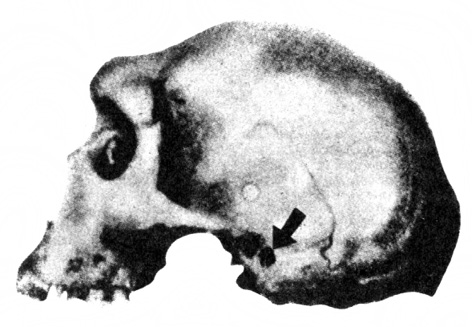
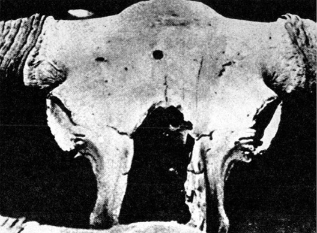
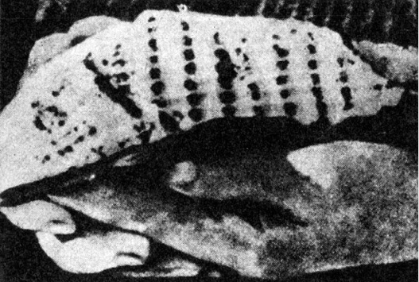

> _Tyto hodnoty zavržené kritikou a duchem systému  
> nezapomněly na lekci, jíž se jim dostalo, a mohou dnes  
> protivníka napadnout jeho vlastními zbraněmi._

ROGER CAILLOIS: MÝTUS A SPOLEČNOST

V Britském muzeu je chováno mnoho lebek neandertálců. Po původním objevu v západním a středním Německu byly pozůstatky neandertálských pralidí, dlouho považované za daleko mladší kosterní zbytky nemocných nebo duševně postižených jedinců, nalezeny i ve Francii, v Belgii, ve Španělsku, v Jugoslávii, v ČSSR, v Maďarsku, v Itálii, v Anglii, v SSSR, v Palestině, na Jávě a ovšem i v pravděpodobné kolébce člověka vůbec, v Africe, v Saldanhe a na slavném nalezišti Broken Hill. Jedna z brokenhillských lebek je pozoruhodná přesným kruhovým otvorem, pronikajícím spánkovou kostí do lebky. Kolem otvoru nejsou pukliny, jež by nevyhnutelně vznikly např. při proražení lebky hrotem špičáku při vykopávkách, nebo dokonce za života neandertálce jakoukoli tehdejší zbraní (v podstatě existovaly jen pěstní klíny, kyje a nejspíše i kostěné dýky). Charakter zranění neodpovídá ostatně takovému mechanismu. Pozoruhodné je, že protější spánková kost lebky chybí, jako by byla vyražena. Tak by tomu bylo při zásahu např. moderní loveckou kulovnicí: hladký vstřel a po zploštění projektilu mohutný otvor výstupu střely.

Původcem podivného otvoru nebyl ani vrtavý mlž, houba (Vioa) nebo červ, kteří namnoze rozrušují fosilie, jež se ocitly v moři. Broken Hill byl ostatně vždy na souši. Pozoruhodné je, že místo zranění přesně odpovídá „smrtelné zóně“ – v případě střelné rány musel být neandertálec okamžitě mrtev. Ačkoli jsou známy okolnosti nálezu lebky, nelze zcela vyloučit špatný vtip: dodatečné prostřelení lebky.

  

> Lebka neandertálce z Broken Hillu, perforovaná v oblasti spánkové kosti otvorem vysvětlitelným pouze vstřelem

Co však říci dalšímu podobnému nálezu, pocházejícímu tentokráte z okolí dnešního Jakutska a uloženému v moskevském Paleontologickém muzeu Akademie věd SSSR?

Je to lebka pratura, rovněž, jak se zdá, zasažená střelou v oblasti „smrtelné zóny“, totiž přesně v ose čelní kosti, jako by střelec čelil útoku mohutného zvířete, nastavujícího mu skloněnou hlavou právě tuto partii lebky. Také v tomto případě nejsou v okolí rány praskliny a činnost vrtavých mlžů je možno vyloučit; lebka je skvěle zachovaná a zcela určitě neležela v moři. Ani chorobný proces, tzv. osteomyelitida, nemůže zanechat takovou stopu, tím méně např. roh konkurujícího samce. Pikantní podrobností v tomto případě je, že se rána, jakkoli pronikla lebkou a zasáhla zřejmě mozkovnu, počala hojit kostní jizvou, svalkem. Není tedy pochyby o jejím datování. Vznikla v době života pratura – přibližně před několika desítkami až stovkami tisíců let, a kdoví zda ne přesně v době, kdy byl zabit i neandertálec v oblasti Broken Hillu. Ráže střely, jež mohla způsobit obě zranění, se zdá odpovídat. Obě mohla být na střeleckém kontě jedné jediné zbraně s podobným účinkem.

  

> Lebka pratura, uložená v Moskevském přírodovědeckém muzeu. Střelné (?) poranění čelní kosti se počalo hojit

Přesné datování obou nálezů radiokarbonovou analýzou není možné – fosilní kosterní zbytky rychle ztrácejí organické látky a kromě toho kosti z naleziště Broken Hillu jsou prostoupeny rozličnými fosforečnany, především zinku a olova. Geologické (stratigrafické) i paleontologické vědomosti však naznačují, že neandertálec i pratur mohli být současníky.

Kdo to tehdy chodil po naší planetě, ozbrojen průbojnou palnou zbraní poměrně malé ráže, a tedy značně dokonalou?

Kdo nebo co zanechalo v pískovci pouště Gobi v Mongolské lidové republice otisk, nalezený společnou sovětsko-čínskou expedicí roku 1959? Nepodobá se žádnému fosilnímu reliktu, vědě až dosud známému, nepodobá se ani stopě, kterou může zanechat některý nám známý kráčející, plazící se nebo lezoucí tvor. Zato se velice nápadně podobá otisku profilované podrážky, tzv. traktoru, jaký používají posádky Apolla na Měsíci jako nejpružnější obuvi, zajišťující nejlépe tření a tím pevný postoj za všech okolností.

  

> Podivný „otisk podrážky“, nalezený sovětsko-čínskou expedicí v poušti Gobi

Otisk je několik desítek nebo set tisíc let starý, nevznikl rozhodně v historických dobách, a obzvláště zajímavým jej činí plochy písku, změněného v pouštní sklo, nalezené v okolí Gobi.

Nejde o účinek blesků. Tzv. fulgurity, vznikající natavením horniny úderem blesku ve formě sklovitých trubiček, vypadají docela jinak. Exploze meteoritu mohou ovšem horniny roztavit a vytvořit tzv. impaktity, ale rozstříknou je do širokého okolí. Nikdy nebyly pozorovány celé skelné plochy, jakási „přírodní kluziště“, jejichž meteoritický mechanismus vzniku bychom asi těžko vysvětlovali. Kromě toho nejsou impaktity nikdy dokonale protaveny. Daleko spíše se zdá, že zde místně působil mimořádný žár, který jako ve sklářské peci změnil písek ve sklovitou taveninu. Muselo jít o žár kolem 1400 °C –1600 °C – tavení křemene pro optické a jiné účely se podařilo nepříliš dávno a je dodnes spojeno s obtížemi. V žádném případě tedy nevytvořily ony plochy roztaveného křemenného písku např. lesní požáry v době, kdy Gobi byla ještě před vrásněním Himálaje, zadržujícího dnes vláhu od jihu, kvetoucím krajem a eldorádem praještěrů…

Fantastickým vysvětlením je např. místní působení raketových trysek, jejichž žár by rozhodně stačil podobnou přeměnu provést. Přijmout takovou hypotézu je ovšem značně odvážné, avšak jiné a schůdnější vysvětlení lze těžko nalézt. Tím spíše, že se nadhozený problém velmi úzce týká i jedné z našich zajímavostí, českých taktitů, vltavínů.

První sběratelé těchto přírodních skel, nalezených poprvé asi před 180 lety u Týna nad Vltavou a později postupně v nejrůznějších částech světa, se domnívali, že jde o odpad ze starých skelných hutí. Objevily se i fantastické domněnky o přetavení rostlinného popela a další. Geochronologické určení stáří vltavínů na 14,8 miliónů let zasadilo této teorii smrtelnou ránu. Padly i další teorie o prostě sopečném nebo meteoritickém původu tektitů, ať už změnou hmoty meteoritů jejich rozžhavením při průletu armosférou nebo odkapáváním, či konečně roztavením hmoty meteorického roje, který se ocitl v blízkosti Slunce a doplatil na to podobně jako bájný Ikaros. Mnoho autorů považovalo tektity za vyvržený materiál měsíčních sopek, jiní za roztavené horniny, „vystřelené“ z povrchu Měsíce dopadem velkých meteoritů. Pozoruhodné – ale ne tak neobvyklé – je, že všichni přinesli pro své domněnky celou řadu znamenitých argumentů: pokusy, prováděné ve vzdušných tunelech při nadzvukové rychlosti tavící horniny, propočty oblastí, kam by byly tektity vyvrženy měsíčními sopkami, atd. atd., ochotně svědčily tu té, tu oné teorii…

Astronom českého původu Z. Kopal, s ním L. J. Spencer a další vybojovali místo na slunci teorii, která je dnes přijímána většinou vědců: tektity vznikají při dopadu obrovských meteoritů na Zemi z roztavené hmoty zbytků meteoritu i zasažených hornin při teplotě až 2500 °C, jsou rozstříknuty do vzdálenosti až 500 km a dopadají, ochlazeny ve vysokých vrstvách atmosféry či v kosmickém prostoru, do míst, kde je nacházíme.

Tektity postupně nalézaly své „otce“. Pro české a moravské vltavíny byl přiřčen meteoritický kráter Riess, Steinheim a v roce 1972 i Stopfheim na území Švábska v NSR, pro australity astroblém v oblasti Wilkesovy země v Antarktidě atd. Všechno opět souhlasí, včetně zjištěného stáří tektitů i jejich otcovských kráterů. Je tu však háček.

Pro celou řadu tektitů nebyly vhodné impakty nalezeny – což by konečně nebylo takové neštěstí. Dávné jizvy na tváři Země (ačkoli australity jsou staré jen 5000 let a tektity jihovýchodní Asie, mezi nimi až dosud nejtěžší o váze 12,8 kp, 610 000 let) mohly být zahlazeny. Vážnější námitky vznášejí geologové, odmítající meteoritický vznik kráterů Riess a dalších; dokazují, že jsou projevem tzv. kryptovulkanismu, tj. sopečné činnosti, nedoprovázené výlevy lávy ani dopadem sopečného popela.

Největším otazníkem – a tím se dostáváme k vlastnímu tématu – je však značně odlišné složení vltavínů a impaktitů (suevitů, meteoritických skel, aj.) z předpokládaných „otcovských“ kráterů. Složení vltavínů odpovídá nejspíše chemickému složení granulitu (bělokamene), kterého je v oblasti výskytu jihočeských vltavínů dostatek, z něhož při tavení část alkálií, především sodík a draslík, vytékala. Zdá se, že tedy vltavíny vznikly spíše přetavením místních materiálů než vzdušným importem z daleka. Tato domněnka je podporována i zajímavou skutečností: zatímco naleziště jihočeských vltavínů leží v oblasti, kde se granulit vyskytuje takřka všude, je moravské naleziště vltavínů od Třebíče kolem povodí Jihlavky a jihovýchodně ke Znojmu prakticky jediným místem, kde moravský granulit vystupuje na povrch. Je to na geologické mapě taková „nudlička“, že je ji nutno takřka hledat lupou (podle ing. Patrovského).

Není trochu přílišná náhoda, dopadnou-li víceméně nahodile rozstříknuté kapky roztavené horniny právě na velmi omezený a geologicky přesně určený proužek země, ještě ke všemu nespojitý? Nepůsobil zde spíše místní činitel X (říkejme mu tak), který vysokou teplotou nejméně 1800 K, při níž lze tavit tektity, vzdorující i dmuchavce, dokázal přeměnit granulit ve zvláštní přírodní sklo? A nemohly být tímto činitelem X plameny trysek raket, ačkoli se raketový pohon zdá být pro pokročilou kosmonautiku trochu primitivní?

Ostatně je zde ještě další možnost, jak mohlo dojít k místnímu roztavení písku nebo jiných hornin a k jejich proměně v přírodní sklo: žár atomového výbuchu.

Velmi zajímavým je v tomto ohledu čistě křemenné sklo Libyjské pouště, – nacházené asi 800 km jihozápadně od Káhiry na ploše 136 km × 56 km, tedy odpovídající přibližně nalezištím českých a moravských vltavínů. Vzniklo zřejmě přetavením pouštního písku a je většinou považováno za impaktit, avšak ani kráter, ani zbytky meteoritu nebyly nalezeny. Za nejzajímavější je považována skutečnost, že libyjské pouštní sklo se nachází i v dost velkých kusech (v káhirském muzeu je exemplář hmotnosti 525 g), avšak přesto dokonale protavené, čiré, homogenní a čisté. Ostře se odlišuje od všech ostatních přírodních skel, ať již jde co do vzniku o skla sopečná (obsidián), impaktity nebo pravé tektity, zato však se některými znaky blíží sklu, vzniklému z hornin při výbuchu atomové bomby u Alamogordo v Novém Mexiku. Na podobný terénní útvar upozornil již sovětský badatel Kogen.

Je pochopitelné, že tato shoda nejen zaujala vědce, ale i romantické laiky, a byla (navzdory poměrně značné vzdálenosti obou míst) uváděna v souvislost se zkázou Sodomy a Gomory – existovala-li ovšem obě města. Sovětský fyzik, profesor Matvěj Agrest navrhl pátrat jak v Libyjské poušti, tak v okolí Mrtvého moře po radioaktivních izotopech s dlouhými poločasy rozpadu, jež by se zde měly v případě dávných jaderných explozí vyskytovat ve zvýšeném množství, především po Si 32, Ti 44, Mn 50 a dalších. A hle: ředitelství jaderného výzkumu v EAR zvýšený podíl těchto izotopů v okolí Riachu, Dariatu a na Sinajském poloostrově potvrdilo.

J. Alden Mason, americký etnograf a paleoantropolog, nalezl při vykopávkách na peruánské náhorní planině ozdoby, odlévané (nikoli tepané) z platiny.

Materiál sám není překvapující. Platina se vyskytuje v naplaveninách a v písku vždy ryzí s příměsí ruthenia, rhodia, palladia, osmia a jiných kovů a vyskytuje se i na různých místech Jižní Ameriky, především v Kolumbii. Podivné na celé historii je, že platina taje při 1773 °C a její odlévání je práce pro dobře zařízené metalurgické provozy.

Nejschůdnější cestou, jak platinu roztavit, je použití elektrického oblouku, mají-li se vyrobit platinové elektrody, kontakty, termočlánky atp., případně části šperků. Krajní možností je kyslíko-vodíkový plamen. Při použití konvenčních tepelných zdrojů (pícek a topiv) prostě platinu zpracovávat nelze, tím méně uvést do stavu, umožňujícího odlévání.

Kdo znal způsob, jak dosáhnout trvalé teploty kolem 1800 °C v době, o níž předpokládáme, že disponovala jen nejprostšími výrobními prostředky? Byla to snad civilizace, jež podle starých bolivijských a peruánských legend podlehla v boji s nelidským plemenem, jehož krev nebyla červená? Nebo to bylo právě ono plemeno?

Ostatně pěknou metalurgickou záhadu poskytla i Čína. V hrobě proslulého vojevůdce Cao Čou, žijícího v letech 265–316 n. l., byl nalezen pancíř, přesněji řečeno válečná košile, pošitá destičkami ze slitiny 10 % mědi, 4 % hořčíku a 85 % hliníku.

Hliník, ač třetí nejrozšířenější prvek v zemské kůře (po kyslíku a křemíku), se v přírodě vyskytuje výhradně ve sloučeninách. Špetku nečistého hliníku se podařilo chemickou cestou připravit teprve H. Ch. Oerstedtovi roku 1825. Průmyslová výroba však byla umožněna teprve o něco později a světový chemický kongres uctil svého nestora a vůdčího ducha D. I. Mendělejeva pohárem z nejvzácnějšího kovu – hliníku…

Jak získali staří Číňané – jakkoli si jejich důvtipu neobyčejně vážíme – hliník v kovovém stavu? Měli snad zdroje elektrické energie, umožňující elektrolýzu? Nebyl pro ně problém sestrojit například vhodnou pec pro tavbu bauxitu, kde dosahovali nezbytné teploty 1300 °C pro spékání bauxitu se sodou a vápencem, aby získali hlinitan sodný, který žíháním při téže teplotě přechází v kysličník, a ten pak v roztaveném kryolitu s fluoridem hlinitým při 950 °C elektrolyzovali za použití elektrod z čistého grafitu? V Americe si s tímto problémem poradili teprve roku 1886, v Evropě o rok později Francouz P. Hérault. A vyplatilo se vyrobit tímto značně složitým způsobem jen pár plíšků pro brnění pana generála? Je vůbec plátovaná válečná košile přiměřeným stejnokrojem vojevůdce, jenž má k dispozici tak rozvinutou technologii? Nebo šlo o zbytky plechů, zděděné z dávné minulosti? To se zdá pravděpodobnější.

Obecně lze k tepelnému zpracování minerálů říci, že zvyšování teploty asi do 1000 °C není zvlášť obtížné a daří se i velmi primitivními prostředky. Dále však je třeba o každých 50 °C urputně a důvtipně bojovat. A mít prostředky.

V rovníkové západní Africe byly od starověku až bezmála do dnešních dnů nejvyhledávanějším zbožím podivné skleněné perličky, zvané aggry. Byly válcovitého tvaru, modré, žluté, zelené nebo různobarevné vykládané. Domorodci jim připisovali čarovnou moc a několikanásobně je vyvažovali zlatem. Je pochopitelné, že se Evropané, nacházející právě v západní Africe skvělou bonanzu zlata, otroků, slonoviny a dalšího zboží, usilovně snažili záhadné aggry napodobit ve vynikajících benátských i českých sklárnách. Snahy skončily fiaskem. Nepravé aggry se od původních lišily na první pohled a domorodci je s posměchem a opovržením odmítali. Zdroj pravých agger, zřejmě velmi starobylý, se nepodařilo nalézt. Portugalská znalost dnešní Brazílie před Kolumbem byla např. s jistotou prokázána zjištěním benátských perel, jimiž se zdobily indiánské krasavice, vyráběných speciálně pro Portugalsko. Aggry vzdorují. Jejich výroba v Egyptě nebo ve Fénicii je jen předpokládána, ale ve sklárnách odkrytých archeology nebylo nalezeno nic aggrám podobného.

Západoafričtí domorodci sami původ perliček neznali, měli však o něm pěknou legendu: přinesli prý je lidé světlé pleti a dlouhých vlasů, kteří se snesli z nebes…

Již v 16. století objevili Španělé ve stříbrných dolech v Peru 18 cm dlouhý „hřebík“, zcela zarostlý v rudě a zjevně železný nebo ocelový, ačkoli přítomnost železa ve stříbrných rudách je značně nepravděpodobná. Daleko spíše lze spolu se stříbrem nalézt olovo nebo zinek.

V australských vrstvách třicet miliónů let starých byl rovněž nalezen opracovaný kus železa meteoritického původu a ve skotských uhelných žilách byly rovněž nalezeny kovové předměty, jejichž přírodní vznik si nedovedeme na úrovni dnešních znalostí představit.

Po druhé světové válce byly obnoveny intenzívní průzkumy v oděských přirozených i umělých katakombách (dlouhých přes 600 km), jež se staly za války útočištěm několika oddílů hrdinných partyzánů. Při těchto výzkumech, prováděných nejen vojenskými odborníky a historiky, ale i paleontology, byly odkryty jeskyně, sloužící již dávno před historickými dobami jako útulky člověka a ještě dříve jako skrýše pravěkých zvířat. Vědci T. J. Gricaj a I. J. Jack nalezli v jedné z nich fosilizované kosti vyhynulých pštrosů, velbloudů a hyen, kteří tu kdysi žili dávno před vstupem člověka do kamenné doby – alespoň na evropském kontinentu a podle našich dnešních představ. Tyto kosti jsou opracovány jemnými nástroji, zřejmě podobnými vlasovým pilkám. Jsou z nich vyříznuty tenké destičky, téměř lupínky, jiné nářezy zůstaly nedokončené a dokazují účinnost a úzký břit nástroje, jaký si nedovedeme představit ani ve vlastnictví středověkého řemeslníka.

Při četbě o tomto nálezu jsem si vzpomněl na první praktické aplikace elektřiny v telegrafech systému Jacobiho, Wheatstonea, Cooka, Steinheila, Gausse a dalších. Jako izolátorů bylo vesměs používáno – z neznalosti a nedostatku lepších materiálů – slonovinových nebo kostěných destiček.

Jako autor vědeckofantastických románů si docela dobře dovedu představit například kosmonauta, který po havárii pracně opravuje svůj vysílač, jedinou naději na přivolání pomoci, tím, co mu divoká a mladá planeta právě poskytla…

Německý archeolog Wilhelm König vykopal roku 1938 nedaleko Bagdádu předmět, který – nebýt všetečnosti vědců těsně po II. světové válce – by zcela určitě byl zařazen do muzejních sbírek jako „kultovní předmět“ nebo mezi „různé“, jako zcela podobné objekty, uložené do té doby v berlínských muzeích. Všechny pocházejí z oblastí a dob Parthů, íránských kočovníků, kteří několik set let před naším letopočtem založili mezi Kaspickým mořem a Perským zálivem rozlehlou říši.

Nález nevypadá příliš okázale. Je to asi 18 cm vysoká nádoba z pálené hlíny, do které je zasunut 10 cm vysoký válec z měděného plechu, jehož šev je řemeslně vzorně spojen lehko tavitelnou slitinou, obsahující 60 % olova a 40 % cínu. Měděné dno válce je izolováno asfaltem, aby nedošlo ke styku se železnou tyčinkou, provlečenou víčkem, rovněž izolovaným asfaltem.

Naplní-li se tato nádoba vhodným elektrolytem, máme zde zdroj stejnosměrného proudu, elektrogalvanický článek, sestrojený pěkně dávno před Voltovým vynálezem z roku 1800.

Pak tedy některé měděné vázy z této kulturní oblasti, zdobené zlatem a stříbrem, by vděčily za svůj vznik elektrochemickému pokovení. Vypadá to hodně divoce, ale na vlastní oči jsem viděl, že bagdádští zlatníci dodnes používají (ačkoli lze pochopitelně koupit suché baterie v každém odborném krámě i stánku na bazaru) zcela totožných článků pro elektrogalvanické pozlacování v kyanidové lázni.

Kde, kdy a jak se elektrogalvanický článek mezi kočovníky, kteří určitě nebyli příliš hloubavými vědci, objevil?

Roku 1900 zakotvil Kondos, kapitán lodi lovící v Egejském moři mořské houby, u mysu Glyphadia na Antikythéře, kam jej zahnala nenadálá bouře. Nechtěl přerušit lov, a jakmile se hladina poněkud uklidnila, poslal na dno jednoho ze svých potápěčů, jenž při prvním ponoření objevil několik bronzových soch a vynesl ruku jedné z nich, zřejmě antické práce.

Po nezbytných průtazích se o nálezu dozvěděl řecký ministr osvěty, sám vášnivý archeolog-amatér, jenž zajistil prostředky na vyzvednutí nálezu. Ministr si povšiml jednoho bronzového zlomku, značně rozrušeného mořskou vodou a pokrytého usazeninami. Věnoval mu mimořádnou péči a k naprostému údivu se mu podařilo vyloupnout z inkrustací řadu velkých i menších – ozubených koleček…

Později bylo zjištěno, že jde o neobyčejně složité astrolabium, komplikovaný, ač formátem kapesní přístroj s mnoha důmyslnými převody, umožňující díky řadě číselníků, připouštějících korekce posunutím stupnic, aby byl egyptský kalendář o 365 dnech (bez přestupných let) uveden do souladu se slunečním rokem, určit pouhou manipulací číselníky po celý rok východy a západy jasných hvězd, Slunce, Měsíce i známých planet.

Výzkum astrolabia, které se potopilo – jak zcela přesně víme – i s lodí řeckého obchodníka, plujícího do Říma nebo do Athén, roku 80 před n. l., není ještě zdaleka dokončen a přístroj sám je přísně střežen v athénském Národním muzeu. Romantičtější autoři v něm spatřovali navigační přístroj cizích kosmonautů, což je zřejmě nesmysl – jde určitě o astronomickou nebo astrologickou pomůcku, patřící snad původně slavnému hvězdáři Geminovi, žijícímu kolem roku 77 před n. l. na ostrově Rhodu.

Tím však není astrolabium méně zajímavé. Naskýtá se řada otázek.

Především zjevná technická úroveň výrobku, co do jemnosti a dokonalosti zpracování nesrovnatelně vyšší než veškeré nám známé antické přístroje. Geometrické modely sluneční soustavy, které prý znal Platón, Aristoteles a Archimédes a o nichž se zachovaly až do středověku (v 9. století u Arabů) jen zcela nejasné zprávy, byly takřka určitě primitivnější a nedovolovaly převod numerických operací v mechanickou manipulaci, existovaly-li vůbec.

Jemnost provedení soukolí a redukcí dosahuje úrovně vrchol­ných výrobků renesančních hodinářů nebo zhotovitelů vynikajících astronomických přístrojů. Ostatně samo použití ozubených kol je záhadou. Pojednává o nich sice již pseudoaristotelský spis Mechanické problémy asi z roku 330 před n. l. i Vitruvius ve svých knihách o architektuře, ovšem šlo vždy buď o teoretizování, nebo o velmi primitivní ozubená kola příčková, dodnes sloužící např. ve vodních čerpadlech přírodních národů. Teprve od druhé poloviny 17. století se počíná uvažovat o správném tvaru ozubení. Stroj pro výrobu ozubených kol navrhl neúnavný Leonardo da Vinci asi kolem roku 1500, zůstalo však při projektu a výroba ozubů se rozvíjela pracně a pomalu spolu se zdokonalováním hodinových strojů.

Ještě větším otazníkem je geniální a v nejvlastnějším slova smyslu převratný nápad na sestrojení mechanického pomocníka aritmetických operací, o němž nenacházíme ve starověku a středověku ani zmínku. Teprve osmadvacetiletý Blaise Pascal sestrojil roku 1652 primitivní sečítací stroj. Po něm následovali další vynálezci, avšak dokonalosti, srovnatelné s astrolabiem, dosáhl nejspíše teprve F. M. Hahn roku 1770…

Zdá se, že u Antikythéry bylo zkrátka nalezeno cosi podobného parthskému elektrogalvanickému článku, cosi naprosto nezapadajícího do kontextu historického a technického vývoje, převzatého z minulosti a představujícího spíše napodobení dokonalejších dávných vzorů.

Každý z nás, žijících v cihlových domech, udělal tutéž zkušenost: hřebík či skobku pro zavěšení obrazu se mu podařilo zatlouci do zdi teprve po několika pokusech, když se šťastně strefil mezi cihly do měkčí malty. Zeď po této proceduře vypadá, jako by ji kdosi opracoval hráběmi.

Starořímské (a mnohé další) stavby byly asi zdrojem opačných obtíží. Stojí podivuhodně zachované už 2000 let, aniž cihlové klenby povolily. A zbudovat cihlovou klenbu takových monumentálních rozměrů, jako např. v římských Caracallových lázních, není právě snadné. Teprve dnes, díky průmyslovým exhalacím, ničícím všude na světě kulturní památky a urychlujícím i u nás rozpad kamenných barokních soch desetinásobně až stonásobně, počínají podléhat zubu času. Cihly se drolí a rozpadají. Římská malta však statečně odolává. Je tvrdší betonu. Odlomit nepatrný kousek k chemickému rozboru (což jsem s povolením ctihodného kustoda učinil) vyžadovalo ocelové dláto, kladivo a pořádnou práci. Výsledkem bylo ztupené dláto a kousíček malty jako oříšek.

Římané a další starověké národy především v Mezopotámii, odkud znalost přešla přes Řecko do Říma, přidávali do svých tzv. hydraulických malt (které ve vodě dále tuhnou a zvyšují pevnost) zvláštní přísady, např. hlínu, těženou u dnešní Neapole, nebo cihlovou drť. Moderní stavitelství se snažilo je napodobit – J. Smeaton (1724–1792) postavil u Plymouthu v Anglii Eddystonský maják s použitím silně hydraulického vápna a svou maltu hrdě nazval římským cementem, z něhož se v 19. století vyvinul cement portlandský. Bohužel – byl to pouhý název. Žádný z našich cementů ani zdaleka nedosahuje tvrdosti skutečné římské malty. Tajemství se ztratilo – američtí technikové sice zjistili, že lze kvalitu cementu zvýšit přidáním cukru, ale náklady se tím neúměrně zvýší. Německým technikům bylo přikázáno napodobení římského cementu jako jmenovitý úkol pro opevňovací účely. Neuspěli. Technologie nejméně 3000 let stará odolává.

Podobnou ztracenou technologickou znalostí je zvláštní úprava mědi v říši Inků. Železo neznali – leda z nahodilých nálezů sideritů, železných meteoritů. Zato, jak alespoň tvrdili španělští vojáci, byly jejich nože, sekery a hroty kopí, zhotovené z mědi nebo spíše slitiny mědi, tvrdší než pancíře výzbroje loupeživých dobyvatelů, ostřejší než čepele ocelových dýk a pružnější než nejkvalitnější toledské čepele mečů. V žádném případě to nebyl onen poměrně měkký, ohebný a snadno tažný kov, známý v Evropě již asi od roku 2500 před n. l. jako první prakticky užívaný kov vůbec (nehledě na paleolitické nálezy opracovaných sideritů).

Dnešní metalurgie dovede sestavit vzorce slitin mědi podle přání. Dovede vyrobit dělovou bronz, tvrdou takřka jako ocel, avšak nikoli pružnou, umí vyrobit měď pružnou, ale nikoli tvrdou. Žádná ze slitin mědi nespojuje všechny požadavky tak ideálně jako výrobky z říše Inků.

Bohužel, žádná z těchto zbraní se nezachovala, aby bylo možno učinit metalografickou analýzu. Vzaly za své nejen korozí, ale především díky lačnosti dobyvatelů, kteří sice hledali především zlato a stříbro, ale nepohrdli ani jinými kovy.

A ještě jednou se vraťme na skok do Říma: podle písemných zpráv i podle zachovaných šperků a ozdobných předmětů, intarzovaných plátky slonoviny tak dokonale, že mezi nimi nevznikají mezery ani při prudkých změnách teploty, se zdá, že římští řezbáři slonoviny znali (a přísně tajili) způsob, jak slonovinu změkčit, zformovat a opět ztvrdit.

Slonovina, vlastně zubovina sloních klů, byla odedávna zpracovávána v Egyptě, egejské oblasti, Mezopotámii, na Krétě a v Řecku, odkud jako ozdobný materiál přicházela i do římských oblastí. Nedovedeme si dnes ani zdaleka představit, jak změkčit zubovinu bez naprostého rozrušení (např. odvápněním) – znovuobjevení této zajímavé techniky by určitě potěšilo výrobce „pravých“ kulečníkových koulí a umožnilo jim používat i zbytků materiálu. Daleko více než potěšení těchto pánů mne však zajímá perspektiva využití staronové techniky v zubním lékařství, jehož obecně nemilované zákroky vrtačkou (ať už starou či hypermoderní) by bylo alespoň zčásti možné nahradit zákrokem zcela bezbolestným…

Změkčování mamutoviny bylo ostatně známo i paleolitickým zakladatelům světoznámé nekropole Sungir u Vladimiru, šlo tedy patrně o techniku sice geniální, ale nenáročnou a prostou. Potvrdily to vykopávky tisíců a tisíců předmětů z mamutoviny, mezi nimiž byla i řada dlouhých dýk a kopí, rovných, dvoumetrových, i delších. Podle výzkumů T. Bulavincevové, která se specializovala na vztahy člověka a mamuta v paleolitu, bylo třeba ke zhotovení takového oštěpu (který je opravdu z mamutího klu, nikoli např. z rohu narvala) narovnat dvě stě kilogramů hmotný kel. Jak – to bohužel ani netušíme.
