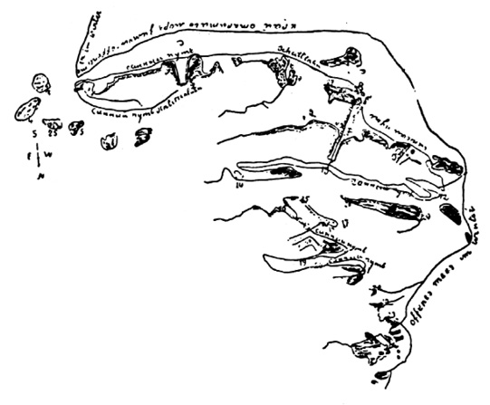
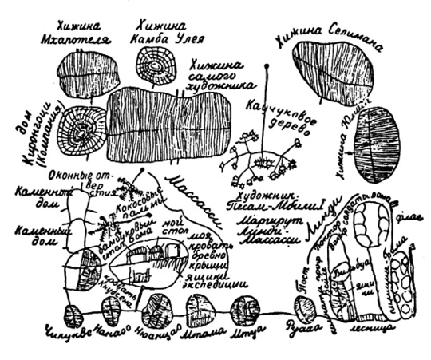

<section>

> _Již mnoho set let před naším letopočtem byl člověk nucen  
> konat na zemském povrchu různá měření a výsledky  
> znázorňovat kresbou.  
> I starověcí kulturní národové – Egypťané, Babylóňané,  
> Féničané a potom Řekové a Římané – zkoumali povrch  
> nejen svých, ale i jiných zemí a zhotovovali kresby, které byly  
> pravzorem dnešních plánů a map._

PROF. DR. G. N. LIOTD

Před několika lety vzbudily pozornost čtenářů světového tisku články, obírající se mapami, jejichž autorem byl roku 1413 vysoký důstojník tureckého loďstva Piri Reis a roku 1431 kartograf Orontius Fineus.

Bylo to vlastně obnovení zájmu o Reisovu mapu – již dávno před válkou dal tehdejší státní tajemník USA Henry L Stimson přezkoušet, zda Piri Reis nepoužil Kolumbových map, jejichž originály se ztratily a jejichž rekonstrukce by byla významným příspěvkem k dějinám USA. Výsledek byl negativní a zájem kartografů nevelký vzhledem k hrubému zkreslení karibské oblasti i linie pobřeží jižní části Jižní Ameriky. Originál mapy se s formálním vyjádřením díků vrátil do cařihradského archívu muzea Topkapi, aby dál v klidu a bez zájemců odpočíval, jako už několik staletí.

Mapa na první pohled prozrazuje arabské autory z doby vrcholného rozvoje arabské kartografie, zprvu značně handicapované maurskou oblibou geometrizace, nepřipouštějící přesnou kresbu, a snad i nedostatečným cvikem v kreslení a malování, jež korán s výjimkou kaligrafie a ornamentiky výslovně zakazoval. Podle některých názorů byli Arabové ve vědě pouhými řemeslníky, ni­koli tvůrci, a své kartografické znalosti převzali od Řeků. Jejich jedinou, avšak nespornou zásluhou v této oblasti je, že uchovali kartografické poznatky antické vědy, vydávali díla řeckých kartografů a jejich mapy. Arabské mapy sloužily za podklad zhotovování pozdně středověkých a raně novověkých kompasových map, tzv. portolánů, se zanesenou sítí kompasových růžic pro různé body, umožňující plavcům snadnou orientaci a rychlé nalezení vhodného směru k cílovému přístavu. Přesnost těchto map je pozoruhodná a představovaly po několik staletí vrchol kartografického umění – ani zde však nebyli Arabové původními. Kompas i jeho užívání převzali od Číňanů, kteří již v hlubokém starověku ovládali vyměřovací a kartografické práce a ve 2. století n. l. zřídili dokonce zvláštní kartografický úřad. Čínská znalost kompasu se podle některých autorů datuje do 11. století před n. l., podle jiných až do 2. století n. l.

V každém případě bylo při tomto skeptickém přístupu ke kartografickým výkonům Arabů překvapením, když si někteří zeměpisci povšimli zvláštní podobnosti obrysů pevniny a karibských ostrovů ve zcela zkreslené a zdánlivě kartograficky nesmyslné a vybájené mapě Piriho Reise s mapami, jež přikázalo ke zvláštním účelům plánování operací v severní Africe zhotovit americké ministerstvo války během II. světové války v tzv. ekvidistantní projekci. Roku 1953 bylo faksimile mapy Piriho Reise předloženo k prozkoumání americkému kartografovi, námořnímu kapitánu a později autorovi knihy Ztracená Amerika Arlingtonu H. Mallerymu. Všiml si zvláštní projekce, naznačující, že vědeckotechnický postup při zhotovování mapy, tedy její matematický podklad (pokud smíme vůbec o takových úvahách na přelomu 14. a 15. století mluvit), nesvědčí ani pro předpoklad ploché Země, který právě tehdy počal podléhat představám o zemském glóbu, ani pro snahu o prosté převedení povrchu zemského geoidu do plochy, jež se ostatně podařilo teprve holandskému vědci a kartografovi Gerhardu Mercatorovi (1512–1594). Dalším zkoumáním se proto zabýval praktický kartograf Walters, jenž nalezl použitý způsob projekce a přenesl mapu, zobrazující značnou část světa (což je samo o sobě pro tehdejší dobu značně neobvyklé), na kouli.

Ve spolupráci s dalším vědcem zjistil, že obrysy kontinentů a jejich zakreslených útvarů, poloha a tvary ostrovů jsou mimořádně přesné nejen v oblasti odedávna známé a na mapě nepříliš, i když znatelně zkreslené, totiž kolem Středozemního moře, ale i na druhé straně Atlantiku, kam se zatím dostalo jen velmi málo Evropanů, kteří ještě zdaleka neměli čas a možnost utvořit si celkový obraz o tvaru pobřeží nového kontinentu, o jeho vnitrozemí ani nemluvě.

Tím větší byl otřes, když výbor geofyzikálního roku 1955, jenž za jeden z dílčích úkolů přijal i nový průzkum map Piriho Reise, sdělil výsledky ředitele observatoře ve Westonu a šéfa kartografie námořnictva USA Daniela Linehana. Linehan potvrdil po jistých posunech, vzniklých nesprávným spojením původních map, správnost obrysů Severní Ameriky, umístění zakreslených jezer a hor v Kanadě, včetně nejzazšího severu kontinentu, polohy Falklandských ostrovů, známých teprve koncem 16. století, a co nejzajímavějšího, obrys Antarktidy, nikoli jak ji mapujeme pomocí leteckých snímků, nýbrž Antarktidy pevninské, zbavené ledového příkrovu a holé (její tvar pracně zjišťujeme díky možnostem gravimetrie, magnetometrie, seizmologie a dalších pomocných věd). Řadu útvarů zanesených na mapě Piriho Reise potvrdili polárníci teprve zcela nedávno. Autentičnost Reisovy a Fineovy mapy plně potvrdil např. polárník kapitán Finn Ronne, kdysi průvodce admirála Byrda a později koordinátor britsko-norsko-švédské výpravy do Antarktidy. Hory jižního kontinentu, zakreslené na těchto mapách jako ostrovy, jsou skutečně na svých správných místech a jsou to ostrovy, pokryté souvislou vrstvou ledu, spojující je s pevninou v oblasti země královny Maud. To však zjistily seizmické sondy teprve v letech 1949–1952…

Vyrojila se spousta dohadů – mimo jiné se o ně zasloužil i Däniken domněnkou, že zde zasáhli nepozemšťané, kteří poskytli lidstvu jako kartografický podklad letecký či kosmický snímek ze svého kosmoletu, „vznášejícího se nad Káhirou“.

Asi toto se tedy svět dozvěděl o podivných mapách Piriho Reise a – jaký div? – užasl. Zcela originálně zapůsobily publikované články v Turecku; kromě pochopitelné pýchy, že si nepozemšťané vybrali k osobním kontaktům právě vynikajícího reprezentanta pravé víry, a ne nějakého nevěřícího, si Turci záhy povšimli, že na mapě je arabským písmem zmínka o Kryštofu Kolumbovi, což panu Dänikenovi, neznalému arabského písma, uniklo. V Cařihradu vypukla horečka hledání původní Kolumbovy mapy, tím spíše, že Turci existenci této mapy s jistotou předpokládají. Puntičkářský Piri Reis by se byl nepochybně zmínil o pouhých ústních informacích, kdyby se mu takových dostalo a kdyby byly pro kartografa jako podklad k sestavení mapy dostatečné – což si lze stěží představit. Existenci Kolumbovy mapy v cařihradských archívech ostatně tušil už osvícený prezident Kemal Atatürk a osobně nařídil po vzácném pergamenu pátrat. Bezvýsledně. Stav archívu osmanských sultánů v paláci Topkapi (kde je mj. umístěno i muzeum a kde byla roku 1929 objevena nešťastná Reisova mapa) učinil z hledání mapy akci ještě beznadějnější než pátrání po legendární jehle v kupě sena. Dnes však došlo k prudké recidivě mapové horečky. Zúčastňují se jí úředníci, přehrabávají hory dokumentů, naházených prostě do sklepů, ctižádostiví soukromníci i hejno detektivů, prohledávajících staré domy kolem Zlatého rohu. Mocným impulsem, pracujícím v nitru těchto dobrovolných pomocníků historiografie jako reaktor, není vědecký zájem, ale vidina miliónové částky, za niž by bylo nepochybně možné na vhodném místě Kolumbovu mapu zpeněžit. Turecká vláda se snaží odvrátit nebezpečí vyvezení mapy ze země – bude-li nalezena – a vypsala velice štědrou odměnu…

Ještě větší vzrušení ovšem vzbudila sama „kosmická“ interpretace Reisovy mapy, nalezené již před více než 40 lety v Cařihradě, mezi vědci, zeměpisci a kartografy, kteří rázem zahořeli spravedlivým hněvem proti nedoukům, pletoucím se jim do řemesla a narušujícím představu postupné a dnes již vlastně uzavřené historie objevování a mapování kontinentů i moří naší planety. Odpůrci senzací, prohlašující celkem právem, že až dosud vždy vystačili se zcela nesenzačním výkladem původu nejrůznějších map, po­ukazují především – a opět právem – že žurnalisté a popularizující spisovatelé mystifikovali čtenáře neúplným uvedením skutečností, pojících se k Reisově mapě samotné. Napravme tedy jejich hříchy slovy prof. K. Kuchaře, předního českého kartografa a geografa:

Piri Reis se na mapě podepsal s uvedením několika členů rodiny, podobně jako arabští hrdinové románů Karla Maye: syn Hadži Mehmeta, synovec Kemala Reise, a uvedl datum i místo vzniku sporné mapy, totiž měsíc muhartem roku 919 mohamedánské hedžry, v městě Gelibolu na Dardanelách, tedy dobu od 9. března do 7. dubna 1513 n. l. Strýček Kemal byl tureckým admirálem, velícím středomořské osmanské flotile v poslední čtvrtině 15. století. Měl španělského otroka, jenž se podle vlastního tvrzení (nebo vychloubání?) zúčastnil tří Kolumbových výprav do končin zvaných Antilie, 4000 mil jihozápadně od Gibraltarské úžiny. Aniž je to v textu mapy uvedeno, vyplývá samo sebou, že tento otrok poskytl Kemalu Rei­sovi Kolumbovu mapu nebo alespoň vyčerpávající údaje pro její sestavení. Mapu pak zdědil synovec a pokračovatel v admirálském řemesle Piri Reis. Byla zřejmě chována jako rodinné tajemství, což ostatně bylo naprosto obvyklé. Piri Reis totiž v dedikaci sultánu Selimovi I., jemuž mapu odevzdal u příležitosti dobytí Egypta roku 1517, zdůrazňuje, že nikdo jiný takovou mapu nemá. Admirál, který jistě měl jako každý vyšší hodnostář dostatek soupeřů a protivníků, by se sotva odvážil vědomě sultánovi lhát – radost nad unikátní znalostí dosud takřka neznámého světadílu by se změnila při objevu duplikátu záhy v zuřivost, kterou temperamentní Selim I. léčil naražením zdroje nejjasnější nevůle na kůl. O Kolumbově mapě se Piri Reis výslovně zmiňuje v předmluvě k „bahríji“, plavební příručce pro příbřežní navigaci, dokončené roku 1524, jako o jednom ze zdrojů, z nichž čerpal k souboru map celého známého světa, mezi nimiž jsou prý i mapy daleko podrobnější než dosavadní – bohužel dosud nenalezené, nebo snad, žel, definitivně ztracené. Předloh bylo asi dvacet, mezi nimi mapy z dob Alexandra Velikého, osm map typu džafarie (kompasové arabské mapy), mapy čtyř Portugalců se zakreslenými zeměmi Sindem, Hindem a Čínou atd., jež prý Reis všechny převedl do shodného měřítka, navzájem spojil a doplnil.

Prof. Kuchař i další autoři připouštějí, že Kemal Reis, vysoký velitel tureckého loďstva, mohl získat Kolumbovu mapu jako část kořisti tureckých lodí při úspěšném střetnutí se španělskou flotilou v západním Středomoří roku 1501. Snad i portugalské prameny jsou jako jeden ze zdrojů mapy přípustné – zlato zmůže konečně mnoho a nechybí ani tvrzení, že sám Kolumbus jel takřka najisto do míst Portugalci dávno navštěvovaných a zmapovaných, avšak přísně utajených (protože byly podle smlouvy se Španěly, papežem ratifikované, vyhrazeny Španělsku), s pomocí kdovíjak získaných map z lisabonských archívů.

Asi toto (obvykle s výjimkou předchozí poznámky o možnosti, že Kolumbus znal portugalské mapy) dodávají odborníci k nešťastné Reisově mapě.

Prohlašují, že Reisovo tvrzení o překreslení všech map do stejného měřítka je nedůvěryhodné a bývalo tehdy leda nedostižným cílem kartografů. A v krajinách do té doby tolik nenavštěvovaných a s tehdejšími pomůckami se vůbec nemohlo podařit. Kartogra­fové kreslili do map i hypotetické útvary, přičemž prý starověcí i středověcí kosmografové předpokládali obyvatelný jižní kontinent, jehož neznámé břehy stále odsouvali k jihu podle představy světa uspořádaného symetricky podle rovníku. Zakreslené se řídilo i přáním – byly např. zakreslovány neexistující průliv mezi Severní a Jižní Amerikou nebo severozápadní a jihozápadní pasáž dávno před jejich nalezením.

Pokud pak jde o obrysy jihoamerického kontinentu, zdá se prý, že je tu zakresleno jen to, co bylo tehdy známo – a při velkém měřítku mapy se dal autor svést ke zvětšení pobřeží již vzhledem k tehdejšímu usilovnému hledání průlivu do Tichého oceánu. Kromě toho prý neměl, kam by pobřeží stočil, než k jihovýchodu, do zeměpisných délek Afriky – v tomto ohledu se prý Reis patrně dovolává úmyslně falšovaných portugalských pramenů, snažících se utajit, že Jižní Amerika dávno nepatří k portugalské „polovině světa“, sahající podle známé smlouvy jen 2000 mil na západ od Gibraltaru.

Zkrátka: ať už kontury jihoamerického pobřeží byly takto zakresleny z neznalosti nebo úmyslně, rozhodně nejde o Antarktidu, tím méně o mapu, pořízenou podle leteckých snímků nad Káhirou. Mapa je obrazem tehdy známého světa, doplněným ohlasem bájí a nadsázek. Závěr cituji doslova: „Moderním kombinacím o předhistorické nebo mimozemské předloze mapy nemusíme věřit ani tolik jako příhodě o putování sv. Brandana, která je na Reisově mapě vyobrazena: plavci právě přistáli u hřbetu velryby a rozdělali na něm oheň v domnění, že jsou na ostrově…“

Domněnka, že obrys Antarktidy na mapě Piriho Reise a Fineově je prostě podobou hypotetického kontinentu, nazývaného Terra australis incognita a zakresleného do map odedávna, neobstojí.

Terra australis incognita není ani na Behaimově glóbu z roku 1491. Ocitla se teprve na Mercatorově Obrazu světa díky výzkumným plavbám a údajům plavců o březích, spatřených kdesi daleko na jihu. Mercatorova autorita vnucovala představu této země dalším a dalším kartografům, a trvalo dlouhá staletí, než ustoupila až k břehům dnes známé Antarktidy.

Jediný pohled na kteroukoli mapu, znázorňující neznámou jižní zemi, postačí: až do Lemairovy a Schoutenovy výpravy (1615–1616), jež nalezla průplav mezi Ohňovou zemí a ostrovem Států, až do holandských expedic k břehům Austrálie a Tasmanovy plavby (1642–1644), jenž obeplul Austrálii z jihu, byla tato předpokládaná pevnina zakreslována vždy fantasticky a v neslýchaných rozměrech, zaujímajících valnou část jižní hemisféry. Reisova mapa je v ostrém rozporu se všemi tehdejšími autoritami, jestliže jí přisuzují jen poměrně malý rozsah a uzavřený, ostrovní tvar.

Nechci zde rozebírat známý fakt, že Kolumbus nebyl prvním obyvatelem Starého světa, jenž vystoupil na americkou pevninu.

Jisto je, že starověk tušil existenci Ameriky. V tragédii učitele a rádce císaře Nerona Seneky, Medeji, jsou odvážná a prorocká slova: „Přijdou v budoucnu staletí, kdy Oceán nebude již hranicí, objeví se ohromný kraj, a bohyně Thetis odhalí nové světy. Ostrov Thúlé nebude již posledním na Zemi.“

Zároveň s odvážnou výpravou kartaginského mořeplavce Han­nóna podél západní Afriky, jež s šedesáti padesátiveslicemi dospěla patrně až k břehům Kamerunu, vyplul i jeho bratr Hamilcon (Himilco) s úkolem prozkoumat severní Atlantik za Cínovými ostrovy (Irsko a západní pobřeží Anglie). Čtyřměsíční cesta – pokud ovšem nebyl popis přehnán, aby odradil možné konkurenty – vedla pustými končinami oceánu a není vyloučeno, že zavedla odvážné Puny až do oblasti Grónska.

Dávné znalosti topografie amerického pobřeží nelze tedy vyloučit. A nové pohledy na dějiny osídlení amerického kontinentu, k nimž nás nutí archeologické nálezy, posunující datum objevení se člověka v obou Amerikách značně do minulosti oproti ještě nedávným představám a poskytující materiál k pochybnostem, že „severní cesta“ z nejvýchodnějšího cípu Asie přes Beringův průliv, případně (a spíše) přes řetěz Aleut byla jedinou, nás v tom utvrzují.

Kromě teorie našeho krajana Aleše Hrdličky, dodnes všeobecně uznávané a dobře doložené, se hlásí o slovo i „oceánská“ teorie, jejímž vášnivým zastáncem byl Eric de Bisschop, pokládající za jednu z migračních cest praobyvatel Ameriky „úzkokolejný“ rovníkový protiproud od Indonésie až k břehům Střední Ameriky, především však poměrně nová teorie „australská“.

Jejím autorem je portugalský vědec Mendes Correa. Tvrdí, že část nejstarších Američanů přišla do své nové vlasti z Austrálie přes Antarktidu, a to většinou suchou nohou díky daleko většímu rozsahu pevniny a ostrovních pásů ve starší době kamenné než dnes. Kromě toho by tato migrační vlna putovala v dobrých klimatických podmínkách. Antarktida totiž – což uniká kritikům „romantických“ teorií o vzniku a původu map Piriho Reise – měla tehdy zcela bezpečně daleko příznivější podnebí než dnes, jak dokazují geologické a paleontologické nálezy. Od Tasmánie přes Antarktidu do Ohňové země by se přistěhovalci pohybovali pásem zelených ostrovů.

Tuto teorii podpořili významní badatelé – vedoucí britských výzkumů v Antarktidě Vivian Fuchs nebo amerikanista Paul Rivet. Byly zjištěny jazykové i etnické shody, přenos rostlin i zvířectva po celé migrační trase, dlouhé takřka dvacet tisíc kilometrů.

Podporu argumentů o dávné znalosti Antarktidy přinášejí i le­gen­dy obyvatel Velikonočního ostrova – naznačují, že jejich předkové osobně poznali Antarktidu ještě ne zcela pokrytou ledovcem. Zachovali na ni tak přesnou vzpomínku, jakou jen umožňuje takřka zázračně stabilní bájná tradice, předávaná z generace na generaci s minuciózní péčí o každé slovo, každou slabiku, každý přízvuk, aby byla zaručena co nejmenší deformace.

Konečně velmi působivým argumentem pro několik migračních cest je rozbor radiokarbonových a geochronologických dat migrací přistěhovalců do Nového světa. Až dosud byly nalezeny pouze exempláře současného typu Homo sapiens sapiens, jejichž migrační vlny mohly přejít ze Sibiře na Aljašku teprve po ústupu ledovců, které vytvořily vstupní bránu mezi laurentinským ledovcovým štítem a ledovou pokrývkou Skalistých hor. Došlo k tomu asi před 13 000 nebo 12 000 lety a ústup pevninských ker byl takřka vzápětí následován prvními skupinami sibiřských lovců, kteří se neobyčejně rychle dostali nesmírnými prostorami až k nejjižnějšímu cípu kontinentu, do Fellovy jeskyně, osídlené již od let 8770 ± 330 před n. l. Datování mezilehlých nálezů od Aljašky až k Ohňové zemi umožňuje postup migrace zhruba sledovat.

Kromě těchto osadníků však jsou již nějakou dobu zjišťovány zbytky daleko staršího osídlení (na ostrově Santa Rosa, v texaském Lewisvillu, v Clovisu aj.), rozhodně se nehodící do osvědčeného schématu. Výsledky radiokarbonových analýz kosterních pozůstatků z pobřeží jižní Kalifornie, datovaných v době nálezů (1920–1935) do doby asi 5000 let před n. l. však mluví jasnou řečí: člověk se objevil na americkém kontinentě už před 50 000 lety, v blízkosti Del Maru u San Diega před 48 000 lety a u La Jolly před 44 000 lety. Tzv. člověk z Los Angeles je starý 26 000 let. Je velmi nepravděpodobné, že by tito průkopníci dosáhli obou Amerik přes Beringovu úžinu – „australská“ hypotéza se zdá být pravděpodobnější.

Prosím čtenáře, aby nepovažoval datování všech právě uvedených událostí do „starší doby kamenné“ za určení kulturního stupně migrujícího obyvatelstva, ale za konvenční zařazení do určitého období života naší planety, kulturně patrně velmi nerovnoměrného. Ještě dnes, v době kosmických letů a dokonalé komunikace, žijí na naší planetě lidé na úrovni zmíněné starší doby kamenné. Vyloučit před několika tisíci lety možnost civilizace, schopné zachytit kartografické podklady, by bylo nevědecké. Předhistorické kartografické kresby nalezl již zeměpisec F. Rödiger roku 1891, dnešní „divoši“ všech kontinentů jsou schopni vynikajícím způsobem pomoci badatelům kresbami podivuhodně přesných „map“, zachycujících i značné plochy, např. povodí řeky Xingú, celého Jakutska (podle takové „mapy“ na březové kůře podnikl 400 verst dlouhou cestu revolucionář Kropotkin roku 1906), nebo severního Grónska, jež si ostatně odlehlostí a nedostupností nezadá s Antarktidou.

</section>

<section>

> Poměrně velmi přesná a podrobná mapa části Grónska, nakreslená roku 1898 zcela negramotným Eskymákem Nakutinem

Zbývá ještě argument, který má jistě svou váhu: Cařihrad, pozdější Istanbul, kdysi sídlo císařů východořímské říše, spravující po jistou dobu (v době vlády císařovny Teodory a Belisarových výbojů) takřka polovinu známého světa, byl a je jedním z nejnadějnějších míst pro hledání velmi starých poznatků tohoto druhu. Roku 1413 zde byla například nalezena po celá staletí ztracená mapa egyptského zeměpisce Ptolemaia.

Kromě toho nelze podceňovat ani lepší dobové heuristické mož­nosti Piriho Reise, než jaké jsou přány nám. Tehdy ještě neprošla Evro­pou ničivá smršť velkých válek, především třicetileté, jež navždy pohltila nenahraditelné historické doklady, ukrývané v kunstkomorách, kabinetech kuriozit i ve sbírkách rukopisů zámožných humanistů.

Je ostatně dobře, že mapa Piriho Reise byla prokazatelně objevena již roku 1929 a že zprvu nevzbudila pražádný zájem. V roce 1965 byla totiž v Basileji uveřejněna kartografická senzace: mapa světa, pocházející z roku 1440, tedy 52 let před Kolumbovou první plavbou, s dosti přesně zaznamenanou Amerikou (pod názvem Vinland) i Grónskem. Zcela zjevně dokazovala prioritu Vikingů a přesně odpovídala představám arabských kartografů – bohužel ne však znalostem Normanů.

Společnou prací vědců Zeměpisné společnosti SSSR a Yalovy univerzity v USA byl odhalen podvod: mapa byla skvělým falzifikátem, sestaveným na základě celé řady existujících map, avšak padělatelé se dopustili zásadní chyby: použili totiž i mapy (jak zjistili sovětští kartografové) z roku 1690, uveřejněné teprve v roce 1951. Šlo tedy o mapu starou asi deset let.

Ať už je tomu s Reisovou a Fineovou mapou jakkoli, tohleto jim zcela jistě vyčítat nemůžeme.

</section>

<section>

> Cestovní mapa trasy z africké Lindy do Massassi, nakreslená domorodcem Pesa Mbilim roku 1907 pro cestovatele Weula

</section>
