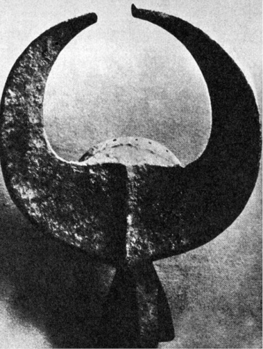

> Vlastní fyzika se tehdy ještě nevymanila z prvních počátků,  
> vyjma optiku, jejíž výjimečné pokroky byly vyvolány  
> praktickými potřebami astronomie.

BEDŘICH ENGELS: DIALEKTIKA PŘÍRODY

V úvodní kapitole o indiciích byla mj. vyvrácena domněnka, že dávná znalost velkých mlhovin a dalších nebeských objektů je sama o sobě důkazem neméně dávné existence dalekohledu.

  

Přesto však existují nepřímé doklady, nasvědčující dávné možnosti použití dalekohledu celá tisíciletí před tvrzením „Julese Verna středověku“, Rogera Bacona, že „… lze průhledná média uspořádat pro oko tak,… že lze vidět věci v dálce… Ba, mohli bychom tak i stáhnout Slunce a Měsíc z oblohy…“ (asi r. 1250), před pověstným nezbedným synkem holandského optika Jana Lippersheye, jenž si prý darebně hrál s otcovými sklíčky a objevil taje jejich kombinací, takže tatíček roku 1604 vytvořil „holandskou trubici“, první dalekohled světa. A navíc že tento dalekohled, jehož existenci předpokládáme, byl obrácen k nebesům celá tisíciletí před památným dnem roku 1609, kdy tak učinil Galileo Galilei.

Velmi silným argumentem pro pradávnou znalost dalekohledu, zasvěcenci (jako obvykle nejpravděpodobněji kněžími) pečlivě utajovaného, není samo vědomí skutečnosti, že se Venuše občas jeví jako srpek, ale všeobecné rozšíření tohoto vědomí a dále znalost proměn jejích fází, které nejsou postižitelné ani výjimečně dokonalým zrakem. Experimenty, provedené hvězdáři, dokázaly, že ani mimořádně ostrozrací lidé, vybraní z tisíců a tisíců, nejsou schopni zachytit spolehlivě fázi Venuše, závisející na okamžité poloze této planety vůči Zemi a Slunci.

Astrologie starých národů, prováděná téměř bezvýhradně kněžími v chrámech, uchovávajících souhrn tehdejšího vědění, spojovala však planetu Venuši se skotem nebo s bohy, opatřenými rohy, případně ji označovali sami za „rohatou“ (Venus cornuta), aniž vysvětlovali toto spojení.

Antropomorfní zobrazení planetárních bohyň Venuše, jež vystřídala v I. tisíciletí před n. l. zlověstná a zlomocná božstva většinou mužského rodu, jsou obvykle, ať už jde o Astarté (Ištaru), nebo indickou „nebeskou krávu Surabhi“, nazývanou též „libovonná“, vždy s rohy.

Od Indie přes Mezopotámii a Egypt až po Krétu se táhne pás uctívání skotu, z našeho racionalistického hlediska neúčelný a nevysvětlitelný motivy, jež v některých částech světa a v některých úsecích lidských dějin zplna vysvětlují uctívání, ba zbožnění užitkových, nebo dokonce nebezpečných zvířat. Nic takového však zde nenalézáme.

Nejhysteričtější formy nabylo uctívání krav v hinduistickém náboženství, odsuzujícím zabití krávy jako nejohavnější ze všech zločinů.

Uctívání krav není v Indii zvykem „od nepaměti“, jak bývá obvykle tvrzeno. Naopak – ve staré hinduistické literatuře je řada míst, připouštějících výklad, že kdysi byly krávy konzumovány na maso bez nejmenších skrupulí. Je zřejmé, že se zákaz setkával zprvu se značným odporem a že jeho motivace musela být velmi závažná.

V Mezopotámii se setkáváme toliko s kultem rohaté bohyně Ištary, zato v Egyptě se rozvinul všeobecně známý kult bílého býka Ápise do téměř stejného zbožnění, vedoucího k mumifikaci posvátných býků a k jejich pohřbívání v žulových sarkofázích s mnoha vzácnými záhrobními dary. A přece i pro Egypt byl skot celkem bezvýznamný – obohacení jídelníčku představoval nejvýše na několika málo místech v oblasti nilské delty, kde zůstaly tu a tam skrovné pastviny. Jinde v zemi, s každou pídí úrodné půdy věnovanou intenzivnímu obilnímu zemědělství, neexistoval. V místě chovu posvátných býků Vésetu byl skot krmen výhradně zrním. Nejsou doklady, že by byl kdy hovězí dobytek používán k tahu. A kravské mléko zřejmě naprostá většina Egypťanů, odkázaných na rostlinnou stravu, doplněnou výtěžky rybolovu, čižby a včelařství, nejen nikdy neochutnala, ale ani nespatřila.

Také v Egyptě se neobjevil kult Ápise „odpradávna“, ale ve zcela historických dobách, za panování krále Asetha, kdy byl „mladý býček prohlášen za boha a nazván Ápisem“.

Také krétské uctívání býků je dostatečně známo nejen z báje o Mínótaurovi, ale i z proslulých fresek knósského paláce, zpodobňujících (jak se ne zcela bezpečně domníváme) jakési hry vznešených mladíků a elegantních dívek, skákajících ve hře se smrtí přes hřbety obrovských rozzuřených býků. Zdá se, že dnešní corrida není svým vznikem daleko této zábavě, sloužící ve starověku takřka nepochybně kultu, nikoli sportovní slávě.

Není třeba dodávat, že skalnatá a málo úrodná Kréta, jež z existenčních důvodů vytvořila první thalassokracii a bohatla v době slávy námořní válečnou mocí i obchodem, nebyla vhodným místem chovu hovězího dobytka a že býci, chovaní v Knóssu i ostatních palácových sídlech pro skokanské exhibice, byli možná (ne-li pravděpodobně) jedinými exempláři.

Někteří autoři, zabývající se nejstaršími dějinami hvězdářství (u nás to byl např. Josef Sadil), se domnívají, že prvotní impuls k ochočení skotu nebyl užitkový a nemotivovala jej snaha dostat se snadno a kdykoli k masu a mléku, ale rituální, vyplývající z všeobecně rozšířeného zbožnění Měsíce. V rozích skotu spatřovali růžky měsíčního srpku a pojem posvátnosti přenesli z Měsíce i na zvíře.

> Buvolí maska z Lagosu pro kult mangam může být ovšem i dokladem astrálních kultů. Takových předmětů nacházíme na celém světě mnoho

Z bájí a pohádek tak starých, že se jejich věk neodvažujeme ani odhadovat, zaznívá motiv prastaré hrůzy lidstva nad ubývajícím Měsícem, který vbrzku z oblohy zmizí a zanechá své děti napospas temnotě, skrývající nejrůznější nebezpečí. Z dob, kdy snad člověk ještě ani neovládl umění rozdělávat a udržovat oheň (připisované dnes v předoasijském kulturním okruhu osmému tisíciletí před n. l.), čiší strach z bezměsíčných nocí, který donedávna při zhasnutí lampy (svědectví P. Gaugina v jeho knize Noa-noa) ochromoval Polynésany až do bezvědomí. Psychologicky je zcela pochopitelné, přáli-li si tehdejší zemědělci mít Lunu – zastoupenou krávou nebo býkem – v ohradě, a zajistit se tak symbolicky proti mocnostem tmy a zmaru. Tak asi vzniklo pastevectví, podle nových výzkumů vždy prvotně sdružené s primitivním zemědělstvím, jedině umožňujícím nashromáždit dostatek píce pro zimní období, a nikoli, jak jsme se dříve domnívali, nejen izolovaně, ale dokonce za přímého rozporu zemědělce-Ábela a lovce a pastevce-Kaina, ničícího obdělaná pole, zatímco jeho revíry a pastviny byly naopak ohroženy rozšiřováním obdělaných ploch…

Jestliže však bylo prvotní pastevectví skotu zasvěceno Měsíci, velmi brzy se „nebeský patron“ změnil a stala se jím Venuše. Těžko si vymyslet jiný přesvědčující důvod než reprízu původního motivu: totiž přirovnání růžků srpku Měsíce po novoluní a před ním s rohy skotu. Jaké asi muselo být překvapení, když bylo zjištěno, že Venuše mění fáze jako Měsíc. V úrovni tehdejší vědy bylo správné vysvětlení, respektující heliocentrický planetární systém, takřka nemyslitelné; ještě když Anaxagorás správně a logicky objasnil vznik měsíčních fází (k jejichž vysvětlení postačí geocentrická představa), byl obviněn z rouhání bohům a vypovězen z Athén do oblasti Dardanel, až na samou periférii Řecka.

Objevení Venušiných fází tedy bylo překvapením a zázrakem, zcela se vymykajícím i představám o neproměnné podstatě planet – prvním důsledkem byla patrně rychlá feminizace měsíčních bohů vzhledem k pochopitelné analogii cyklu lunárního a ženského. Domnívám se, že tento moment sám postačil i k uctívání zvířat, mysticky spojených se záhadnou planetou, oznamující svítání nebo noc, a že není třeba sahat ke krkolomným hypotézám o srážkách planet, kdy Venuše zachránila Zemi před kolizí s Marsem a stala se tak uctívanou zachránkyní naší planety. Měsíc ztratil sobě zasvěcený skot tím spíše, že byl za dlouhé věky trvání rozličných náboženství zatížen dalšími „funkcemi“, ba stal se nezřídka i hlavním bohem, pro nějž bylo, nešlo-li o kulturu ryze pasteveckou a kočovnou, nedůstojné zabývat se kravami.

Zcela nedávno byl objeven nepřímý argument pro existenci čoček a pro jejich použití v kulturním okruhu, kde se znalost zvětšovacích skel a tím možnost sestavení dalekohledu dosud nepředpokládala. V rozvalinách proslulého Sacsayhuamanu, označovaného za inckou pevnost (ačkoli síla ani umístění hradeb naprosto neodpovídají rozumným předpokladům obrany a pracnost jejich sestavení z kamenných bloků až 500 tun těžkých, složených naprosto beze spár, nekonečně převyšuje palebné možnosti potenciálních útočníků, o nichž se můžeme jen dohadovat), bylo nalezeno množství droboučkých, 7 až 9 milimetrů vysokých kamenných figurek neznámého určení, představujících lidské postavy nebo zvířata, vypracovaných do nejjemnějších detailů. Tyto trpasličí mikroplastiky jsou tak dokonale provedené, že lze – podle tvrzení peruánských vědců – vyčíst pod lupou z tváří nejen výraz smutku, hněvu či štěstí, ale rozeznat dokonce i charakteristické znaky jednotlivých tehdejších plemen. Dokonalostí se těmto pidimužíkům rovnají snad jen některé exempláře japonských netsuké, vypracované s nemenší péčí o detail, ovšem s použitím ocelových nástrojů a optických pomůcek.

Figurky, pocházející podle mínění odborníků ze 13. století n. l., a tedy z doby dávno před nástupem dynastie Inků na trůn říše, kladou mnoho otázek. Na jednu, jež nás v tomto okamžiku zajímá, však současně odpovídají: jejich výrobci (množné číslo je namístě – bylo nalezeno již několik tisíc mikroplastik) zcela určitě znali zvětšující spojené čočky a pracovali s jejich pomocí. Neméně nepochybné je, že se jejich znalost později ztratila nebo byla přísně utajena.

Nedovedeme si bez zvětšovacího skla představit ani výrobu slonovinové kvadrigy, vyřezané Medimecem, o níž referuje Titus Livius: „moucha by ji přikryla křídly“. Také v rozvalinách Kartága byly objeveny filigránské kameje a kromě nich i poměrně velmi dokonale vybroušené křišťálové čočky.

Spolu se skutečností, o níž referuje řada autorů, že totiž egyptští kněží astronomové pozorovali oblohu „rourami“ nebo „trubicemi“, což bylo vysvětlováno jako prosté, ale účinné opatření proti oslnění jasem okolní oblohy, můžeme předpokládat znalost broušení čoček a jejich sestavování v dalekohled za velmi starou. Astrologové totiž nemuseli na oslnění dbát – planety i hvězdy pro ně byly pouhými světelnými body, jejichž polohy vůči hvězdnému pozadí zkoumali, a v tomto případě by „roura“ nebo „trubice“ byla spíše na závadu. Je pochopitelné, že nedovolili nezasvěcenci do svých přístrojů nahlédnout a zjistit, zda tu kromě pláště válce nejsou (slovy Rogera Bacona) nějaká „průhledná média uspořádaná tak, aby bylo možno vidět věci v dálce…“

Je to tím pravděpodobnější, že podle dobových pramenů umístil egyptský vládce Ptolemaios III. Euergetés na vrcholu alexandrijského majáku, jednoho z tehdejších divů světa, „tajné zařízení, jímž bylo možno pozorovat vzdálené lodě“. Co jiného než dalekohled mohlo tímto „tajným zařízením“ být? Utajení je logické – sám astronom Galileo propagoval svůj dalekohled především jako válečnou pomůcku a astronomické použití zahrnul sumárně mezi „mnohé další užitečné možnosti“.

Podle uvedeného astrologického výkladu Venuše by byla znalost fází značně starou, zcela jistě starší 5000 let. Venuše tehdy byla božstvem spojovaným se skotem, božstvem válek a zmaru. Ústup pastevectví na úkor zemědělství a vědomost o fázích Venuše spolupůsobily na změně její astrologické symboliky v planetu žen a lásky. Podobně byl ženám přiřazován vzhledem k fázím Měsíc, jenže ten byl z planet všemi astrologiemi jaksi vydělen „pro zvláštní účely“, především kalendářní, a v oblastech, kde byly Venušiny fáze známy, musela převzít jeho funkci Venuše.

Dešifrování mýtů a legend je velmi svízelné a oblíbená honba za jejich racionálním jádrem nevděčná.

Posledním, ale nikoli nejméně závažným argumentem ve pro­spěch starověké znalosti dalekohledů je řecká a později římská báje o Saturnovi (Kronovi), požírajícím své děti – dva syny. Oba bohové byli ztotožněni s planetou Saturnem, tehdy nejvzdálenější známou planetou (Uran, Neptun a Pluto nebyly ještě objeveny).

Galileo Galilei namířil svůj třicetkrát zvětšující dalekohled na Saturn a užasl. Důvod svého údivu skryl podle dobového zvyku kryptogramem, jehož řešení je „Altissimum planetam tergeminum observavi“ – pozoroval jsem, že nejvyšší planeta je trojitá.

Opravdu – vzhledem k nedokonalosti svého neachromatického dalekohledu s nevelkým průměrem objektivu se mu Saturnův prstenec jevil jako dvě malé planety (synové), doprovázející po obou stranách tatíka Saturna. Podivný jev sledoval dále, až zanedlouho užasl znovu. „Synové“ zmizeli, aby se opět po nějaké době objevili. Vysvětlení je ovšem jednoduché. Je-li Saturnův prstenec vůči Zemi v takové poloze, že pohledu nastavuje svou hranu, mizí i v největších dalekohledech. Čím větší úhel svírá s rovinou pohledu, tím zřetelnější se jeví a tím snáze může vzniknout klam „synovských“ planet, které jsou opět záhy „pozřeny“.

Skutečná povaha prstence byla poznána poměrně pozdě. „Souputníky“ pozorovala ještě po Galileovi řada hvězdářů. Bez dalekohledu je to fyziologicky vyloučeno. A báje sama je zvláštní, zjevně astrální.

Je-li pravdivé tvrzení, že Chaldejci zobrazovali svého boha, ztotožněného se Saturnem, Nizrocha, vždy obklopeného prstencem, v němž se vznáší, byl by to jen další důkaz. K pozorování Saturnova prstence a poznání jeho skutečného tvaru postačí poměrně nevelký dalekohled, je-li optika alespoň poněkud slušná. Uran, rovněž prý Chaldejcům známý, je pozorovatelný i pouhým okem (na hranici viditelnosti).

Je tedy celá řada dobrých podkladů pro tvrzení, že starověk znal princip i techniku zhotovování dalekohledů, jež byly v dosahu možností sklářského díla, pyšnícího se již nejméně pětitisíciletou tradicí. Otazníkem zůstává, jak dávné civilizace k této znalosti tak záhy dospěly.

Ostatně se zdá, že se znalost dalekohledu tak docela neztratila a že si ji díky přísně tajeným kontaktům s arabskými protivníky a zejména jejich tajnými společnostmi (včetně tzv. hašašínů, vrahů Starce z hory) osvojili a do Evropy přivezli např. templáři. Nasvědčuje tomu – podle mého mínění – mnoho diskutovaný a hledači pokladů všelijak vykládaný nápis na starém sídle komtura velkopřevorství templářů ve Francii na hrádku Arginy na panství Beaujeu. Nápis zní:

Zbuduješ tento tajný příbytek,  
dáš mu tři stonásobky základní míry zdéli,  
pět desetinásobků zšíři,  
čtyři hloubky či tloušťky,  
a podle stejné míry zřídíš kulovitý prostor,  
na vrcholku přístupný světlu.  
A tam, kde se na opačné straně rozšiřuje,  
zbuduješ části dvojité a trojité.

  

Templáři byli velkými milovníky nejen peněz a majetku, ale i krypto­grafie a astrologie, především ve spojení s alchymií. Zdá se dost podivné, že – pokud vím – nikdo dosud neinterpretoval nápis z Arginy jako koruptelu konstrukčního návodu ke zhotovení zrcadlového dalekohledu, reflektoru, ačkoli samo umístění nápisu na tzv. alchymické věži naznačuje jeho astronomicko-astrologický význam a zašifrování není nijak zvlášť důmyslné.
