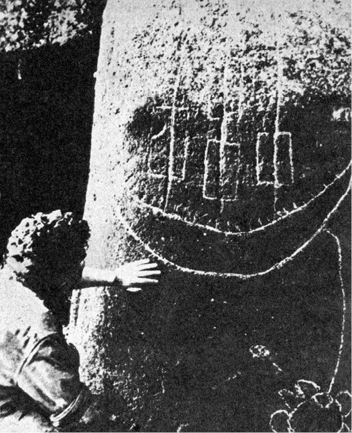

> _Velikonoční ostrov je nejosamělejší lidské sídliště na světě.  
> Nejbližší pevné body, které jeho obyvatelé mohou vidět,  
> jsou na obloze: Měsíc a hvězdy.  
> Musili by cestovat dále než kterýkoli jiný kmen na světě, aby  
> se přesvědčili, že existuje skutečně i jiná pevnina než Měsíc  
> a hvězdy a že jim leží blíž. Proto žijí tak blízko hvězdám  
> a znají jich větší počet než měst a zemí v našem světě._

THOR HEYERDAHL: AKU-AKU

> _Ať tomu někdo věří nebo nevěří, Velikonoční ostrov napadly  
> síly, které tušíme, které cítíme, natolik jsou dnes přítomné  
> a silné na tomto kousku země, kterou poznamenal oheň._

FRANCIS MAZIÈRE

Nepočetní lidé, obývající malý, trojúhelníkový ostrov se stranami 16, 18 a 24 km dlouhými a s plochou sotva 118 km2, vzdálený přes 3200 km od Chile, jemuž od roku 1888 patří, a téměř 3700 km od Tahiti, nejbližšího souseda na západě, lidé vystavení každodenní drsné nutnosti obživit sebe a své děti v oblasti, kde nebylo kromě ptáků jedlých zvířat, lidé osamělí až k šílenství a podle všech předpokladů naprosto bezpeční před jakoukoli invazí a vyrušováním, bezpečnější než tibetští poustevníci ve svých slujích nebo grónští Eskymáci ve svých osamělých iglú, vybudovali fantastické dílo.

Neobklopili svůj domovský ostrov kyklopskou zdí, chránící je od moře (ačkoli i takové stavby dokázali), nezbudovali ani citadely, ani mocné loďstvo. Zato „vytvářeli gigantické kamenné sochy v lidské podobě, vysoké jako domy a těžké jako železniční vagóny. Velké množství jich pak odvlekli přes hory i doly a pak je vztyčovali na mohutné zděné terasy, zbudované kolem celého ostrova“ (Heyerdahl).

Více než 600 vztyčených soch obdrželo svá archeologická inventární čísla malovaná s vybraným nevkusem olejovou barvou. Asi 150 jich leží nehotových a zpola vybavených ze skály v jediném lomu, kráteru vyhaslé sopky. Jsou to právě ty největší a nejmonumentálnější, náhle a ve spěchu opuštěné. Nevíme proč. Ale kdyby nedošlo k násilnému přerušení práce, jak dlouho a až kam by bylo plastické šílenství obyvatel (zdá se, že mnoho soch nebylo dosud objeveno) pokračovalo? K opracování všech skal a všech balvanů ostrova v sochy? A proč?

Velikonoční ostrov dosud neodpověděl – o nalezení odpovědi se tedy pokoušejí objevitelé a vědci již od osudového Velikonočního pondělí roku 1722, kdy u ostrova přistály tři holandské řadové lodi admirála Roggeveena, jejichž muškety zahájily krvavou kalvárii ostrovanů prvními salvami do bezbranných domorodců.

Jako v několika jiných kapitolách musíme nejprve očistit hádanku kolosů Velikonočního ostrova od nepravd a omylů, těšících sice duše romantiků, ale bránících konstrukci plodných domněnek a snižujících jejich závažnost.

Je to především samotná výroba kolosálních soch, popisovaná některými autory jako nepředstavitelně svízelná a takřka neproveditelná bez zásahu laskavých nepozemšťanů, kteří by se obořili do práce s moderními mechanickými pomůckami. Däniken dokonce píše o „ocelově tvrdých balvanech, rozřezaných jako máslo…“.

Nuže, není tomu tak. Sochy jsou většinou vytesány sice z tvrdé, ale poměrně křehké, a tím snadněji opracovatelné ztuhlé lávy, zatímco sekerky, k opracování používané, byly z čediče, tvrdého téměř jako obsidián. Při vynikajícím mistrovství praobyvatel, zabývajících se kamenickým dílem tradičně a vybavených staletými zkušenostmi, není třeba pochybovat, že se výroba soch nijak nevymykala možnostem, i když jistě spotřebovala nesmírně mnoho času, zaměstnávala značnou část produktivních sil a byla nepochybně považována za společensky svrchovaně důležitou, ba spíše životně nezbytnou.

Nejzajímavější a dosud ne zcela vysvětlenou technickou otázkou je metoda vrtání dosti hlubokých děr, hyzdících hřbet nosu, bradu a spánky některých soch. Chilský archeolog profesor Gonzalo Figueroa, který se věnuje průzkumu Velikonočního ostrova, soudí, že používané vrtáky byly patrně z obsidiánu, ačkoli se dosud nepodařilo je nalézt. Technicky je to vyloučeno – jedinou možností vyvrtat prostředky kamenné doby díru do kamene, tedy např. provrtat hlazený valoun, aby jej bylo možné nasadit na topůrko jako mlat, je použití rotující větve s měkkou dření, např. bezu, podsypávané tvrdým ostrohranným pískem. Písek se zadře do dřeně a vytvoří brusnou plošku, pronikající sice zoufale zvolna, ale zato neúprosně, do kamene. Představa o vrtání kamene parohem nebo dokonce jiným kamenným nástrojem je technologicky absurdní, jakkoli dodnes straší i ve školních učebnicích. (Mimochodem poznamenejme, že profesor Figueroa je pravou studnicí nepřijatelných hypotéz. Čím menší jsou však jeho úspěchy v interpretaci znepokojujících otazníků Velikonočního ostrova, tím větší žárlivost na výsledky jiných archeologů; velmi taktně se o tom zmiňuje Heyerdahl, velmi otevřeně Francis Mazière.)

Ani vyvrtání otvorů tedy není záhadou a může nalézt zcela prosté vysvětlení, rozhodně spíše než opravdu podivuhodný transport soch a několik tun těžkých kamenných „klobouků“ usazovaných na jejich temena do výšky mnoha metrů. Profesor Mulloy se domnívá, že sochy byly vztyčovány s „klobouky“ již nasazenými, což je nejnesmyslnější, a především technicky nejobtížnější způsob, jaký by si tvůrci soch mohli vůbec vybrat. Pokud jde o transport, zdá se, že „klobouky“ byly v lomech zformovány ve tvar válců, dovaleny na místo a tam teprve definitivně opracovány – ostatně zdobily jen menší část soch z posledního období. Jejich zdvíhání do výšky ovšem představovalo v každém případě impozantní technický výkon: rampy z kamení a hlíny, vedoucí k temenu figury, by byly dílem stejně pracným jako socha sama (totéž platí o předpokládaných rampách při stavbě pyramid). Domněnka o zdvíhání „klobouku“ na dvou kamenných věžích střídavým podkládáním kameny se sice dobře čte, v praxi by však patrně záhy vedla k trvalé invaliditě všeho obyvatelstva ostrova následky úrazů. Zvedání „klobouků“ i samo vztyčování soch bylo tedy prováděno nějakým nám dosud nejasným, ale zcela jistě velmi důmyslným způsobem – i když Thor Heyerdahl tuto otázku bagatelizuje poukazem na „ukázkové“ postavení jedné sochy moai malou skupinou místních obyvatel za jeho přítomnosti. Zapomněl dodat, že šlo o jednu ze soch nejmenších, v ojediněle výhodné poloze, takže ji postačilo sesunout ze svahu, a to pomocí kmenů eukalyptů, rostoucích na ostrově teprve krátkou dobu. O několik let později opakovali jeho pokus dva rakouští novináři s průměrnou sochou, vážící asi 20 tun. Bylo třeba použít jeřábů a buldozerů, početného týmu chilských a amerických techniků a i tak trvala práce řadu dní. (Oba novináři zahynuli při návratu z Velikonočního ostrova při leteckém neštěstí, což zabránilo polemice s Heyerdahlem.) Jedinou výhodou, kterou snad smíme obyvatelům připsat, je – namnoze popíraná – existence různých druhů stromů, kterou dokázaly rozbory pylů v bažinách Rano Raraku, provedené dánským badatelem Sellingem. Je ovšem otázkou, zda potřeba zemědělské půdy nevyhubila tyto stromy ještě před masovou výrobou kolosů moai; nebylo-li tomu tak, podlehly patrně díky ní jako nezbytný materiál pro pomocné práce. Dnes není na ostrově po těchto původních stromech ani stopy. Ostatně nelze v žádném případě bujnost dávné flóry přeceňovat – nejsilnějšími dřevinami byly stromy toro-miro, antarktickými větry zkroucené, zprohýbané a silné nejvýše jako stehno. Jejich dřevo bylo vzácným materiálem pro výrobu desek rongo-rongo a unikátních plastik moai kava-kava. Figueroa se opět jednou mýlí, považuje-li např. transport soch moai za vysvětlený jejich „zachycením v dřevěné vidlici a postupným posunováním“. Pro tento způsob posunu soch velikosti sedmipatrového domu po nerovném terénu stromy ostrova zcela určitě nepostačily. Použití krátkých dřevěných válců nelze ovšem vyloučit – otázkou je, zda by byly schopny transport ulehčit a zda by ostrované obětovali surovinu, v pravém slova smyslu cennější než zlato. Vždyť i chýše obyvatel byly budovány bez dřeva, ve tvaru obrácených člunů, jejichž žebra z rákosu byla zapouštěna do neuvěřitelně pracně vyvrtaných děr v kamenných dlaždicích.

Stejným, i když málo významným omylem je tvrzení, převzaté z atlantologických knih, jejichž autoři se snaží i za cenu vyhledávání krkolomných analogií nalézat shody mezi kulturami odlehlých kontinentů; totiž popisovaná podobnost písma rongo-rongo na dřevěných tabulkách (patřících k nejvzácnějším archeologickým exponátům nemnoha šťastných světových muzeí) se staroegyptskými hieroglyfy. Podobnost jde však pouze k pojmu obrázkového písma, ne dál. Profesor Figueroa s důvtipem sobě vlastním soudí (aniž cituje maďarského lingvistu Hevettyho, autora této myšlenky), že je nejpodobnější písmu ze severoindického údolí Lindo, pocházejícího ze 3. tisíciletí před n. l. – ať již přijmeme radiokarbonové datování Heyerdahlovo, určující osídlení Velikonočního ostrova do 4\. století n. l., nebo datování podle opracovaného obsidiánu, připouštějící první obyvatelstvo teprve o tři století později, je mezi oběma písmy časová propast, takřka vylučující jinou než náhodnou příbuznost.

Potud je třeba korigovat často naivně romantické a až příliš tajuplné představy o Rapa Nui, Matakiterani neboli Te Pito O Te Henua, o Očích, které hledí k nebi, což vše jsou domorodé názvy Velikonočního ostrova.

Jde především o odhad počtu obyvatel v dobách budování kolosů moai. Dnes žije na ostrově asi 1500 obyvatel – podle sčítání v roce 1970 dokonce jen 1200. V patnáctém a šestnáctém století, kdy zřejmě kultura Velikonočního ostrova vrcholila a kdy patrně byly již kolosy moai dávnými památkami, žilo podle údajů prvních evropských mořeplavců na ostrově asi 4000 lidí, což je možno považovat spíše za přehnané. Objevitelé, přinášející svým vládcům nové země, měli politováníhodný, i když lidsky pochopitelný zvyk zveličovat lidnatost a význam zabraných kolonií. Počet 20 000 obyvatel, odhadnutý z početných archeologických nálezů chrámů s tisíci monumenty, je naprosto nepravděpodobný.

  

> Tato „senzace Velikonočního ostrova“, rytina velké lodi na jedné ze soch moai, patrně senzací není. Polynésané nikdy takové koráby nestavěli a kresba byla nepochybně vyryta pod dojmem návštěvy evropských cestovatelů

Na ostrově nežila s výjimkou ptáků jedlá zvířata – což zčásti omlouvá kanibalismus jako krytí potřeby bílkovin. Rybolov byl omezen neznalostí stavby plavidel, schopných vydávat se dále od břehů, i astronomické navigace, v ostatní Polynésii všední. Rákosové člunky umožňovaly jen příbřežní rybolov, jehož výtěžek patrně nikdy nebyl v této části Pacifiku zvlášť rekordní. Dřeva vhodného druhu pro stavbu člunů nebylo. Závažným limitujícím činitelem byl a je nedostatek pitné vody – na ostrově téměř nejsou prameny, jež by umožnily existenci „silných pobřežních kmenů“. Voda ve vulkanických jezírkách se hodí nejvýše k napájení ovcí, jejichž stádo, majetek chilské vlády a památka na zásobování teprve nedávno opuštěné americké vojenské základny, tvoří jednu z hlavních součástí výživy obyvatelstva.

Domácích zvířat rovněž nebylo, a „intenzívní zemědělství“, o něž se opírají např. odhady profesora Figueroy, spočívalo ve skutečnosti v nejprimitivnějším obdělávání 118 km2 nijak zvlášť úrodné půdy, ochuzené ještě o plochy skal a močálů; můžeme tedy počítat pouze se zlomkem této výměry osázeným kulturami banánů a sladkých brambor, ovšem bez přirozených hnojiv, mrvy a guana, na něž je tak bohaté nedaleké pobřeží Peru a Chile. Figueroa a další tvrdí, že po populační explozi došlo ke kmenovým válkám, které decimovaly obyvatelstvo na pouhé 4000 a vedly jeho regresí k velmi nízkým civilizačním stupňům.

To vše jsou jen dohady, jejichž pravděpodobnost není příliš velká. Jistě, přelidnění může ústit a v primitivních společnostech patrně obvykle ústí v agresi, zejména pokud nemůže být řešeno zevním výbojem nebo hromadnou emigrací, vedoucí např. k postupnému osídlení celé Polynésie. Agresivita však končí s dosažením biologicky, v lidském společenství tedy ekonomicky dostatečného zajištění všech členů etnického celku. Není důvod k pokračujícímu vraždění – i když je ovšem nemůžeme vyloučit. Je však velmi pravděpodobné, že kapitáni, zmocňující se na Rapa Nui až do roku 1862 kontingentů otroků pro peruánské guanové doly (což naráželo na odpor světové veřejnosti, burcované tahitským biskupem Tepáno Jaussenem), podstatně ve svém líčení zhoršovali situaci obyvatelstva na domovském ostrově, aby nalezli byť chabou morální omluvu. Nespornou skutečností je, že se po několika letech patnáct domorodců, zbylých z celého tisíce, decimovaného nelidskými podmínkami a neštovicemi takřka do posledního, vrátilo domů, na mořskou výspu. Odmítli podílet se na slastech civilizace.

Je tedy pravděpodobné, že obyvatelstvo Velikonočního ostrova nikdy nepřekročilo počet několika tisíc lidí a že potřeba udržení života za každou cenu v pravém slova smyslu vyžadovala značné úsilí. Docházelo i ke kanibalismu, k zabíjení a pojídání příslušníků cizích rodů. Domnívám se, že přísně tajné rodové jeskyně, chránící především ženy a děti, byly úkrytem ne v čase „válek“, o nichž osobně dost pochybuji, ale před nebezpečím napadení spoluobyvateli, následovaným snědením pod vhodnou rituální záminkou, ve skutečnosti však z hladu…

  

> Stále se opakující kresba boha na Velikonočním ostrově

Takto popisovaná společnost se ovšem liší od blahobytných představ pana profesora Figueroy, v nichž Rapa Nui přetéká obilím a rybami a kdy „na pobřeží žily velmi silné kmeny a na kamenické práce a na přepravu zbývalo dost pracovních sil…“ Zdá se naopak, že tvorba, transport a vztyčování kolosů moai znamenaly pro mnohé generace obrovské vypětí sil, vyžádaly každou hodinu času, jež nebyla nezbytná k reprodukci sil na druhý den, a každou ruku, jež nebyla zaměstnána obtížným sháněním potravy. Výroba soch tedy musela být motivována neobyčejně silně a přesvědčivě – a to je tím podivnější, že chrámy místních, dávno zapomenutých kultů byly postaveny jinde a s kolosy moai, jak se zdá, nijak nesouvisely ani prostorově, ani myšlenkově.

Práce s materiály, které byly k dispozici, sice nevyžadovala nepozemskou nebo dokonce nadpozemskou pomoc, lávový kámen lze čedičem otesávat, to však neznamená, že to byla kratochvíle a cosi podobného práci se sochařskou hlínou. Zvětralá láva je ovšem na povrchu křehká a poddajná, první evropští návštěvníci se dokonce domnívali, že kolosy jsou z hlíny, ale při pokusu zdolat je ocelovou sekyrou nebo motykou odletují jiskry. Při úderu čerstvě naostřeným čedičovým kladivem „… nezanechala jednotlivá rána velkou stopu, nejspíše jen šedivou vrstvu prachu…“ (Heyerdahl). Sochaři museli neustále střídat nové a nové sekyry, zatímco otupené byly dalšími pomocníky odštěpováním znovu naostřovány. Mnohé sochy bylo nutné i v poslední fázi opustit pro trhliny nebo neopracovatelné inkluze čediče vzdorující sekerám.

Heyerdahlovy zkušenosti a pokusy (ač usiloval o opak) nejen vyvrátily, ale přímo rozmetaly mínění, že malý tým sehraných kameníků byl schopen sochu dokončit v patnácti dnech. Je to nesmysl. Heyerdahlem dobře placená skupina chudičkých obyvatel ostrova, která by byla jako dar z nebes uvítala slibné zaměstnání, dílo navzdory počátečnímu nadšení po třech dnech definitivně vzdala. Z nepatrného výtěžku usilovné třídenní námahy Heyerdahl i domorodci vypočítali, že by dokončení malé sochy vyžádalo asi 12–15 měsíců práce dvou střídajících se skupin asi po 10–15 mužích.

Ať soudíme o Dänikenovi cokoli, má proti svým kritikům výhodu: na rozdíl od většiny z nich totiž navštívil Velikonoční ostrov. Píše o tom mj. „… Viděl jsem hubený (Heyerdahlův) výsledek: několik milimetrů hlubokou rýhu v tvrdém lávovém kameni. Také my jsme tloukli největšími valouny, jaké jsme vůbec mohli nalézt, do skály jako diví. Po několika stech ranách jsme drželi jen ubohé zbytky našich nástrojů, skála však jevila sotva jediný škrábanec…“

Tím vůbec nechci říci, že do výroby moai zasahovaly nepozemské síly. Jisto však je, že tato výroba byla obtížná a pro hrstku lidí na ostrově znamenala nevýslovné břemeno tím spíše, vznikly-li všechny kolosální sochy, jak se dnes soudí, v poměrně malém časovém rozpětí.

A pak ovšem nastaly starosti s transportem.

Největší sochy, vysoké jako sedmipatrový dům (až 23 metry), představovaly nepochybně obrovský transportní problém tím spíše, že transport musel být (a byl) velice opatrný a šetrný – je pozoruhodné, že největší sochy zůstaly nedohotovené v lomech a zároveň sochařských dílnách kráteru Rano Raraku a byly očividně opuštěny naráz a ve spěchu. Ani cenné čedičové sekery, jež mohly koneckonců sloužit jako zbraně, nebyly odneseny a povalují se po stovkách všude kolem. Nemenším problémem bylo vztyčování „klobouků“ na temena obrů. Některé z nich mají objem až 6 m3, vážily až 10 tun a po 11 kilometrech cesty je čekalo vyzdvižení do výšky střechy čtyřpatrového domu bez okolních převýšených opěrných bodů a pravděpodobně bez dostatečně dlouhých a pevných kmenů. Hrstka lidí, kteří by se s nasazením života mohli stěsnat na temeni sochy, by „kloboukem“ ani nepohnula. Zkrátka – buď jak buď, byla to obrovská práce, tak obrovská, že dnešní obyvatelé ostrova jsou svatosvatě přesvědčeni, že sochy došly na svá místa samy. Transport si vůbec nedovedou představit.

Podstatným otazníkem a centrální záhadou Velikonočního ostrova tedy je, proč byly obrovské sochy moai s takovým úsilím, ohrožujícím výživu a existenci obyvatel celého ostrova, vytesány a postaveny. Znovu opakujeme, že důvod musel být smrtelně vážný, i když ovšem z našeho dnešního hlediska nikoliv racionální.

Bude jednodušší vypočítat, čím gigantické sochy nebyly. Začneme opět polemikou s profesorem Figueroou, který prohlásil doslova: „… Moře bylo důležitým zdrojem obživy a u moře byly i chrámy. To souvisí s celou mytologií, hlava byla vždy místem, kde je soustředěna nadpřirozená moc. Hlavy soch měly k pobřeží přivést ryby, zvýšit snůšku vajec, zúrodnit půdu – dodnes je mají venkované zakopány i na svých polích…“

Nebylo tomu tak. Motivy megalitických staveb, budovaných pro věčnost a, jak se zdá, lidmi, kteří si uvědomili pomíjivost svého času, byly zcela jiné, nikdy bezprostředně utilitární. Až na pozoruhodnou výjimku sedmi soch, seřazených na jediné ahu-moai, kamenné terase v severozápadní části ostrova, jsou všechny sochy obráceny tváří do vnitrozemí a moři ukazují dosti realisticky zpracované zadní části těla, což se nezdá být právě vhodné pro nadpřirozené přilákání ryb. V jihozápadním kvadrantu ostrova chybí sochy moai úplně – naneštěstí pro vývody prof. Figueroy právě zde je i skupina ostrůvků Motunui, kde hnízdili ptáci a kde byla sbírána vejce, spíše ovšem z rituálních důvodů než pro obživu. A pokud jde o „hlavy, zakopané v polích“, je škoda slov. Kolem 40 cm hluboká vrstva prsti maličkých, před větrem ohrazených políček taková kouzla prostě předem zcela vylučovala.

Funkce prosebníků za úrodu a zprostředkovatelů styku s ochran­nými bohy obsadili na všech stupních raných kultur kněží. Jinak tomu nebylo ani zde – na vrcholu nejvyššího sopečného kužele Rano Kao byl nalezen vydlážděný kamenný chrám s astronomickými stavbami, obvyklými pro megalitické kultury, a více než s tisícem soch – zcela jiného druhu. Také sošky, jež měly přinášet úrodu, nemají se stylizovaným tvarem obrů moai, na rozdíl od chrámových soch jakoby odlitých jediným kadlubem, nic společného. Poblíže soch nebyly nalezeny stopy, že by zde bylo obětováno nebo že by byly jakkoli nábožensky uctívány (s výjimkou nepříliš jasné a nepřesvědčivé zprávy Roggeveenovy a mladších kosterních nálezů).

Nikde – až na vzácnou výjimku Markéz – nebyly v Polynésii a Melanésii nalezeny megalitické sochy, jež by se i při sebevětší dávce fantazie daly přirovnat k moai, nepočítaje ovšem nešťastnou velkou kamennou hlavu na Charlesově ostrově ve skupině Galapág. O této soše referoval v New Yorku kapitán Lord a na přednášku zvlášť zaletěl i Thor Heyerdahl. Lord byl obviněn, že dokladové fotografie pořídil… na Velikonočním ostrově. Spor měl rozhodnout Heyerdahl, jenž se rozhodl „odskočit“ si na Galapágy a věc prozkoumat na místě. O vzniku sochy jej uspokojivě informoval pan Wittmar, starý německý osídlenec, který kdysi sochu osobně z tufového kamene vytesal, aby synu Rolfovi ukázal, co všechno tatíček dokáže. Kapitán Lord nebyl vinen – milý Rolf měl totiž kromě kladných vlastností i dvě záporné: přehnanou zdvořilost a naprostou neznalost angličtiny. Na otázky kapitána Lorda, fotografujícího sochu ze všech stran, odpovídal tudíž stereotypně „yes“, i když se kapitán tázal, zda tam socha, vypadající už díky pokrývce mechu a zvětšení značně starobyle, byla už před příchodem Wittmarů…

A naposledy a za čtvrté: sochy, o něž je veden spor, nejsou jen hlavami, ale mají celá těla, zapadlá do země, pokud to její slabá vrstva vůbec dovoluje.

Velmi rozšířený je názor, že nešlo-li o postavy bohů – a těžko si představit bohy vzájemně tak k nerozeznání podobné, nebo uctívání jediného boha stovkami vedle sebe nakupených replik téže podoby – zpodobují sochy praobyvatele ostrova, „Dlouhouché“. „Klobouk“ vlastně představoval uzel vlasů, v dnešní řeči domorodců pukao, jejž bylo nutno charakterizovat rudou barvou materiálu, a proto vytesávat z lomů ve vzdáleném cípu ostrova.

Domnívám se, že je zde příčina zaměňována s následkem. Nehledě na obrovskou práci, kterou výroba, doprava a vyzdvižení „klobouků“ vyžadovaly a jíž by se bylo možné docela dobře vyhnout vytesáním sochy i „klobouku“ z jednoho kusu a nabarvením „klobouku“ např. hlinkou, se tyto rudé válce podobají všemu možnému než účesu. Nic takového zřejmě nenapadlo ani La Pérouse, ani velmi pečlivého a naturalistického ilustrátora jeho cestopisu, když 9. dubna 1786 navštívili Velikonoční ostrov. Žádné rudé vlasy a žádné účesy tohoto druhu nespatřili. Zkrátka: sochy nevznikly jako zpodobení rudovlasých předků s výstředními vrkoči, ale naopak vyprávění o rudovlasých předcích s výstředními vrkoči vzniklo díky sochám, jejichž původ a smysl dějiny zasuly, stejně jako móda dlouhých, na temeni stočených vlasů – pokud ovšem existovala. Dnes po ní není ani stopy, přestože se obyvatelé pro potěšení turistů občas převlékají do fantastických trávových sukének a kokrhelů, odpozorovaných patrně z nějakého amerického filmu o havajských krasavicích.

Pro úplnost je ovšem třeba dodat, že mužové výpravy dona Felipa Gonzalese, jenž přistál u Velikonočního ostrova se dvěma loďmi roku 1770, rovněž přivolán kouřovými signály, nalezli některé muže s hnědými a dokonce zrzavými vlasy – šlo však o pouhých několik málo jedinců, a rozhodně ne o kmenový charakteristický znak. Existenci těchto ryšavců není třeba hledat ani v rasových zvláštnostech obyvatel, ani v záhadných návštěvnících, jimiž se tak okouzluje pan Däniken i Thor Heyerdahl: padesát let před Gonzalesem (1722) tu přistály tři holandské lodi, plné námořníků po dlouhé plavbě, kteří strávili několik dnů na pevnině. Podle očitých svědků se několik málo žen, jež se ukázaly (patrně volnějších mravů), chovalo k bělochům „hodně vyzývavě“, aniž mužové dali najevo sebemenší známky žárlivosti.

Abychom kapitolu zbytečně neprotahovali: všechno nasvědčuje tomu, že sochy na pobřeží ostrova jsou strážci, chcete-li strašáky, kteří měli zabránit ať už skutečně hrozícímu, nebo fiktivnímu napadení ostrova.

Podivná červená pokrývka hlavy daleko více a sugestivněji při­pomíná jakousi přilbu, a neostýchám se říci, že dokonce přilbu obrovských soch „kosmonautů“ (jak je nazvali odvážní snílci) z La Venty.

Muselo to být ohrožení vážné a osudné, byli-li strážci vybudováni v takovém počtu a takové velikosti, i když materiál nepřekvapuje: žádný jiný totiž na ostrově nebyl. Snad sami tvůrci věřili v jejich strašlivou moc – svědčí o tom, že oči byly sochám vytesány, teprve až byly vztyčeny na ahau, jedné z mnoha kamenných plošin podél mořského břehu, zdvíhajících se až čtyři metry nad okolní terén. Rudé přilby na hlavách soch zdůraznily jejich monumentalitu, spíše však měly prohloubit nebezpečný vzhled. Zda prostě neobyčejnou (bojovou?) pokrývkou hlavy, zda skutečně válečně načesaným a nabarveným vlasem, nebo zda (a to nelze vyloučit) oživením vzpomínky na kohosi s přilbou, i když nebyl opatřen zjevnou zbraní, který prokázal svou sílu a možnosti? Těžko říci.

  

> Jedna z obrovských, až třicet tun těžkých olméckých hlav v La Ventě, romantiky nazývaných „kosmonauti“

Domněnku o strašácích změnily téměř v jistotu otvory, s nimiž si zatím nevědí archeologové rady. Povšimneme-li si jejich rozdělení, táhnou se téměř přesně po zevním obrysu soch od spánků přes líce na bradu, ramena a boky, a právě tak lemují po čele, hřbetu nosu a bradě profil některých soch. Bylo vysloveno několik domněnek, především o tetování nebo zdobení zjizvenými zářezy do kůže. Takové tetování by však bylo velmi neobvyklé, liší se od tetování, popisovaného na Velikonočních ostrovech, a stěží by je velkoryse stylizující tvůrci napodobovali pracným vyvrtáváním děr, vyžadujícím stovky hodin otupující práce. Domnívám se, že otvory původně sloužily k upevnění nějakých hořlavých látek, pochodní, rákosového lýka, smočeného v tuku mořských ptáků apod., nebo snad jakýchsi kahanů, jež jsou nálezy prokázány již v neolitu. Zatímco ve dne hrozily vetřelci sochy, v noci zářila pro výstrahu ohnivá silueta alespoň některých. Iluminovat všechny bylo nad síly obyvatel. Ochrana tedy byla zajištěna i v noci.

Musel to být velký, generacemi se táhnoucí strach, který přinutil děti ostrova Rapa Nui k tak usilovné společné práci, velký strach a strašný potenciální nepřítel, hodný tak obludných kamenných protivníků. Je nepravděpodobné, že by šlo o trosečníky z nesmírně vzdáleného západního souostroví nebo o vory rybářů od jihoamerického pobřeží zahnané proudy a větrem. S těmi by si obyvatelé snadno poradili, tím spíše, byli-li tak bojechtiví, jak je archeologové líčí. Jiné a vážnější reálné ohrožení si ani při nejlepší vůli nedovedeme představit – a přece zřejmě existovalo, a jeho hrozivost přesahovala všechno pomyšlení. (Francis Mazière mluví o „… silném traumatismu, který… není dílem podnebí nebo náhody; je to pozůstatek tak hrozného duševního otřesu, že pro to nemáme srovnání na ostatních ostrovech…“)

Navrhněme možné vysvětlení: dějiny ostrova se vyvíjely jinak, než jak je dnes pracně a se značnou dávkou fantazie při popisování dlouhých „němých“ století doplňujeme: nepřítelem byli právě tvorové s rudými vlasy (nebo přilbami), kteří jednoho dne přistáli ze vzduchu na ostrově a zpustošili jej ohněm a mečem nebo snad čerstvě importovanou infekcí, jež by musela mít v nepromořeném terénu tragické, nedohledné důsledky. Prokázali naprostou neschopnost místních starých bohů, takže ihned po jejich odchodu následovalo rozkotání chrámu jako pomsta bohům, kteří připustili utrpení svých věrných – podobné exploze násilí proti bohům jsou u přírodních národů dosti obvyklé a poskytují přirozenější vysvětlení naprostého zničení všech chrámů než „válka všech kmenů proti vládnoucím kněžím“, jak říká J. Slovák.

Není vyloučeno, že se tehdy jeskynní úkryty znamenitě osvědčily a že byly později budovány pro případ potřeby jako bezpečné skrýše nejen před živými protivníky, ale i před pohromami (např. vlny žáru, tlakové vlny výbuchu a další). Na odvrácení invaze nežádoucích cizinců byly postaveny jejich vlastní, do nitra ostrova hledící vysoce stylizované podoby v nadživotní velikosti jako ochránci, strážci, strašáci.

Staletí však ubíhala, kolektivní amnézie nahradila vzpomínky. Smysl a původní důvod vztyčování obrovských moai byl zapomenut a na nebezpečí nikdo nemyslil – k vlastní škodě. Karavely holandského admirála Roggeveena byly dokonce přivolány kouřovými signály domorodců, zřejmě toužících po společnosti.

Za jistých okolností mohla být poloha Velikonočního ostrova, zajišťující zdánlivě jeho idylickou osamělost, nevýhodou: to tehdy, kdyby kdokoli, schopný pozorovat z výše, hledal jakousi „mateřskou letadlovou loď“ v oceánu, z níž by přikročil ke „kratším výletům“, např. k údolí Nazka, do oblasti jezera Titicaca a k jiným zajímavým oblastem…

Toto vše jsou jenom domněnky, ale nejsou o nic nepravděpo­dobnější než řada ostatních. Velikonoční ostrov je dosud archeo­logicky velkým otazníkem, jehož rozluštění by vyžadovalo, jak prohlašuje patrně nejzasvěcenější znalec, antropolog univerzity ve Wyomingu, profesor William Mulloy, sto archeologů na plný úvazek. Navštěvuje ostrov každoročně od roku 1955, kdy zde poprvé přistál s výpravou Thora Heyerdahla. Tvrdí, že dějiny ostrova jsou před jeho objevením Evropany tajemstvím – jisté je prý toliko, že některé sochy jsou starší než 1000 let…

Zatím se profesor Mulloy nedočkal pomoci, jakou by si tento ostrov, jehož „archeologické možnosti jsou nedotčeny“ a jenž je „jedním z nejúchvatnějších míst na světě“, zasluhoval.

Taková teorie pochopitelně připomíná spíše science fiction než vážné zamyšlení, avšak sám Velikonoční ostrov je dostatečně fantastický, aby podobné myšlenky naléhavě vyvolával.

Dívá se do nebes jako zděšené a zcela zaujaté dítě, věřící pohádkám. „Oficiální“ pozorování byla snad prováděna (jak se domnívá Heyerdahl) z observatoře na svazích sopky Rano-kau, spadající strmou falézou k moři a k Ptačím ostrůvkům. Její stěny byly vyloženy deskami s kresbami a rytinami boha Make-Makeho, v přísné a kolosům moai naprosto cizí stylizaci, tolik podobné postavě ve skafandru jako „Velký marťanský bůh“ Henriho Lhota z Tassíli nebo postavy skalních maleb z Val Camonica. Zdá se však, že nebesa měla uhrančivou moc nad všemi obyvateli ostrova, jehož oči vzhlížely k nebi, fascinovány důvody dávno ztracenými a zapomenutými.

  

> Proslulý „velký marťanský bůh“ z Tassíli, objevený Henrim Lhotem (Lhote ovšem mínil tento název zpola žertovně)

  

> Stejně početné a stejně rozšířené jsou kresby postav s kulatými hlavami a jakýmisi „anténami“. Tyto kresby pocházejí z afrického Sefaru

Chilská vláda se léta starala především o 50 000 ovcí anglické firmy Williamson a Balfour – péče o tělesné a duševní blaho poslední tisícovky domorodců se omezovala na povinné návštěvy mší samozvaného „krále ostrova“, považujícího domorodce za bandu zlodějů a darebáků. Pro početnou rodinu na týden byl příděl 3 kg veterinárně závadné skopoviny, škola na ostrově neexistovala a negramotnost byla stoprocentní. Ostrované sdělili manželce Mazièrově, jejíž polynéský původ jí získal důvěru, některé z článků své víry:

  

… Obyvatelé Jupitera regulovali soulad v kroužení planet…

… První planeta, kterou lidé poznají, bude Venuše…

… Naše tělo nemůže vydržet na planetách déle než dva měsíce…

… Všechny planety zbožňují Slunce…

… Jen málo hvězd je obydleno…

… Běh a světlo Venuše jsou produktem vzduchu…

… Dvě planety, Jupiter a Mars, nemají přírodní elektřinu, jsou jako Země. Nejsou tam větry…

… Jen naše Země má obyvatele různých barev…

… Je jediné Slunce a nikdo na něm nemůže žít…

… Na Měsíci žijí lidské bytosti…

… Existuje planeta bez rostlin, bez hlíny; je tam jen voda a kamení. Lidské bytosti, které na ní žijí, jsou jiné a rodí se ve vodě…

… Na té planetě existují doly na kovy zcela jiné, než jsou naše: je to zejména jeden zcela jedinečný kov, mnohem jemnější než naše zlato: je mnohobarevný, zeleno-černo-modro-žluto-červený…

… Ta planeta má tvar velké kamenné a kovové koule…

… Je třeba prorazit kamenným ohněm železnou kůru, aby se přišlo na kov. Ten kov se rýžuje v kamenném a vodním ohni; je nesmírně jemný a může se používat jako tkanivo…

  

Nebudeme rozebírat obsah těchto mýtů a hodnotit jej poznatky dnešní astronomie, resp. kosmonautiky. Jsou nesmírně významné a vzrušující již svou samotnou existencí: není znám jiný příklad, kdy by kosmické mýty izolované společnosti nabyly takové podoby. Jde pochopitelně o synkretické útvary, v jejichž základech je uloženo prastaré astronomické vědění Polynésanů a možná i první migrace z východu, z pevniny a andských kultur. Svou úlohu snad sehrály i rozhovory domorodců např. se světlou postavou temných a smutných dějin ostrova Eugènem Eyraudem a několika málo dalšími, kteří zde nežili pro získání otroků, vlny, případně sexuálních zážitků. Postačí však takové vysvětlení? Jsem přesvědčen, že ani zdaleka ne.

Nebesa, pozorovaná bdělýma očima Mata-ki-te-rangi, odpovídala už dávno před příchodem prvních bělochů. Domorodci Velikonočního ostrova rozhodně nesdíleli mínění ctihodné francouzské Akademie věd o nemožnosti existence meteoritů (nazývaných zde Ure Ti‘-oti‘-o Moana): tři vesmírné střely značného kalibru dopadly v poměrně nedávných dobách na nepatrnou plochu ostrova – poslední z nich v padesátých letech našeho století, přičemž byla zpustošena anakenská pláž.

Je to náhoda? Astronomové se (patrně právem) zasmějí návrhu na uvedení této strašlivé přesnosti meteoritických zásahů do nepatrného cíle uprostřed nekonečného oceánu v souvislost s výraznou magnetickou anomálií ostrova. Geologové se (patrně neméně oprávněně) pobaví myšlenkou, že by protáhlé povrchové ložisko obsidiánu, osm set metrů dlouhé a dvě stě metrů široké na úpatí sopky Rano-kau, ukončené zřetelným meteoritickým impaktem v samotné ose ložiska, mohlo být v genetické souvislosti s dopadem povětroně. A každý střízlivý člověk asi odmítne myšlenku, že to nemusely být jen meteority, které se snesly na nicotný trojúhelníček ostrova, a že to nemusel být jen žár dávno vyhaslé Rano-kau, jenž přetavil horninu v sopečné sklo, od samého počátku osídlení ostrova používané k výrobě čepelí, škrabadel, šípových hrotů a nožů. Nemysleme raději na možnost, že by stejná hustota meteoritických dopadů ničila postupně např. naše velkoměsta stejně účinně jako letecké útoky…

Domorodé kmeny v okolí nápadných meteoritických impaktů vytvářejí své vysvětlující pověsti – vznikly mezi Evenky u Kamenné Tunguzky, vznikly i mezi indiánskými kmeny, kočujícími v okolí Velkého Barringerova kráteru.

V obou případech sestoupil kmenový bůh ohně a hromu na Zemi. Pověst ostrova ticha, hledícího zděšeně k nebi, je však zvláštní:

  

Za krále Rokoroko he Taua spadlo nebe.  
Spadlo seshora na zem.  
Lidé křičeli: „Spadlo nebe za času krále Rokoroko he Taua.“  
Nějaký čas se dívalo – počkalo – odešlo a zůstalo nahoře.  
Znovu si Ronga Riki dal jméno Rangi Topa.

  

Padající nebe, které se dívá, čeká a opět se vrací… Jak asi by si člověk v prelogické fázi vývoje vysvětloval přistání a opětovný start kosmického korábu (nebo letadla), jak by jej popsal? Nějak takhle?

A jaký vztah k tomuto podivnému zážitku mají „Tamti“, lid, o němž obyvatelé Velikonočního ostrova mluví s jakousi hrůzou a nechutí. „Tamti“ jsou součástí nebo snad jednou z příčin chronického traumatu ostrova. Zanechali v jeskyních své výtvory, podivné sošky, jejichž rysy ani zpracování nejsou polynéské. Podle zpráv prvních mořeplavců, navštěvujících ostrov, domorodci je rádi a s jakýmsi ulehčením přenechávali zájemcům jako cosi, tající v sobě nebezpečí a negativní sílu, jež pověra připisuje např. i staroegyptským vešeptům, soškám, střežícím klid hrobů.

Nejvýraznějším typem, převzatým z podivné plastické produkce „Tamtěch“, jsou figury moai kava-kava, vyřezané ze dřeva toro miro a nesmírně vzácné. Domorodci dnes zhotovují jejich neumělé napodobeniny jako turistické suvenýry, přičemž zjevně nechápou předlohu, přejímajíce z ní pouze bizarní a groteskní rysy. Původní – nebo alespoň napodobováním nepříliš zdeformované – moai kava-kava jsou stylově dokonalým zpodobením vysloveně patologických jedinců, na kost vyhublých, se zhroucenými obratly, nádory a voletem. Zchátralé bytosti, takto zpodobené, mají ve světovém umění málo rovnocenných protějšků.

Badatelé, zabývající se otázkou moai kava-kava (Stéphane Chau­vet aj.), v nich viděli smutný produkt ustavičných pokrevních sňatků a následné degenerace, nebo přechlorování organismu pitím mořské vody, filtrované sopečnou skálou do nečetných studní a nádrží (prameny na Velikonočním ostrově neexistují), případně hladu ve spojení s chronickou úplavicí. Francis Mazière říká:

„… přesto však udivuje, že takový fyzický stav, zejména byl-li chronický po celá staletí, mohl tak inspirovat umělce a vázat zobrazování člověka na tento pravzor.

Právem si můžeme položit otázku, zdali Velikonoční ostrov nebyl zasažen silným zářením nějakého světa zmagnetizovaného úplně jinými a neznámými silami.

Stojíme-li před jistými geologickými záhadami, které vtiskují pečeť tomuto ostrovu, je naší povinností vzít v úvahu i možnost, že tu došlo k mimozemskému styku, k brutálnímu ozáření ostrova, které zůstavilo na věčné časy v mysli ostrovního obyvatelstva pocit úzkosti a závazek votivního zobrazování tohoto období.“

Z lékařského hlediska nelze takový zdroj zbědovanců, zpodobených soškami moai kava-kava, vyloučit. Vole nemusí vznikat jen zduřením štítné žlázy, ale i lymfatických uzlin, zachvácených nádorovým bujením, přecházejícím na mízní uzliny týlní. Chorobným procesem zachvácené obratle se hroutí, kachexie, celková sešlost, věští brzký konec… Avšak není návštěva nebe, které se dívalo-počkalo-odešlo přirozenějším vysvětlením takového ozáření (vzpomeňme na biblického Lota, jenž se obával, že „zlo jím pronikne a zahubí jej“), než „záření jinak zmagnetizovaného“ světa?

Malomocný, stařec Gabriel Veriveri šeptal paní Mazièrové jedné noci legendu o „tvorech tam z jiného světa, kteří mají tělo pruhované jakoby žílami“.… Francis Mazière připouští, že při vyslechnutí této báje pocítil strach – je na mně, abych se k podobnému pocitu přiznal při seznámení s objevem francouzské expedice: podivuhodnou rytinou na balvanu porostlém mechem a lišejníkem v kráteru sopky Rano-kau. Představuje vousatou bytost se sovíma očima a na hlavě s útvary, podobajícími se parohům.

Podle názoru domorodců to je člověk, mající podobu hmyzu – ačkoli na ostrově nežije hmyz, jenž by toto tvrzení opravňoval. Podle názoru objevitelů jde o šamana v masce – ačkoli ani na ostrovech Polynésie, ani v Jižní Americe nežijí zvířata s parohy. Podobná zobrazení šamanů lze (podle Mazièra) nalézt u sibiřských Tunguzů i jihoamerických indiánských kmenů Yaghanů a Alakalufů z Ohňové země. Nejsem kompetentní toto tvrzení posoudit – vím však naprosto jistě, že zcela nepolynéská kresba na balvanu v kráteru Rano-kau je přesným dvojníkem podivné bytosti, zpodobené paleolitickým umělcem na stěně jeskyně Trois-Frères ve Francii a nazývané „tančící kouzelník v masce s parohy a koňským ohonem“… Ani v jednom případě nejsou „parohy“ (navzdory nesporné schopnosti paleolitických tvůrců i řezbářů moai kava-kava zachytit podobu předlohy svrchovaně realisticky) zobrazeny anatomicky alespoň přibližně správně – připomínají spíše jakési bizarní výrůstky. A pokud jde o funkci parohů a rohů, víme dnes, že jejich smyslem bylo mj. poskytovat organismu pomocné zdroje krvetvorby jako prostředek ke zmáhání problémů, jež organismu klade gravitace. Obrovité paroží pradaňka jako součást tíhového přizpůsobení vypadá sice na první pohled bizarně, ale je skutečností. Na planetách s vyšší gravitací, než jakou má naše Země, patrně by se bílkovinný život, podobný našemu, bez přídatných zdrojů krvetvorby neobešel…

Vzájemné kontakty obyvatel Velikonočního ostrova a jihoamerických kultur nejsou vyloučeny, naopak, ale Velikonoční ostrov, osídlený patrně nejdříve ve 4. století n. l. a paleolitická Francie…? Kdo navštěvuje naši Zemi? Kdo vyhledává zprvu nejrozvinutější a, soudě podle maleb v Lascaux, Trois-Frères, Altamíře i jinde, nejperspektivnější, a pak nejosamělejší lidská společenství celé naší planety? Ano, přiznám se, trochu mne zamrazilo.

Domněnku o návštěvě na Velikonočním ostrově, návštěvě, jejíž ozvěna dosud v mentalitě a tvorbě obyvatel doznívá, podporuje ostatně i rozmístění moai. Kromě množství nehotových soch v různém stupni opracování, zanechaných v lomu, jsou všechny dokončené moai seskupeny ve třech kvadrantech, ponechávajíce jeden kvadrant (jihozápadní) zcela volný. Všechny jsou obráceny tváří do vnitrozemí s výjimkou sedmi soch, vztyčených na terase na svahu nad mořem a pohlížejících směrem k západoseverozápadu. Domorodá tradice praví, že se „každá socha dívá na tu část světa, za kterou nese odpovědnost“. Je to ušlechtilé a vznešené vysvětlení, avšak, žel, právě na nejosamělejším a od světa nejodříznutějším ostrově naší planety značně nepravděpodobné.

Připadám si jako barbar a svatokrádežník, odvažuji-li se takového přirovnání, ale nemohu jinak: sochy moai jsou postaveny naprosto přesně v místech, kam by velitel rozmístil své kulomety, očekávaje silný vzdušný výsadek nepřítele, přibližujícího se zhruba od západu.

  

> Směry „pohledů“ kolosálních soch na Velikonočním ostrově, jak je zachytil Francis Mazière

Uvítá jej „baterie“ sedmi soch moai na ahau nad severozápadním břehem, od níž si zřejmě nelze příliš slibovat – nebe, které „přichází-čeká-odchází“, se patrně snáší do středu ostrova jako blesk a těžko by bylo možné očekávat, že se zalekne těchto soch, ba dokonce že je z té výše spatří. Archeologové se ostatně shodují, že právě tyto sochy jsou nevalné kvality, a ne z největších. Ostatní sochy, hledící do vnitrozemí, mají v této intepretaci dvojí smysl: brání vetřelci vstoupit do hustě obydleného pobřežního pásu (vnitrozemí ostrova nikdy obydleno nebylo), kde jsou v útesech a na falézách i tajné rodové jeskyně, a nutí jej pod hrozbou opustit ostrov předem vytčeným směrem: jihozápadním sektorem. Všude jinde se nutně střetne s hrozivými obry s červenými přilbami, jejichž nezjevnou zbraní jsou snad oči, kameníky „otevírané“ teprve po vztyčení na terasách…

Očekávaný směr útoku od západoseverozápadu má jako výchozí bod nebo alespoň průchodiště Mangarevu, Tahiti, zčásti tedy pravděpodobné (ne-li dnes už jisté) původní domovy migrace Hotu-Matuovy a Anua-Motuovy, jež dospěly na Velikonoční ostrov koncem 13. století n. l. První zjištěnou migraci ve 4. století a snad i vlny osídlení, jež narazily ještě dříve na břehy ostrova, nelze zatím spolehlivě určit. Jihozápadní sektor je volný. V tomto směru vetřelci nikoho neohrozí. Zde je pouze nekonečný oceán. Cesta k východu je pro vetřelce uzavřena.

Zmínili jsme se, že právě u obyvatel Velikonočního ostrova nelze očekávat podrobné informace o „světě“ – to však neznamená, že by zde nemohla tradice zachovat poměrně přesné zprávy o oblasti Polynésie a snad i vzdálenějších pevninských zemí. Je dnes známo, že staří Polynésané měli v Mogemogu na Karolínách, v Uleai, v Poluatu a na Marshallových ostrovech jakési kadetní školy příštích navigačních kněží-důstojníků, doprovázejících na bezpříkladné cílové plavby po nekonečných plochách oceánu každé kanoe a určujících astronomickými způsoby navigaci. Je jisté, že měli i mapy s vyznačenými směry mořských proudů a převládajícími směry sezónních větrů. Nové etnologické výzkumy naznačují, že se tyto znalosti mohly týkat i netušených oblastí mimo Polynésii a že se datují snad ještě z dob, kdy existovala (nikoli bájná, ale oceánologickými průzkumy zjištěná) pevnina Hiva, rozkládající se na severovýchod od Velikonočního ostrova směrem k Tuamotu, jejímž posledním zbytkem snad je asi sto mil od Velikonočního ostrova vzdálený ostrůvek Sala-y-Gómez, nazývaný domorodci Motu Motiro Hiva, „ostrov v blízkosti Hivy“. (Zpráva o potopě, jež zhubila Hivu a o včasném zachránění lidu krále Hotu-Matuy na Velikonočním ostrově, objeveném sedmi legendárními průzkumníky, je některými autory uváděna jako důvod vztyčení sedmi výjimečných soch, hledících přes moře k západu.)

Legendy z Mangarevy i Velikonočního ostrova popisují plavby k zemím, které nemohou být ničím jiným než nejjižnějším cípem Jižní Ameriky, Ohňovou zemí a snad i Antarktidou. Potvrzuje to i Paul Rivet, ředitel pařížského Musée de l’Homme, upozorňující na celou řadu jazykových shod a kulturních podobností mezi Polynésii, Ohňovou zemí, územím rovníkových Aymarů a starým Peru. Alfred Métraux upozornil (jak se zdá, marně), že „obrázkový systém panamských indiánů kmene Cuna má celou sérii symbolů naprosto shodných se symboly z Velikonočního ostrova“. Nebyla dosud prozkoumána možná vnitřní příbuznost australských čuring (čering), posvátných předmětů, sloužících právě tak jako desky rongo-rongo nejspíše k mnemotechnickému vybavení posvátných textů.

Důležité je, že na východ – zakázaný východ pro vetřelce – od Velikonočního ostrova, nazývaného též Te Pito o te Henua, Pupek světa – leží další místo téhož jména poblíže jezera Titicaca, u starobylého a dodnes nedatovaného megalitického města Tíwanaku. A mezi ním a Velikonočním ostrovem je na „letové dráze“ i Valle de Palpa, Údolí bohů se svými strašáky poněkud jiného druhu.
