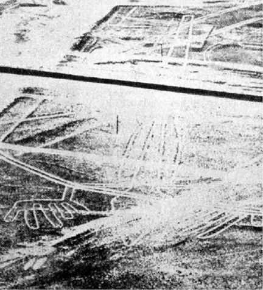
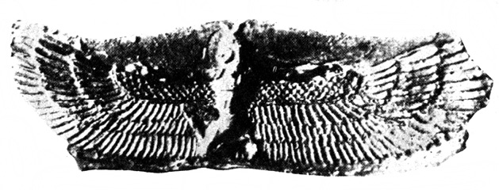

<section>

> _Toho, jenž hlubiny zřel až k hranici země,  
> jenž poznal všechna moře, opěvat chci.  
> Vše viděl a prozkoumal rovnou měrou,  
> byl nadán moudrostí a znalostí všech věcí.  
> On tajemství zřel, odhalil skryté  
> a zvěst přinesl o tom, co před potopou bylo._

POČÁTEK EPOSU O GILGAMEŠOVI, ASYRSKÁ VERZE

Zdrželi jsme se poněkud u dvou civilizací, jejichž otřes v minulosti předpokládáme, což nám umožňuje povšimnout si zajímavých skutečností na „letové trase“ od Egypta (a možná ještě dále na západ přes Korsiku a Stonehenge až do míst, kde se kdysi vypínal Atlantský hřbet), až k civilizacím Jižní Ameriky, kde naše vyprávění o otřesených civilizacích skončí.

Zmínili jsme se o Mohendžodáru a Harappě, dvou opevněných velkoměstech, od sebe vzdálených 600 km, jež se vynořila roku 1922 z hlubin minulosti zcela neočekávaně a jejichž geneze a vývoj dosud nejsou uspokojivě vysvětleny. Postupem let a s dalšími vykopávkami přibyly k oběma velkoměstům další města a vesnice kultury, jež se vyrovná vyspělé kultuře starého Egypta nebo Mezopotámie a jejichž vznik dnes klademe do první poloviny 3. tisíciletí před n. l., tedy do doby současné se sjednocením Egypta a vznikem sumerských městských států. Harappská kultura měla velmi čilé námořní i pozemní styky s blízkými i vzdálenými sousedy, pečetidla byla nalezena dokonce na území dnešního Rumunska.

Zmínili jsme se i o výstavnosti obou velkoměst, o dokonalé urbanistické koncepci, hygienických opatřeních a podivné skutečnosti, že archeologové až dosud nenarazili na žádnou stavbu, jež by mohla být chrámem, svatyní nebo obětištěm.

Na první pohled tedy šlo o kulturu kvetoucí, jejíž surovinová základna, jak víme z rozborů mědi a určení nalezišť minerálů, sahala až do dnešního Íránu a Afghánistánu, do střední Indie, do Pamíru, Tibetu a Barmy. A přece se nám podařilo, jak se zdá, zachytit civilizaci umírající, zatímco Egypt a Mezopotámie se v téže době dynamicky vyvíjely. Tato stagnace trvala 700–1000 let, jež můžeme díky archeo­logům přehlédnout. Rozkotání obou velkoměst dobyvateli (nebo jejich zničení jiným způsobem, využité pak kmeny indoíránských Árjů, znalých železa, k obsazení země) kolem roku 1750 před n. l. bylo jen epilogem truchlohry. Povšiml si toho i pozorovatel tak citlivý jako C. Lévi-Strauss a označil ubohé příbytky, nalezené poblíže různých pracovišť v Harappě i v Mohendžodáru, za „dělnické kolonie“ a celkový dojem za „deprimující a truchlivý, naznačující hluboký úpadek“. Avšak i bez tohoto významného svědectví je obraz kulturního okruhu Harappy a Mohendžodára (dodnes není jasné, zda šlo o dvě centra jedné jediné říše či dvou oblastí) truchlivý. Tvary nástrojů, ozdobných předmětů a ani zbraní se neměnily a nevyvíjely, stejně jako se nevyvíjela technologie jejich výroby. Některé sošky z různých materiálů jsou tak naturalistické, že byly vysloveny pochybnosti o jejich předřeckém původu, jiné nápadně primitivní. Vnější zdi domů nejsou opatřeny okny – každá rodina žila v klauzuře vlastního příbytku, pokud si jej ovšem mohla dovolit. Celou dohlednou historií těchto měst se táhne důsledný, zjevně mocensky vynucený konzervatismus, spojený s překvapující péčí o tělesnou čistotu, jež se ovšem v krajním případě může stát trýzní – vězňové nacistických koncentračních táborů dobře vědí, co mám na mysli. Autoři sborníku Moudrost a umění starých Indů se domnívají, že důvodem byla teokratická forma vlády, vynucující si náboženskými sankcemi dodržování i nejmalichernějších předpisů. Nelze to vyloučit, ale jak srovnat teokracii s městy bez chrámů? Lze si představit Vatikán bez chrámů?

</section>

<section>

> Klenutý podzemní kanál v rozvalinách Mohendžodára

Zdá se, že se vládní moc v Harappě na sklonku jejího trvání zhroutila, pořádek, násilně udržovaný, se změnil v chaos a stabilita v nejistotu (zakopávání majetku, především šperků).

Árjové, uctívači boha ohně Agni, se nesmísili s vyšší kulturou Harappy a Mohendžodára, jak se obvykle v dějinách stává, a nepřevzali jejich kulturu. Naopak veškerou péči zřejmě věnovali zabránění vzájemných styků mezi příslušníky svých kmenů a prvotním obyvatelstvem, které bylo vytlačováno na jih Indie a jež nalézáme jako příslušníky dnes stodvacetimiliónové skupiny Drávidů. Možná, že Drávidové a Harappané žili kdysi vedle sebe a stihl je týž osud. Nevíme.

Jisté však je, že kastovní systém, mučící dodnes Indii a zavedený Árji, měl především přispívat k úplné izolaci původního obyvatelstva.

Jaké nákazy se Árjové obávali? Jaké myšlenky nesměly proniknout mezi dobyvatele? Čím byla otřesena kultura Harappy a Mohendžodára, že se obě města vzdala svých zjevných bohů, v této fázi vývoje zákonitě existujících všude jinde na světě? Má téměř hysterická starost o čistotu něco společného s dezaktivací po zásahu tajemné zbraně indických eposů?

A především, co způsobilo stagnaci civilizace, jejíž stopy jsme nalezli a zjistili, že jde o stopy civilizačního sestupu? Zdá se, že po­dobný otřes utrpěla řada kultur a řešila jej rozdílně: migrací (Mayové, Polynésané), přípravou obrany (Egypťané, obyvatelé Velikonočního ostrova) nebo výměnou bohů. Okruh Harappy a Mohendžodára nezvolil ani jednu z cest. Snad nebyly schůdné, snad byla opravdu moc vládců, násobená propastnými třídními rozdíly, dovolujícími usoudit na otrokářský režim v Asii, nezvyklého typu, příliš autoritativní. Stačila konzervovat zvyky, zachovávat status quo, ale to samo o sobě v biologii i v dějinách národů znamená úpadek.

Na „letové dráze“ k Velikonočnímu ostrovu leží obrovská oblast Polynésie, překypující bájemi a mýty, jež mohou být při dobré vůli interpretovány zcela atlantologicky nebo kosmicky – do těchto úvah se však nepustíme. Mýty náleží vykládat zasvěceným odborníkům, kteří se již dávno shodli, že jejich interpretace může být „podmětná“, nikoli „předmětná“. Jinými slovy: jsou vzácným zdrojem informací o autorech a o prostředí, v němž vznikaly, nelze z nich však obvykle pouhým odstraněním koloritu a mytických, případně zázračných epizod vyloupnout racionální jádro, jakkoli i tento diletantský postup přináší občas dobré výsledky.

Na samém pobřeží Jižní Ameriky nacházíme první z nesčetných zajímavostí, slavný „trojzubec“ (250 metrů vysoký) u Piska na šikmé, skalnaté stráni při pobřeží Peru, viditelný z moře ze vzdálenosti 20–30 km. Má prapodivný tvar, který podnítil několik badatelů k domněnce (o níž jsem se rovněž zmínil, ačkoli ji dnes považuji za mylnou), že šlo o seizmograf – u středního sloupu bylo totiž podle tradice nalezeno lano a lze vykonstruovat důvtipné zařízení, které by opravdu jako seizmograf mohlo sloužit… v případě, že by obrazec byl na kolmé skále. Což není.

Zkoumání obrazce je obtížné – po souši totiž k němu nevede žádná přístupová cesta, je třeba doplout ke břehu zátoky Pisco a dobrodit přes ostrá skaliska.

Rovněž domněnka o kaktusu se nezdá být přijatelná. Byl by to totiž prapodivný druh, jaký v Jižní Americe, tak bohaté kaktusy, neznáme, pokud bychom připustili alespoň minimum obvyklého realismu domorodých tvůrců, odjakživa důvěrně seznámených s tvary domácí flóry a fauny. Daleko spíše se obrazec podobá podivně pokroucenému kandelábru. Ani v bohatých keramických nálezech pouštních příbřežních civilizací starého Peru (např. močické a čimuánské) není doklad podobné stylizované kresby.

Vznik „trojzubce“ je záhadou. Někteří autoři dokonce soudí, že jej dal zhotovit teprve peruánský místokrál pro svého synovce Alvara de Mendana, aby mu usnadnil návrat z dobyvatelských výprav v letech 1567 a 1595.

Tato domněnka trpí podobnými úbytěmi jako moje hypotéza o seizmografu: zakládá se totiž na neúplných informacích. Piskánská zátoka je dosti uzavřená a bylo by těžké najít místo, kde by bylo znamení lépe skryto a spíše odsouzeno k přehlédnutí, pokud nepozorný plavec mine vchod do zátoky. Kromě toho by byl stěží k takovému účelu budován složitý a pracný obrazec – nautická znamení jsou podstatně jednodušší a méně bizarní. Ani domorodým plavcům asi piskánský „trojzubec“ nesloužil – podle našich vědomostí se zabývali (navzdory Heyerdahlovým teoriím) výhradně příbřežní plavbou a taková monumentální znamení potřebovali stejně málo jako kapitán pražského vltavského parníčku petřínskou rozhlednu, aby nalezl spásný přístav u Palackého mostu.

Zdá se, že vysvětlení může naznačit jeho poloha, obrácená spíše k obloze než k mořské hladině: jde o znak, který kdysi kdosi umístil na svah piskánského zálivu jako znamení pro kohosi, kdo přilétal od Tichého oceánu. Možná, že to byli staří bohové, jejichž existenci na nebesích staroperuánské kultury předpokládaly, možná, že…

Hypotéza o kaktusu je, jak řečeno, vratká – ale v každém případě je na stráni v Pisku zpodobeno cosi hrotitého, ostnatého a především gigantického, přitažlivého asi stejně jako obrovský obraz šibenice nebo nabodnuté hlavy mořských lupičů na kůlech, taktně upozorňující v době rozvoje vikinských plaveb mořské kořistníky, že jejich přítomnost na pobřeží není vítána. Domnívám se zkrátka, že šlo o znamení varovné, smyslem odpovídající kolosům na Velikonočních ostrovech a rozměrem vyhovující účelu.

Domnívám se tak tím spíše, že 160 km odtud leží proslulé „letiště bohů“, Valle de Palpa u Nazky, se svými podivuhodnými kresbami a liniemi.

</section>

<section>

> Další pozoruhodnost Nazky: souběžné linie, běžící přes hory a doly a spojující dvě náhorní planiny

Je rovněž dostatečně známé a mnohokrát popsané ve vědecké i populární literatuře, postačí tedy jen stručné shrnutí: při leteckém snímkování příští trasy panamerické dálnice vedoucí přes Valle de Palpa se na fotografiích objevily jakési podivné linie a geometrické obrazce, které byly prohlášeny za incké cesty a zavodňovací příkopy. Roku 1940 se na ně přijel podívat americký archeolog Paul Kosok, zabývající se odhadem hustoty osídlení starého Peru právě podle zavodňovacích zařízení.

Na první pohled mu bylo zřejmé, že se interpreti leteckých snímků mýlili. Linie, pásy a křivky, jež vznikly jednak odstraněním vrchní zvětralé a tmavé vrstvy až na světlé kompaktní podloží, jednak stavbou jakýchsi zídek z kamenů, nebyly ani kanály, ani cestami, ledaže by je projektoval šílenec. Údolím Nazka se pak zabývala od roku 1946 řada archeologů, především Marie Reichová. Některé linie byly s uspokojivou pravděpodobností vysvětleny jako kalendářní, mířící k bodům horizontu, kam zapadá Slunce o slunovratech, přesněji řečeno, kam zapadalo mezi rokem 350 a 550 n. l. – astronomická zjištění se shodují v tomto případě s radiokarbonovou analýzou zbytků kůlu, nalezeného v prodloužení jedné linie, jehož stáří bylo určeno na 1500 let.

Nejzajímavější jsou však stylizované obrazy zvířat, osmdesátimetrových opic, 46 metrů dlouhých pavouků, ještěrů, dravých ryb, jakýchsi nedefinovatelných nestvůrek, jež by mohly, ale nemusely být sépiemi, a především bohatého sortimentu obrovitých dravých ptáků s výhrůžně napřaženými zobany. Některé kresby se opakují, jako by byly do vyprahlé půdy náhorní planiny (je 500 m n. m.) vyraženy razítkem, velkým jako slušné hřiště. Jejich vznik je nejasný – musíme předpokládat, že tvůrci ovládali základy vyměřování a přenášení kreseb pomocí sítě do impozantních rozměrů v terénu; to připouští i Marie Reichová jako sice šílené, ale jediné vysvětlení. To je samo o sobě zajímavé, avšak nás především trápí základní otázka: proč taková námaha?

</section>

<section>

> „Dráhy“ ve Valle de Palpa rozhodně nebyly silnicemi. Význam mnohých z nich nebyl dosud spolehlivě určen

</section>

<section>

> Tato linie je ovšem jistě astronomická – snímek byl pořízen v den zimního slunovratu 21. prosince. Ještě před 1500 lety byla shoda úplná

</section>

<section>

> Oblasti staré a nové mayské říše

</section>

<section>

> Jedna z obrovských figur: opice napojená na systém podivuhodně geometricky přesný, pracný a záhadný

</section>

<section>

> Panamerická dálnice zničila mnoho figur, např. tohoto ještěra dlouhého 180 metrů

Däniken vidí ve Valle de Palpa letiště nepozemšťanů, kteří diri­govali postup kreseb z letadel nebo je sami např. pomocí energetických paprsků vytvořili zároveň s absolutně přímo probíhajícími dvojitými zářezy, překračujícími údolí i okolní vrchy a zřejmě naznačujícími jakési důležité směry, jež musely být fixovány. V krajním případě připouští Däniken jako důvod vzniku kreseb touhu tehdejších obyvatel, aby se „bohové“ z vesmíru vrátili. Gigantické figury je měly přilákat.

Nehledě na vlastní nepřekonatelný odpor k pavoukům, nepovažuji menažérii potvor, vyvedených ve štěrku Valle de Palpa, za právě lákavou. Zcela naopak. Vnucuje se opět myšlenka, že jde o strašáky, zvířata dostatečně nebezpečná a dostatečně veliká, ba dokonce zvířata létající, která měla varovat kohosi, aby zde nepřistával. Snad předcházely špatné zkušenosti, jimž by se konečně nebylo co divit: start jakéhokoli kosmického korábu (například) je patrně vždy doprovázen vedlejšími efekty, jež nepůjdou neopatrným svědkům k duhu.

Myšlenka, že se cosi takového kdysi dávno stalo, má několik podpůrných argumentů: na „letové trase“ leží i Tíwanaku, rozvaliny města plného dosud nevyřešených otázek. Jisto je, že Tíwanaku zde stálo již v době, kdy široko daleko nebylo žádné jiné lidské sídliště tohoto druhu, a přirozeně by poutalo pozornost.

Kromě toho nejsou „strašáci“ z Valle de Palpa jediní: v chilské poušti Tarapacáru byly roku 1968 objeveny podobné kresby, mezi nimi i stometrový obrys lidské postavy, vytvořený z lávových balvanů na výšině 200 metrů vysoké, a na náhorní rovině El Enladrillado další „letiště bohů“, dokonce obklopené amfiteátrem z kamenných bloků o hmotnosti kolem 10 000 kg.

</section>

<section>

> Méně známé nálezy z Nazky: několik metrů vysoké skalní reliéfy postav s jakousi svatozáří kolem hlav

Pochopitelně – místní obyvatelé Warrauové mají o Valle de Palpa své hezké pověsti o sídle vysoko nad nebesy, odkud jejich praotec sestoupil na zem a nastřílel tam lukem a šípy zvířata, zobrazená na Valle de Palpa. Zdá se však, že impuls k vytváření obrazců, viditelných v celku toliko z výšky, byl značně silný nejen v Peru, ba nejen v Jižní Americe. Na východě Severní Ameriky se setkáváme s tzv. moundy, zemními navršeninami z hlíny nebo z kamene různého tvaru. Zvláštní místo mezi nimi mají tzv. mound-effigies, nacházené většinou ve Wisconsinu, vršené ve tvaru obrovských, obvykle několik set metrů dlouhých zvířat, hadů, medvědů, aligátorů atd. – ale i králíků a jelenů, jejichž tvar je možné přehlédnout teprve z letadla.

Není ani známo, proč moundy vznikly – představovaly obrovský výkon a přemístění statisíců kubických metrů zeminy a kamene v době, která neznala ani jednoduchou lopatu – ani kdy vznikly. Mound-effigies patrně již asi v 7. století před n. l. a později. Pravda, někteří indiánští démoni sídlili podle pověsti mezi hvězdami a na obloze, ale byl to dostatečný důvod? Proč např. křesťanství, přes nepochybně nebeská sídla boha, světců a andělů, nikdy nepomyslelo, s výjimkou nemnoha bazilik, na významuplné půdorysy staveb, „čitelné“ z nebeských výšek?

(Po pravdě řečeno, neznáme, ba ani netušíme důvody vzniku podobných, avšak daleko bližších „nebeských poutačů“ v Anglii, např. 111 m dlouhého koně v Uffingtonu, starého nejméně 2000 let, nebo „Velkého muže z Wilmingtonu“ na svazích hory Windover i jiných, patrně starších obrazců, vzniklých obnažením bílého křídového podkladu, zbaveného vrstvy hlíny a drnu. Mnoho těchto obrazců je jistě velmi starých – od 19. století se však stalo módou vytvářet nové, takže lze nalézt i – Blériotovo letadlo. Zajímavým zjištěním je, že organizace jejich „výroby“ byla i v moderní době velmi obtížná a vyžadovala systém vlajkových signálů, megafony a teodolity. Neméně zajímavé je, že velmi staré kresby, např. „Obr z Cerne Abbasu“ s 37 m dlouhým kyjem, jsou vysloveně děsivé a odpuzující.)

Zdá se mi, že musíme připustit otřes místních kultur jakousi událostí, jež přikvačila nebo hrozila přikvačit z výšky. K jejímu odvrácení měly sloužit obrovské obrazy zvířat, rozhodně nepůsobících přitažlivě. Na tom ovšem nic nemění skutečnost, že některé kresby, podobné strašidélkům ve Valle de Palpa, byly nalezeny na místní nazkánské keramice. Proč ne? Proč by domorodci nepřenesli vhodné kresby třeba z keramiky nebo jich nepoužili současně ve velkém i v malém?

V zájmu vědecké poctivosti musíme ovšem uvést i další možné vysvětlení, které však považuji za méně pravděpodobné, i když svrchovaně vzrušující: obrovské podoby zvířat a lidí, nalezené v Novém světě, jsou primitivní a nedokonalou nápodobou podivuhodné a naprosto tajemné kultury Marcahuasí.

</section>

<section>

> Ukázka podivuhodné sochařské práce dávných obyvatel Marcahuasí: skála změněná v podobu afrického lva

Jde o oblast v Peru poblíže Limy v provincii Huarochiri a okrese Casta. Na několika čtverečních kilometrech, jež prozkoumal v letech 1952–1954 dr. Daniel Ruzo, je nejfantastičtější sochařská galerie, pro niž byly (podobně jako Mount Rushmore v USA pro podoby čtyř prezidentů) přetvořeny celé skalní hřbety v plastiky. Španělští kronikáři konkvisty zanechali zprávu, že Inka Tupac Yupanqui znal Marcahuasí i další podobné oblasti, které „… vytvořili bílí lidé z hvězd… stvořili je k svému obrazu a k obrazu cizích národů, které žijí na čtyřech světových stranách…“

Seznámil jsem se s Ruzovým spisem, doprovázeným početnými původními snímky. Jako znalec fotografie musím přiznat, že je nepokládám za mystifikaci a vylučuji dodatečné úpravy; dominanty oblasti Marcahuasí totiž tvoří čtyři gigantické hlavy, jedna s indiánskými rysy, druhá se semitskými, třetí s černošskými a čtvrtá zřejmě patřící neznámé rase. Jsou zde sochy želv, ropuch, sov, ryb, milenců, ale také, a to je v Americe prazvláštní, velblouda, býka, lva, gorily a slona, tedy zvířat, která zde buď nežila, nebo dávno vymřela. A k dovršení všeho lze rozeznat v zřejmě otesaných pahorcích podoby stegosaura a toxodona, kteří toto slzavé údolí opustili, jak pevně věříme, před 150 milióny let.

</section>

<section>

> Ani tisíciletí útoků povětrnosti nesetřela zcela tvary hlavy další velesochy Marcahuasí, tentokráte velblouda

Opravdu necituji science fiction, pokračuji-li v Ruzových poznatcích: objevil reliéfy, zřetelné toliko v den slunovratu (jaké vědomosti a prostředky museli tvůrci ovládat!), na nichž se objevují předchůdci člověka od opočlověka až k neandertálci, skulptury, proměňující se minutu od minuty postupem slunce způsobem, který je sice odedávna vytouženým, ale naprosto nedosažitelným ideálem tvůrců plastik pod širým nebem.

Neuvěřitelné plastiky dávno vyhynulých tvorů se dostávají o krok blíže k pochopení, seznámíme-li se s dalšími nálezy: v bolivijské provincii Sica-Sica u Vizcachani byly odkryty zbytky paleolitické kultury, staré 30 000 let, jejíž příslušníci lovili mastodonty, tedy třetihorní tvory, zpodobované (a omylem považované za „slony“) mayskými reliéfy. Poblíže Candelarie v obvodu Beni byly před II. světovou válkou objeveny výborně zachované kostry řady druhů zvířat, která podle našich představ nepřežila konec třetihor, na samém povrchu země, mj. i pětiprstý tvor s drápy, jehož se dosud nepodařilo paleozoologicky zařadit. Největší senzaci vzbudil roku 1945 šokující objev asi 3000 let staré keramiky poblíže mexického města Acámbara. Zpodobuje v pohybu vyhynulé americké velbloudy, prakoně, pratapíry, a dokonce i řadu druhů veleještěrů. Vykopávky u Acámbara dosud neskončily a vědci je považují za epochální. Jak se zdá, budeme muset po nezbytném dalším důkladném studiu poněkud změnit názor na dobu vyhynutí třetihorních, ba snad i druhohorních tvorů, a přiznat siru Conanu Doylovi za jeho Ztracený svět značnou jasnozřivost. Ale to vše se netýká naší knihy – chtěli jsme jen doložit, že Marcahuasí není tak docela ojedinělým, bludným balvanem.

Marcahuasí bylo kdysi malým rájem, glyptotékou, zavlažovanou dvanácti umělými jezery, z nichž zbylo poslední. Je to prastará galérie. Neodvážíme se ani odhadovat, jak. Snad nebyla jediná. Snad se příští generace snažily napodobit nenapodobitelné alespoň v rámci svých možností. Kdo ví?

Vraťme se však k argumentům o civilizačních otřesech.

Instalace bubáků všeho druhu je jistě možným a mentalitě přírodních národů odpovídajícím způsobem reakce na nebezpečí z výšky. Bezprostřední ochranou, s níž jsme se již seznámili (alespoň v předpokladech), je budování bezpečných útočišť, současnou terminologií řečeno krytů.

Východně od Limy na svazích Cajamarquilly jsou zříceniny, den ze dne ustupující (jako tolik ostatních památek, navždy zničených) civilizačnímu náporu buldozerů a skrejprů. Mimo jiné jsou zde stovky otvorů do skály, zřejmě velmi pracně vyhloubených, s „lidskou mírou“: jsou 1,70 m hluboké a 60 cm v průměru, přesně válcového tvaru, jako by zde postupovala slušně velká půdní fréza a hloubila jeden kryt za druhým v impozantním počtu – některé řady mají až přes dvě stě děr, nápadně – jak upozorňuje neúnavný pan Däniken, jenž provedl fotografickou dokumentaci, měření a pokus – podobné krytům obyvatel Vietnamu proti teroristickým americkým náletům. Stejně jako ony měly základní výhodu: byly po ruce přímo v sídlištích.

Archeologie vysvětluje jámy v Cajamarquille zcela neromanticky jako zásobárny obilí. Toto uklidňující vysvětlení naráží bohužel hned na několik obtíží. Nehledě na skutečnost, že nebyla nalezena žádná víka a že řady pastí přímo na ulici musely být pro místní světáky dost nebezpečné, je pravděpodobné, že by se zrní na dně závrtů, kam mohla zatékat nebo prosakovat voda, brzy kazilo, tím spíše, že je takřka vyloučeno poslední čtvrtinu obsahu těchto „sil“ vybrat bez sacího potrubí. Lopatou to prostě nejde, v úzké jámě se nelze skrčit na bobek, a ani malé nádoby na provázcích, které jako poslední a nejrafinovanější možnosti použil Däniken se svými společníky, problém nezvládly. A ovšem v žádné z jam nebyla nalezena ani stopa po obilí nebo jakékoli jiné potravině.

Ještě rozsáhlejší a podivuhodnější je systém jeskyň, který objevil roku 1965 Juan Moritz v hraniční provincii Ecuadoru, sousedící s Peru, Morona-Santiago. Svůj nález oznámil vládním činitelům, požádal o vědeckou pomoc a zároveň o audienci u prezidenta Velaska Iberry. Nestalo se nic až do 4. března 1972, kdy se Däniken s Moritzem setkal, část jeskyň prohlédl a své zkušenosti popsal – a byl Moritzem žalován. Vstup do jeskyň, rozkládajících se v troj­úhelníku měst Gualaquiza – S. Antonio – Yaupi, není snadný, vchody skrývá prales, obývaný necivilizovanými indiány. Tunely jsou řemeslně dokonale raženy s pravoúhlými chodbami a obsahují celou řadu předmětů, které Däniken vyfotografoval a popsal, za což si vysloužil pověst sedmilháře a obecný posměch.

Přiznám se, že jsem této náladě rovněž podlehl, tím spíše, že můj poměr k Dänikenovým hypotézám je, jak čtenář jistě poznal, značně rezervovaný. Myšlenka na „stovky kilometrů“ podzemních chodeb pod Ecuadorem a Peru se mi zdála vymykat se zdravému rozumu, a argumentům, uvedeným v Dänikenově knize Aussaat und Kosmos (Econ Verlag 1972), jsem prostě nevěřil.

</section>

<section>

> Mapka území, kde byly objeveny rozsáhlé podzemní prostory z incké nebo předincké doby

První otřes mi způsobil známý český amerikanista Miloslav Stingl, když v osobním rozhovoru Dänikenovy nálezy nevyloučil. Zcela bezradný jsem zůstal nad sdělením peruánského archeologa Itala Olbertiho, jenž ve spolupráci s polskými vědci roku 1972 objevil poblíže Sacsayhuamanu tunel, vedoucí od pevnos

ti k městu Cuzku, a potvrzuje existenci „celé sítě podzemních cest“, mj. dalšího „tunelu sta dveří“, jak jej nazvali archeologové pro stovky lichoběžníkových megalitických dveří v něm…

Otázku, proč vznikl tento rozměrný labyrint, rovněž čekající na další průzkum, nehodlám řešit. Nevěřím ovšem, že jej vybudovali nepozemšťané, ačkoli námaha, vynaložená na proražení geometricky přesných tunelů musela být strašlivá a vyčerpala pracovní kapacitu mnoha generací. Jistě to byl impuls nesmírně působivý, pro nějž v oblíbeném schématu kultovních staveb, k němuž se obvykle utíkáme, nenalézáme v náboženských představách tehdejších obyvatel (pokud jsme vůbec schopni je rekonstruovat) žádný důvod. Je nesporné, že v případě potřeby šlo o ideální kryty – zda tyto chodby a jeskyně opravdu jako kryty sloužily, rozhodne budoucnost. Již dnes můžeme říci, že to nebyly ani pohřební katakomby, ani svatyně. A jako trezor pro zlaté a stříbrné i kamenné objekty a prapodivnou „knihovnu“ z kovových fólií, většinou roz­měru 96 cm × 48 cm, uschovanou dnes jako jedinečná sbírka u pátera Carla Crespiho v Cuence, by byly takové jeskyně poněkud příliš pracné…

Závěrem se alespoň letmo zmiňme o pozorovaných následcích otřesu, jenž snad vyvrátil kvetoucí starou říši Mayů a zanechal ji zcela opuštěnou a mrtvou, zatímco se středisko přesunulo o několik set kilometrů na severovýchod, na poloostrov Yucatán do nové říše.

Nebudeme široce rozvádět podivnou rozpornost mayské kultury zaměřené výhradně na „nepraktické“ záležitosti a naprosto neschopné vyrovnat se s nejvšednějšími otázkami. Mayové, otroci nejsložitějšího trojitého kalendáře, jaký kdy svět poznal, se ve svých záznamech díky poměrně rozvinuté matematice vraceli k datům, vzdáleným 400 miliónů let v minulosti (podle Thompsona, patrně nejlepšího znalce mayské kultury vůbec, ještě o miliardy let dále…), nebyli však schopni zvážit ani balík bavlny. Po jejich sacbe (bílých cestách), skvěle dlážděných a s mimořádným úsilím stavěných např. i napříč jezery, neprojel až do vylodění Franciska Monteja roku 1526 ani jediný vůz, i když by se tři vedle sebe zcela pohodlně minuly; Mayové totiž neznali kolo… (A neznali je opravdu? Je takový „výpadek“ možný v civilizaci, přemísťující zřejmě na válcích dvacetitunové i vícetunové balvany? A především: jsou známy mayské keramické hračky – na kolečkách…) Obvyklým vysvětlením je, že sacbe byly používány k rychlým přesunům vojsk do vzdálených neklidných provincií. To je názor lidí, kteří nemají nejmenší představu o vojenství. Armáda by bez týlového zabezpečení, bez povozů – a Mayové neměli ani zvířata, jež by nesla náklad – po několika dnech v pralesích zahynula hlady. K těžké obsidiánové zbroji a ještě těžší výstroji nemohl bojovník pobrat mnoho zásob…

Mayové vytvořili patrně nejvyšší kulturu Jižní Ameriky, i když je Inkové předčili ve tkaní a barvení látek, Chiriquové ve zpracování kovů a Aztékové ve vojenské organizaci. Byla plodem nejméně 3000 let vývoje, po němž ve „zlatém věku“ rozkvetla města Palanque, Yaxchilán, Piedras Negras, Seibal, Tical, Neranjo, Copak, ovlivňovaná záhadnou kulturou La Venty, i další. Tuto starou říši, ležící v povodí řeky Usumacinty a Peténu, z nepochopitelných důvodů Mayové opustili a přestěhovali se s „mezistanicí“ v zemi Chen až do severního Yucatánu, kde založili novou říši. K velkému pochodu Mayů došlo podle radiokarbonového datování asi v letech 800 až 925 n. l.

Navzdory mínění některých autorů nebyl asi přesun ze staré do nové říše proveden rázem, tím méně panicky. Svědčí o tom především skutečnost, že obyvatelé měst zakryli většinu posvátných pyramid násypy hlíny, což byla takřka stejně velká práce jako budování pyramid.

Důvod mayského exodu je pro mayology „problémem číslo jedna“ (M. Stingl). Hypotéz je celá řada.

– Vzpoury proti nadvládě hierarchie (ale v nové říši se ujaly vlády tytéž rody jako ve staré a kromě toho se stěhovalo všechno obyvatelstvo, nikoli jen vypuzená část);

– útok nepřátel (ale Mayové neměli v dalekém širokém okolí rovnocenného soupeře, města nenesou známky dobývání a jen Palenque bylo pravděpodobně později obsazeno Totonaky);

– častá zemětřesení (ale pyramidy nenesou jejich stopy a lid, bydlící v rákosových chatrčích, si na vulkanismus zvyká a neopouští proto vlast – podobně jako to nečiní Japonci);

– zanesení vodních nádrží bahnem (ale takovou nepříjemnost nelze čekat ve všech městech současně a Mayové by si s ní patrně poradili);

– epidemie (ale nebyly nalezeny žádné společné hroby ani jiné známky hromadného onemocnění);

– vyčerpání půdy (ale Mayové byli dobrými pěstiteli kukuřice, fazolí a tykví a není důvod, proč by po 3000 letech náhle k vyčerpání půdy došlo);

– klimatická změna (ale té by několikasetkilometrovou poutí neunikli).

Podobných domněnek byla vyslovena celá řada. Roku 1973 oznámili archeologové manželé Dennis a Olga Pulestonovi: Mayové odešli, aby nalezli lepší podmínky pro svou základní rostlinu, totiž druh fíkovníku, maysky nazývaný „raman“ a plodící až 1000 kp z hektaru za rok. Proto se vzdali i možnosti pobřežního rybolovu a sběru škeblí a korýšů, proto opustili svá města.

Proč by je však zasypávali?

Däniken vymyslel hypotézu důvtipnější: velesložitý kalendář považuje za zajištění Mayů proti omylu v datu, kdy se „bohové“, tzn. nepozemšťané, vrátí ke svým dítkám. Däniken si zřejmě z vrozené dobroty představuje každé setkání dvou vesmírných civilizací, resp. jedné civilizace a druhé protocivilizace, jako idylickou selanku, těšící obě zúčastněné strany. Tvrdí, že i pyramidy byly vlastně fixací data návratu „bohů“ – jejich jednotlivá patra přirůstala přesně v rytmu předem vypočítaných let.

S tím nelze souhlasit. Mayské pyramidy byly poměrně složité svou vnitřní konstrukcí, avšak nenarůstaly po etážích. Jejich obložení kamennými kvádry a deskami bylo provedeno teprve po dokončení jádra, a najednou. Zajímavá je myšlenka na kalendářní posedlost, které si jsou velice dobře vědomi všichni amerikanisté, zabývající se podivnou mayskou civilizací. Podle jedné domněnky byly i stavby pyramid několikanásobně jištěnou zárukou přesného datování čehosi v dohledné budoucnosti, co se zjevně nestalo (zatímco mayské výpočty jdou, jak víme, milióny a snad miliardy let do minulosti, nejodvážnější „futurologické“ datum je položeno pouze 4000 let v budoucnosti – J. E. S. Thompson).

Nevrátili se snad „bohové“ a znamenalo toto zklamání otřes tak strašlivý, že všemocní kněží museli přijít s tvrzením o omylu v místě přistání „bohů“ a odvést tam všechen lid, jehož rozhořčení bylo svízelemi cesty oslabeno a rozptýleno, takže nedošlo ke svržení ani světských, ani kultovních vládců? Byly snad pyramidy zakryty, aby se „bohové“ nezmýlili?

Nepovažuji tuto domněnku za zavrženíhodnou. Podobně si totiž vedli v křesťanských klášterech první kronikáři, když jim byl každoročně, díky iniciativě Bedy Ctihodného, přidělen lunární kalendář, nezbytný k výpočtu důležitých svátků, především Velikonoc. Volná plocha pergamenu umožnila stručné záznamy, jež prováděli kronikáři ve spolupráci s tzv. komputisty, kalendářními odborníky. Zápisy naprosto nebyly činěny s jakýmkoli „moderním“ dějepisným záměrem; jejich jediným smyslem bylo vzájemným srovnáním a pečlivým doplňováním zabezpečit správný letopočet a díky němu přesně uvítat milénium, rok 1000, kdy, jak se všeobecně předpokládalo, sestoupí Kristus a nastane Soudný den.

Mrazivou noc na Nový rok 1000 strávila křesťanská Evropa pod širým nebem, v chiliastickém blouznění a na modlitbách, přecházejících v masovou hysterii, podněcovanou potulnými kazateli a mnichy. Když se očekávané efekty nedostavily, nastal strašlivý šok, který málem znamenal konec křesťanství, a byl by jej také znamenal, nebýt pevné církevní organizace a jejího sromatnepětí se světskou mocí. Letopisy o této obrovské blamáži nevyprávějí. Dějiny, jak známo, píší vítězové.

Podobný otřes mohl postihnout i Maye.

Další možností je útěk z ohrožené oblasti a velkorysé „smazání stop“ skrytím pyramid, sice nesmírně pracným a náročným, ale přece jen schůdnějším než jejich srovnání se zemí.

V každém případě zde tušíme stín…

</section>

<section>

> Památník Opeřeného hada – hlavní pyramida v mayském městě Chichen Itzá s jedenadevadesáti schody a devíti stupni

</section>

<section>

> Na trase „otřesených civilizací“ nacházíme množství létajících bohů, démonů i strojů

</section>

<section>

> Některé objekty jsou těžko vysvětlitelné a jejich označení je výsledkem konvence; tato kamenná mayská plastika byla označena jako „hlava papouška Xochicalco“

</section>
