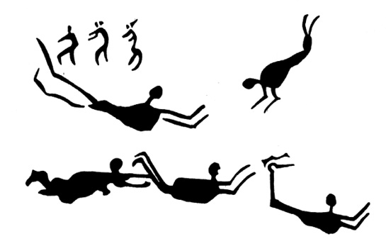

> Jsou lidé, jejichž obrazivost a síla myšlenek je velmi silná  
> a mohou nabýti takové moci, že se mohou duším jiných lidí  
> ohlašovat a je poučit o svých myšlenkách a přáních na velké  
> vzdálenosti.

AGRIPPA Z NETTESHEIMU, 1531

Paul Brunton, který celý život zasvětil zkoumání podstaty východních mystických praktik i praktické mystice, napsal na sklonku života rozsáhlé dvousvazkové dílo, v němž doznává: je třeba konečně říci, že mystika v žádné formě nevede ke „spojení s bohem“, nemá sama o sobě žádný náboženský ani mravní význam. Je jenom zdrojem příjemných pocitů. Lidé, kteří se jí oddávají, touží po těchto příjemných pocitech a usilují o to, aby se opakovaly. Nic víc.

  

Je to strašná deziluze, které se spousty snílků dočkaly od jednoho ze svých uznaných vůdců. Namlouvají si totiž, že se přesvědčují o existenci boha osobně, že si zajišťují věčný život, že se vymykají ostatním lidem, atd. atd.

Je třeba říci to ještě brutálněji (což Brunton neučinil): z fyziologického hlediska je podráždění míšních nervů, vznikající různými mystickými praktikami, ekvivalentní bouři tzv. vegetativního nervového systému, vznikající při orgasmu, i když je ovšem mechanismus jiný. Dosažení těchto stavů, promítajících se ve formě zahalených koruptel do všech náboženství a usnadňovaných používáním jistých psychofarmak rostlinného původu, obvyklým takřka u všech přírodních národů za zvláštních příležitostí a nevedoucím tedy většinou k narkomanii, patří k prastarým znalostem lidstva. Vrcholnou extázi, ať už je nazývána rozličnými školami jakkoli, prožívali stejně šamani pravěkých lovců jako křesťanští světci, hinduističtí „svatí mužové“ i nemnozí trpěliví Evropané, kteří si navzdory krajně nepříznivým okolnostem zcela jiné doby a atmosféry potřebné – a řekněme hned, že pro zdraví duševní i fyzické dost nebezpečné – schopnosti osvojili.

Moderní věda nyní objevila některá pradávná psychofarmaka přírodních národů – ještě donedávna se nezdálo, že mohou poskytnout něco významného moderní farmakologii, odmítající „zastaralá“ galenika – a intenzívně je studuje, ať již jde o houby a kaktusy Aztéků, ayahuascu, „víno, opájející duši“, cohobu, ololiuqui a mnohé další. Harvardský profesor Schultes, jeden z průkopníků tohoto výzkumu, prohlásil: „Nejdůležitější metodou, jak objevit nové drogy, je studovat staré spisy, vědecký výklad lidových zvyků, a právě v terénu mezi primitivy, kteří dosud žijí v úzkém styku s rostlinným světem. Musíme využít těchto možností, dříve než těch pár zbývajících panenských končin poruší vpád civilizace. Jsem přesvědčen, že v průběhu čtvrt století většina tohoto etnobotanického bohatství propadne zkáze. Narazili jsme na několik cenných psychoterapeutických látek, ale doslova v poslední chvíli.“

Přes nevelkou povzbudivost těchto řádek se i tak zdají být příliš optimistické: přišli jsme pozdě. To, co ze „zelené medicíny“ dávných kultur objevujeme, je právě v oblasti psychofarmak pouhá koruptela, zaměňující původní látky, jistě přísně utajované a z dobrých důvodů obecně nepřístupné, s látkami opojnými, i když ani ty nejsou přírodními kmeny zneužívány. A tak dnes stojíme v údivu nad objevy účinných cytostatik (léků, zpomalujících růst zhoubných nádorů), na jejichž ověřování pracuje od roku 1955 jenom v USA devět farmaceutických společností a 175 výzkumných pracovišť. Znovu a znovu s překvapením zjišťují, že jde skutečně o rostliny (jmelí, americká mandragora, podražec obecný atd.) velmi účinné, jimiž byly nádory léčeny od nejvzdálenější dohledné minulosti. Je záhadou, jak k tomuto poznatku, který může být získán teprve velmi dlouhou zkušeností a srovnáváním a jehož samotné ověření je svrchovaně svízelné i pro skvěle vybavené laboratoře, používající pokusných zvířat, došlo. Domorodá psychofarmaka jsou však přísně tajena, především před bělochy, i když jde zjevně o látky pouze opojné, např. peyotl, jehož kult se stal podle Aldouse Huxleyho součástí kulturního nacionalismu amerických indiánů, prohlašujících: „Bůh dal bílému muži vše, ale nám dal peyotl…“

Teprve poslední léta přinesla, jak se zdá, trochu světla do záhad dávných drog, používaných patrně ve značné části světa: roku 1941 identifikoval Schultes mexickou povijnici jako starobylé narkotikum Aztéků, ololiuqui, podle kronikářů konkvisty „objasňující všechny věci, které nemohou být lidskou myslí pochopeny“, jež je patrně nejblíže výchozí droze.

Také o ní proskočily zprávy (roku 1958), a byly ihned potlačeny. Podle nich byla objevena rostlina yagé, jejíž výtažek umocňuje psychotronické možnosti každého, jenž ji požil, disponuje jej k telepatickému příjmu i vysílání, k telegnosi a snad dokonce k telekinetickým akcím. Pokusy s touto drogou se ihned přísně utajovaly, a to nejen z obav před zneužitím narkomany.

O psychotroniku se totiž velice zajímají generální štáby všech armád světa. Zdá se, že telepatické spojení by bylo v podmínkách protiradarové války, rušící pojítka protivníka na všech frekvencích, spolehlivější než všechna dosud známá technická zařízení. Spojené státy provádějí rozsáhlé pokusy o spojení do hlubin moře s telepaty na atomových ponorkách, které by měly sloužit jako velitelská stanoviště a bezdrátovými pojítky nejsou dosažitelné bez vypuštění bóje s anténou, označující polohu ponorky. Ačkoli to není veřejnosti všeobecně známo, probíhaly v rámci programu Apollo pokusy s telepatickým spojením s každou kosmickou lodí. Při obležení americké základny Khe-San vietnamskými vlastenci použili Američané s úspěchem proutkařů, vyhledávajících bambusové miny, na něž nereagovaly minohledačky, i podkopy směřující k základně. Telegnose byla nejednou využita jako pomocný prostředek vojenského průzkumu – známá je historie českého pluku, jenž za intervence proti Maďarské republice rad roku 1919 používal skupiny tří rozvědčíků-telegnostů (dva z nich byli vybráni na místě) se zjevnými úspěchy i v řízení nepřímé dělostřelecké palby. A téměř všechny policie světa spolupracují ve vybraných případech s telegnosty, i když tato spolupráce není vždy publikována tak obsáhle, jako např. případy, které řešil proslulý Croiset…

Zájemce odkazuji na rozsáhlou odbornou literaturu sovětskou, naši nebo jinou – existuje zkrátka řada dobrých důvodů pro domněnku, že staré civilizace měly daleko vyšší schopnosti k využití všech složek psychotroniky (ať už to bylo zahaleno do jakéhokoli náboženského hávu) jednak zvláštním způsobem myšlení, jednak psychikou pravěkého člověka-lovce. Výhodnější pro uplatnění psychotronických jevů bylo patrně i prostředí, nepotlačující tyto schopnosti nejrůznějším způsobem. A ovšem uplatnily se – v případech, kdy to bylo nutné – drogy, s jejichž pradávnou znalostí i náhražkami se dnes při pracném a zoufale spěchajícím výzkumu setkáváme. Je ostatně známo a mnohokrát popsáno, že i drogy tak banální jako alkohol, požitý v malém množství, i nikotin zvyšují schopnosti mnoha telepatů a telegnostů.

Nemůžeme vyloučit v dávné minulosti lidstva civilizace, které nezanechaly příliš mnoho stop prostě proto, že jejich vývoj byl netechnický. Kdybychom se vzdali svých domů, oděvů, strojů, nástrojů, zbraní a všech zařízení, která je vyrábějí, kdyby toto všechno rázem zmizelo, ani naše civilizace by nezanechala příliš mnoho zbytků. Dobrým příkladem je Polynésie, nad níž hořekují etnografové: Polynésané se spokojovali pouze s nezbytnými výrobními prostředky a veškerý důvtip vynaložili, aby jich bylo co nejméně. Materiální památky z této oblasti jsou proto velmi, velmi vzácné.

Pokusme se takovou civilizaci – „civilizaci delfínů“ – modelovat.

Leží ve velmi dávné minulosti – deset i více tisíců let, hluboko v prehistorii, kam archeologové dohlédnou jen vzácně. Domnívám se však, že neuvěřitelně pevná společenská paměť lidstva přesto zachovala mnohé útržky vzpomínek – jde jen o to správně je interpretovat.

Pokud jde o přesnější datování, doporučuji poohlédnout se v období pozdně glaciálním po dobách klimaticky příznivých, je to podle terminologie, platné pro severozápadní Evropu (avšak s úpravami přijatelné takřka globálně), tzv. allerödská oscilace v letech 8800–10 000 před n. l. a ještě starší böllingská oscilace (10 500–11 500). Obě období, určená podle pylových zón a datovaná radiokarbonovou analýzou, představovala epochy ústupu ledovců a změn rostlinné i živočišné „dekorace“. Dostáváme se tak o řadu tisíciletí před klimatické optimum atlantské a pozdně boreální v postglaciálním období, kterému bylo až dosud přisuzováno nejvíce zásluh na civilizačním rozvoji člověka od kořistníka k usedlému zemědělci a pastevci (3000–7000 před n. l.).

Neznala patrně války – instinkt druhové sounáležitosti byl ještě dost silný, aby zmírnil prvotní střetnutí lovců a usedlých pastevců a zemědělců. A země byla dost velká pro všechny. Tato skutečnost se, jak věřím, promítá velice dlouho do jazyků, zachovávajících původní etymologické kořeny slov déle než tradice, jakkoli se jazyk jako společenský jev vyvíjí souběžně se společností a reaguje na její změny.

Johan Huizinga ve své knize Homo ludens upozorňuje na shodnost výrazů pro „boj“ a „hru“ v řeči starých jazyků a na přenesení pojmu „hra“ na „boj“, sledovatelné ještě ve starověku i středověku. Píseň o vítězství krále Ludvíka II. roku 881 říká o bitvě: Zde hráli Frankové… Ve 2. knize Samuelově vyzývá Abner Joaba před smrtelným kláním: Nechť vystoupí nyní mládenci a pohrají před námi… Zdá se, že prvotní charakter hry, určené formálními a přesnými pravidly, jež nevedla k smrti protivníka, jakkoli mohla rozhodovat ve sporu (podobně jako při zápasech zvířat), se přenesl i do jistých zdvořilostních zvyků, dlouho dodržovaných vojevůdci. Obzvláště zřetelné je to v archaickém Řecku, kde války mezi řeckými kmeny měly velmi formalizovaný ráz, často se jich účastnily pouze „týmy“ o stejném počtu bojovníků, jimž bylo zakázáno používat zbraní tak nebezpečných, jakými jsou např. oštěpy atd. Města Chalris a Etretia na ostrově Euboi vedla koncem 8. stol. př. n. l. válku o helantinskou planinu, trvající plných sto let – je vidět, že to nebyla válka příliš ničivá.

Tato civilizace – jestliže jsou naše domněnky správné – byla schopna používat telepatie, nazývané dnes experimentální, i mimo mezní situace; i v současnosti dochází u osob jinak málo disponovaných k tzv. telepatii spontánní (při onemocnění blízkých osob, jednoho z dvojčat atd.). O existenci telepatie není sporu a opakovat základní pokusy znovu a znovu nemá větší smysl než prozkoumávat každý litr mořské vody, abychom nabyli jistoty, že je opravdu slaná. V žádném případě nejde o nevědecké domněnky nebo dokonce o „čarování“.

Poněkud přehlíženým faktem je, že ještě dnes národy blízké přírodě a žijící prostým životem považují telepatické spojení za samozřejmost, nepřikládají mu naprosto žádný „okultní“ význam a podivují se, když Evropané a Američané, příliš ohlušení civilizací, než aby byli schopni registrovat jemná poselství, zprostředkovaná delikátnějším způsobem než telefonem nebo dopisem, žasnou. A dokonce se občas zlobí.

Utrechtský profesor psychotroniky Pobers (jak sdělil r. 1964 Jean Cocteau) při svém pobytu na Antilách pozoroval, že jeho služka občas hovoří do stromu, stojícího na zahradě, jako holič Kukulín do vrby v Havlíčkově Králi Lávrovi. Veden pochopitelnou zvědavostí se otázal, co to dělá, a proč. Odpověď byla podbarvena emocionálně: Mluví se svými příbuznými ve městě, a protože je chudá, používá „kouzelného stromu“, jehož prostřednictvím objednává z města zboží nebo ohlašuje svůj příjezd. Kdyby byla bohatým a lenošivým bělochem, opatřila by si samozřejmě také telefon…

Pěknou historku vyprávěl William Graves, jenž navštívil Finsko, v časopise National Geographic. V Laponsku se setkal s vírou o etäinen, fantómech nebo dvojnících skutečných osob. Píše doslova: „‚Etäinen jsou duchové‘, vysvětlila mi paní Jomppanenová. ‚Nejsou to božstva, jsou to prostě duchové lidí – živých lidí. Často běží napřed, aby ohlásili, že ti skuteční přicházejí, nebo co skuteční právě dělají.‘

Nedokázal jsem nevypadat skepticky.

‚Je to pravda,‘ řekla trpělivě. ‚Nikdy jste neměl pocit, že vás nějaký váš přítel přijde navštívit, nebo že se něco stane, a pak se to skutečně splnilo?‘ Musel jsem připustit, že se mi to stává.

‚Oznámili vám to etäinen,‘ přikývla. ‚Laponcům se etäinen často přímo zjevují nebo alespoň vydávají zvuky. V zimě se mi už kolikrát stalo, že jsem vyhlížela na řeku a viděla jsem přes led přecházet manžela nebo někoho od sousedů. Někdy je to skutečně ten, koho vidím, a někdy etäinen. V každém případě ale vždy postavím na kávu, protože vím, že někdo přichází.‘

Jihani mne ujišťoval, že ho jeho žena viděla, když byl na lovu kilometry odtud, a někdy dokonce předem věděla, jakou přinese kořist.

‚Říkávám jí žertem, aby si představovala něco chutného a pěkného, ale ona se mi směje – vidí jen to, co je, nemůže si vybírat.‘

Rozloučili jsme se u dveří stiskem ruky. Řekl jsem, že bych se rád jednou zase do Finska podíval. Jestli se mi to povede, dozajista zajedu i do Laponska a do domu na břehu řeky Lemmenjoki. Paní Jomppanenová se čtverácky usmála.

‚Až přijdete, bude tu na vás čekat káva.‘“

Potud William Graves.

Mohu jeho zkušenost téměř doslova opakovat a potvrdit z oblasti geograficky a způsobem života obyvatel velmi podobné, avšak etnograficky a kulturně naprosto odlišné: z Islandu. Venkovští obyvatelé Islandu stejně klidně a nevzrušeně věří v tzv. „jiné lidi“, přinášející poselství a zastávající funkci místních etäinen.

Mnoho podobných případů zaznamenal i James H. Neal, kdysi hlavní kriminální komisař v Akkře, hlavním městě dnešní Ghany. Domorodci mu podávali přesné zprávy z míst, nedosažitelných dopravními prostředky a nespojených dálkovými pojítky. Nikdo ze zúčastněných ani nenaznačil, že by šlo o nějaké čarodějnictví, použití místních kouzel či o bubnovou telegrafii.

Jako poslední uveďme svědectví paní A. David-Neelové, která považuje telepatický přenos zpráv v Tibetě za dosti častý, snad díky příznivým podmínkám. Velmi všední případ, kdy naprosto nešlo o vznešené záležitosti, ale o misku kyselého mléka. Paní Neelová cestovala tehdy se svým adoptivním synem lámou Yongdenem na zapřenou a v oděvu žebrajících poutníků do Lhasy. Po cestě se setkala s vyšším lámou, doprovázeným kněžskou suitou, od něhož vyžebrali čaj – když dopíjeli, polekal se jeden z koní a utekl. Mladý mnich se za ním pustil s ohlávkou. „Poutníci“ měli ještě hlad a paní Neelová spatřila mezi lámovým nádobím hrnek od kyselého mléka.

„‚Uhodla jsem, že je láma dostal z nedalekého statku.‘ Zašeptala jsem Yongdenovi:

‚Až láma odejde, půjdeme do statku vyžebrat si trochu kyselého mléka.‘

Mluvila velmi tiše. Ale láma, jak se zdálo, zachytil má slova. Dlouho se na mě díval pátravým pohledem a opakoval tlumeně: ‚Njingdže!‘ (ubožáci – pozn. aut.) Potom obrátil hlavu.

Kůň neutekl daleko, ale vypadalo to, jako by si chtěl hrát. Trapa se k němu nemohl dostat. Konečně mu hodil provaz kolem krku a kůň se dal klidně vést.

Láma stále zůstával bez pohnutí, oči maje upřeny na muže, který se k nám vracel. Ten se pojednou zastavil, zůstal nějakou chvíli v pozorném postoji, potom dovedl koně ke skále a uvázal ho tam. Nato zamířil ke statku. Za chvíli jsem viděla, jak se vrací ke koni, nesa cosi v rukou.

Když přišel k nám, poznala jsem, že nese dřevěný hrnek plný kyselého mléka. Nepostavil ho před učitele, nýbrž jej podržel v ruce a díval se tázavě na lámu, jako by se ptal: ‚Tohle jsi žádal? Co mám dělat s tím hrnkem?‘

Na tyto mlčenlivé otázky odpověděl láma přikývnutím a poručil trapovi, aby mi mléko dal.“

Potud paní Alexandra David-Neelová. Tibeťané vůbec a vzdělaní lámaističtí kněží zvláště považují telepatii a další schopnosti, realizované vesměs díky koncentračním cvičením, nejvýše za běžný a banální prostředek splnění toho nebo onoho úkolu, v žádném případě za cosi nadpřirozeného nebo „božského“.

Tyto obecné nebo alespoň značně rozšířené schopnosti „civilizace delfínů“ jsou zřejmě nenávratně ztraceny.

Nestor světové psychotroniky, utrechtský profesor dr. Wilhelm Tenhaeff, zabývající se vědecky těmito otázkami od roku 1920, odmítl domněnku, že by se lidé mohli v budoucnosti dorozumívat telepaticky, a na otázku, zda schopností pro psychotroniku ubývá nebo přibývá, odpověděl: „Na to vám nemohu dát kvalitativní odpověď. Značná část paragnostických vlastností je archaický pozůstatek, plod atavismu. Jiná část je však projev rozvoje psychických schopností člověka koncentrací a duchovním obohacováním. Pomyslete jen na indické jogíny… To, co v nás zbývá z dávného člověka, je na ústupu… Pozůstatek dávných dob, který máme v sobě, je povýtce regresivní… Máme všichni ve větší nebo menší míře paranormální vlastnosti. Ve vzdálené minulosti jsme jich měli víc. To, co nám z nich zbylo, je dávné, atavistické… Nepochybně je nebezpečí, že v budoucnosti člověk paranormálních schopností zneužije…“

Jak je vidět, názory vědce, jenž rozhodně nemůže být obviňován z „okultismu“ nebo nedostatečných znalostí svého oboru, se shodují s myšlenkami této knihy. Na problematice pracuje mnoho vědeckých ústavů a laboratoří – osobně, se domnívám, že velmi plodnými budou pokusy se zvířaty (známý je tzv. „šnečí telegraf“, překonávající oceány a fungující zcela spolehlivě), o jejichž telepatické schopnosti vnímat např. přítomnost agresivního nepřítele jsme se zmínili. Je známo, že některé děti, jevící paranormální schopnosti, tuto vlastnost později ztrácejí, také je známo, že labilní jednotlivci v pubertě jeví tyto schopnosti rovněž ve zvýšené míře, což odpovídá jednak domněnce o atavismu, jednak o individuální variabilitě paranormálních schopností.

Tím se však dostáváme k další možné (a pokud možno ještě fantastičtější) oblasti psychokineze.

Jednou z nejoblíbenějších zábav „duchů“ všude na světě je, jak vědí čtenáři okultní literatury, poněkud rošťácké házení kamenů po nevinných kolemjdoucích, jimž se však nikdy nic nestane – což by dokazovalo mimořádnou zručnost a praxi. Záhy bylo zjištěno, že se vždycky do záležitosti zamíchala nějaká mladá osoba nevyrovnané povahy, nejčastěji v pubertě, osoba po úrazu lbi nebo duševně nenormální. Není divu, že skeptikové rázem jásavě odmítli (ostatně naprosto právem) „duchy“ a doporučovali zaměřit pozornost zejména na dotyčné mládence a panny, případně jim naložit pár pohlavků, a bude po kamenování. Nebylo. Dr. Šimsa prozkoumal případy záhadného létání kamenů roku 1927 v Kotrbachu na Slovensku, v Šumicích na Moravě a v Mikulově – jmenujeme tyto tři případy za desítky a desítky jiných na celém světě. Byl sám svědkem létání kamenů, odporujícímu fyzikálním zákonům, i akcí policie, četnictva a dobrovolníků, zuřivě hledajících viníky. Všude byly středem dění mladé dvanáctileté až patnáctileté osoby obojího pohlaví, prokazatelně nevinné a z celé nemilé příhody nejvíce vyplašené. Okultisté je považovali za „média“, s jejichž pomocí se „duch“ manifestuje tímto poněkud pošetilým způsobem. Méně romantický přístup měly k případům spontánní telekineze vyšetřovací komise roku 1965 v Brémách, kde „duchové“ natropili vždy v přítomnosti patnáctiletého učně Heinera Sch. škody za 5000 DM v oddělení obchodního domu s porcelánem, a roku 1967 a 1968 v Rosenheimu v advokátní kanceláři dr. J. Adama, jež se na několik měsíců změnila ve strašidelný zámek s vypadávajícími pojistkami, padajícími zářivkami, otáčejícími se obrazy, posunovanou 200 kg těžkou registraturou a samovolně vytáčenými telefony, dokud byla přítomna osmnáctiletá a v zaměstnání velice nespokojená Annemarie Sch., jež ovšem byla rovněž přísně kontrolována. Nejen psychotronici, ale i kriminalisté, odborníci elektrárny a fyzikové plně potvrdili, že jevy nejsou vysvětlitelné jinak než interakcí dosud neznámého druhu. Protokoly končí kapitulačním prohlášením.

Zčásti pod vlivem těchto zjištění se obnovila i pokusná práce na kvalitativních i kvantitativních psychokinetických pokusech, zejména v SSSR, kde s pokusnou osobou N. S. Kulaginou experimentoval neurofyziolog profesor L. L. Vasiljev, jeden z předních světových teoretických fyziků J. P. Terleckij, kybernetik a sdělovací technik G. A. Sergejev a další. Pokusy byly naprosto přesvědčující: Kulagina, zřejmě s největším úsilím, vedoucím po experimentu k vyčerpání, změnám pulsu a (po 30 minutách) ke ztrátě až 1000 g váhy, dokázala bez kontaktu s pohybovanými předměty posunovat nejrůznější objekty, přičemž se výrazně změnily křivky akčních proudů mozku, snímané elektroencefalografem. (Novinářská tvrzení, že používala „malých magnetů“, připevněných na těle, jsou směšná: Kulagina pohybovala i nemagnetickými látkami, byla dokonale pod kontrolou nejen osob, ale i citlivých přístrojů, nehledě na skutečnost, že posunovat pomocí skrytého magnetu i magnetický předmět je neproveditelné: buď přiskočí, nebo se ani nepohne…). Kromě jmenovaných se zabývá telekinezí v SSSR např. doktor psychologických věd V. Puškin. Původně zavrhuje psychokinezi jako „nejméně pravděpodobný a nejfantastičtější jev z oblasti lidské psychiky“, jak připustil roku 1973 v článku, uveřejněném v časopise Znanije-sila, později se stal jedním z předních badatelů v tomto oboru.

Puškin pátrá po síle, jež telekinezi působí, a dochází k zajímavým závěrům:

1\. psychokineze vyžaduje soustředění, jehož je pokusný objekt schopen nejvýše na 25 vteřin,

2\. reakce je řízena vývojově velmi starými centry mozku, která člověk zdědil ze své dávné minulosti,

3\. psychokinetickou energii by bylo patrně možné zvětšit při působení většího množství disponovaných osob.

Nebudeme se zabývat mechanismem psychokineze. Snad zde hraje úlohu praktické uplatnění Dirakových předpovědí v souvislosti s tzv. Pauliho principem: Dirac (objevitel pozitronu a jeden z vedoucích kvantových fyziků, laureát Nobelovy ceny roku 1933) se domníval, že elementární částice, jimiž se zabýváme v našem běžném fyzikálním světě, představují jakýsi přebytek energie, že vakuum není prostorem, v němž by nebylo nic, ale naopak oceánem částic s negativní energií, natěsnaných jedna vedle druhé. To, co vnímáme jako částice, jsou vlastně „díry“ v této energetické hladině. O energii by tedy mohlo být postaráno např. jak pro psychokinezi, tak i pro jiné, dosud nevysvětlené jevy.

Jisto je, že současně s fyzikálně „nezákonným“ pohybem předmětů ve strašidelných domech, v kanceláři dr. Adama i v laboratořích psychotroniků byl vždy pozorován pokles teploty, jako by došlo k přeměně tepelné energie v energii pohybovou, což zcela odpovídá zákonu o zachování energie.

Nelze vyloučit, že lidstvo v pradávné minulosti dovedlo využívat psychokinetické energie k praktickým účelům, zejména bylo-li použito hromadného soustředění se.

Zdá se, že dávnou vzpomínkou na tyto schopnosti, ztracené jednak fyziologickým vývojem mozku jiným směrem, jednak odlišnými cestami historických civilizací, jsou i zprávy o vznášení, o levitaci, připisované např. světcům různých náboženství a sekt v okamžiku extáze.

Drbal s Rejdákem připouštějí, že patrně jde většinou o masovou sugesci (nebo, jak třeba doplnit, o senzacechtivost, a především propagandistická tvrzení kněží), zároveň však upozorňují na dosti důvěryhodná očitá svědectví účastníků při tancích dervišů, kteří se v maximálním vytržení odpoutali od země a pluli na nějakou vzdálenost vzduchem. Pozoruhodné jsou i zprávy prof. Kellara o levitaci fakírů v přítomnosti prince Waleského.

V levitaci je patrně třeba hledat zdroj celé řady maleb z různých končin světa (Tassíli, Žabbáren, Ázerbájdžán aj.), na nichž jsou nakresleny postavy „v beztížném stavu“, vznášející se zjevně ve vzduchu bez jakékoli opory. Zdá se to pravděpodobnější než Dänikenovy domněnky o vyhlídkových letech výkladů v kosmických korábech nepozemšťanů a s nimi spojenými zkušenostmi se změnami gravitace. Ostatně i kresby „kosmonautů v přilbách s anténami“, totiž postav s hlavami, obklopenými jakousi svatozáří a nalézaných všude po celém světě, by mohly být např. zpodobením či spíše abstrakcí osob s telepatickými nebo jinými paranormálními vlastnostmi.

> „Plavci“, skalní kresba z Gilf Kebiru v Libyi z počátku 2. tisíciletí před n. l., připouštějící řadu výkladů

> Skalní pravěké malby z Libyjské pouště, zpodobující figury v podivných polohách podobajících se levitaci a s naznačenými šrafovanými dráhami pohybu

Pro úplnost je nutno uvést další možné vysvětlení obrazů a kre­seb postav, levitujících v beztížném stavu, totiž tzv. „létací“ sny, kterými je navštěvována většina z nás a které jsou obvykle vysvětlovány buď jako atavistická druhová vzpomínka na blahý život, strávený hopkováním ve větvích pralesa, nebo – což je pravděpodobnější – pocitem lehkosti v okamžiku usínání, kdy jako první „usíná“ hmat a s ním i pocit styku těla s podložkou.

Mezi zvláštní paranormální schopnosti patří soubor tibetských cviků lung-gom, jenž v obecné formě směřuje k rozličným cílům fyzického i duševního zdokonalení (čímž se značně přibližuje snahám klasického Řecka o harmonii mladíků – kalokagathů). Ve zvláštní podobě pak má propůjčovat schopnost nadnormální rychlosti a lehkosti, umožňující takřka neuvěřitelné denní pochody mimořádně obtížným terénem a v nadmořských výškách, kde Evropanu, neopatřenému kyslíkovým přístrojem, činí obtíže v pravém smyslu slova každý krok. Lung-gom-pa, subjekt, vybavený touto schopností, si dovede podle Tibeťanů „sednout na klas a neohnout ho, nebo se postavit na hromadu ječmene a neshodit ani jediné zrno“. Vrcholem cviků lung-gom je dosažení levitačních schopností; někteří nejinteligentnější zasvěcenci (a tedy lidé vzdělaní a na rozdíl od masy pologramotných mnišských parazitů ve výrocích opatrní) tvrdí, že za jistých okolností se lung-gom-povy nohy přestanou dotýkat půdy a že klouže prostorem značnou rychlostí. Je charakteristické, že právě tito zasvěcenci sice lung-gom uznávají, ale nepřikládají mu žádný význam. Jeho nositele považují za pouhé zřízence zvláštní kategorie, vhodné k obstarávání rychlého spojení mezi vzdálenými kláštery. Tím byla vysvětlena skutečnost, o níž se zmiňují takřka všichni cestovatelé Tibetem: ať jejich karavana cestovala sebeusilovněji a po jediné schůdné cestě, jejich „akta“ je pravidelně předešla, právě tak jako popis pobytu na předchozí zastávce. Pokud nepředpokládáme bezdrátové rádiové spojení (což v minulých stoletích zajisté nepředpokládáme), zbývá na vysvětlenou pouze telegnose, telepatie nebo doručení zprávy běžcem lung-gom-pou. Poslední vysvětlení se zdá být nejpravděpodobnější.

> Skalní kresba z Mtoko v Rhodesii prý zpodobuje mrtvoly Mamba a Mwuizy – mohlo by ovšem jít i o pokus znázornit levitaci nebo „létací“ sen

S lung-gom-py se setkala řada evropských cestovatelů – nejpodrobnější zprávy o nich opět přivezla nedávno zesnulá paní Alexandra David-Neelová. Tato profesorka univerzity v Pekingu a Haagu, obdařená vzácnou schopností lehké a úsměvné sebeironie nad svým pravověrným buddhismem, svými zážitky a závěry, byla svrchovaně kritická a svou znalostí Tibetu v době kolem I. světové války tehdy nebetyčně převyšovala všechny ostatní cestovatele. Uveřejnila je v knize Mystikové a mágové v Tibetě, z níž čerpala víceméně přesně řada autorů. Rozhodně nemůže být srovnána s plejádou šarlatánů, kteří se vydávali za „zasvěcence“ a kteří zaplavovali před časem důvěřivé čtenáře fantazmagoriemi o tibetských klášterech, a dokonce o podzemních říších Agartě a Shampullah, kde žijí nadlidé, bohové a duchové.

Její poznatky se ovšem týkají Tibetu minulého, jehož třináctý dalajláma byl přesně podle proroctví dalajlámou posledním (jeden z jeho předchůdců se pro povahové kazy a rozmařilost z počtu škrtá).

Uvádím poznatky paní Alexandry David-Neelové zkráceně, avšak doslova:

„Poprvé jsem viděla lung-gom-pu v travnaté poušti severního Tibetu. Navečer jsem spatřila velmi daleko před námi temný bod, v němž jsem kukátkem zjistila člověka. Velice mne to překvapilo. V těch končinách nejsou setkání častá a my jsme už deset dní neviděli živé duše. Kromě toho se do těch nesmírných samot nepouštějí lidé pěšky a sami.

Ten člověk se stále blížil a více a více byla patrna rychlost jeho chůze. Jeden z mých lidí řekl, že to je asi nějaký lung-gom-pa. Tím ve mně vzbudil touhu podívat se na něho, promluvit s ním, vyfotografovat ho. Když však jsem se o tom zmínila, zvolal jeden sluha:

‚Ctihodná dámo, nesmíte zastavovat lámu, ani s ním mluvit. Měl by z toho smrt. Když jsou na cestách, nesmějí tito lámové přerušit rozjímání. Přestanou-li opakovat magické formule, uteče bůh, který je v nich, a ježto je opustí předčasně, zatřese s nimi tak silně, že je usmrtí.‘

Byla to výstraha a bylo nutné na ni poněkud dbát. Věděla jsem už dříve, že takový člověk kráčí v transu a že by při náhlém probuzení mohl utrpět otřes nervů. Musela jsem se tedy spokojit s pohledem na toho podivného cestujícího.

Přišel blízko k nám. Zřetelně jsem viděla jeho netečnou tvář a široce rozevřené oči, které jako by se dívaly na nějaký bod kdesi vysoko v dálce. Ten láma vůbec neběžel. Zdálo se, že se při každém kroku zvedá od země a dělá skoky jako míč. Měl na sobě mnišské roucho a tógu. V pravici držel purbu, rituální nůž, a vypadalo to, jako by se o ni opíral… jak se zdálo, nezpozoroval naši přítomnost.

Za čtyři dny nato jsme přišli do kraje zvaného Thebgje…

… vyptávala jsem se na lung-gom-pu a dověděla jsem se, že ho někteří spatřili při západu slunce o den dříve než my. Z toho jsem přibližně vypočetla, že lung-gom-pa, než se dostal od pastýřů k nám, musel jít celou noc a celý den stejnou rychlostí, jakou jsme ho my viděli kráčet…

… Mnichové, kteří aspirují na úlohu posla, musí se nejprve cvičit. Trénink spočívá ve cvičení dechu a ve zvláštní gymnastice, prováděné v thams-changu (cele) – naprosto temném a v přísné odloučenosti od světa, která trvá tři roky, tři měsíce, tři týdny a tři dny… (klasická tibetská perioda pro rozličná duchovní cvičení).

… Studující sedí na zkřížených nohou na širokém a tlustém polštáři. Zvolna a dlouho vdechuje vzduch, jako by se chtěl nafouknout. Potom musí zadržet dech a vyskočit, nohy maje stále zkříženy a bez pomoci rukou, a spadnout, nezměniv polohu…

… Vymyslili si podivnou zkoušku a kdo v ní obstojí, je pokládán za schopného provozovat zvláštní věci… Vykope se jáma tak hluboká, jak je kandidát vysoký. Nad ní se postaví jakási kopule s úzkým otvorem nahoře, tak vysoká, jak hluboká je jáma. Jestliže tedy muž měří 170 cm, činí vzdálenost ode dna jámy k otvoru ve střeše 340 cm. Kandidát sedící v jámě musí jedním skokem projít otvorem…

… Když žák dostatečně pokročil, smí podnikat pochody. Tu se mu dostane nového zasvěcení a jeho guru (duchovní vůdce) ho naučí magické formuli. Novic soustřeďuje myšlenky na opakování té formule, která řídí rytmus jeho dechu při pochodu, a kroky se dělají v tempu s jednotlivými slabikami formule, odříkávané v duchu.

Chodec nesmí mluvit ani myslit ani dívat se napravo nebo nalevo. Stále musí upírat oči na jediný vzdálený předmět. Když se dostane do transu, přece mu zůstane tolik normálního vědomí, aby se vyhýbal překážkám a zachovával směr svého cíle – ale to se děje jen mechanicky.

Velké pustiny, roviny a šero jsou pokládány za příznivé podmínky. I když za dne urazí dlouhou cestu a je unaven, dostává se takový člověk navečer zase snadno do transu. Nepociťuje pak únavy a může zase proběhnout značný počet kilometrů…

… Pro trénink začátečníků je pokládána za vhodnou každá jasná, ale hlavně hvězdnatá noc, v níž má upírat zrak stále na tutéž hvězdu…

… Podle mé malé zkušenosti v tomto směru a podle toho, co jsem slyšela od věrohodných lámů, dospívá při tom cviku člověk tak daleko, že necítí váhy svého těla. Jakési znecitlivění umrtvuje také bolesti při nárazu na kámen nebo na jinou překážku a člověk kráčí celé hodiny s nezvyklou rychlostí v příjemném opojení, jaké dobře znají automobiloví závodníci.

Tibeťané přesně rozlišují dobrovolné pochody, které koná lung-gom-pa, a pochody, které konají pawo a parno, posedlá média, jež se bezděčně dostávají do transu a vydávají se na cestu bez cíle. V Himálaji je hojně lidí, postižených touto chorobou…“

Potud paní Alexandra David-Neelová, která strávila řadu let v celách tibetských klášterů, absolvovala úplný soubor duchovních cvičení nejen pod vedením tylků, vyšších lámů, ale i s osobními a písemnými radami XII. dalajlámy, který si jí velice vážil. Tváří v tvář skutečnosti, že Tibeťané donedávna hluboce pohrdali všemi ostatními národy a zejména na Evropany pohlíželi jako na cosi, co právě vylezlo zpod kamene, je to mimořádné vyznamenání.

Co říci ke zvláštnímu výcviku lung-gom-pů? Evropský trenér by zcela určitě zvolil pro své svěřence dokonale odlišnou metodu, o jejíchž výsledcích v porovnání s tibetskými posly se můžeme nejvýše dohadovat. Názory, že popsaný výcvik lung-gomu, podle tradice zavedený ve 13. století n. l., je přizpůsoben mystickému naturelu Tibeťanů, jak se lze občas dočíst, je třeba odmítnout. Chudí mladí chlapci, cvičení v klášterech jako příští běžci, protějšky řeckých grammatoforů, poštovních běžců na dlouhé tratě, neměli o nic „mystičtější naturel“ než chudí chlapci kteréhokoli jiného národa, ovládaného všemocnou kněžskou hierarchií. Světští Tibeťané daleko spíše než lámaismu, celebrovanému v klášterech bez přístupu nezasvěcených, věřili bönům, čarodějům starého předlámaistického náboženství, a i pro nevalně honorované a ještě méně vážené zaměstnání by byli jistě ochotni podstoupit výcvik jakéhokoli druhu. O kontemplativní mystice pochopitelně neměli ani potuchy.

Ryze fyzická složka tréninku lung-gomu by koneckonců mohla přinést výsledky v mimořádném posílení svalstva dolních končetin i rozvoji dýchacího aparátu – ovšem za předpokladu dostatečného přívodu hodnotných bílkovin, což je u lámů nižších svěcení a trapů-žáků, odkázaných na rostlinnou a mléčnou stravu, takřka vyloučeno. Také rytmické opakování vhodné formule, regulující tempo chůze a frekvenci dechu, rozhodně není vytrvalci na škodu. Rovněž hypnotický stav, navozující anestézii chodidel, by byl dočasnou výhodou – záhy by se však změnil v opak, kdyby zraněné nohy dosáhly stupně nevnímané traumatizace, znemožňující chůzi. Zdá se zkrátka, že s vysvětlením v úrovni dnešních znalostí sportovního lékařství a fyziologie nevystačíme a že volky nevolky musíme rozhodující část schopností tibetských běžců (o jejichž existenci není nejmenších pochyb) připsat koncentračním cvičením, zdánlivě pro výkon sám bezvýznamným.

Fantastickou souvislost nabídl v poslední době George Langelaan, jenž v časopise Planète napsal doslova: „… Provádíme levitaci, aniž o tom víme? Je pravda, že vážíme o něco více než normálně, když řekneme, že je nám těžko, a naopak – vážíme o něco méně, když se cítíme volně a lehce? Někteří vědci si začínají klást podobné otázky a znám jednoho anglického lékaře, který tvrdí, že je s to zjistit rozdíl ve váze, když se někdo cítí těžko nebo lehce. Ten rozdíl je samozřejmě nepatrný a je třeba vážit nesmírně přesně, aby se dal určit v desetinách či dokonce setinách miligramů…“

Ač je Langelaanova serióznost mimo pochybnost, zdá se mi 1/100 000 gramu příliš malou veličinou, aby mohla být určena jako úbytek váhy těla – každým dechem ztrácíme daleko více. Pocit lehkosti by ostatně nebyl výsledkem, ale příčinou této váhové změny, jakýmsi „mírným transem“.… Ale to se již dostáváme příliš hluboko do oblasti science fiction, do hájemství Alexandra Beljajeva a jeho románu Ariel, s hrdinou levitujícím po mystických cvičeních vzduchem jako pták.

Zůstaňme u prosté skutečnosti lung-gom-pa, ať již svým schop­nostem vděčí za cokoli.

V obraze naší hypotetické „civilizace delfínů“ bychom mohli dlou­ho pokračovat. Spokojme se však ještě alespoň s jedinou ukázkou mimocivilizačního, lépe řečeno netechnického řešení vztahu člověka k zevnímu prostředí a k udržení nezbytného rozdílu energetických hladin, předpokladu života. Při této příležitosti se zmíníme o několika příbuzných problémech.

Jedním ze základních problémů biologického zachování existence jakéhokoli jedince i druhu je termoregulace, schopnost vyrovnat se vhodným způsobem s výkyvy teploty zevního prostředí tak, aby nebyly narušeny životní funkce.

Člověk i značná část živočichů řeší svízelný problém uchování tělové teploty, slučující se se životem, dvojím způsobem: termoregulací vnitřní, biologickou, a zevní, umělou, u člověka uvědomělou a záměrnou, u zvířat, vyhledávajících nory a doupata nebo sestupujících v zimě pod zem a shromažďujících se tam na omezeném prostoru (mravenci), instinktivní.

Biologická termoregulace člověka, jakkoli (jak jsme se přesvědčili teprve nedávnými objevy fyziologie) netušeně složitá a mnohonásobně zajišťovaná, je od samého počátku v nevýhodě oproti termoregulaci příbuzných primátů: člověk je „nahou opicí“, podivnou hříčkou vývoje zbavenou srsti, a tím nejúčinnější pomoci proti chladu, ohrožujícímu tepelnou rovnováhu neskonale více než přehřátí. Jak se zdá, ani paleolitický člověk neoplýval podstatně bohatším ochlupením než my – proto byl nucen vyhledávat nové a nové způsoby termoregulace zevní, z nichž nejpodstatnějším objevem bylo zkrocení ohně a oblékání se do kožešin srstnatých zvířat, případně využívání jeskyň nebo budování umělých staveb. Dnešní teplárny, klimatizace, moderní architektura a továrny oděvního i obuvnického průmyslu jsou jen jedněmi z mnoha zařízení, sloužících téže funkci.

Dokud se člověk neseznámil s možnostmi umělé termoregulace, byl odkázán na zcela určitá klimatická pásma, jež nemohl opustit bez vážného nebezpečí, nebyl-li pro ně velmi zvolna, po celé stovky generací aklimatizován. Dokonce ještě po ovládnutí celé řady způsobů ochrany před chladem i horkem taková omezení pociťoval; pro staré Řeky sahala oikuméne, obyvatelný pás, od Dunaje na severu do severní Afriky na jihu – dál byl buď smrtící mráz, nebo neméně smrtící žár. Tím spíše by musela taková omezení pociťovat společnost s ještě primitivnějšími výrobními prostředky než klasické Řecko, jež po této stránce nijak nevynikalo.

Teoreticky by společnost mimo oikuméne, tzn. mírné klimatické pásmo, vůbec neměla obstát – a přece existovala dlouhá staletí v nejnehostinnější a nejdrsnější obydlené krajině zeměkoule, v Himálaji. Udržení tělesné teploty v mrazivých vichrech, odvádějících velmi rychle tělesnou teplotu, při stravě, postrádající takřka úplně uhlohydráty, jejichž energetický přínos byl kryt zvýšeným množstvím tuků, bylo odjakživa základním problémem odolného nárůdku, obývajícího náhorní planiny i nad 4000 m. n. m., tím spíše, že v některých oblastech je naprostý nedostatek dřeva. Uhlí (s výjimkou dřevěného) chybí v Tibetu vůbec. Snaha o udržení tělesné teploty vedla k systému zvláštního „osobního vytápění“ dřevěným uhlím, uloženým v kovové misce pod šatem na břiše. Stinnou stránkou tohoto důvtipného způsobu je neobyčejně častý vývoj tzv. rakoviny kangri v těchto chronicky drážděných místech. Tento způsob, pomineme-li již jeho nebezpečnost a nepohodlnost i relativní nákladnost, není řešením pro poustevníky a askety, trávící dlouhá léta v jeskyních nebo zazděných celách ve výši 4000 až 5000 metrů. Ani otužilost by nepomohla – poustevníci mají pouze tenký šat nebo jsou dokonce nazí – zevní podmínky by se bez zvláštní ochrany proti chladu prostě neslučovaly s možností života, tím spíše, že Tibeťané nejsou nijak zvlášť otužilí. Když byl Tibet obsazen armádou ČLR a obyvatelé se odstěhovali, brzy se ukázalo nezbytným přesídlit je opět do velehor – v nížinách hynuli zejména plicními a oběhovými chorobami.

Tibetští poustevníci a mnozí jiní Tibeťané znají praktiku uvolňování vnitřního tepla, zvaného tumo.

Nebudeme se zabývat různými druhy tuma, vznikajícími prý při extázích atp. V této souvislosti nás zajímá pouze tumo, projevující se mimořádným vývojem tělové teploty i v nepříznivých podmínkách.

K poučení o tumu nemůžeme nalézt nikoho zasvěcenějšího než opět Alexandru David-Neelovou, která sama tumo ovládla, což komentuje pouze přiznáním nesmírné hrdosti nad faktem, že se nenachladila…

Kdo je zasvěcen do umění budit tumo, nesmí nikdy nosit vlněný oděv a přibližovat se k ohni – jde tedy o podobné omezení nebo snad o okázalost, jíž podléhají i lung-gom-pové, obtěžkávající se řetězy, aby dokázali svou lehkost. Podle učitelů, zvaných respové (tj. ten, kdo se šatí bavlnou), se nesmí tumo cvičit v místnosti, ani mezi domy, protože kouř nebo zápach by při nezbytných dechových cvičeních, dosti podobných tréninku lung-gom-pů, nejen překážely, ale dokonce mohly i těžce poškodit zdraví cvičících. Nejvhodnější je naprostá samota v nadmořské výši alespoň 4000 metrů.

Trénink má tři součásti: dechové cviky, soustředění až k transu, způsobujícímu objektivaci myšlenek, a účast lámy, oprávněného a schopného respy. Nezbytnou podmínkou je zdraví a silná tělesná soustava, zkoušená respy v dosti dlouhé lhůtě rozličnými cviky. Je to namístě. Začátečník sice smí při cvičení sedět na kousku koberce, brzy však jen na holé zemi a později na sněhu nebo na ledě, o hladu a bez nápojů.

Po přípravných cvičeních se adept soustřeďuje na svůj pupek, kde si představuje žhoucí zlatý lotos a „semeno ohně“, slabiku ram. (Jakými cestami se asi dostalo soustředění na vlastní pupek do Cařihradu, kde se jako hnutí hesychastů, provádějících tzv. omfaloskopii čili zírání na pupek, stalo módou a takřka náboženstvím, jemuž holdovali i příslušníci vládnoucího rodu Kantakuzenů právě v době, kdy se již kolem města stahovala smyčka tureckých vojsk…?)

Poté dlouhými dechy rozdmýchává oheň kolem pupku a prohání jej třemi „mystickými žilami“ (vypůjčenými ostatně od Indů), až naplní celé tělo, jež se v předposlední etapě stane jakousi pecí, pouhou schránkou ohně. V poslední etapě přestane být tělo vnímáno a naldžorpa, jak se zasvěcenci nazývají, se dostává do extáze, kde se domnívá být jen plamenem v moři ohně. Trans pak odeznívá v opačném pořadí.

Mystické „žíly“ roma, uma a kjangma nejsou pokládány za skutečné žíly oběhového krevního systému a pokročilými mystiky ani za tenoučké nervy, jak se občas píše, ale za ryze obraznou představu proudů síly. To zcela dobře odpovídá našim dnešním poznatkům, lépe řečeno neznalostem mechanismu působení akupunktury (léčení vpichy jehel) a moxy (léčení přikládáním hořících kuželíků kadidla na pokožku). V některých případech zcela nepochybně přinášejí úlevu pacientům s chorobami orgánů, vzdálených místu vlastního zásahu, aniž je možné zjistit nějaké nervové, humorální nebo jiné spojení, alespoň poněkud rozumně vysvětlující léčebný nebo alespoň bolest zmírňující efekt. Při léčbě akupunkturou (moxa se u nás, pokud vím, nepraktikuje) jde o ryze empirické zákroky, prováděné podle tisíciletých schémat. (Mohu zodpovědně prohlásit, že jsem byl v čínských nemocnicích nejednou svědkem rozsáhlých chirurgických zákroků, např. vynětí žaludku apod., kdy jedinou narkózou pacientu poskytnutou byly dvě nebo tři jehly, vbodnuté do různých míst těla – hlavní úlohu měl ve většině případů lalůček ušního boltce. Pacienti nejevili bolest, byli v dobré náladě, a postěžovali-li si na nepříjemné pocity, postačila manipulace s některou z jehel, aby bylo všechno v pořádku.

Jako lékař připouštím, že je to neuvěřitelné a nepochopitelné. Je to ale pravda.)

Existují ještě jiné způsoby buzení vnitřního tuma, při nichž se naldžorpa pohybuje, přesněji řečeno slovy Šestera tajných věd lámy Naroty, „třese tělem jako vzpínající se kůň a činí malé skoky“. Není divu, jestliže je cvičícímu po takovém tělesném výkonu teplo – tento způsob je však v Tibetu spíše výjimkou. Naprostou převahu má trénink tuma v nehybnosti, soustředění.

Adepti tuma skládají na závěr přísné zkoušky. V mrazivé větrné noci se odeberou se svým učitelem k řece nebo k jezeru, je-li třeba, prosekají led, usednou zcela nazí do sněhu a balí se do namočených prostěradel, jež zmrzla na kost. Jakmile je látka suchá, vystřídá ji další. Je nutné za noc vysušit nejméně tři taková prostěradla, aby adept získal čestný titul respy a směl nosit bavlněný šat, vlastně sukni z bílé bavlny. Někteří naldžorpové prý dovedou usušit na těle až čtyřicet prostěradel za sebou – paní David-Neelová považuje tento údaj za přehnaný, avšak usušení několika kusů látky velikosti rozměrného šálu viděla při cvicích tumo na vlastní oči a fotografovala zasvěcence, kolem nichž v mrazivé noci během koncentrace tál led a mizel sníh.

Zpočátku trvá pocit tepla při cvičení tumo jen v průběhu koncentrace a s rozptýlením pozornosti opět mizí. Po řadě let tréninku však se mimořádné a stálé vyvíjení tepla stane fyziologickým mechanismem, vstupujícím v činnost při každém poklesu tělesné teploty. Existence a působnost této praktiky jsou prokázány nade vši pochybnost; v Tibetu žije (nebo žilo) množství osamělých poustevníků, nahých nebo polonahých ve velkých výškách, kde zůstávají i v zimě bez otopu a jen se skromnou stravou. Potvrdili to různí cestovatelé, např. členové expedic k Mount Everestu, někteří se dokonce domnívali, že Ohyzdný sněžný muž, yeti, tato rozkoš novinářů, není nikdo jiný než poustevník, vyhýbající se styku se světem – což je ovšem nepravděpodobné. Paní David-Neelová „dosáhla při svých nemnohých pokusech o tumo značných výsledků“, jak píše doslova.

Fyziologie připouští částečné vysvětlení praktiky tumo: je známo, že při některých mozkových chorobách, především nádorech, může dojít k dočasné nebo trvalé hypertermii, chorobnému zvýšení tělesné teploty, navozenému drážděním jistých oblastí ústředního nervového systému. Lze si představit umělé podráždění, zprvu dočasné, pak snad i trvalé nebo objevující se podle potřeby a zvyšující tělesnou teplotu. Úplné objasnění naráží na svízele, jak vysvětlit rovnováhu energetické bilance. Zvýšení tělesné teploty pouze o několik stupňů C představuje nadmíru zvýšenou spotřebu energeticky hodnotných tělových rezerv, které ovšem zdaleka nejsou nevyčerpatelné. Tím náročnějším by musel být výkon organismu, schopného zvýšit teplotu do té míry, že prohřeje okolní vzduch až k tání sněhu a ledu a odvádějícího tím značné množství tepla povrchem těla do mrazivé noci. Fotografie vyzáblých adeptů, pořízené paní David-Neelovou, jejich rituální hladovění a i jinak velmi skrovná strava rozhodně vysvětlení neposkytují.

V obecném slova smyslu jsou zkrátka, jak se zdá, fyzické možnosti lidského organismu nejen kvantitativně schopné ustavičného rozvoje (postupné zvyšování sportovních rekordů), ale i kvalitativně odlišných a dosud nevysvětlených zátěží.

Mluvili jsme o tumo, schopnosti zachovat tělesnou teplotu na fyziologické výši i za nemyslitelně nepříznivých zevních podmínek. Zůstaňme i nadále u problematiky termoregulace, tentokráte ovšem ve zcela extrémních polohách nespalitelnosti lidského těla.

Jednou z nejstarších soudních praktik byly tzv. „boží soudy“, vystavující podezřelého nějakému bezprostřednímu nebezpečí nebo působení škodlivého agens – jedu, chladu, vody a především ohně nebo žhavého kovu, jejichž dotek neměl způsobit na pokožce znatelné stopy, byl-li vyšetřovaný nevinen. Rozumově jde ovšem o nesmyslnou praktiku – a toto poznání vedlo později k paradoxní situaci: vynucování přiznání mučením. Ze soudních zápisů však vyplývá, že mnozí, kteří se podrobili „božímu soudu“ žhavým železem či ohněm, vyšli ze zkoušky nepopáleni a byli zproštěni viny. Záznamů je takové množství, že tento fakt nelze vysvětlit pouze falšováním spisů a podvody úplatných soudců.

Někdy bylo podobným událostem přítomno více svědků. Za Ludvíka XIV. byl odsouzen k smrti upálením jakýsi Claris, camisard a vůdce selských rebelů. Byl uvržen do hořící hranice za nadšené účasti 600 diváků. Když hranice dohořela, Claris z ní vyšel živ.

Božímu soudu chůzí po rozžhavených radlicích byla podrobena dokonce i manželka německého císaře Jindřicha, Kunigunda, jež sice v zájmu spasení odmítala sdílet s manželem lože, byla však často vídána ve společnosti statného zbrojnoše. Nepopálila se, za což byla prohlášena svatou (3. března). Zbrojnoš byl brzy odhalen jako ďábelské mámení.

Ne vždy ovšem všechno skončilo přesvědčivým happy endem: když se např. snažil provensálský kajícník, jakýsi Petr Bartoloměj, podpořit značně pokleslou morálku křižáckého expedičního sboru, obléhajícího Arc, zázrakem, a na Velký pátek roku 1099 demonstroval průchod ohněm, chráněn hrotem kopí, jež prý probodlo Krista, popálil se tak, že dvanáctého dne zemřel. Jak je vidět, víra i čisté svědomí musejí být doprovázeny patřičným fortelem.

Celá řada naprosto spolehlivých a ověřených zpráv však popisuje rituální obřady tanců a chůze po žhavém uhlí nebo po rozpálených kamenech, odehrávající se na Fidži, Bali, některých ostrovech Indonésie, Cejlonu, ba dokonce i v Latinské Americe, kde se např. roku 1962 promenovalo třicet členů baptistické sekty za přítomnosti 15 000 diváků, mezi nimiž byli i profesoři lékařských fakult, po žhavém uhlí. Na Havaji byla změřena místními techniky teplota kamenů vzápětí poté, když z nich tanečníci odešli – dosahovala 610 °C. Málo známým faktem je, že se tanec po žhavých kamenech zachoval jako folkloristická zvláštnost v Bulharsku. Je to tzv. nestinarský tanec, dodnes tančený v Rodopech, o němž komponoval Goleminov operu, součást stálého repertoáru bulharských divadel.

Jednu z posledních obsáhlých zpráv o ohňochodcích podal nedávno v knize Po stopách Bounty známý dánský cestovatel Arne Falk-Rónne z Benqua, drobného ostrůvku v souostroví Fidži. Také zde probíhalo všechno jako jinde na světě – muži zkoušející svou manu, tajemnou vnitřní sílu, chodili za čtyřicetistupňového vedra po rozžhavených kamenech, jež rudě zářily – měly tedy teplotu nejméně 600°C, spíše však více, bylo-li rudé záření viditelné za jasného dne. Občas se na kamenech dokonce zastavili na jedné noze a nepopálené chodidlo druhé nohy ukazovali divákům… Oproti jiným produkcím tohoto druhu musí dokázat ohňochodci z Benqua, že jim nevadí ani kouř: na závěr se pohybují v jámě, kam je naházeno listí a ratolesti, jež na kamenech ihned vzplanou. Žádný nezakašlal.

Všechny zprávy se shodují na mimořádném vzrušení tanečníků, jednajících zřejmě buď pod vlivem omamných drog (čemuž nasvědčuje výrazné rozšíření zornic), nebo v jakémsi transu, do něhož se uvádějí přípravnými tanci a obřady, a bez jakýchkoli známek poškození plosek nohou. V žádném případě nebyla zjištěna nějaká chemická nebo jiná příprava chodidel tanečníků a dnešní věda nezná prostředek, jímž by mohla zabránit těžkým popáleninám i při zcela letmém doteku s rozžhavenými kameny nebo žhavým uhlím. Také nebylo zjištěno mimořádné ztluštění a zrohovatění pokožky na chodidlech, spíše naopak. Teorie od psacího stolu, totiž že pokožka nohou tanečníků je nasycena kyselinou boritou nebo že nadměrné množství požitých tekutin způsobuje rychlé vylučování potu, a tudíž ochlazování chodidel ochrannou vrstvičkou vody, jsou sice důvtipné a skvěle hoví obecné potřebě zlikvidovat všechny nepříjemné otazníky, mají však společnou chybu: kdokoli se pokusil využít je v praxi, utržil již při prvém doteku řádné popáleniny.

> Skalní kresba z Tell Issaghenu na Sahaře je vysvětlována jako transport mumií – je v ní ovšem možné vidět i např. levitaci „spojenými silami“

Zdá se, že ve všech případech se uplatňuje jakási psychicky řízená ochrana, jejíž mechanismus je nám dosud neznámý. Svědčí pro to případ popsaný Wilmonem Menhardem: v okamžiku produkce jednoho chodce, kráčejícího po rozpálených kamenech, se v blízkosti počali hlučně rvát psi. Hluk odvrátil na okamžik mužovu pozornost, což postačilo, aby rázem došlo ke zcela normálním popáleninám. Podobné stanovisko zastává i nepočetná odborná literatura o tomto předmětu. Závěry studie uveřejněné v časopise British Medical Journal 11. ledna 1936 dodnes neztratily platnost.

Nepřímou podporou domněnky o psychofyziologické ochraně tanečníků před popálením je opačný jev: při dostatečně účinné sugesci lze vyvolat puchýře a příškvarky i dotekem studeného kovu, věří-li pokusný objekt, že bude popálen.

Zmíněné případy nám slouží pro podporu myšlenky, že lidský organismus snad může alespoň za jistých okolností uvolňovat kromě energií již známých nebo tušených i energie dosud neznámé a netušené (jak soudí např. dr. Gustaf Stromberg, astronom na Mountwilsonské observatoři v časopise Franklinova ústavu, sv. 239, str. 27–40), o jejichž využití můžeme dnes toliko spřádat víceméně důvtipné hypotézy.

Téměř se ostýchám uvést jednu z nich v obavě, abych nebyl obvi­něn z naprostého fyzikálního ignorantství, schopného zaměňovat a směšovat všechny druhy plazmy dohromady. Nuže: nezaměňuji a nesměšuji, přinejmenším usiluji nezaměňovat a nesměšovat, i když je to někdy obtížné. Plazma totiž jako čtvrtý (a ve vesmíru patrně nejvýznamnější, ačkoli nejpozději objevený) stav hmoty je fyzikálně vzato ionizovaným plynem v hvězdných atmosférách, v laboratoři, kde vzniká za vysokého napětí nebo pod obrovskými tlaky, v plamenech ohně, v polární záři i… v jakýchsi výronech studené plazmy, doprovázejících neodlučně život jakéhokoli živočicha a ovšem i člověka.

Poprvé se o možnosti existence „biologické plazmy“, dosud neprokázané a toliko tušené, zmínil sovětský vědec V. S. Griščenko již roku 1944. Bylo však třeba vyčkat dalších pokroků v metodice zkoumání bioenergetické struktury organismů, aby byla prokázána. Došlo k tomu roku 1962, kdy nezávisle na sobě objevili studenou biologickou plazmu manželé S. D. a V. Ch. Kirlianovi v Krasnodaru a shodou okolností rovněž manželé Kulaginovi v Leningradu. Do roku 1964 doplnili manželé Kirlianovi původní aparaturu přístroji, umožňujícími vybuzeným zářením v oblasti viditelného a ultrafialového světla ve vysokofrekvenčním poli hodnotit emisi biologické plazmy i kvantitativně. Plazma je ostatně při určité intenzitě emise viditelná pouhým okem jako aura – domnívám se, že jde o znovuobjevený Reichenbachův „ód“, prokazovaný stejnojmenným vídeňským chemikem v minulém století tisíci pokusy v naprosté temnotě, v níž disponovaní lidé spatřovali kolem živých objektů i např. pólů magnetů modravé a žlutooranžové záření.

Jedním ze sovětských badatelů, zabývajících se intenzívně „ne­viditelným ohněm“, jak biologickou plazmu nazývá, je G. A. Sergejev, leningradský sdělovací technik, kybernetik a neurofyziolog, odborník v oblasti grafických přístrojových záznamů fyzických i neuropsychických funkcí, patřící svou vědeckou erudovaností a rozsahem experimentální činnosti k hlavním představitelům psychotronické vědecké školy SSSR. Registroval plazmu několik milimetrů od těla experimentálních objektů, v některých případech však pomocí aparatury Kirlianových zjistil obláčky plazmy, jež se odtrhly a putovaly prostorem. Intenzita plazmového pole biologického objektu se značně mění zevními podmínkami (stavem magnetického pole Země, stupněm ionizace ovzduší atd.), někdy dokonce úplně vymizí – zejména však stavem organismu. Hustota plazmy je neočekávaně značná, až 100 mln. v 1 cm3, což odpovídá koncentraci elektronové plazmy, jež je zdrojem rádiového záření Slunce, a intenzitě elektrického pole až 1000 V/cm, čímž G. A. Sergejev vysvětluje telekinetické schopnosti např. N. S. Kulaginové.

Ve výzkumu pokračuje řada odborníků, např. V. M. Injušin, biolog Kazašské státní univerzity v Almě-Atě, zkoumající výrony biologické plazmy při extrémních situacích organismů. Došel k zajímavým výsledkům: ačkoli (podle Sergejevových výzkumů) je „centrálním výrobcem“ biologické plazmy pravděpodobně mozek, vyzařuje velmi rozličnou intenzitou na různých místech těla – zejména je aktivní čelo, u jedinců, provádějících složité pohyby prsty, např. u hudebních virtuosů, prsty, a obecně okolí solárního plexu.

Jistě jde jen o první krůček. O zjištění, že lidské tělo je schopno dosud nezjištěným způsobem emitovat vrstvu, v některých případech i obláčky ionizované plazmy, obdařené dosti značným energetickým nábojem, jejichž výrony lze ovlivňovat proměnami kvality mozkové činnosti. Smíme-li věřit tvrzení experimentátorů, kteří podstoupili trénink těchto schopností, může být výsledný efekt v takovém poměru ke spontánním, mimovolným výronům, spojeným zřejmě s každou duševní činností a zvýšeným u zvlášť disponovaných individuí, jako mohutný parní stroj k pokličce čaj­níku, zdvíhající se při varu.

V každém případě je zachycena stopa, vedoucí snad k racionálnímu vysvětlení nejen problematiky mimořádného tepelného hospodářství, ale i mimořádného mechanického působení, využívaného v dávných dobách.

Bylo by zcela zajímavé zrevidovat po stu letech z hlediska výsledků, dosažených v oblasti bádání o biologické plazmě, i tzv. „spiritistické fotografie“, pořizované např. v sedmdesátých letech 19. století britským fotografem Bittym nebo o deset let později proslulým petrohradským zoologem profesorem N. P. Wagnerem. Na rozdíl od tuctových podvrhů tohoto druhu, vznikajících obvykle dvojexpozicí předem použité desky, byly fotografické pokusy obou jmenovaných prováděny pod přísnou kontrolou a většinou stereo­skopickými přístroji, umožňujícími současným snímáním dvou fotografií vyloučit nahodilé kazy a závady.

Bittyho i Wagnerovy fotografie předvádějí „duchy“ v podobě bílých nebo světelných obláčků zřetelně ohraničených, avšak nijak nevytvářejících podoby lidí nebo jakýchkoli předloh. Jeví změny v čase, rostou, pohybují se a mizí. Vyskytují se vždy v blízkosti osob v transu, hypnotickém spánku, tedy ve stavu, zvyšujícím schopnost emise biologické plazmy, z níž se patrně „duchové“ skládají.

Podotýkám, že účast na zachycení těchto jevů mohl mít tehdy tzv. mokrý kolódiový proces, při němž byla citlivá vrstva desky senzibilována dnes již zcela opuštěným způsobem především pro paprsky krátkovlnné, jakož i poměrně jednoduché objektivy, propouštějící daleko větší procento krátkovlnných paprsků než objektivy dnešní, ovšem s výjimkou speciálních, křemenných.

A ještě o jednom přírodním úkazu můžeme v této souvislosti uvažovat – o tzv. bludičkách, jejichž existence je kromě pohádkami všech národů dosvědčena řadou pozorovatelů, mj. i anketou, kterou mi umožnila před několika lety laskavost redakce časopisu Věda a technika mládeži. Všeobecně přijatým vysvětlením „světélek“, objevujících se někdy v impozantním množství (23. napoleonský pluk jízdních myslivců pod vedením plukovníka Marbota se roku 1812 v bažinách nedaleko Němenu domníval být obklopen tisíci ohni ruské armády a manévroval podle toho), je samovznícení bahenního plynu nebo atmosférická elektřina, tedy tzv. oheň sv. Eliáše. Pokud by nebyla nabídnuta pravděpodobnější vysvětlení, doporučuji vrátit se k tradiční a pěkné hypotéze, že jde o dušičky ubohých nekřtěňátek. Dosud nikdy a nikým nebylo totiž pozorováno samovznícení plynů nad vodami nebo bažinami, s jedinou výjimkou odpadové jímky jakési francouzské papírny, kde se koncentrovaly použité chemikálie – není však známo, že by bludičky obzvláště vyhledávaly okolí papíren. Několik málo vědecky vzdělaných pozorovatelů, kterým se podařilo přiblížit se k bludičkám, obvykle mizejícím nebo ustupujícím, potvrdilo, že světlo bylo studené a neohřálo ani hůl, vloženou přímo do „plamene“ – tato svědectví pocházejí vesměs z 18. a 19. století. Rovněž účast atmosférické elektřiny je svrchovaně nepravděpodobná; „světýlka“ se vyskytují i v podmínkách a za meteorologických situací, které to, alespoň podle dnešních znalostí, zcela vylučují.

Myslím, že znám vysvětlení alespoň pro část těchto fenoménů. V bažinaté tajze poblíže čínsko-korejských hranic roku 1954 jsem na místě, kde ještě před několika okamžiky dosti jasně zářilo „světélko“, odebral poslepu vzorek trouchu a nalezl v něm později značné množství chvostoskoků (Collembola), „patrně co se týče počtu jedinců nejhojnější skupiny hmyzu a suchozemského tvorstva vůbec“ (J. Obenberger). Vzhledem k situaci jsem se nemohl obrátit na specia­listu a systematikou bezkřídlého hmyzu se nezabývám, domnívám se však, že šlo o některý druh čeledi Achorutidae (Bezchvostkovití), u nichž bylo vedle dalších čeledí chvostoskoků, obývajících jeskyně, zjištěno občasné a dosti silné světélkování (Molisch, Dubois), připisované pohlcení svítivých mycelií hub. Průsvitný tělní pokryv Collembol nebrání světlu vyzařovat, a shromáždí-li se větší počet takto „napasených“ jedinců na jednom místě – což je pro chvostoskoky charakteristické – je světlo dobře pozorovatelné i z větší vzdálenosti. Jsem přesvědčen, že část pozorování „světélek“ nad bažinami, starými pařezy a jinými lokalitami, kde lze svítící mycelia očekávat, možno připsat na účet těchto zajímavých a úctyhodně starobylých tvorečků.

Neméně jsem ovšem přesvědčen, že některé případy pozorování bludiček, zejména ustupujících („prchajících“) před člověkem, vyžadují vysvětlení jiné. Snad by bylo účelné uvažovat o emisi biologické plazmy některými zvířaty, možná v mezní situaci (nebezpečné zapadání do bahna apod.), nebo o této emisi zvlášť disponovanými druhy, vázanými způsobem života na vlhká místa, kde se „světélka“ nejčastěji objevují.

Věřím, že budu správně pochopen: rozhodně se nepřimlouvám za založení společnosti pro výzkum hejkalů a jezinek, domnívám se však, že by definitivní a ověřené, nikoli jen spekulativní vysvětlení podstaty působení dušiček ubohých nekřtěňátek mohlo sehrát jistou úlohu v interdisciplinárním průzkumu biologické plazmy, otevírajícím snad slibné průhledy k dalšímu bádání. Většinou se nevyplácí odkládat nevyřešené problémy ad acta. Vždyť podle svědectví Wernera Heisenberga stojí na počátku kvantové teorie (a tím našeho dnešního fyzikálního i reálného obrazu světa) zdánlivě opominutelný nesoulad zákonů klasické fyziky se zjištěnými změnami barvy zahřívaného černého tělesa, jehož si povšimli koncem 19. století Rayleigh a Jeans…

Alespoň tolik na okraj některých zajímavých možností, jež se otevíraly v dávné minulosti netechnickým civilizacím, vytvářejícím svůj vztah k zevnímu prostředí zcela jinými prostředky, než jsou naše, a používajícím snad i jiných a překvapujících metod vyrovnání se s vynořivšími se problémy. Kdoví, zda náš model není alespoň v některých aspektech přípustným i pro civilizace nepozemské. Nikoli pro ty, které se vzdaly, jak se domnívá Lem, dalšího technického rozvoje vůbec a kosmické expanze zvláště. Taková regrese je sociálně i biologicky vyloučená a ještě daleko pošetilejší než hlásání „návratu k přírodě“ – také pro nás jsou tyto cesty navždy uzavřeny a křísit je jako praktické řešení civilizačních otázek by bylo jistě málo slibné. Možná však, že existují vesmírné „civilizace delfínů“, které z nejrůznějších důvodů nemohly zvolit jinou cestu. Kdoví zda se s nimi nesetkáme na planetách vzdálených hvězd, podaří-li se nám je dosáhnout.

Jsem si vědom problémovosti této kapitoly a byl bych rád, aby byla pochopena tak nepředpojatě, jak se s těmito otázkami vyrovnával např. V. I. Lenin ve své knize Materialismus a empiriokriticismus, kde na námitky o mechanickém přístupu materialismu ke vztahu vědomí a skutečnosti odpovídá: „To je ovšem nesmysl. Jako by materialismus něco tvrdil o ‚menší‘ reálnosti vědomí nebo nutně ‚mechanickém‘, a ne elektromagnetickém, nebo _ještě mnohem složitějším obrazu světa jako__ž__to pohybující se hmoty!_“
